# 用 Eclipse 编写 servlet 程序

> 原文：<https://dev.to/programmingmonky/eclipse-o6n>

尚未导入 Eclipse 的人请参考[这篇文章](https://dev.to/programmingmonky/eclipsejava-4e0m)导入 Eclipse。

# 1 项目的创建

说明如何创建 servlet 的简单项目
菜单>文件>选择出现在新>项目中的窗口的 Web >动态 Web 项目，然后按下一步

[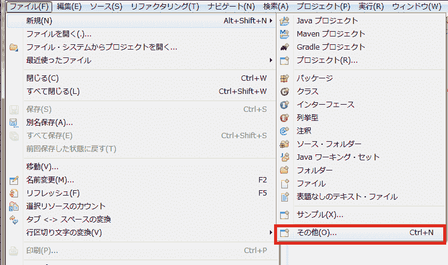](https://res.cloudinary.com/practicaldev/image/fetch/s--2y3zNkry--/c_limit%2Cf_auto%2Cfl_progressive%2Cq_auto%2Cw_880/https://thepracticaldev.s3.amazonaws.com/i/0jb6tqrgvm4y7vcfs1y2.PNG)
[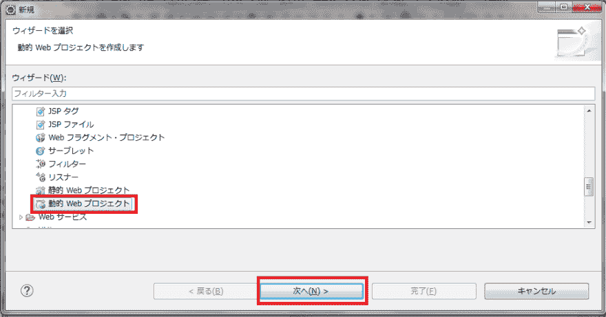T6】](https://res.cloudinary.com/practicaldev/image/fetch/s--OX-rgtUI--/c_limit%2Cf_auto%2Cfl_progressive%2Cq_auto%2Cw_880/https://thepracticaldev.s3.amazonaws.com/i/nglwqmg22clygc4gphj1.PNG)

## 1-2 项目的设定

项目名称为`servletTest`

在这个画面上有一点需要注意的是，请选择自己持有的 Java 版本的目标运行时。
我的 Eclipse 中最新的 Java 是 8，所以暂时选择了 8。

[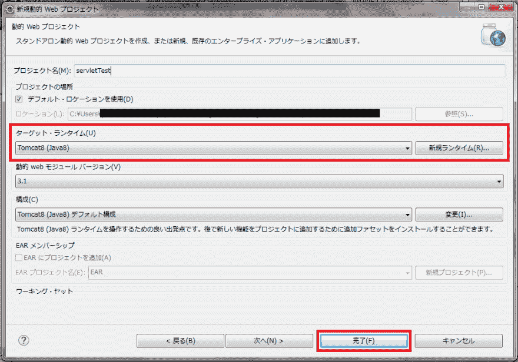T2】](https://res.cloudinary.com/practicaldev/image/fetch/s--bngUx1ev--/c_limit%2Cf_auto%2Cfl_progressive%2Cq_auto%2Cw_880/https://thepracticaldev.s3.amazonaws.com/i/dde5qljn484789c1kf6v.PNG)

不知道自己 Eclipse 可以使用的 Java 版本的人在
菜单栏的窗口>设定中显示的画面的

点击 Java >已安装的 JRE，
Eclipse 中将显示当前可用的 Java 列表。

[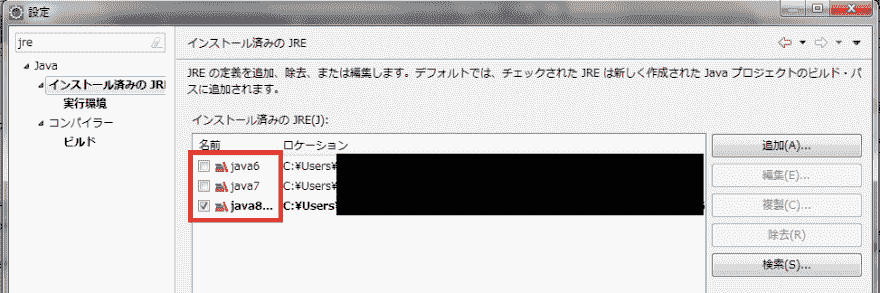T2】](https://res.cloudinary.com/practicaldev/image/fetch/s--a1imv6ji--/c_limit%2Cf_auto%2Cfl_progressive%2Cq_auto%2Cw_880/https://thepracticaldev.s3.amazonaws.com/i/2voc9hu00w8qwttq0wgg.PNG)

# 2 源代码的制作

那么，创建要实际处理的 servlet 的类

单击右上角的文件>新建>类以添加新类

这次的班级名称为`ServletTest`。

[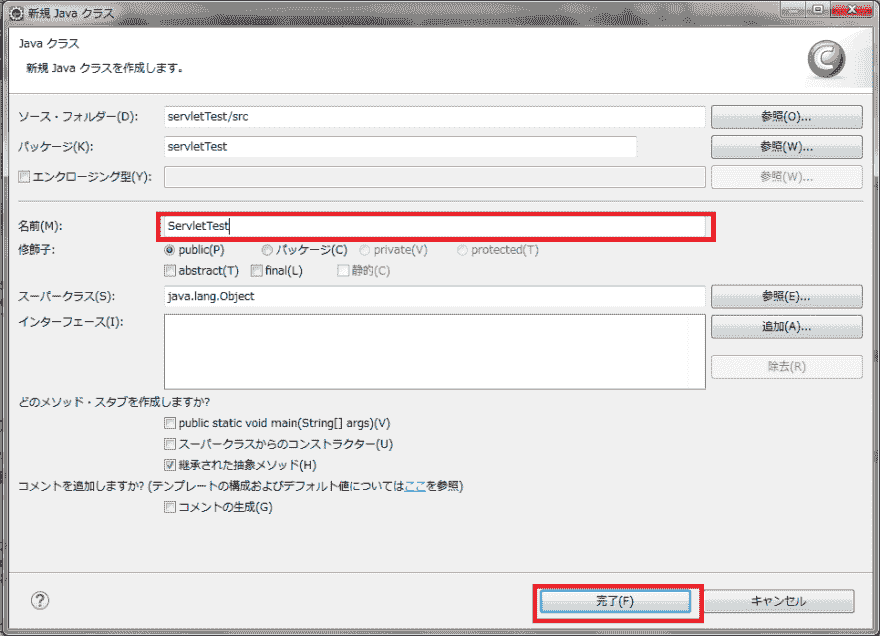T2】](https://res.cloudinary.com/practicaldev/image/fetch/s--jP7ZNjwU--/c_limit%2Cf_auto%2Cfl_progressive%2Cq_auto%2Cw_880/https://thepracticaldev.s3.amazonaws.com/i/ry1028s4pecmkxvw6hx7.PNG)

按下完成并确认
包资源管理器后，将创建类。

[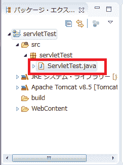T2】](https://res.cloudinary.com/practicaldev/image/fetch/s--1QVdiVu5--/c_limit%2Cf_auto%2Cfl_progressive%2Cq_auto%2Cw_880/https://thepracticaldev.s3.amazonaws.com/i/eo4aq6dss8g3e8sidl3s.PNG)

## 2-2 ServletTest 类的实现

用以下代码复盖 servlet 类的内容。

```
package servletTest;

import java.io.IOException;

import javax.servlet.ServletException;
import javax.servlet.annotation.WebServlet;
import javax.servlet.http.HttpServlet;
import javax.servlet.http.HttpServletRequest;
import javax.servlet.http.HttpServletResponse;

@WebServlet("/helloworld")
public class ServletTest extends HttpServlet {
    private static final long serialVersionUID = 1L;
    protected void doGet(HttpServletRequest request, HttpServletResponse response)
            throws ServletException, IOException {
        String param = request.getParameter("param");
        response.getWriter().write("Hello "+ param);
    }

} 
```

Enter fullscreen mode Exit fullscreen mode

## 添加 2-3 tomcat

添加运行刚才程序的服务器。

如果未显示服务器视图，请使用以下方法添加视图:

选择顶部菜单>窗口>显示视图>其他>服务器>服务器，然后单击打开

[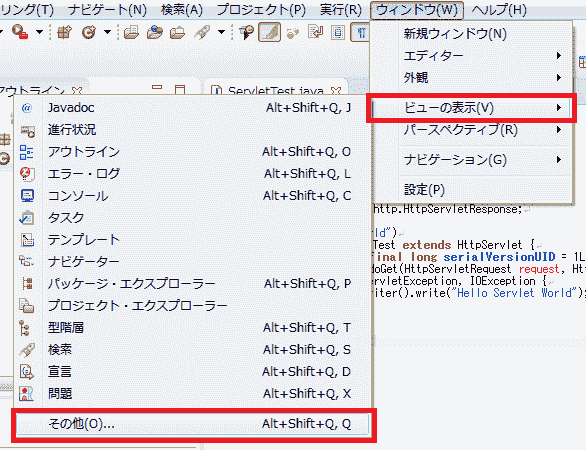T2】](https://res.cloudinary.com/practicaldev/image/fetch/s--4db0qWCf--/c_limit%2Cf_auto%2Cfl_progressive%2Cq_auto%2Cw_880/https://thepracticaldev.s3.amazonaws.com/i/wca0xzol6vht41734blx.PNG)

[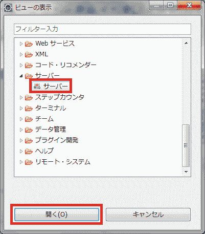T2】](https://res.cloudinary.com/practicaldev/image/fetch/s--1ompFFUU--/c_limit%2Cf_auto%2Cfl_progressive%2Cq_auto%2Cw_880/https://thepracticaldev.s3.amazonaws.com/i/vp83y1ylixll79u3mjq8.PNG)

“没有可用的服务器。 请单击此链接创建新服务器...」，右键单击
或“服务器”选项卡，然后单击“新建>服务器。

选择与在上述步骤中出现的窗口中自己可以移动的 JRE 的最新版本相对应的 tomcat

[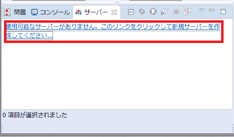](https://res.cloudinary.com/practicaldev/image/fetch/s--ept0V7PP--/c_limit%2Cf_auto%2Cfl_progressive%2Cq_auto%2Cw_880/https://thepracticaldev.s3.amazonaws.com/i/8psdndtd911xa9x5gye3.PNG)
[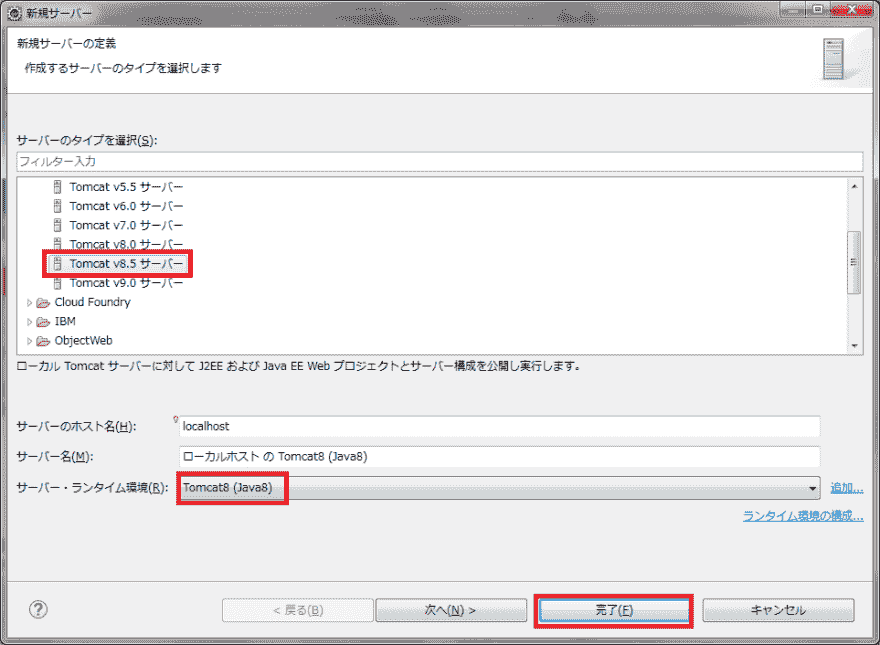T6】](https://res.cloudinary.com/practicaldev/image/fetch/s--0HJ3pLKJ--/c_limit%2Cf_auto%2Cfl_progressive%2Cq_auto%2Cw_880/https://thepracticaldev.s3.amazonaws.com/i/85gt4k520hnyw7ccmozs.PNG)

我的情况是最新版本是 8，所以变成了 tomcat8.5。

在上述步骤中添加服务器

[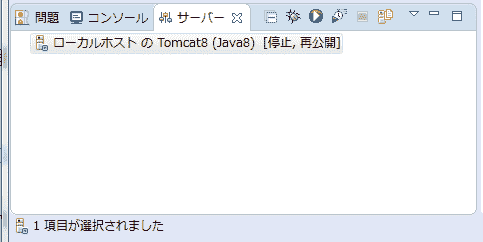T2】](https://res.cloudinary.com/practicaldev/image/fetch/s--3fqnzRbd--/c_limit%2Cf_auto%2Cfl_progressive%2Cq_auto%2Cw_880/https://thepracticaldev.s3.amazonaws.com/i/v47taw56ejrxoe6gj8c4.PNG)

## Line 2-4

右键单击项目名称

选择“运行”>“在服务器上运行”。

[T2】](https://res.cloudinary.com/practicaldev/image/fetch/s--yASBMehP--/c_limit%2Cf_auto%2Cfl_progressive%2Cq_auto%2Cw_880/https://thepracticaldev.s3.amazonaws.com/i/p65e2qt0d9pe78j2n6vm.PNG)

选择刚才添加的 tomcat，然后单击“完成”

[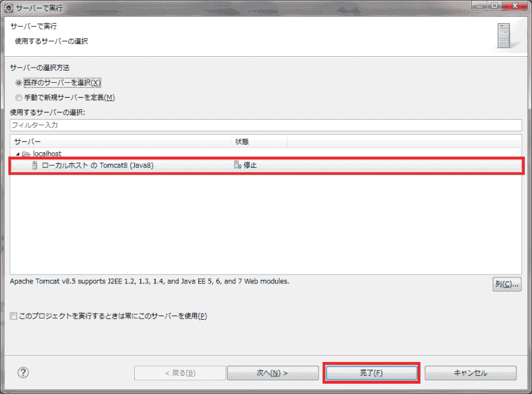T2】](https://res.cloudinary.com/practicaldev/image/fetch/s--gfuaFCDl--/c_limit%2Cf_auto%2Cfl_progressive%2Cq_auto%2Cw_880/https://thepracticaldev.s3.amazonaws.com/i/oc7tp3yptv6fdyli5fjf.PNG)

执行后，打开浏览器

```
http://localhost:8080/servletTest/helloworld?param=<あなたのローマ字の名前> 
```

Enter fullscreen mode Exit fullscreen mode

中选择所需的族。

※请在中输入“tarou”等自己合适的名字。

然后，刚才创建的 servlet 程序将运行，浏览器中将显示以下屏幕:

[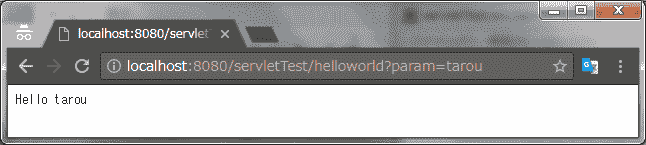T2】](https://res.cloudinary.com/practicaldev/image/fetch/s--ApxNeAp2--/c_limit%2Cf_auto%2Cfl_progressive%2Cq_auto%2Cw_880/https://thepracticaldev.s3.amazonaws.com/i/ay1pbrnz9x8hfcq0v2vo.PNG)

servlet 的简单示例已经运行。
基本上可以按照这样的步骤来创建 web APP 应用程序。