# 如何部署 Eclipse 和运行简单的 Java 程序

> 原文：<https://dev.to/programmingmonky/eclipsejava-4e0m>

部署 Eclipse 并运行示例 APP 应用程序。

另外，执笔时笔者的环境

*   操作系统:windows 7 32 位
*   ブラウザ:Google 铬合金

是。

# 1 Eclipse 主机的下载

从以下网站下载的话，捆绑了 java、日语化、webserver 等的东西可以下载

[http://mergedoc.osdn.jp/](http://mergedoc.osdn.jp/)

强烈建议部署最新版本的稳定运行版，但如果需要，请每次选择旧版本。
这次下载本稿执笔时 2018/7/6 的最新版 Eclipse 4.8 Photon

[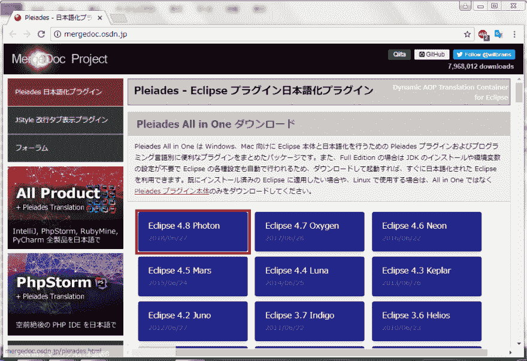T2】](https://res.cloudinary.com/practicaldev/image/fetch/s--3TkpFx61--/c_limit%2Cf_auto%2Cfl_progressive%2Cq_auto%2Cw_880/https://thepracticaldev.s3.amazonaws.com/i/wvyq6owqq896i1cpfblf.PNG)

## 1-2 选择下载软件包

下载适合您要开发的环境的软件包。
本文首先选择全部包含的 Ultimate 的 Full。 笔者的操作系统为 Windows7 32bit，所以选择红框的。
请确认自身的操作系统并安装合适的操作系统。

[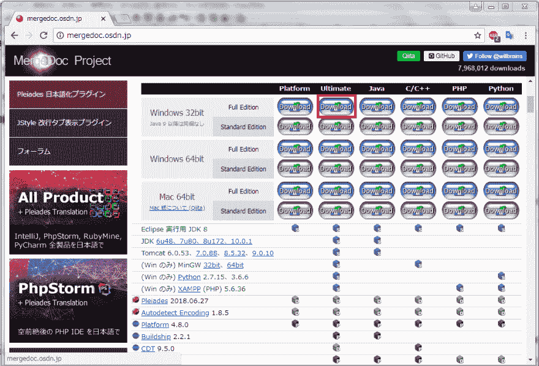T2】](https://res.cloudinary.com/practicaldev/image/fetch/s--DG2d7Uog--/c_limit%2Cf_auto%2Cfl_progressive%2Cq_auto%2Cw_880/https://thepracticaldev.s3.amazonaws.com/i/qybm5s5552yfn8qk4cz7.PNG)

但是，虽然所有的 Ultimate 都包括在内，但是如果由于大小较大(解压缩前 1.5GB )导致网络环境较差，则应该选择合适的较轻的。
选择 full edition 时，由于会使用捆绑了编译器等路径设定的内容，所以不需要安装后的环境设定作业。

# 2 解压执行

安装后，解压缩到适当的位置并运行 pleiades\eclipse\eclipse.exe

[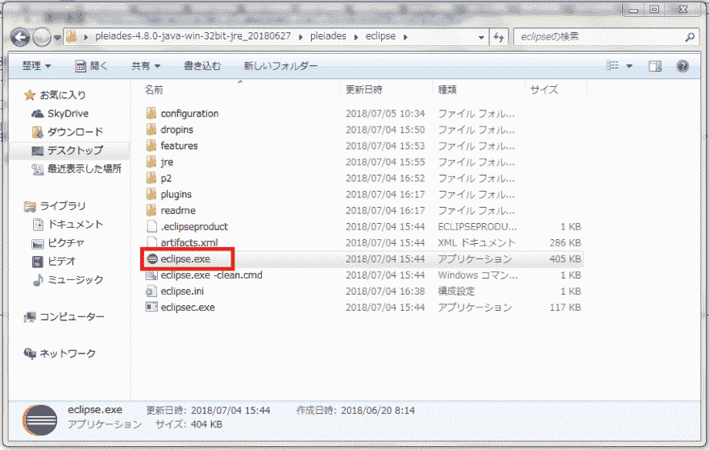T2】](https://res.cloudinary.com/practicaldev/image/fetch/s--GYOoyMPB--/c_limit%2Cf_auto%2Cfl_progressive%2Cq_auto%2Cw_880/https://thepracticaldev.s3.amazonaws.com/i/sspfhr2zejhjgqyuu9wj.PNG)

会出现选择使用哪个工作区(将制作的程序和设定等放置在哪里)的画面，
首先要验证的话，默认的东西也可以。 按“启动”按钮前进吧。

[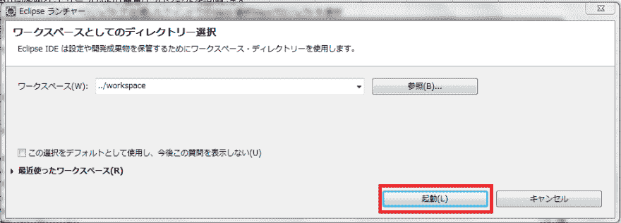T2】](https://res.cloudinary.com/practicaldev/image/fetch/s--EpkcwGX1--/c_limit%2Cf_auto%2Cfl_progressive%2Cq_auto%2Cw_880/https://thepracticaldev.s3.amazonaws.com/i/sbv896iwa67z4ltujqh1.PNG)

然后 Eclipse 就会启动。

[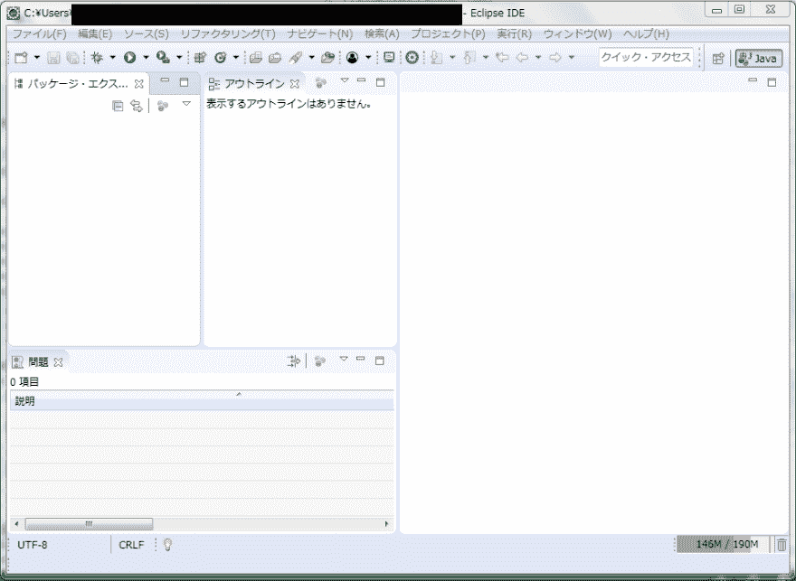T2】](https://res.cloudinary.com/practicaldev/image/fetch/s--gwQfvtJe--/c_limit%2Cf_auto%2Cfl_progressive%2Cq_auto%2Cw_880/https://thepracticaldev.s3.amazonaws.com/i/4l6owzho22r12aqztxnn.PNG)

# 3 示例代码的执行

## 3-1 新建项目

那么，我用样品写 Java 的代码来做一个运行的实验。

文件>新建> Java 项目

点击

[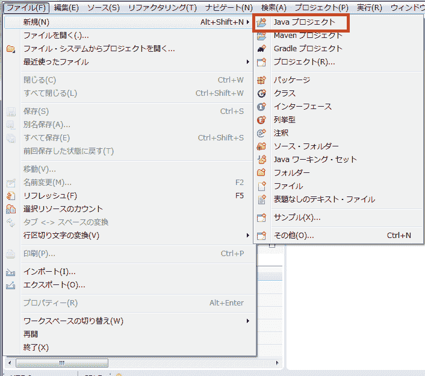T2】](https://res.cloudinary.com/practicaldev/image/fetch/s--qYEUnhvA--/c_limit%2Cf_auto%2Cfl_progressive%2Cq_auto%2Cw_880/https://thepracticaldev.s3.amazonaws.com/i/80a0oijptand3696o3rb.PNG)

这样，就会出现输入项目设定的画面。
这次只是进行动作验证，所以不需要细致的设定。

总之这次把项目名称定为“testApp”

[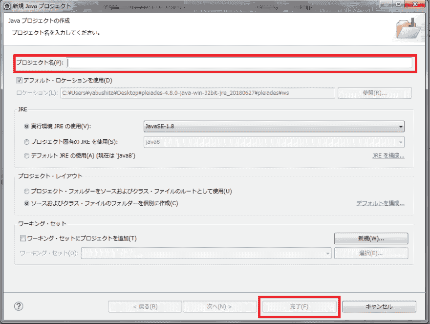T2】](https://res.cloudinary.com/practicaldev/image/fetch/s--mv3SCYgq--/c_limit%2Cf_auto%2Cfl_progressive%2Cq_auto%2Cw_880/https://thepracticaldev.s3.amazonaws.com/i/w09ikvnivq2w5rjgda4n.PNG)

在输入项目名称并按“完成”按钮后，应该已在 Eclipse 包资源管理器中创建了该项目。

[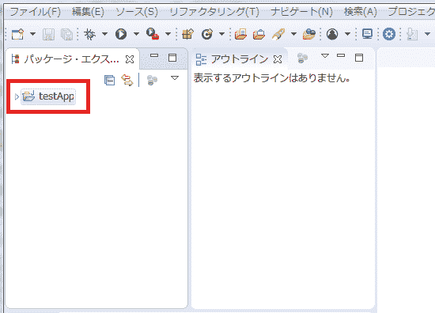T2】](https://res.cloudinary.com/practicaldev/image/fetch/s--rXaW2p8o--/c_limit%2Cf_auto%2Cfl_progressive%2Cq_auto%2Cw_880/https://thepracticaldev.s3.amazonaws.com/i/c7cjy4eyzwnpkgkwr309.PNG)

## 3-2 新建班级

编写一个编写示例程序的类。

单击“新建”>“类”

[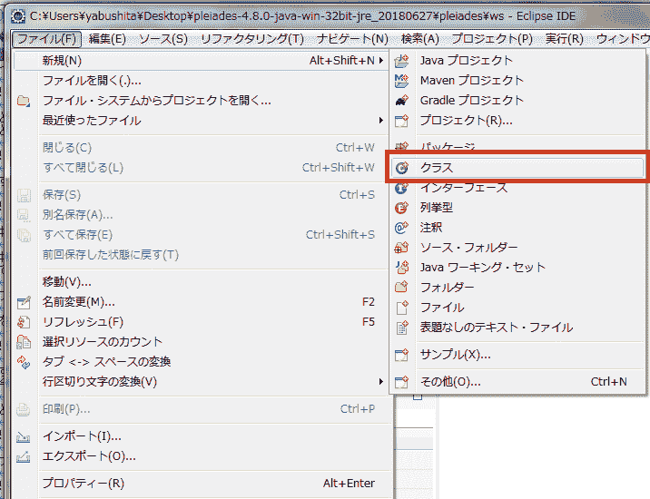T2】](https://res.cloudinary.com/practicaldev/image/fetch/s--ebu9_2uI--/c_limit%2Cf_auto%2Cfl_progressive%2Cq_auto%2Cw_880/https://thepracticaldev.s3.amazonaws.com/i/7nxl9815rl4gc39jbgvd.PNG)

出现要创建的类的设置画面。
类名这次定为`HelloWorld`。
其他什么都不做，按下“完成”按钮。

[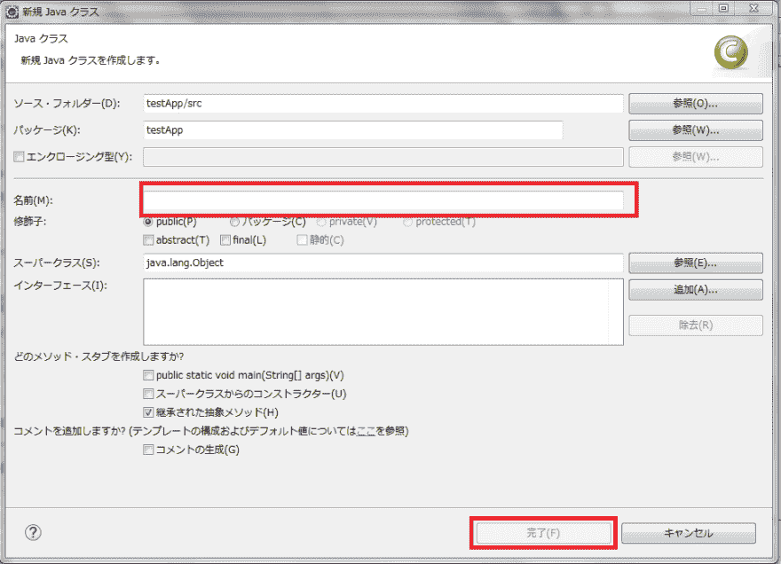T2】](https://res.cloudinary.com/practicaldev/image/fetch/s--kSWx14se--/c_limit%2Cf_auto%2Cfl_progressive%2Cq_auto%2Cw_880/https://thepracticaldev.s3.amazonaws.com/i/4j2hoj2xwn2l2hc179l8.PNG)

## 3-3 编程

那么写源代码。
这次只需要贴上准备好的以下代码就可以了

```
package testApp;

public class HelloWorld {
    public static void main(String args[]) {
        System.out.println("Hello World!!!");
    }

} 
```

Enter fullscreen mode Exit fullscreen mode

※如果将项目命名为 testApp 以外的名称，则 package 行必须更改为自己命名的项目名称。

## Line 3-3

那么就实行吧。

右键单击包资源管理器中的项目名称( testApp )，然后单击
执行>Java APP 应用程序。

[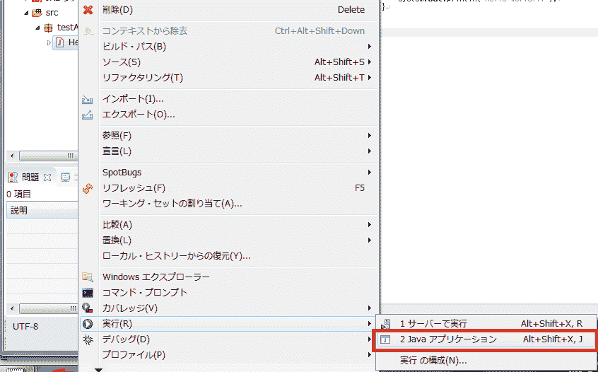T2】](https://res.cloudinary.com/practicaldev/image/fetch/s--_JZLR4LV--/c_limit%2Cf_auto%2Cfl_progressive%2Cq_auto%2Cw_880/https://thepracticaldev.s3.amazonaws.com/i/jgxnwtso415yg4yolg26.PNG)

然后程序运行，控制台上显示`Hello World`。

[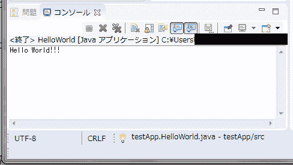T2】](https://res.cloudinary.com/practicaldev/image/fetch/s--2k1-LxdW--/c_limit%2Cf_auto%2Cfl_progressive%2Cq_auto%2Cw_880/https://thepracticaldev.s3.amazonaws.com/i/hkmn0ibby9crt5ohwb8l.PNG)

Eclipse 的导入和示例程序的执行到此结束。