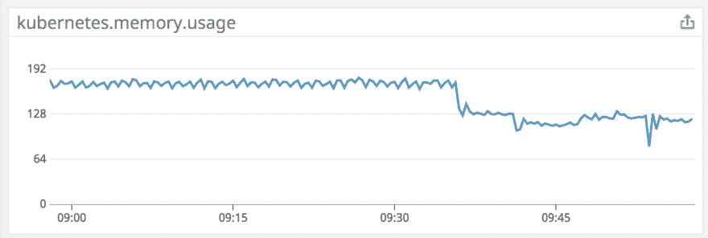

# Ecto 3.0 :性能和迁移到新版本等

> 原文：<https://dev.to/gumi/ecto-30--3ema>

本文得到了 plataformatec 公司的许可，基于开发团队的博客文章“[a sneak peek at Ecto 3.0:performance，migrations and more](http://blog.plataformatec.com.br/2018/10/a-sneak-peek-at-ecto-3-0-performance-migrations-and-more/) ”，介绍了 ecto 3.0 的爸爸 2018 年 10 月 16 日发布了候选发布的[Ecto v3.0.0-rc.0](https://elixirforum.com/t/ecto-3-0-rc-is-out-and-stable-api/17306) ，可以实际尝试一下。

# 内存使用的改善

在 Ecto 3.0 中，性能提升的最大原因是从 Ecto 存储库中加载的架构占用的内存更少。

Ecto 3.0 的许多内存改进都得益于对模式元数据的良好管理。 所有实例`Ecto.Schema`的`%User{}`都具有条目生命周期信息的元数据字段。 例如，数据库前缀及其状态(是构建的还是从数据库加载的)。 元数据字段具体有 16 个词。

```
iex> :erts_debug.size %Ecto.Schema.Metadata{}
16 
```

Enter fullscreen mode Exit fullscreen mode

64 位机器的 16 个词相当于 128 字节。 使用 Ecto 2.0 读取 1,000 个条目后，仅存储元数据就消耗了 128KB 的内存。 但是，1,000 个条目可以使用完全相同的元数据。 这样，无论加载的条目是 1,000 还是 100，000，成本都将保持不变，为 128 字节。

自从 Ecto 3.0-rc 发布以来，实际上已经有了升级的团队。 存储库中也有相当大的东西。 但是，升级用了不到一天。 CargoSense 的高级工程师 Ben Wilson 将他们的 APP 之一制作成 Ecto 3.0-rc 并投入产品。 结果如下图所示。

#### [t1■APP 应用的使用存储器](#%E5%9B%B3001%E2%96%A0%E3%82%A2%E3%83%97%E3%83%AA%E3%82%B1%E3%83%BC%E3%82%B7%E3%83%A7%E3%83%B3%E3%81%AE%E4%BD%BF%E7%94%A8%E3%83%A1%E3%83%A2%E3%83%AA)

[T2】](https://res.cloudinary.com/practicaldev/image/fetch/s--yGGSnyU8--/c_limit%2Cf_auto%2Cfl_progressive%2Cq_auto%2Cw_880/http://blog.plataformatec.com.br/wp-content/uploads/2018/10/memory.png)

内存使用量下降是在从 Ecto 2 部署到 Ecto 3 的瞬间。 这个 APP 应用程序在启动过程中读取了很多数据。 你会发现内存的使用得到了怎样的改善。 系统稳定后，平均使用内存总体下降 15%。

此外，Ecto 3.0 现在使用 Erlang VM 文字池。 这样元数据就可以在查询之间共享了。 例如，如果有两个查询，每个查询返回 1,000 个职位，则总共 2,000 个职位将使用相同的元数据。 [减少结构体的分配](https://github.com/elixir-ecto/ecto/commit/415ba3df0b3810e5b3393d32a208745e28bd5c20)结合其他改善，Ecto 的内存使用量整体上会减少吧。

# Ecto.Repo.insert/update/delete 的语句缓存

Ecto 3.0 的另一个重要性能改进是自动缓存在`Ecto.Repo.insert`/ `update`/ `delete`中生成的语句。 例如，考虑以下代码: 假设 Post 是一个包含 13 个字段的架构。

```
for i <- 1..1000 do
  Repo.insert!(%Post{visits: i})
end 
```

Enter fullscreen mode Exit fullscreen mode

如果在具有 10 个连接的 Postgres 数据库中运行此代码，则添加所有 1,000 个职位需要 900 毫秒。 因为 Ecto 总是缓存选定的查询，所以如果在`Ecto.Repo.insert`/ `update`/ `delete`中加上语句缓存，操作总时间就会缩短到 610 毫秒。

问题是，每次调用`Repo.insert`时，Ecto 都必须从连接池获得新的连接。 在此基础上，进行插入，恢复连接。 在连接 10 的池中，下一个选择可能不是可重用( warm )状态，而是语句缓存不可用。 不要长时间持续连接很重要。 应该最大限度地利用数据库的资源吧。 因此，要求很多操作连续执行。

因此，Ecto 3.0 具备了`Repo.checkout`的操作。 现在，您将被告知 Ecto 存储库使用相同的连接。 跳过连接池，继续使用可复用的连接。 按如下方式重写代码，所有插入平均只需 420 毫秒。

```
Repo.checkout(fn ->
  for i <- 1..1000 do
    Repo.insert!(%Post{visits: i})
  end
end) 
```

Enter fullscreen mode Exit fullscreen mode

还有一个可以使用的技巧。 进行多次插入时，将`Repo.checkout`置换为`Repo.transaction`。 事务检出一个连接。 但是，数据库本身更有效率。 通过这个改写，花费的时间可以减少到 320 毫秒。 如果想更快的话，用`Ecto.Repo.insert_all`就可以了吧。

# 其他选项和改善

Ecto 2 支持了[up sert](http://blog.plataformatec.com.br/2016/12/many-to-many-and-upserts/)。 Ecto 3 对 upsert API 做了很多改进。 例如，通过`:replace_all_except_primary_key`，在发生竞争或复盖特定字段时，可以传递`on_conflict: {:replace, [:foo, :bar, baz]}`。 另外，将`:conflict_target`的值赋予`{:unsafe_fragment, "be careful with what goes here"}`，可以进行自定义公式。

`Ecto.Repo`在 API 中，除了上述的`Ecto.Repo.checkout`之外，还增加了新的`Ecto.Repo.exists?`等很多改善。

# 向新版本的转移

对 Ecto (更准确地说是`Ecto.SQL`)进行的其他重大改进是版本迁移。

可以锁定迁移表，以便在多台计算机上同时迁移(由 Allen Madsen 贡献)。 以前，尝试在多台计算机上执行迁移可能会发生冲突，从而导致失败。 在新版本中不会发生这样的事情。 锁定的种类由`:migration_lock`资源库设置确定。 默认为“FOR UPDATE”，`nil`无效。

另一个改进是，在进行 Ecto 迁移时，notice/alert/warning 现在可以进行记录。 在以前的版本中，如果有长索引名，数据库会截断，TCP 连接会发出警告。 但是，没有提取出这个警告，没有输出到终端。 在 Ecto 3.0 中这个就没有了。

同样，如果执行迁移时数据库中存在已迁移到较新版本的内容，Ecto 会发出警告。 例如，假设您对一个功能工作了很长时间，现在已经到了可以合并到 master 的阶段。 但是，如果开始工作后，其他功能和迁移已经发货到生产环境中。 然后，部署将会出现问题。 如果无法部署，则必须回滚数据库。 最近一次迁移的时间戳应该与您刚才执行的时间戳不同。

如果出现警告，则可以防止开发人员和产品团队陷入这种情况。

最后，也许最重要的是，Ecto 的 API 更稳定了。 详情请参阅 Elixir Forum 的“[Ecto 3.0-rc is out and stable API](https://elixirforum.com/t/ecto-3-0-rc-is-out-and-stable-api/17306) ”。

### Journaling of Lian Lian

*   [Ecto 3.0 :关于打破互换性的变更预定](https://dev.to/gumi/ecto-30--523l)
*   [Ecto 3.0 :计划改善查询 API 前篇]](https://dev.to/gumi/ecto-30-api-d0g)
*   [Ecto 3.0 :计划改善查询 API 后篇]](https://dev.to/gumi/ecto-30-api-3odk)