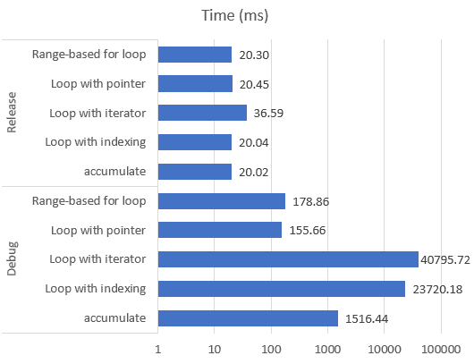
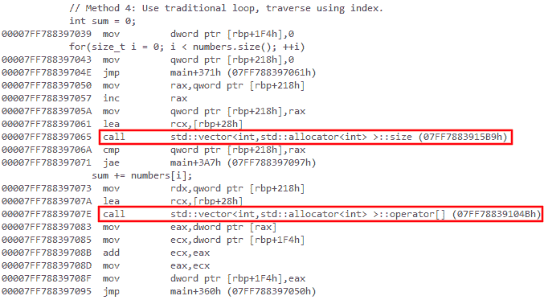
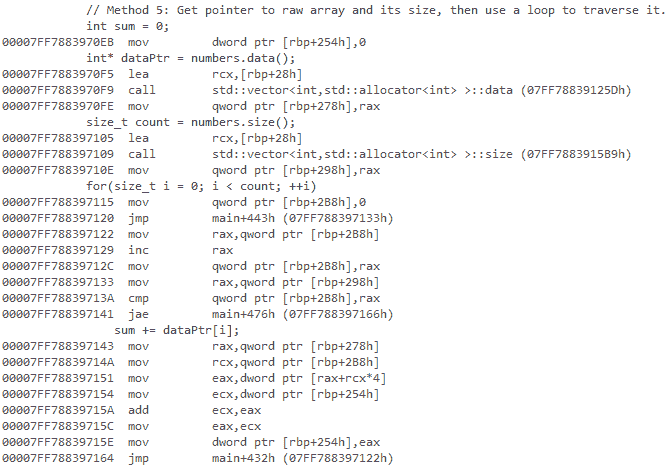

# 使用 std::vector 的有效方法

> 原文：<https://dev.to/reg__/efficient-way-of-using-stdvector-4oo3>

有人说 C++ STL 慢。我宁愿说这是我们使用它的方式。当然，在使用 STL 时，有许多潜在的缓慢来源。例如，`std::list`或`std::map`倾向于分配许多小对象，动态分配是一个耗时的操作。像`std::string`一样复制你的物体也是很昂贵的——这就是为什么我创建了 [str_view 项目](http://asawicki.info/news_1685_str_view_-_null-termination-aware_string-view_class_for_c.html)。但是`std::vector`只是一个动态分配数组的包装器，它还能记住数组的大小，并能在你添加新元素时重新分配。如果没有 STL，您将需要自己实现相同的功能。

当涉及到遍历向量的元素时(例如，对向量中包含的数值求和)，有许多方法可以做到。众所周知，STL 在调试项目配置中运行非常慢，但事实证明，这很大程度上取决于您选择使用它的方法。

这是我刚刚做的一个小实验。在这段代码中，我创建了一个包含 100，000，000 个整数的向量，然后使用 5 种不同的方法对其元素求和，计算每种方法需要的时间。结果(每种方法 5 次迭代的平均值)如下。请注意横轴上的对数刻度。

[T2】](https://res.cloudinary.com/practicaldev/image/fetch/s--aAtvr7O2--/c_limit%2Cf_auto%2Cfl_progressive%2Cq_auto%2Cw_880/http://asawicki.info/files/Efficient_way_of_using_std_vector_Plot.png)

这里是我的测试程序的完整源代码:

```
#include <cstdio>
#include <cstdint>
#include <vector>
#include <chrono>
#include <numeric>

typedef std::chrono::high_resolution_clock::time_point time_point;
typedef std::chrono::high_resolution_clock::duration duration;
inline time_point now() { return std::chrono::high_resolution_clock::now(); }
inline double durationToMilliseconds(duration d) { return std::chrono::duration<double, std::milli>(d).count(); }

int main()
{
    printf("Iteration,Method,Sum,Time (ms)\n");

    for(uint32_t iter = 0; iter < 5; ++iter)
    {
        std::vector<int> numbers(100000000ull);
        numbers[0] = 1; numbers[1] = 2; numbers.back() = 3;

        {
            time_point timeBeg = now();

            // Method 1: Use STL algorithm std::accumulate.
            int sum = std::accumulate(numbers.begin(), numbers.end(), 0);

            printf("%u,accumulate,%i,%g\n", iter, sum, durationToMilliseconds(now() - timeBeg));
        }

        {
            time_point timeBeg = now();

            // Method 2: Use the new C++11 range-based for loop.
            int sum = 0;
            for(auto value : numbers)
                sum += value;

            printf("%u,Range-based for loop,%i,%g\n", iter, sum, durationToMilliseconds(now() - timeBeg));
        }

        {
            time_point timeBeg = now();

            // Method 3: Use traditional loop, traverse vector using its iterator.
            int sum = 0;
            for(auto it = numbers.begin(); it != numbers.end(); ++it)
                sum += \*it;

            printf("%u,Loop with iterator,%i,%g\n", iter, sum, durationToMilliseconds(now() - timeBeg));
        }

        {
            time_point timeBeg = now();

            // Method 4: Use traditional loop, traverse using index.
            int sum = 0;
            for(size_t i = 0; i < numbers.size(); ++i)
                sum += numbers[i];

            printf("%u,Loop with indexing,%i,%g\n", iter, sum, durationToMilliseconds(now() - timeBeg));
        }

        {
            time_point timeBeg = now();

            // Method 5: Get pointer to raw array and its size, then use a loop to traverse it.
            int sum = 0;
            int\* dataPtr = numbers.data();
            size_t count = numbers.size();
            for(size_t i = 0; i < count; ++i)
                sum += dataPtr[i];

            printf("%u,Loop with pointer,%i,%g\n", iter, sum, durationToMilliseconds(now() - timeBeg));
        }
    }
} 
```

Enter fullscreen mode Exit fullscreen mode

如您所见，在调试配置中，有些方法比其他方法慢 3 个数量级以上！差别如此之大，以至于如果你像这样写你的程序或游戏，它的调试版本可能无法使用任何合理大小的输入数据。但如果看拆解的话，应该也不奇怪。例如，方法 4 在循环的每次迭代中调用向量方法`size()`和`operator[]`。我们知道，在调试配置中，函数没有被内联和优化，所以这些是真正的函数调用:

[T2】](https://res.cloudinary.com/practicaldev/image/fetch/s--14I1b_AL--/c_limit%2Cf_auto%2Cfl_progressive%2Cq_auto%2Cw_880/http://asawicki.info/files/Efficient_way_of_using_std_vector_Debug.png)

另一方面，在指向 vector 底层数据的原始指针上操作的方法 5 在调试配置中并不比发布慢多少。从调试版本反汇编:

[T2】](https://res.cloudinary.com/practicaldev/image/fetch/s--LqJybaUG--/c_limit%2Cf_auto%2Cfl_progressive%2Cq_auto%2Cw_880/http://asawicki.info/files/Efficient_way_of_using_std_vector_Debug_Pointer.png)

所以我的结论是:使用 std::vector 来处理内存管理和重新分配，并使用原始指针来访问其数据是最好的方法。

我的测试环境是:

```
CPU: Intel Core i7-6700K 4.00 GHz
RAM: DDR4, Dual-Channel, current memory clock 1066 MHz  
OS: Windows 10 Version 1803 (OS Build 17134.285)  
Compiler: Microsoft Visual Studio Community 2017 Version 15.4.8  
Configuration options: x64 Debug/Release  
Windows SDK Version 10.0.16299.0 
```

Enter fullscreen mode Exit fullscreen mode