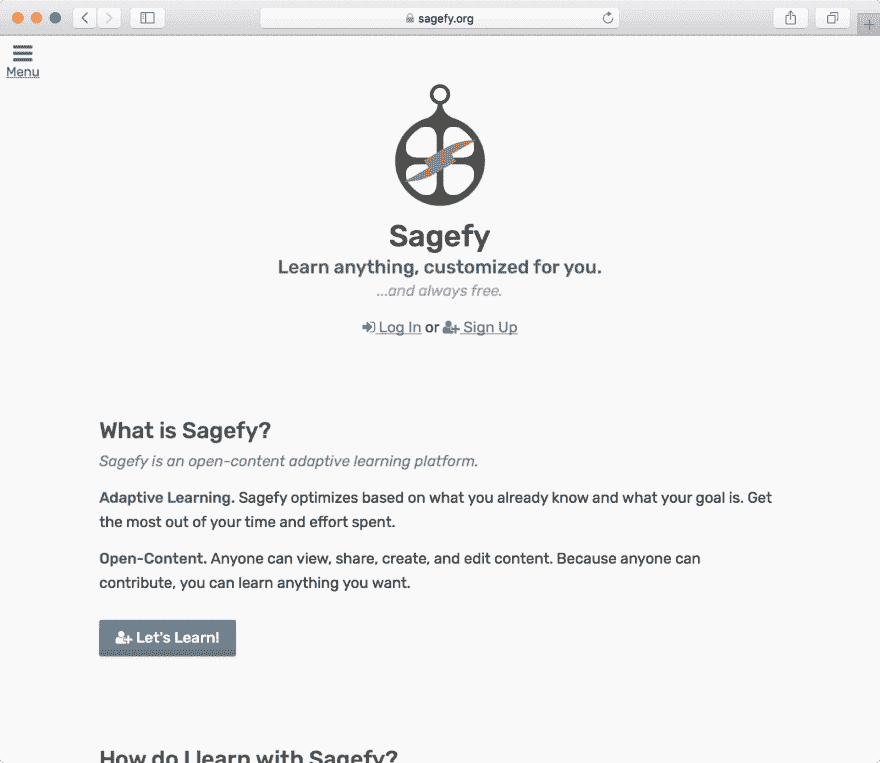
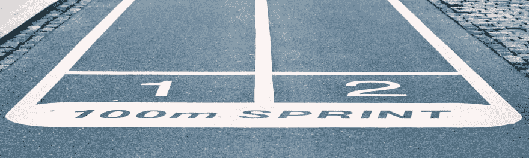
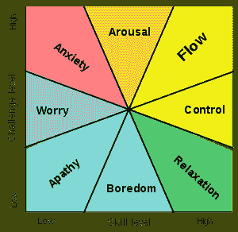

# 八大学习理念

> 原文：<https://dev.to/heiskr/eight-big-ideas-of-learning-e85>

我承认:*我是个超级书呆子*。我最喜欢的科目之一是**学习如何学习**。多年来我一直在阅读和研究学习科学。我已经建立了自己的学习平台， [Sagefy](https://sagefy.org) 。也就是说，我不是专家——欣赏一下这个局外人对文学的看法。

在这篇文章中，我将总结我所学到的关于学习的知识。有一个完整的研究领域致力于这个主题，所以我不能囊括一切。但是这八点概括了这项研究。(如果这篇文章对你来说太长，可以看看我的 [10 分钟 TL；DR 版本](https://dev.to/stories/eight-big-ideas-of-learning-tl-dr-edition)。)

**如果你也是个初学者**，*这篇文章是为你准备的*。也许你是学生，老师，或者像我一样是个终身学习者。教育研究人员通常从任课老师的角度来写这些。我是从一个独立的个体学习者的角度来写作的。这些想法可以应用于课堂、在线学习和日常生活课程。并不时回来回顾这些想法…你可能会发现一个你意想不到的新视角。我一向如此。

我相信**证据**。研究并不完美。但是研究比选择更好。我们都在学校和工作中发展学习理论。但并非所有这些理论都有证据支持。以“学习风格”为例——该理论认为每个人都有一种学习类型，比如听觉或视觉。这种思想在机构教育中很普遍。然而，[的“学习风格”理论并没有证据](https://digest.bps.org.uk/2018/04/03/another-nail-in-the-coffin-for-learning-styles-students-did-not-benefit-from-studying-according-to-their-supposed-learning-style/)来支持它。[来自学习者的关于他们偏好的反馈](https://www.ncbi.nlm.nih.gov/pubmed/18361632)是另一个假象。相反，我们需要关注 [*的学习成果*](https://files.eric.ed.gov/fulltext/ED498555.pdf) 。

将研究转化为可应用的技术并不总是容易的。像这样的文章试图弥合差距。这些想法不是新的或独特的。我不是第一个说这些话的人。虽然这个特定的列表和顺序是独一无二的，但本文中的每个想法都来自其他来源。我会尽可能地链接。

[T2】](https://sagefy.org)

如果我的背景让你感兴趣的话:**萨格菲就是我基于这些想法建立的项目。Sagefy 是一个开放内容的自适应学习系统。开放内容意味着任何人都可以创建和更新学习内容，比如维基百科。*适应性学习*是指根据学习者的先验知识改变内容。这种结合意味着任何人都可以学习几乎任何东西，不管他们之前有什么知识。要了解关于 Sagefy 的更多信息，请查看这篇[深度文章](https://dev.to/stories/why-i-m-building-sagefy)。**

 **技术最大的机会是人类的学习。我们通过使用工具来加速我们的知识，从而加快我们的进步。我们必须避免仅仅为了技术而技术。技术进步经常无法实现它们的可能性。[ed-tech](https://www.amazon.com/Teachers-Machines-Classroom-Technology-Since/dp/080772792X)的历史表明技术偏离了学习原则。我们通过关注核心原则来避免不必要的技术混乱。我希望这篇文章能成为我建立和发展 Sagefy 的参考。

[T2】](https://res.cloudinary.com/practicaldev/image/fetch/s--inwoI973--/c_limit%2Cf_auto%2Cfl_progressive%2Cq_auto%2Cw_880/http://heiskr.cimg/big-3.jpeg)

## 想法一:一次做一件事

**一次做好一件事说起来很长: ***专注*** 。排除杂念。删除不需要的接口。静音背景聊天。不要一心多用:这没用。一次只专注于一个科目的一课。当我们集中注意力时，我们会从投入学习的精力中获得更多。**

 **试图同时学习三种新思想来解决一个问题会让你慢下来。而是把每个想法孤立起来学习，然后把想法整合起来解决问题。

### *1.1 说明工作记忆的极限。*

我们的大脑大约有 860 亿个神经元。我们的长期记忆[似乎是无限的](http://www.cs.colorado.edu/~mozer/Teaching/syllabi/7782/readings/Landauer1986.pdf)。我们的现实是，我们不可能一次记住长期记忆中的所有东西。我们现在所记得的，我们称之为**工作记忆**。

[乔治·米勒在 1956 年](http://www.psych.utoronto.ca/users/peterson/psy430s2001/Miller%20GA%20Magical%20Seven%20Psych%20Review%201955.pdf)发现工作记忆限于七项，正负两项。几十年后，研究人员发现我们的大脑将工作记忆限制在四个项目的**。这条规则适用于死记硬背之外的任何事情。参见 1975 年的布罗德本特，[1994 年的巴德利](http://psycnet.apa.org/record/1995-04539-001)，2001 年的[考恩](http://memory.psych.missouri.edu/doc/articles/2001/Cowan%20BBS%202001.pdf)。智商测量通常不会影响工作记忆极限。**

 **我们通过*将新信息与先前已知的信息*联系起来来学习。(我们将在下一节(3.3)回到这个话题)。)你目前的知识需要一到三项。这意味着你可能只剩下**一两个项目**来学习新知识。本文其余的大部分都是关于工作记忆的极限。

总之， ***现实一点*** 关于你能把多少信息放进你的工作记忆里。比你预期的要少。

### *1.2 一次做一项活动。避免一心多用。*

人类在多任务处理方面**很糟糕。2005 年[克拉克、艾尔斯和斯威勒的一项研究](http://citeseerx.ist.psu.edu/viewdoc/download?doi=10.1.1.476.4112&rep=rep1&type=pdf)要求学习者同时学习电子表格软件和相关数学。学习者感到不知所措。Mayer 和 Chandler 在 2001 年的另一项研究发现，学习者很难同时学习整个界面。学习者顺序学习界面更成功。**

 **一个完整的研究领域，[能力理论](https://en.wikipedia.org/wiki/Capacity_theory)，探索了一个人在同一时间能学多少的概念。许多研究人员使用[威斯康星卡片分类测试](https://en.wikipedia.org/wiki/Wisconsin_Card_Sorting_Test)来证明我们在学习新东西的时候不能一心多用。

要点是试图一次学多件事会适得其反。相反，试着一次学一件事情比一次学很多事情要好得多。学一个东西，休息一下，学下一个东西，休息一下，等等。如果你感到不知所措，把你所学的分成不同的步骤。然后，最后把所有的都集中起来。

### *1.3 切割噪音:分心、额外选择、切线、额外输入……*

1996 年 Mayer 等人的一项研究发现总结一个教训，减少信息，增加学习。1998 年,【Harp 和 Mayer 的一项研究发现，添加有趣的信息会降低学习效果。T4 2001 年的一项 Mayer 研究发现，增加一堂课的信息量会降低记忆力。2006 年 Butcher 的一项研究发现简单的图表比真实的图表更适合学习。最后，2007 年梅森等人的一项研究发现，走神的人不太能完成任务。

噪音有很多种形式。*噪音影响学习*。有听觉或视觉噪音。在学习界面中，噪音是额外的选择。信息的切线中有噪音。例如，我为 Sagefy 设定的目标之一就是减少界面噪音，以便专注于学习。找一个安静舒适的地方学习，没有什么会让你分心。禁用社交媒体，将手机设为静音，关闭浏览器标签。摆脱无关的想法、担忧和计划。*允许自己一次专注于学习一件事。*

[T2】](https://res.cloudinary.com/practicaldev/image/fetch/s--VvcOmXtC--/c_limit%2Cf_auto%2Cfl_progressive%2Cq_auto%2Cw_880/http://heiskr.cimg/big-4.jpeg)

## 想法二:设定&坚持目标

*明确小而可实现的* ***目标*** 。然后随着你的学习，对照这些目标进行检查。设定具体的目标会给你带来不断成功的机会，这让你不断学习。

如果你的目标太大或定义不清，你会很难集中注意力并失去动力。你会处理一个永恒的问题，“下一步是什么？”花更多的时间去思考该做什么，而不是真正去学习。通过设定小而可实现的目标，你可以不断学习。

### 2.1 定义小而可实现的目标。

有 [SMART](https://en.wikipedia.org/wiki/SMART_criteria) 等多种目标框架。这些框架似乎都有一个共同点，那就是制定既*又 ***可实现的*** 目标。*

 *目标和学习是教育科学中研究最多的关系之一。Rothkopf 和 Billington 于 1979 年在 T2 进行的一项重要研究要求学生在开始阅读前设定小目标。这提高了阅读理解能力。德西和瑞安 2000 年在 T4 发表的一篇论文发现，目标是一种基本的心理需求。Locke 和 Latham 在 2002 年发表的一篇综述文章深入研究了学习中设定目标的历史。研究人员表明，设定目标——具体的、有挑战性的、可实现的——可以提高学习。Kivetz、Urminsky 和 Zheng 在 2006 年发表的一篇论文中发现，设定小目标可以增加预期行为。Koo 和 Fishbach 在 2010 年发表的一篇论文发现，专注于剩余任务——而不是未完成的任务——会产生更好的结果。在[爱立信的刻意练习模型](https://graphics8.nytimes.cimg/blogs/freakonomics/pdf/DeliberatePractice%28PsychologicalReview%29.pdf)中，刻意练习需要频繁设定目标。其他方面是关注(1.3)、反馈(8.1)和适当的挑战水平(3.2)。

你应该从一个**小而具体的目标**开始每一次学习。例如，学习所有的微积分是巨大的，不是一次就能完成的。取而代之的是，为导数幂法则设定一个解决 20 个练习题的目标。那*就是*既*小*又*可实现*。通常，目标越具体，目标就越容易实现。学习时失去动力是很常见的。设定小而可实现的目标有助于我们保持动力。设定目标也有助于我们实践*想法 1:通过帮助我们确定我们的焦点，一次做一件事*。

### 2.2 为知识和技能都设定目标。

布鲁姆 1956 年的分类法定义了六种学习活动。**知识、理解、应用、分析、综合和评估**。(另见 [Krathwohl 的 2002 年修订版](https://www.depauw.edu/files/resources/krathwohl.pdf)。)如果我们只为知识设定目标，就错过了发展其他部分的机会。例如，1989 年池等人的一项研究发现，更强的学习者用自己的话解释他们所学的东西。

最常见的说法之一是学习没有价值，除非你能**应用**你所学。因此，我们需要确保我们设定的目标超越记忆事实的范畴*。挑战自己，将数据点相互联系起来。从事应用这些知识的项目。做比较练习。花时间识别知识中的模式。根据你所学到的东西提出论点。超越知识很重要。(我们将在 6.2 节进一步讨论这个方面。)*

### 2.3 习惯性对照目标回顾自己的进度。

[丹尼尔·平克的动力](https://www.amazon.com/Drive-Surprising-Truth-About-Motivates/dp/1594484805)显示了 ***内在动力*** 比外在动力更强大。外在动机是奖励和惩罚。Pink 指出了内在动机的三个主要原则。**自主**(见思路 5)**精通**(见思路 6)**目的**(见思路 7)。对照我们的目标检查我们的进展会增加我们的掌控感。这反过来又建立了内在动力。

在 Sagefy 中，当你学习的时候，你会看到你在这门学科中已经掌握了多少单元。在您进行学习活动时，一个简单的条形显示您掌握该单元的进度。

随着你的学习，创造一种方式来**可视化**你相对于目标的进展。这个提醒可以帮助你保持学习的动力。

[T2】](https://res.cloudinary.com/practicaldev/image/fetch/s--Ytfj_OuT--/c_limit%2Cf_auto%2Cfl_progressive%2Cq_auto%2Cw_880/http://heiskr.cimg/big-5.jpeg)

## 思路三:适应先验知识

预测我们将学到多少的最强有力的方法是 ***我们已经知道的*** 。*先验知识*是我们在学习过程中所知道的知识。让学习经验适应先前的知识。当学习活动将我们推向正确的挑战水平时，我们就充分利用了我们的学习时间。

如果内容太简单，我们会感到厌烦。如果内容太难，我们会感到沮丧。我们的理解变得模糊。不管怎样，我们都会失去动力。通过呆在中间地带，我们可以最大限度地利用我们的学习努力，并保持更长时间。

### 3.1 先评估先验知识。关注薄弱环节。

[Dochy、塞格斯和 Buehl 在 1999 年](https://www.researchgate.net/publication/249797493_The_Relation_Between_Assessment_Practices_and_Outcomes_of_Studies_The_Case_of_Research_on_Prior_Knowledge)发现*不同学习者之间的学习率差异的 81%* 是先验知识。在[哈蒂对学习因素的大规模排名](https://visible-learning.org/hattie-ranking-influences-effect-sizes-learning-achievement/)中，先验知识的影响大小为 0.94。先验知识也是两个更强因素的潜在影响。先前的知识对我们学多少有最大的影响。

[***形成性评价***](https://en.wikipedia.org/wiki/Formative_assessment) 就是我们先从测试自己的知识开始的想法。然后，我们继续用评估来学习。[终结性评估](https://en.wikipedia.org/wiki/Summative_assessment)只在最后。《纽约时报》的一篇文章强调了形成性评估的价值。在一篇有影响力的 1972 年 Bransford 和 Johnson 的文章中，形成性评估激活了先验知识。结果是形成性评估本身就是一种学习工具。Wininger 的一项研究试图在学习活动之前和期间使用评估。这提高了学习者的理解力。

我们经常决定选择一本书或一门课程作为主题，而没有首先考虑我们已经知道的东西。不幸的是，工业化教育表明所有的学习者都是从同一个地方开始的。如果你想学习如何弹钢琴，却不知道如何看乐谱，你将会经历一段艰难的旅程。相反，*想办法* ***评估*** *你已经知道的*——以及你需要在开始学习之前**。此外，在学习过程中使用评估来识别薄弱环节，并首先在这些环节上有所改进。**

### 3.2 留中调整挑战。脚手架。

[T2】](https://res.cloudinary.com/practicaldev/image/fetch/s--fwAy3-Lv--/c_limit%2Cf_auto%2Cfl_progressive%2Cq_auto%2Cw_880/http://heiskr.cimg/big-6.png)

米哈里·契克森米哈最著名的作品是[流](https://www.amazon.com/Flow-Psychology-Experience-Perennial-Classics/dp/0061339202)。[心流](https://en.wikipedia.org/wiki/Flow_%28psychology%29)是一个心理学概念，指**完全投入**一项活动。当我们的技能水平和挑战水平相匹配时，我们就处于“学习流”中。有时我们先前的技能水平和挑战水平不一致。然后我们焦虑或者无聊。约翰·卡罗尔的[极简主义](http://www.instructionaldesign.org/theories/minimalism/)框架也促进了挑战与学习者技能水平的匹配。我们可以将这个想法追溯到阿特金森 1957 年的文章。

帮助匹配先验知识和挑战级别的方法之一是使用脚手架。 [***脚手架***](https://en.wikipedia.org/wiki/Instructional_scaffolding) 是装上训练车轮的想法。首先，提供大量的学习支持。然后，随着学习者技能*的发展*，移除这些支持。Reiser 的一篇评论显示脚手架是一种古老而有效的技术。

在 Sagefy 中，我通过每次活动来衡量和更新学习者对材料的了解程度。我向学员展示基于这些衡量标准的可供选择和参与的活动。

我们想避免学习太容易或太难的经历。太容易了，我们会感到无聊，在我们已经知道的事情上浪费时间和精力。太难了，我们变得沮丧并开始关闭。我们希望**留在中间**。有时这意味着首先把我们正在学习的东西分解成更小的部分。这可能意味着复习必备知识。我们也可以绞死自己。从简单的知识应用开始，慢慢增加复杂度。

### **3.3 将新信息与现有知识联系起来。**

1980 年，[吉克和霍利奥克](http://reasoninglab.psych.ucla.edu/KH%20pdfs/Gick-Holyoak%281980%29Analogical%20Problem%20Solving.pdf)要求学习者进行类比，将他们先前的知识与新知识联系起来。这提高了召回率。马丁和普莱斯利 1991 年在 T2 的一项研究让学生解释他们已经知道的知识如何应用到新的信息中。这对学习产生了巨大的影响。1992 年由[普莱斯利等人](http://www.hostos.cuny.edu/MTRJ/HTRT/Encouraging%20mindful%20use%20of%20prior%20knowledge.pdf)撰写的关于先验知识的综述研究了先验知识的历史。作者总结道*我们通过连接新信息和先前的知识*来学习。2004 年的《偶然》一章中，德尔马斯和加菲尔德得出了类似的结论。

在学习新东西之前，*从**复习**你已经知道的相关信息开始*。否则，你就降低了将这两种知识联系起来的机会。你降低了回忆相关新信息的能力。例如:你正在上一堂关于选择有效字体的课。你可以从复习不同种类的字体开始。**把你已经知道的和你想学的联系起来是加速你自己学习的最好方法之一。**

[T2】](https://res.cloudinary.com/practicaldev/image/fetch/s--qZtymBIt--/c_limit%2Cf_auto%2Cfl_progressive%2Cq_auto%2Cw_880/http://heiskr.cimg/big-7.jpeg)

## 思路四:构建图表

我们的记忆系统是通过形成数据之间的*关系来工作的。精通是一个*大型深度连接图*的结果。我们将新信息与已知信息联系起来。当我们专注于组织知识时，当我们学习时，我们有放置知识的心理空间。*

 *当我们在深入挖掘之前不知道专家是如何组织知识的时候，我们就没有把知识联系起来。学习变得机械。通过先学习如何组织信息，我们可以快速*连接信息*。我们可以更多地利用我们的先验知识。我们从图表的每一部分得到更多。

### 4.1 先学习如何组织主题，再具体。

教育研究中一个被大量引用的作品是 1965 年德格鲁特的《象棋中的思考和选择》在这部作品中，DeGroot 展示了国际象棋初学者和专家之间的差异。[蔡斯和西蒙 1973 年的研究](http://citeseerx.ist.psu.edu/viewdoc/download?doi=10.1.1.601.2724&rep=rep1&type=pdf)扩展了这项工作。在那项研究中，国际象棋初学者和专家在组织知识的 T4 上有所不同。鲍尔等人 1969 年的一项研究向学习者展示了单词的层次结构，而不是杂乱无章的列表。这种高召回率。在 Reif 和 ey lon 1984 年对一堂物理课的研究中，研究人员首先提出了组织。这提高了测试性能。池等人的另一项研究也得出了类似的结论。

*学习*主题的**组织** *在*之前你开始学习新的东西。这可能意味着在阅读一本书之前，先看一下它的目录。或者在阅读全文之前先阅读章节标题。查看如何组织信息的地图和图表。这项组织任务有助于构建你的学习计划。组织知识也有助于你连接适当的先验知识(3.3)。并设定目标(2.1)。当你学习的时候，你会知道这些信息和这个主题的其他领域有什么联系。

### 4.2 自上而下的工作。

[***自上而下的学习***](https://en.wikipedia.org/wiki/Top-down_and_bottom-up_design) 意为先学习组织和主要思想*。然后开始独奏。随着你继续前进，越走越深。自下而上的学习意味着孤立地学习每一个组成部分，然后在最后才组合知识。*

 *A [2002 孙和张研究](http://www.cogsci.rpi.edu/~rsun/sun.cog02-toh.pdf)在“汉诺塔”问题上尝试了自顶向下加工和自底向上加工。自上而下的方法更有效。Lovrich 在 2006 年的一篇[文章中找到了这两种形式的用例，但是通常自顶向下更有效。最后，](http://www.nsta.org/publications/news/story.aspx?id=53144) [2008 年由 Lim，Reiser 和 Olina](https://tccl.arcc.albany.edu/kniimg/6/6a/Lim_etal_ETR%26D_2009.pdf) 进行的一项研究首先调查了整个任务，然后进行了深入研究。这比教授单个部分然后在最后组合起来更有效。

我们知道大脑限制工作记忆(1.1 节)。应对这种限制的一个策略是分块。*的意思是将*几个相似的项目组合在一起*。组块是将自上而下的工作流程添加到学习中的一种策略。Ericsson、Chase 和 Faloon 在 1980 年的一项研究显示，组块在记忆数字方面表现接近专家水平。*

 *当你学习的时候，试着找出这一课的主要思想是什么。然后，试着想办法让*在每一点上把*和中心思想联系起来。

### 4.3 测试你的组织知识。

1977 年，辛斯利、海斯和西蒙的一项研究要求学生对代数问题进行分类。当学生有正确的分类时，他们更容易得出正确的答案。让学生练习对问题进行分类的*可以提高成绩。A [Chi & VahLehn 1991](https://www.tandfonline.com/doi/abs/10.1207/s15327809jls0101_4) 要求学员解释并包含组织知识。组织知识的解释更有效。*

随着你的学习，想办法 ***测试*** *你的组织知识*。例如:你可以在一篇文章中挑出一段。然后，找出这些知识在你的主题框架中的位置。或者，您可以使用现有的图表来填补空白。你也可以尝试 [*概念图*](https://en.wikipedia.org/wiki/Concept_map)；画一张图来组织这个主题。当你理解了这个组织，你学得更快，并保持知识。

[T2】](https://res.cloudinary.com/practicaldev/image/fetch/s--HzG859cu--/c_limit%2Cf_auto%2Cfl_progressive%2Cq_auto%2Cw_880/http://heiskr.cimg/big-8.jpeg)

## 理念五:赋权选择

**自主性**是[的“三大”内在激励因素](https://en.wikipedia.org/wiki/Self-determination_theory)之一。*选择*抱拳自治。当我们通过选择来掌控我们的学习时，我们更有动力坚持下去。例如，选择可以是在接下来要学的三个单元中选择一个。或者五种不同的方式来学习相同的课程。

如果有人强迫我们学习，我们会反感这种要求。我们的焦点变成了我们的怨恨，而不是学习。太多的选择也会削弱我们的学习能力。我们专注于做出选择，而不是学习。当有大量选择时，我们大多数人都不擅长做出正确的选择。相反，当我们学习时，适量的选择会让我们保持动力，专注于学习。

### 5.1 创建一个在内容和格式上都允许选择的系统。

希娜·艾扬格是选择心理学领域的杰出研究者。她是《选择的艺术》的作者在书中，艾扬格占了我们*根本渴望*的控制权。掌控感会导致一些不理智的行为。选择也可以作为一种*所有权的形式*。在“[目标概念……”1989 年的一章中，“](https://www.taylorfrancis.com/books/9781317510222/chapters/10.4324%2F9781315717517-8)班杜拉发现，我们自己设定的目标*比别人为我们设定的目标*更强大。**

在 Schankenberg 1997 年的论文中，她发现当被允许做出选择时，学习者 T2 练习得更多。额外的练习改善了结果(也见更常被引用的 [2000 再版](https://www.researchgate.net/publication/225566283_Learner_Control_Over_Full_and_Lean_Computer-Based_Instruction_Under_Differing_Ability_Levels))。她还发现学习者对课程有更高的动力和满意度。2010 年 Tabbers 和 de Koeijer 的一项研究也发现，当学习者有选择的时候，他们会花更多的时间在教学材料上。因此具有更高的转移率。

当你为自己或他人制定学习计划时，想想如何将简单的选择纳入其中。例如，对于相同的信息，您可以从三个活动中选择一个。也可能是形式相同，但你可以选择接下来想学的四样东西中的哪一样。你自己的学习计划可能看起来更像一个图表，而不是一个列表。这样，在这一天，你可以选择下一步做哪一部分，而不是被迫进入下一步。

### 5.2 砍掉不必要的选择，减少选项数量。

选择可以**压倒**。艾扬格和莱珀 2000 年在 T2 进行的一项研究考察了每个选项的数量。有限的选择提高了结果和动力。

学习者的选择可能是教育研究中最有争议的话题。Lunts 的一篇论文回顾了这项研究。并基于*上下文*找到*混合*结果。

选择是强大的。往往*太*强大。我们需要小心不要让自己被太多的选择淹没。同样，选择的**目的**是创造一种*自主感*和控制驱动力。学习中选择的目的是*而不是*优化。

### 5.3 创建推荐的默认选择。

一个学习者自己对能力的感知通常是不准确的。2010 年 Zabrucky 评论强调了研究中的这一普遍结果。 [Jee、Wiley 和 Griffin](https://pdfs.semanticscholar.org/eeb3/cf9f4c38107b976f379d1bbb549e48a853c5.pdf) 发现新手和专家对学习者能力的评估都很低。在伊娃、昆宁顿、雷特和诺曼 2004 年的一项研究中，过去的表现比学习者的预测更能预测结果。

避免让自己或其他学习者做出糟糕的选择。避免要求学员*自我评估*的选择，以做出明智的选择。避免这些情况的一个方法是提供少量的选择。并且如果学习者想要继续而不选择，则呈现一个 [**默认选择**](https://en.wikipedia.org/wiki/Default_effect) 。你希望选择是关于控制和自主的感觉，而不是最优化。

[T2】](https://res.cloudinary.com/practicaldev/image/fetch/s--ba_mcUv_--/c_limit%2Cf_auto%2Cfl_progressive%2Cq_auto%2Cw_880/http://heiskr.cimg/big-9.jpeg)

## 想法六:深潜

死记硬背是不够的。我们必须**应用**知识来创造成果。当我们不仅学会了*什么*，还学会了*如何*和*为什么*，我们就能让自己**使用**我们获得的知识。问“如何”和“为什么”的问题加深了我们的了解。

死记硬背没意思。没有人喜欢这样学习。我们忘记了通过记忆学到的知识。相反，我们需要关注*知识如何*起作用以及*为什么*知识是相关的。这些都是不同于“是什么”的目标！潜水越深意味着学习越有趣，我们保存知识的时间越长。深入研究意味着我们可以应用我们所学的知识，并产生真正的*影响*。

### 6.1 练习。

获得足够的**练习**对技能发展很重要。这听起来很明显。但是，在学校里，我们有这样的想法，我们将只通过[听老师背诵信息](https://www.washingtonpost.com/news/answer-sheet/wp/2014/10/24/teacher-spends-two-days-as-a-student-and-is-shocked-at-what-she-learned/?utm_term=.b765c5fc161a)来学习东西。对于我们需要多少练习，我们也有强烈的*误解*。

这里有一个有趣的想法是[幂定律。几十年的研究发现，实践和技能效率之间存在显著的相关性。在](https://en.wikipedia.org/wiki/Power_law_of_practice)[“我如何重新连接我的大脑以变得精通数学”](http://nautil.us/issue/17/big-bangs/how-i-rewired-my-brain-to-become-fluent-in-math-rd)中，芭芭拉·奥克利讨论了*掌握基础知识*的重要性。在进入更难的科目之前，她通过深入的练习来做到这一点。斯洛博达等人 1996 年的一项研究发现，练习的数量比先前的能力更能反映结果。希利等人 1998 年的一项研究发现，实践需要有类似实际应用的多样性。Keehner 等人 2006 年的一项研究发现，随着时间的推移，练习减少了学习者的能力差异。外语学院认为需要 600-2200 小时的练习才能达到中等水平的语言技能。语言测试机构报告了一个相似的范围。

你需要在你的学习计划中建立比你想象的更多的练习。

### 6.2 超越死记硬背:讲解、应用、分析、综合。

正如我在 2.2 中提到的，[布鲁姆的分类法](https://en.wikipedia.org/wiki/Bloom%27s_taxonomy)确定了六项核心技能。知识、理解、应用、分析、综合和评估。 [Craik 和 Lockhart 1972 年的记忆框架](http://wixtedlab.ucsd.edu/publications/Psych%20218/Craik_Lockhart_1972.pdf)表明我们需要各种各样的任务来构建适用的知识。T4 1997 年的一篇 Schnieder 和 Shiffrin 的论文也对此进行了研究。作者发现固定专业知识和灵活专业知识的区别在于实践的*变化*。[koe dinger&Anderson 1998](http://pact.cs.cmu.edu/pubs/Koedinger%20&%20Anderson%2098.pdf)的论文显示，在练习各种任务时，学习效率更高，表现更好。我们在 [McKeough、Lupart、&Marini 1995 年的“为迁移而教”](http://psycnet.apa.org/record/1995-98417-000)中发现了类似的信息。

当你创建和更新你的学习计划时，确保包括各种各样的练习。包括不仅需要识别或回忆信息的练习。包括让你*解释、应用、分析和综合*知识的练习。

### 6.3 建立元认知。

[**元认知**](https://en.wikipedia.org/wiki/Metacognition)——在学习环境中——是评估你自己的学习策略的能力……并在学习过程中调整你的策略。元认知是教育研究中的一个重要课题。还有比我将在这篇文章中包括的更多的东西，但是我将触及基础。

Flavell 1976 年的“问题解决的元认知方面”是该学科的早期研究方法。他认为动机和调节是关键的元认知能力。几项研究已经证实，元认知能力高的学习者学得更好。举几个例子:[帕林塞萨尔&布朗 1984](https://people.ucsc.edu/~gwells/Files/Courses_Folder/ED%20261%20Papers/Palincsar%20Reciprocal%20Teaching.pdf) 、[斯卡达玛利亚贝雷特&施泰因巴赫 1984、](https://pdfs.semanticscholar.org/a895/bbb467b1df55b0b238bddbff04f125ee1971.pdf)和[森古尔&卡特兰奇 2012](http://akademikpersonel.kocaeli.edu.tr/yasemin.katranci/sci/yasemin.katranci17.01.2013_12.51.07sci.pdf) 。

在你学习的过程中，每隔几个小时左右，*问自己几个问题*:

*   我是否*专注于*学习？我如何提高我的注意力？
*   我应该注意什么？
*   我在之前有没有做过类似*的事情？我以前经历过相关的事情吗？*
*   我有多了解这个？现在对我来说有多困难？
*   我是否了解如何*组织*这些知识？
*   我有一个*策略*吗？我的策略成功了吗？我尝试了多少不同的方法？

经常问这类问题。这些问题提高了你的元认知能力。并引导你取得更好的学习效果。

### 6.4 空间你的修行。

教育科学中最古老的研究之一是艾宾浩斯，1885 年。艾宾浩斯将知识的保持概括为一条曲线。*的记忆*越强，*的记忆*越长。事件重复的间隔越长，记忆越强。Baddeley 在 1978 年的一项研究中发现，打字员分散他们的工作会有更好的结果。巴赫里克和菲尔普斯在 1987 年发现，分散练习的西班牙语学习者有更强的记忆力。Caple 1996 年的论文显示间隔练习可以提高学习和记忆。

展开你的练习，而不是死记硬背。随着记忆变得更强，你可以不用复习更长的时间。为你自己创建一个*系统*，作为某种提醒，在你学习的时候回顾你的知识。

[T2】](https://res.cloudinary.com/practicaldev/image/fetch/s--vj_pxiA---/c_limit%2Cf_auto%2Cfl_progressive%2Cq_auto%2Cw_880/http://heiskr.cimg/big-10.jpeg)

## 想法 7:让它成为现实

**目的**是另一个[主要内在动力](https://en.wikipedia.org/wiki/Self-determination_theory)。我们不仅需要知道为什么这些知识对这门学科很重要。我们还需要知道为什么知识对我们来说很重要**。现实生活中的联系和例子赋予了知识目的。**

 **当我们把知识从我们的经历中移除时，我们看不到我们为什么要学习。相反，回顾一下“我为什么要关心？”有了这个，我们就能保持前进的动力。并使以后更容易应用这些知识。

### 7.1 检查自己学习的原因。

目的是 Pink 的三个内在激励因素之一。T2 2004 年 Robbins 等人的研究着眼于学习目标。研究发现目标与提高大学成绩的内在动机一致。2004 年范斯·廷基斯特等人的一项研究也指出，具有内在动机的目标更强。2002 年埃克尔斯和威格菲尔德的研究回顾再次得出了类似的结论。

在你学习之前，*写下*你为什么想学这个科目。关注 ***内在动机*** 。是的，外在目标——比如找份工作——可以是一个有意义的目标。但是也要关注这对你意味着什么:*自主、掌握和目标*。获得晋升是否意味着你在日常工作中有更多的自主权？那门课程会在某种程度上帮助你帮助别人吗？为了*更深*的目的而去。

在你学习的过程中，**不时提醒自己这个目标。确保你*将当天的目标与更大的蓝图联系起来。这会让你保持学习的动力！***

### 7.2 将素材与现实生活中的问题联系起来。

***思考:问题→解决。*T3】**

学习科学的一个早期理论是杜威 1916 年的《民主与教育》。他的主要论点是，心灵不是自己形成的，而是作为一种社会功能形成的。这篇论文引出了 ***边做边学*** 的思想——当我们在真实的语境中学习时，我们会深入地学习。当我们看到我们所学的是真实的，我们与材料的联系就更深了。2000 年科勒等人的一项研究发现，与文本形式相比，具体名词的图像更容易被刺激。[基于问题的学习](https://en.wikipedia.org/wiki/Problem-based_learning)在健康科学领域很常见。PBL 的意思是关注问题，并学会寻找解决方案。金和布里奇斯 2016 年的一篇综述在这个新的学习研究领域发现了喜忧参半的结果。但是当我们把材料和实际问题联系起来时，学习者的动机会更高。《连线》杂志 2013 年的一篇文章[和《纽约时报》2014 年的一篇文章](https://www.wired.com/2013/10/free-thinkers/all/&src=longreads/)[以故事的形式分享了这一观点。](https://www.nytimes.com/2014/07/27/magazine/why-do-americans-stink-at-math.html)

当你学习的时候，试着把你所学的东西和你真正的 T2 联系起来。一个简单的方法是问:“这解决了什么问题？”问题 ***是*** 的上下文。

### 7.3 从实例中学习。使用音频、图像、视频和互动。

听课、看教材是常事。但是我们从研究中知道，一个**例子**要清晰得多。例子可以是*视觉、听觉或互动*形式。1985 年 T4 的一项斯威勒和库珀实验着眼于代数学生的表现。研究发现，用[工作实例](https://en.wikipedia.org/wiki/Worked-example_effect)替换一些文本描述更有效。1996 年 Marcus 等人的一项研究发现例子比单纯的文本更能让人理解说明书。正如 Kealy 等人在 1997 年的一项研究中发现的那样，即使描述视觉方面也可以改善结果。1980 年克莱门特的一项研究发现图表是消除误解的有效方法。罗伯逊 1997 年的一篇评论发现大多数学习者将模仿范例作为早期策略。正如 1987 年 Larkin 和 Simon review 发现的那样，图表是强大的。阿特金森等人 2000 年的一篇综述为在学习中使用例子提供了指导。

在你的学习计划中包括各种*形式的**示例**。如果你卡住了，使用图像或视频搜索引擎搜索一个例子。或者创建您自己的图表来帮助您理解！*

[T2】](https://res.cloudinary.com/practicaldev/image/fetch/s--Z_XyWsfs--/c_limit%2Cf_auto%2Cfl_progressive%2Cq_auto%2Cw_880/http://heiskr.cimg/big-11.jpeg)

## 想法八:一起学

当我们和其他人一起学习时，我们可以加快自己和他人的学习。我们可以分享想法。挑战对方的误解。并提供和获得反馈。

当我们独自学习时，我们更容易陷入困境。没有反馈，我们就错过了改正缺点的机会。没有同伴责任，我们可以让生活的其余部分优先于学习。**一起学习**改变了我们学习的内容、时间和频率。

我们的一个关键学习驱动力是*模仿他人的*成功行为。在 [Galef 和 wig more 1983 年的文章](http://static1.1.sqspcdn.com/static/f/1329369/17269672/1332457526840/learningbehavior+123+292-296.pdf?token=k1e7OAlnS3345f9L1oEEMSsWITc%3D)中，老鼠模仿了示范鼠的成功行为。我们是群居动物，一起学习。

[并不是所有的同伴学习和小组学习都是成功的](https://cirt.gcu.edu/teaching3/tips/groupwork)。当我们一起学习时，我们需要小心我们的互动方式，以保持事情的积极和建设性。

### 8.1 邀请和提供反馈。

反馈是教育科学中一个强有力且被深入研究的话题。科学家研究了请求和邀请反馈的细微差别。

[安德森、科比特和康拉德在 1989 年的一项研究中](https://www.researchgate.net/publication/222448724_Skill_acquisition_and_the_LISP_Tutor)研究了计算机编程教学软件。作者发现反馈让学习者在软件中停留的时间更长。和提高学习成绩。[哈蒂](https://visible-learning.org/hattie-ranking-influences-effect-sizes-learning-achievement/)多次放置反馈高，直接效果大小为 0.7。[哈蒂和坦珀利自己在 2007 年对反馈的回顾进入了细微的差别。但是，作者发现*有规律的*和*及时的*反馈提高了动力和学习成果。反馈越集中于*和*特定任务*，结果就越好。*](http://education.qld.gov.au/staff/development/performance/resources/readings/power-feedback.pdf)*[舒特 2007 年关于反馈的研究指南](https://www.ets.org/Media/Research/pdf/RR-07-11.pdf)发现了类似的结论。*

反馈*不是自动的*。不幸的是，作为人类，我们容易产生[旁观者效应](http://public.gettysburg.edu/~bmeier/Camp%20Psych/Journal%20Articles/Latane%20&%20Darley%20%281970%29%20-%20The%20Unresponsive%20Bystander.pdf)。我们相信其他人会采取行动。可用的人越多，我们就越不可能采取行动。所以我们不应该指望别人提供反馈。我们需要**向**要。

总之，我们需要**要求**和**提供反馈**。反馈要及时。反馈应该尽可能有针对性。当你学习的时候，看看你是否能找到一个能在你学习的时候给你提供反馈的人。通过向他人提供反馈，你也能学到很多东西。

### 8.2 坦诚待人。

在福特 1992 年的《激励人类》中，福特描述了支持和不支持的环境。学习者在支持性环境中有更好的结果。[贝克等人 1996 年的《向作者提问》](http://red6747.pbworks.com/f/Questioning+the+Author+Beck+1996.pdf)告知学习者有关教学策略。当学习者知道这个策略时，参与度会增加。在 [2010 年 Ritchie 和 Thorkildsen 的一项研究中，](https://www.tandfonline.com/doi/abs/10.1080/00220671.1994.9944822)研究人员比较了了解教学策略的学习者和不了解的学习者。研究人员发现，当学习者知道时，他们的表现会更好。

当我们彼此坦诚相待时，我们会学得更好。当别人对我们诚实时，我们对他们的**信任就会增加。我们更愿意放下我们的盾牌，让他们知道。**

### 8.3 互相追究责任。

罗素 2014 年的一项研究发现，负责任的同辈群体比自我负责表现得更好。[Grenny 在《哈佛商业评论》上发表的一篇文章研究了依赖同事责任的团队。…而不是来自领导者的责任。同级问责团队的绩效更高。](https://hbr.org/2014/05/the-best-teams-hold-themselves-accountable)

当我们让彼此对学习负责时，我们更有可能坚持下去并完成我们的目标。你可以尝试的一个策略是找一个[【学习伙伴】](https://en.wikipedia.org/wiki/Accountability_partner)，定期、重复进行体检。

### 8.4 建立[共识](https://en.wikipedia.org/wiki/Consensus_decision-making)。

在 2002 年 De Grave 等人的一项研究中，研究人员观察了成员报告“不平等参与”和“缺乏凝聚力”的群体。这些小组没有带来学习成果。2012 年[Walton 等人的一项研究](https://www.researchgate.net/publication/51738975_Mere_Belonging_The_Power_of_Social_Connections)要求成员们相信另一个成员和他们同一天生日。这提高了学习成果。

我们是社会动物，我们是社会学习者。和别人一起学习时，**共识**可以带动学习成果。归属感和认同感可以帮助我们学得更快。

## 总结起来

我从独立学习者的角度写了这篇文章。但是这些想法同样适用于课堂和培训！

想办法创造一个可以让这些想法蓬勃发展的环境。你甚至可以 [*打印出这份清单*](https://drive.google.com/file/d/1r9LypX9p65C-zRPDrt2axkUWgkUHgGC_/view?usp=sharing) 挂在墙上或者其他你经常看到的地方。

*更新*:想知道如何将这些想法付诸行动？看看我的“[清单”文章](https://dev.to/stories/a-checklist-to-make-your-own-learning-plan)！

**感谢阅读！**欢迎对本文的反馈。我打算让这篇文章成为一篇活的文档。你有没有发现一些新的研究来支持或反驳这些观点？或者一些更清楚或更适用的东西？写个回复让我知道！

## 链接进一步阅读

*   学习是如何工作的:七个基于研究的原则
*   构建专业技能:培训和绩效的认知方法
*   芭芭拉·奥克利的《学习如何学习》
*   [人们是如何学习的](https://www.nap.edu/read/9853/chapter/1)作者:布朗·布兰斯福德，&佩莱格里诺
*   [巅峰:来自专业知识新科学的秘密](https://peakthebook.com/index.html)作者:爱立信和普尔
*   [由粉红色驱动](https://www.amazon.com/Drive-Surprising-Truth-About-Motivates/dp/1594484805)
*   [卡普兰清单](http://kaplan.com/wp-content/uploads/2016/01/Kaplan-Way_Checklist_Summary_Sheet.pdf)
*   [皮尔森学习设计原则](https://learningdesignprinciples.com/)

如果你想了解更多关于 Sagefy 的信息，请访问今天的网站。**************