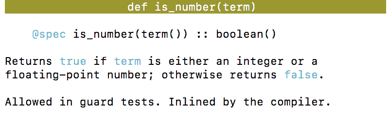

# Elixir 入门 02 :类型的基本知识

> 原文：<https://dev.to/gumi/elixir-02--30n1>

本文在 Elixir 官网的许可下，根据“[Basic types](https://elixir-lang.org/getting-started/basic-types.html) ”的解说，经过修改，对 Elixir 的基本数据类型进行说明。 示例类型和值如下(表 001 )。

#### 表 001■类型和值示例

| 基本类型 | 值示例 |
| --- | --- |
| integer | one |
| Integer (hexadecimal number) | 0x1F |
| decimal | One |
| Lunqi | 真实的 |
| 阿童木 | :原子 |
| Text column | “灵丹妙药” |
| 列表 | [1, 2, 3] |
| 元组 | {1, 2, 3} |

# 基本数值

整数可以进行四则运算。

```
iex> (1 + 2) * 3 - 4
5 
```

Enter fullscreen mode Exit fullscreen mode

但是，除法(运算符`/`)即使结果为整数，也会变为浮点数。

```
iex> 10 / 2
5.0 
```

Enter fullscreen mode Exit fullscreen mode

通过整数的除法，得到商的整数部分的是[`div`函数](https://hexdocs.pm/elixir/Kernel.html#div/2)。 函数的参数可以用括号`()`括起来，也可以省略。 另外，求整数除法的馀数(馀数)的是[`rem`函数](https://hexdocs.pm/elixir/Kernel.html#rem/2)。

```
iex> div(10, 2)
5
iex> div 10, 2
5
iex> rem 10, 3
1 
```

Enter fullscreen mode Exit fullscreen mode

在 Elixir 中，由于可以省略命名函数的括号`()`，所以可以用容易理解的语法书写宣言和控制流程的组装。

可以将整数作为二进制(`0b`)、八进制(`0o`)或十六进制(`0x`)来处理。

```
iex> 0b1000
8
iex> 0o10
8
iex> 0xFF
255 
```

Enter fullscreen mode Exit fullscreen mode

对作为小数处理的数值，附上小数点。 小数点以下的数值不能省略。 没有尾数的时候，请加上 0。 或者，也可以用使用了`e`的浮点数的形式表示。

```
iex> 1.0
1.0
iex> 3.14e-2
0.0314 
```

Enter fullscreen mode Exit fullscreen mode

Elixir 的浮点数值是 64 位的双精度。

使用函数[`round`](https://hexdocs.pm/elixir/Kernel.html#round/1)和[`trunc`](https://hexdocs.pm/elixir/Kernel.html#trunc/1)，可以进行小数点以下的四舍五入和舍去。

```
iex> round(2.718)
3
iex> trunc(2.718)
2 
```

Enter fullscreen mode Exit fullscreen mode

# 函数的表示

在 Elixir 中，函数由名称和接收的参数数量决定。 自变量的数量被称为[真实性](https://ja.wikipedia.org/wiki/%E3%82%A2%E3%83%AA%E3%83%86%E3%82%A3)。 因此，在文档中，函数将表示为“函数名称/真实性”。 例如，如果是对前面提到的数值进行四舍五入的函数，则为`round/1`。 如果名称相同但参数数量不同，则会将其作为其他函数处理。

# 逻辑(布尔)值

Elixir 有具有`true`和`false`2 值的逻辑(布尔)型。

```
iex> true
true
iex> 1 > 2
false 
```

Enter fullscreen mode Exit fullscreen mode

为了调查数据类型，根据类型有各种各样的函数。 确认是否是逻辑值的是[`is_boolean/1`函数](https://hexdocs.pm/elixir/Kernel.html#is_boolean/1)。 返回`true`或`false`的逻辑值。

```
iex> is_boolean(1 > 2)
true
iex> is_boolean(1)
false 
```

Enter fullscreen mode Exit fullscreen mode

关于数值，还具有函数[`is_integer/1`](https://hexdocs.pm/elixir/Kernel.html#is_integer/1)(整数)和[`is_float/1`](https://hexdocs.pm/elixir/Kernel.html#is_float/1)(浮点数值)以及[`is_number/1`](https://hexdocs.pm/elixir/Kernel.html#is_number/1)(数值)等。

另外，`iex`中用`h()`显示帮助。 例如，如果想了解`is_number/1`函数，请按以下方式输入(也可以省略真实性)。 显示函数的语法和说明(图 001 )。

```
iex> h is_number/1 
```

Enter fullscreen mode Exit fullscreen mode

#### t0-t1-iex 所示的函数的语法

[T2】](https://res.cloudinary.com/practicaldev/image/fetch/s--yB0pe5wq--/c_limit%2Cf_auto%2Cfl_progressive%2Cq_auto%2Cw_880/https://thepracticaldev.s3.amazonaws.com/i/3bkykd67u2d69l1inv5w.png)

# 阿童木

原子是将名字直接作为值的常数。 根据语言的不同，有时也称为符号(例如[Ruby](https://docs.ruby-lang.org/ja/latest/class/Symbol.html) )。 阿童木在名字前面加上冒号`:`。

```
iex> :hello
:hello
iex> :hello == :world
false 
```

Enter fullscreen mode Exit fullscreen mode

逻辑值`true`和`false`作为阿童木具备。 值是原子还是逻辑值，分别通过函数[`is_atom/1`](https://hexdocs.pm/elixir/Kernel.html#is_atom/1)和[`is_boolean/1`](https://hexdocs.pm/elixir/Kernel.html#is_boolean/1)进行调查。

```
iex> true == :true
true
iex> is_atom(false)
true
iex> is_boolean(:false)
true 
```

Enter fullscreen mode Exit fullscreen mode

Elixir 的模块名称也是阿童木。

```
iex> is_atom(String)
true 
```

Enter fullscreen mode Exit fullscreen mode

定义自定义模块时，名称以大写字母开始。 即使实际上没有模块，首字母大写的标识符也会被视为原子。

```
iex> is_atom(MyModule)
true 
```

Enter fullscreen mode Exit fullscreen mode

另外，在引用 Erlang 的模块时，会使用原子。 例如，Erlang 具有包含数学函数的[math 模块](http://erlang.org/doc/man/math.html)。 这个可以作为阿童木`:math`来参照。

```
iex(6)> :math.pow(2, 3)
8.0
iex(7)> is_atom(:math)
true 
```

Enter fullscreen mode Exit fullscreen mode

# text column

在 Elixir 中，字符串用双引号(`""`)括起来表示。 编码是 UTF-8。

```
iex> "hello"
"hello"
iex> "拝啓"
"拝啓" 
```

Enter fullscreen mode Exit fullscreen mode

原子可以通过用`#{}`括起来并进行字符串插值，包含在字符串中(参照“[Elixir 的危险语法，atom 字符串插值](https://qiita.com/melpon/items/63bcc6f26200c4081c1f)”)。

```
iex> "hello #{:world}"
"hello world" 
```

Enter fullscreen mode Exit fullscreen mode

字符串包含换行符。 另外，也可以用转义序列(`\n`)进行添加。

```
iex> "hello
...> world"
"hello\nworld"
iex> "hello\nworld"
"hello\nworld" 
```

Enter fullscreen mode Exit fullscreen mode

要输出字符串，请使用`IO`模块的[`IO.puts/2`函数](https://hexdocs.pm/elixir/IO.html#puts/2)。 另外显示的阿童木`:ok`是正确输出时的返回值。

```
iex> IO.puts "hello\nworld"
hello
world
:ok 
```

Enter fullscreen mode Exit fullscreen mode

Elixir 将字符串作为字节序列的二进制文件处理。 确认是二进制的函数是[`is_binary/1`](https://hexdocs.pm/elixir/1.0.5/Kernel.html#is_binary/1)。

```
iex> is_binary("hello")
true 
```

Enter fullscreen mode Exit fullscreen mode

[使用`byte_size/1`函数](https://hexdocs.pm/elixir/1.0.5/Kernel.html#byte_size/1)可以调查字节数。

```
iex> byte_size("hello")
5
iex> byte_size("拝啓")
6 
```

Enter fullscreen mode Exit fullscreen mode

在 UTF-8 中，字节数不一定表示字符数。 为了得到字符数而使用的是[`String.length/1`函数](https://hexdocs.pm/elixir/String.html#length/1)。

```
iex(16)> String.length("hello")
5
iex(17)> String.length("拝啓")
2 
```

Enter fullscreen mode Exit fullscreen mode

# Number of nameless cymbals

在 Elixir 中，函数是[第一级函数](https://ja.wikipedia.org/wiki/%E7%AC%AC%E4%B8%80%E7%B4%9A%E9%96%A2%E6%95%B0)( first-class function )，可以作为参数传递给其他函数或作为返回值返回。 在这种情况下，往往不命名函数就规定了。 以后想调用该函数时，将其存储在变量中。

函数以关键字`fn`开始，用`end`封闭。 自变量在括号`()`中用逗号(`,`)分隔给出，在后面附加的`->`后面写正文。 另外，可以省略包含自变量的`()`。 正确确定后，将显示`#Function<...>`的记述(`<>`内因环境而异)。

```
iex> sum = fn (a, b) -> a + b end
#Function<12.99386804/2 in :erl_eval.expr/5> 
```

Enter fullscreen mode Exit fullscreen mode

调用时，参照包含函数的变量，在点(`.`)之后向括号`()`传递自变量。 另外，这种情况下的`()`不能省略。

```
iex> sum.(1, 2)
3 
```

Enter fullscreen mode Exit fullscreen mode

在变量后添加点(`.`)是为了表示不是有名称的函数。 Elixir 区分有名称的函数和无名函数。

变量中是否包含函数，可以通过[`is_function/1`函数](https://hexdocs.pm/elixir/Kernel.html#is_function/1)来确定。

```
iex> is_function(sum)
true 
```

Enter fullscreen mode Exit fullscreen mode

并且，被调查到真实性数量的是[`is_function/2`函数](https://hexdocs.pm/elixir/Kernel.html#is_function/2)。 将蚂蚁数传递给第二个参数。

```
iex> is_function(sum, 1)
false
iex> is_function(sum, 2)
true 
```

Enter fullscreen mode Exit fullscreen mode

无名函数可以使用[捕获运算符`&`](https://hexdocs.pm/elixir/Kernel.SpecialForms.html#&/1)简短地表示(参照“[Function capturing](https://elixir-lang.org/getting-started/modules-and-functions.html#function-capturing) ”)。 在`&`后面加上从 1 开始的整数序号表示的是自变量。

```
iex> sum = &(&1 + &2)
&:erlang.+/2
iex> sum.(3, 4)
7 
```

Enter fullscreen mode Exit fullscreen mode

无名函数是[闭合](https://ja.wikipedia.org/wiki/%E3%82%AF%E3%83%AD%E3%83%BC%E3%82%B8%E3%83%A3)。 在自己的规定范围内解决参照。 也可以从其他函数引用已经存储在变量中的函数来使用。

```
iex> double = fn (a) -> sum.(a, a) end
#Function<6.99386804/1 in :erl_eval.expr/5>
iex> double.(2)
4 
```

Enter fullscreen mode Exit fullscreen mode

无名函数无需存储在变量中，也可以立即调用。 另外，在函数内分配的变量不会影响外部环境。

```
iex> x = 0
0
iex> (fn -> x = 1 end).()
1
iex> x
0 
```

Enter fullscreen mode Exit fullscreen mode

# 列表

把几个值汇总在一起的是清单。 在方括号`[]`中输入值(元素)，用逗号分隔。 值可以是任何类型。 列表的长度(要素的数量)可以通过[`length/1`函数](https://hexdocs.pm/elixir/Kernel.html#length/1)来调查。

```
iex> list = [3.14, :pie, true, "Apple"]
[3.14, :pie, true, "Apple"]
iex> length(list)
4 
```

Enter fullscreen mode Exit fullscreen mode

可以使用运算符[++/2](https://hexdocs.pm/elixir/Kernel.html#++/2) 或[--/2](https://hexdocs.pm/elixir/Kernel.html#--/2) 添加或减去其他列表中的元素。

```
iex> list ++ ["Cherry"]
[3.14, :pie, true, "Apple", "Cherry"]
iex> ["π"] ++ list
["π", 3.14, :pie, true, "Apple"]
iex> list -- [true, false]
[3.14, :pie, "Apple"] 
```

Enter fullscreen mode Exit fullscreen mode

从包含重复值的列表中减去多个相同的值时，将从左侧的值开始依次删除。 此时，要减去的值必须与严格的等价匹配(请参阅“”“比较”)。

```
iex> [1, 1, 2, 1, 2, 3, 1, 2, 3, 4] -- [4, 1, 3, 1, 2]
[1, 2, 1, 2, 3] 
```

Enter fullscreen mode Exit fullscreen mode

列表运算符不会改变引用的列表本身的内容。 返回的是新的列表。 Elixir 具有“[可抑制](https://ja.wikipedia.org/wiki/%E3%82%A4%E3%83%9F%E3%83%A5%E3%83%BC%E3%82%BF%E3%83%96%E3%83%AB)”( immutable )的数据结构。 数据不会被改写，只能转换为其他数据。 这样，就可以保持干净的代码。

处理列表时，经常取出头部和尾部。 头部是第一个要素，提尔是容纳其馀要素的列表。 分别通过函数[hd/1](https://hexdocs.pm/elixir/Kernel.html#hd/1) 和[tl/1](https://hexdocs.pm/elixir/Kernel.html#tl/1) 得到。

```
iex> hd(list)
3.14
iex> tl(list)
[:pie, true, "Apple"] 
```

Enter fullscreen mode Exit fullscreen mode

列表为空(长度为 0 )时，将出现参数错误(`ArgumentError`)。

```
iex> hd([])
** (ArgumentError) argument error
    :erlang.hd([])
iex> tl([1])
[]
iex> tl([])
** (ArgumentError) argument error
    :erlang.tl([]) 
```

Enter fullscreen mode Exit fullscreen mode

`|`通过使用运算符的模式匹配，也可以将头部和尾部赋予两个变量(参照“[Pattern matching](https://elixir-lang.org/getting-started/pattern-matching.html#pattern-matching-1) ”)。

```
iex> [head | tail] = list
[3.14, :pie, true, "Apple"]
iex> head
3.14
iex> tail
[:pie, true, "Apple"] 
```

Enter fullscreen mode Exit fullscreen mode

创建整数列表时，可能会以非整数的值返回到单引号(`''`)。

```
iex> [10, 11, 12]
'\n\v\f'
iex> [104, 101, 108, 108, 111]
'hello' 
```

Enter fullscreen mode Exit fullscreen mode

Elixir 将可以输出的 ASCII 代码列表表示为与代码对应的字符列表( charlist )。 charlist 经常用于与 Erlang 的代码的接口(请参见“[Charlists](https://elixir-lang.org/getting-started/binaries-strings-and-char-lists.html#charlists) ”)。 涉及到单引号的 charlist 信息可以通过 iex 的[`i/1`函数](https://hexdocs.pm/iex/IEx.Helpers.html#i/1)进行调查。

```
iex> i('hello')
Term
  'hello'
Data type
  List
Description
  This is a list of integers that is printed as a sequence of characters
  delimited by single quotes because all the integers in it represent valid
  ASCII characters. Conventionally, such lists of integers are referred to
  as "charlists" (more precisely, a charlist is a list of Unicode codepoints,
  and ASCII is a subset of Unicode).
Raw representation
  [104, 101, 108, 108, 111]
Reference modules
  List
Implemented protocols
  IEx.Info, Inspect, String.Chars, List.Chars, Collectable, Enumerable 
```

Enter fullscreen mode Exit fullscreen mode

在 Elixier 中，即使是相同的字符串，根据是单引号还是双引号的不同处理也不同。 因为这两个数据分别是不同的类型。

```
iex> 'hello' == "hello"
false
iex> i("hello")
Term
  "hello"
Data type
  BitString
Byte size
  5
Description
  This is a string: a UTF-8 encoded binary. It's printed surrounded by
  "double quotes" because all UTF-8 encoded codepoints in it are printable.
Raw representation
  <<104, 101, 108, 108, 111>>
Reference modules
  String, :binary
Implemented protocols
  IEx.Info, Inspect, String.Chars, List.Chars, Collectable 
```

Enter fullscreen mode Exit fullscreen mode

# 元组

元组也和列表一样，可以将多个值放在一起。 值可以是任何类型。 在括号`{}`中输入值(要素)，用逗号分隔。 调查长度(要素数)的函数为[tuple_size/1](https://hexdocs.pm/elixir/Kernel.html#tuple_size/1) 。

```
iex(5)> tuple = {3.14, :pie, true, "Apple"}
{3.14, :pie, true, "Apple"}
iex(6)> tuple_size(tuple)
4 
```

Enter fullscreen mode Exit fullscreen mode

元组将元素连续存储在内存中。 因此，长度比列表得到得快。 另外，使用[`elem/2`函数](https://hexdocs.pm/elixir/Kernel.html#elem/2)，也可以通过从 0 开始的整数序号的索引来取出要素。

```
iex> elem(tuple, 3)
"Apple" 
```

Enter fullscreen mode Exit fullscreen mode

[也可以用`put_elem/3`函数](https://hexdocs.pm/elixir/Kernel.html#put_elem/3)替换指定索引的值。 但是，和列表一样，元组也是可避免的。 操作返回的是新元组，引用的原始数据不会改变。

```
iex> put_elem(tuple, 3, "Cherry")
{3.14, :pie, true, "Cherry"}
iex> tuple
{3.14, :pie, true, "Apple"} 
```

Enter fullscreen mode Exit fullscreen mode

# 列表和元组的不同

无论数据类型是什么，列表和元组都作为元素存储了任意数量的值。 那么，两者的区别是什么呢？

列表为“[连接列表](https://ja.wikipedia.org/wiki/%E9%80%A3%E7%B5%90%E3%83%AA%E3%82%B9%E3%83%88)”。 元素具有值和对以下元素的引用: 因此，列表的长度，必须从要素开始按顺序数到最后才能知道。

此外，添加其他列表时，`++/2`运算符的左操作数列表越长也越慢。 因为这是在左操作数列表元素的末尾提供对右操作数列表第一个元素的引用的操作。

```
iex> list = [1, 2, 3]
# 左オペランドの長さが1なので速い
iex> [0] ++ list
[0, 1, 2, 3]
# 左オペランドの長さが3なので遅い
iex> list ++ [4]
[1, 2, 3, 4] 
```

Enter fullscreen mode Exit fullscreen mode

元组将值连续存储在内存中。 因此，获得大小和通过索引检索值的操作也很快。 但是，在添加要素或改写的情况下，会在内存中制作新的元组，因此会增加负荷。

```
iex> tuple = {:a, :b, :c, :d}
iex> put_elem(tuple, 2, :e)
{:a, :b, :e, :d} 
```

Enter fullscreen mode Exit fullscreen mode

这是元组结构的故事。 对于中的元素，元组和列表都共享数据。 例如，通过重写一个元素而创建的新元组，除了更新的元素外，与旧元组共享数据。 程序占用的内存相应地被抑制。 可以说这是可同步语言的恩惠吧。

性能的性质决定了数据结构的使用方法。 当返回信息作为函数的返回值时，元组很常用。 例如，[`File.read/1`函数](https://hexdocs.pm/elixir/File.html#read/1)会以元组形式返回文件读取的结果和内容。

```
iex> File.read("path/to/existing/file")
{:ok, "... ファイルの中身 ..."}
iex> File.read("path/to/unknown/file")
{:error, :enoent} 
```

Enter fullscreen mode Exit fullscreen mode

如果可以读取传递给函数参数的路径，则返回值的元组的第一个要素是原子`:ok`，第二个要素是文件的内容。 无法读取时，返回值的第 1 要素为原子`:error`，第 2 要素表示错误内容。

此外，元组是`elem/2`函数，可以得到指定索引的元素。 列表中没有内置此功能。

```
iex> tuple = {:ok, "hello"}
{:ok, "hello"}
iex> elem(tuple, 1)
"hello" 
```

Enter fullscreen mode Exit fullscreen mode

关于计数数据结构中元素的函数，Elixir 决定了命名方法(表 002 )。 返回预先计算的值的是带`size`的函数。 计数并返回的函数附有`length`。 因为要调查长度后返回，所以数量越多处理越慢。

#### 表 002■size 和 length 的用语差异

| 使用的语言 | 价格的计算方法 | Jun Li |
| --- | --- | --- |
| `size` | 被预先计算好了 | 好快 |
| `length` | 数着还给你 | 太慢了 |

以下四个函数已经介绍了。 即使对同一字符串进行操作，得到字节数的`byte_size/1`也是快速的处理。 但是，调查 Unicode 字符数的`String.length/1`，字符串越长处理越花时间。

*   `byte_size/1`:字符串的字节数
*   `tuple_size/1`:元组大小
*   `length/1`:列表的长度
*   `String.length/1`:字符串的字符数

#### Elixir 入门彩票

*   [Elixir 入门 01 :编写代码并尝试](https://dev.to/gumi/elixir-01--2585)
*   Elixir 入门 02 :类型的基本知识
*   [Elixir 入门 03 :运算符的基本](https://dev.to/gumi/elixir-03--33im)
*   [Elixir 入门 04 :模式匹配](https://dev.to/gumi/elixir-04--1346)
*   [仙丹入門 05: 条件-情况/条件/条件](https://dev.to/gumi/elixir-05----casecondif-60o)
*   [Elixir 入门 06 :二进制和字符串以及字符列表](https://dev.to/gumi/elixir-06--35na)
*   [Elixir 入门 07 :关键词列表和地图](https://dev.to/gumi/elixir-07--39hi)
*   [Elixir 入门 08 :模块和函数](https://dev.to/gumi/elixir-08--1c4c)
*   [Introduction T0】 Elixir 09: Rethink](https://dev.to/gumi/elixir-09--1a0p)
*   [仙丹入門 10: EnumとStream](https://dev.to/gumi/elixir-10-enumstream-4fpb)
*   [Elixir 入门 11 :流程](https://dev.to/gumi/elixir-11--2mia)
*   [Elixir 入门 12 :输入输出和文件系统](https://dev.to/gumi/elixir-12--4og6)
*   [仙丹入門 13: aliasとrequireおよびimport](https://dev.to/gumi/elixir-13-aliasrequireimport-55c1)
*   [Elixir 入门 14 :模块的属性](https://dev.to/gumi/elixir-14--3511)
*   [T0】 Elixir Beginner 15: Structure
*   [Elixir 入门 16 :协议](https://dev.to/gumi/elixir-16--lif)
*   [T0】 Elixir Beginner's Level 17: Record of Internal Package
*   [Elixir 入门 18 :锡吉尔](https://dev.to/gumi/elixir-18--5791)
*   [仙丹入門 19: tryとcatchおよびrescue](https://dev.to/gumi/elixir-19-trycatchrescue-50i8)
*   [Elixir 入门 20 :类型规格和行为](https://dev.to/gumi/elixir-20--j50)
*   [Elixir 入门 21 :调试](https://dev.to/gumi/elixir-21--21a1)
*   [Elixir 入门 22: Erlang 库](https://dev.to/gumi/elixir-22-erlang-2492)
*   [Elixir 入门 23 :下一步](https://dev.to/gumi/elixir-23--50ik)

##### Fanwai

*   [Elixir 入门:使用 Plug 为](https://dev.to/gumi/elixir-plug-40lb)