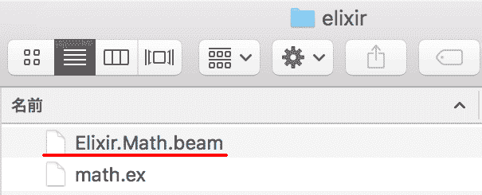

# Elixir 入门 08 :模块和函数

> 原文：<https://dev.to/gumi/elixir-08--1c4c>

本文在 Elixir 官网的许可下，根据“[Modules and functions](https://elixir-lang.org/getting-started/modules-and-functions.html) ”的解说，经过修改后对 Elixir 的模块和函数进行说明。

Elixir 将函数分组在模块中。 例如，[`String.length/1`](https://hexdocs.pm/elixir/String.html#length/1)是调查 UTF-8 的 Unicode 字符数的`String`模块的函数。

```
iex> String.length("hello")
5 
```

Enter fullscreen mode Exit fullscreen mode

制作模块时，使用[`defmodule/2`宏](https://hexdocs.pm/elixir/Kernel.html#defmodule/2)。 进而，在其中确定函数的是[`def/2`宏](https://hexdocs.pm/elixir/Kernel.html#def/2)。 模块和函数由以下语法组成:

```
iex> defmodule Math do
...>   def sum(a, b) do
...>     a + b
...>   end
...> end

iex> Math.sum(1, 2)
3 
```

Enter fullscreen mode Exit fullscreen mode

如果确定了模块和函数，代码变长，在`iex`模式下将很难进行测试。 使用编译和脚本模式，可以尝试写在文件中的程序。

# 编译

给写了 Elixir 程序的文件附上扩展名`.ex`。 例如，假设将以下代码保存为文件名`math.ex`:

```
defmodule Math do
  def sum(a, b) do
    a + b
  end
end 
```

Enter fullscreen mode Exit fullscreen mode

要进行编译，请从命令行工具输入`elixirc ファイル名`。 编译后的字节码文件应该会被制作为名为`Elixir.モジュール名.beam`(图 001 )。

```
$  elixirc math.ex 
```

Enter fullscreen mode Exit fullscreen mode

#### 制作了 001■模块的字节码

[T2】](https://res.cloudinary.com/practicaldev/image/fetch/s--0Hkq4fuq--/c_limit%2Cf_auto%2Cfl_progressive%2Cq_auto%2Cw_880/https://thepracticaldev.s3.amazonaws.com/i/781rg4ji2o5jnseq2irt.png)

之后启动`iex`，则读取该目录中的字节码文件(`.beam`)，模块也可以使用。

```
iex> Math.sum(1, 2)
3 
```

Enter fullscreen mode Exit fullscreen mode

在实际开发中会使用[`mix`](https://hexdocs.pm/mix/Mix.html)这一构建工具。 该工具的作用是创建、编译、测试项目、管理依赖关系等。 Elixir 项目通常将每个文件存储在以下三个目录中进行开发:

*   ebin -编译的字节码文件
*   lib - Elixir 代码文件(扩展名为`.ex`)
*   test -测试文件(扩展名为`.exs`)

# 脚本模式

在脚本模式下不制作字节码文件，而是执行程序。 文件的扩展名为`.exs`。 内容与`.ex`文件相同，编译的模块被读取到内存中执行。 为了表示不将字节码导出到磁盘，将使用不同的扩展名。

```
defmodule Math do
  def sum(a, b) do
    a + b
  end
end

IO.puts Math.sum(1, 2) 
```

Enter fullscreen mode Exit fullscreen mode

在脚本模式下执行时，从命令行工具输入命令`elixir ファイル名`。 要从程序中输出结果。 请使用`IO.puts/2`函数。

```
$  elixir math.exs
3 
```

Enter fullscreen mode Exit fullscreen mode

读取模块后想在`iex`中使用时，请从命令行工具用`iex ファイル名`的命令将其启动。

```
$  iex math.exs 
```

Enter fullscreen mode Exit fullscreen mode

```
iex> Math.sum(3, 4)
7 
```

Enter fullscreen mode Exit fullscreen mode

# 命名函数

在模块中用`def/2`规定的函数可以从其他模块中调用。 [`defp/2`](https://hexdocs.pm/elixir/Kernel.html#defp/2)用于定义不让外界参照的私有函数。 另外，散列符号`#`之后的记述作为注释被忽略。

```
defmodule Math do
  def sum(a, b) do
    do_sum(a, b)
  end

  defp do_sum(a, b) do
    a + b
  end
end

IO.puts Math.sum(1, 2)    #=> 3
IO.puts Math.do_sum(1, 2) #=> ** (UndefinedFunctionError) 
```

Enter fullscreen mode Exit fullscreen mode

```
$  elixir math.exs
3
** (UndefinedFunctionError) function Math.do_sum/2 is undefined or private
    Math.do_sum(1, 2)
    math.exs:12: (file)
    (elixir) lib/code.ex:677: Code.require_file/2 
```

Enter fullscreen mode Exit fullscreen mode

函数的规定中加入了防护和多个子句。 多个子句由 Elixir 按从上到下的顺序尝试，并执行匹配的子句。 如果参数不匹配任何一个，则会出现错误。 另外，函数名的最后加上问号`?`是返回逻辑值时 Elixir 中的[命名规则](https://hexdocs.pm/elixir/master/naming-conventions.html#trailing-question-mark-foo)。

```
defmodule Math do
  def zero?(0) do
    true
  end

  def zero?(x) when is_integer(x) do
    false
  end
end

IO.puts Math.zero?(0)   #=> true
IO.puts Math.zero?(1)   #=> false
IO.puts Math.zero?([1]) #=> ** (FunctionClauseError)
IO.puts Math.zero?(0.0) #=> ** (FunctionClauseError) 
```

Enter fullscreen mode Exit fullscreen mode

与`if/2`相同，命名函数中除了`do/end`块之外，还可以使用使用了`do:`的关键字列表的语法(“[Elixir 入门 05 :条件- case/cond/if](https://dev.to/gumi/elixir-05----casecondif-60o) ”“do”) 上述代码也可以写如下。

```
defmodule Math do
  def zero?(0), do: true
  def zero?(x) when is_integer(x), do: false
end 
```

Enter fullscreen mode Exit fullscreen mode

但是，`do:`的语法在 1 行就可以的情况下使用，在多行的情况下用`do/end`块写比较好吧。

# 函数的捕捉

以上述规定了`Math.zero?/1`的模块(文件名为 math.exs )为例，用`iex`尝试函数的捕捉。

```
$  iex math.exs 
```

Enter fullscreen mode Exit fullscreen mode

```
iex> Math.zero?(0)
true 
```

Enter fullscreen mode Exit fullscreen mode

Elixir 区分无名函数和命名函数。 要从保存了无名函数的变量中调用函数，必须在变量后添加点`.`(参照“[Elixir 入门 02 :类型的基本](https://dev.to/gumi/elixir-02--30n1)”“无名函数”)。

使用捕获运算符[`&/1`](https://hexdocs.pm/elixir/Kernel.SpecialForms.html#&/1)，可以将命名函数放入变量中，像无名函数一样进行调用。 要赋值的函数必须具有真实性。 另外，[`is_function/1`](https://hexdocs.pm/elixir/Kernel.html#is_function/1)确认自变量是否为函数。

```
iex> fun = &Math.zero?/1
&Math.zero?/1
iex> is_function(fun)
true
iex> fun.(0)
true 
```

Enter fullscreen mode Exit fullscreen mode

内置的函数也可以用`&/1`运算符存储在变量中调用。

```
iex> is_fun = &(is_function/1)
&:erlang.is_function/1
iex> is_fun.(fun)
true
iex> (&is_number/1).(1.0)
true 
```

Enter fullscreen mode Exit fullscreen mode

`&/1`使用运算符也可以简单地写无名函数。 例如，假设您想定义以下无名函数:

```
square = fn(x) -> x * x end 
```

Enter fullscreen mode Exit fullscreen mode

`&/1`使用运算符，可以写得很短。 而且，也可以和其他无名函数组合。

```
iex> square = &(&1 * &1)
#Function<6.99386804/1 in :erl_eval.expr/5>
iex> square.(2)
4
iex> square_sum = &(square.(&1) + square.(&2))
#Function<12.99386804/2 in :erl_eval.expr/5>
iex> square_sum.(3, 4)
25 
```

Enter fullscreen mode Exit fullscreen mode

还捕获了模块的函数后，就可以在没有模块的情况下调用它们了。 [`List.flatten/2`](https://hexdocs.pm/elixir/List.html#flatten/2https://hexdocs.pm/elixir/List.html#flatten/2)是在连接自变量的两个列表的基础上，对嵌套进行平坦化的函数。 因为给了两个自变量，所以不会给捕获增加真实感。

```
iex> flatten = &List.flatten(&1, &2)
&List.flatten/2
iex> flatten.([1, [[2], 3]], [4, 5])
[1, 2, 3, 4, 5] 
```

Enter fullscreen mode Exit fullscreen mode

也可以利用模块函数创建新函数。 另外，[`math`](https://elixir-lang.org/getting-started/erlang-libraries.html#the-math-module)是 Erlang 的模块，[`:math.sqrt/1`](http://erlang.org/doc/man/math.html#sqrt-1)是求平方根的函数。

```
iex> hypot = &:math.sqrt(square_sum.(&1, &2))
#Function<12.99386804/2 in :erl_eval.expr/5>
iex> hypot.(3, 4)
5.0 
```

Enter fullscreen mode Exit fullscreen mode

上面的函数定义如下。

```
iex> hypot = &:math.sqrt(&1 * &1 + &2 * &2)
#Function<12.99386804/2 in :erl_eval.expr/5>
iex> hypot.(3, 4)
5.0 
```

Enter fullscreen mode Exit fullscreen mode

# 默认参数

命名函数的参数后面跟在`\\`后面有默认值。

```
defmodule DefaultTest do
  def dowork(x \\ "hello") do
    x
  end
end 
```

Enter fullscreen mode Exit fullscreen mode

```
iex> DefaultTest.dowork()
"hello"
iex> DefaultTest.dowork("hi")
"hi"
iex> DefaultTest.dowork(1)
1 
```

Enter fullscreen mode Exit fullscreen mode

默认值可以由任何表达式给出。 但是，不是在定义函数时评估值。 每次调用函数并使用默认值时，都会对该值进行评估。

```
defmodule Concat do
  def join(a, b, sep \\ " ") do
    a <> sep <> b
  end
end 
```

Enter fullscreen mode Exit fullscreen mode

```
iex(2)> Concat.join("hello", "world")
"hello world"
iex(3)> Concat.join("hello", "world", ", ")
"hello, world" 
```

Enter fullscreen mode Exit fullscreen mode

具有多个子句的函数也可以使用默认值。 但是，在具有相同真实性的子句中，必须使用没有函数主体的标头。 编译错误的消息会显示这一点。

```
defmodule Greeter do
  def hello(name \\ nil, language \\ "em") when is_nil(name) do
    phrase(language) <> "world"
  end

  def hello(name, language \\ "en") do
    phrase(language) <> name
  end

  defp phrase("en"), do: "hello, "
  defp phrase("ja"), do: "こんにちは"
end 
```

Enter fullscreen mode Exit fullscreen mode

```
** (CompileError) greeter.ex:6: definitions with multiple clauses and default values requi
re a header. Instead of:
    def foo(:first_clause, b \\ :default) do ... end
    def foo(:second_clause, b) do ... end

one should write:

    def foo(a, b \\ :default)
    def foo(:first_clause, b) do ... end
    def foo(:second_clause, b) do ... end

def hello/2 has multiple clauses and defines defaults in one or more clauses
    greeter.ex:6: (module)
    (stdlib) erl_eval.erl:670: :erl_eval.do_apply/6 
```

Enter fullscreen mode Exit fullscreen mode

有多个子句的函数的默认值，请在标题的参数中用`\\`给出。

```
defmodule Greeter do
  def hello(name \\ nil, language \\ "en")

  def hello(name, language) when is_nil(name) do
    phrase(language) <> "world"
  end

  def hello(name, language) do
    phrase(language) <> name
  end

  defp phrase("en"), do: "hello, "
  defp phrase("ja"), do: "こんにちは"
end 
```

Enter fullscreen mode Exit fullscreen mode

```
iex> Greeter.hello()
"hello, world"
iex> Greeter.hello("alice")
"hello, alice"
iex> Greeter.hello("太郎", "ja")
"こんにちは太郎" 
```

Enter fullscreen mode Exit fullscreen mode

提供默认值时，请注意不要重复函数定义。

```
defmodule Concat do
  def join(a, b) do
    IO.puts "#=> join/2"
    a <> b
  end

  def join(a, b, sep \\ " ") do
    IO.puts "#=> join/3"
    a <> sep <> b
  end
end 
```

Enter fullscreen mode Exit fullscreen mode

编译上面的函数时，会显示以下警告。 因为传递这两个参数时，总是调用蚂蚁 2 的函数，不会使用蚂蚁 3 的默认值。

```
warning: this clause cannot match because a previous clause at line 2 always matches 
```

Enter fullscreen mode Exit fullscreen mode

因为不是错误，所以可以编译，也可以调用函数。 在传递三个参数之前，不会调用蚂蚁 3 函数。 有两个自变量的时候，应该重新考虑想得到什么样的结果吧。

```
iex(1)> Concat.join("hello", "world")
#=> join/2
"helloworld"
iex(2)> Concat.join("hello", "world", ", ")
#=> join/3
"hello, world" 
```

Enter fullscreen mode Exit fullscreen mode

下面的代码是使用函数默认值和模式匹配的示例。 [`Enum.join/2`](https://hexdocs.pm/elixir/Enum.html#join/2)是在列表([`Enumerable`](https://hexdocs.pm/elixir/Enumerable.html))要素之间插入第 2 自变量的字符串，与二进制(字符串)连接的函数。

```
defmodule Greeter do
  def hello(names, language \\ "en")

  def hello(names, language) when is_list(names) do
    hello(Enum.join(names, ", "), language)
  end

  def hello(name, language) when is_binary(name) do
    phrase(language) <> name
  end

  defp phrase("en"), do: "hello, "
  defp phrase("ja"), do: "こんにちは"
end 
```

Enter fullscreen mode Exit fullscreen mode

```
iex> Greeter.hello("alice")
"hello, alice"
iex> Greeter.hello(["alice", "carroll"])
"hello, alice, carroll"
iex> Greeter.hello(["桃太郎", "金太郎", "浦島太郎"], "ja")
"こんにちは桃太郎, 金太郎, 浦島太郎" 
```

Enter fullscreen mode Exit fullscreen mode

另外，上面的代码中的第一个函数，使用管道运算符[`|>`](https://hexdocs.pm/elixir/Kernel.html#%7C%3E/2)的话，可以简单改写如下。 `|>`是将左操作数的值作为第一参数传递到右操作数函数的运算符。

```
def hello(names, language) when is_list(names) do
  # hello(Enum.join(names, ", "), language)
  names
  |> Enum.join(", ")
  |> hello(language)
end 
```

Enter fullscreen mode Exit fullscreen mode

#### Elixir 入门彩票

*   [Elixir 入门 01 :编写代码并尝试](https://dev.to/gumi/elixir-01--2585)
*   [Elixir 入门 02 :型的基本](https://dev.to/gumi/elixir-02--30n1)
*   [Elixir 入门 03 :运算符的基本](https://dev.to/gumi/elixir-03--33im)
*   [Elixir 入门 04 :模式匹配](https://dev.to/gumi/elixir-04--1346)
*   [仙丹入門 05: 条件-情况/条件/条件](https://dev.to/gumi/elixir-05----casecondif-60o)
*   [Elixir 入门 06 :二进制和字符串以及字符列表](https://dev.to/gumi/elixir-06--35na)
*   [Elixir 入门 07 :关键词列表和地图](https://dev.to/gumi/elixir-07--39hi)
*   Elixir 入门 08 :模块和函数
*   [Introduction T0】 Elixir 09: Rethink](https://dev.to/gumi/elixir-09--1a0p)
*   [仙丹入門 10: EnumとStream](https://dev.to/gumi/elixir-10-enumstream-4fpb)
*   [Elixir 入门 11 :流程](https://dev.to/gumi/elixir-11--2mia)
*   [Elixir 入门 12 :输入输出和文件系统](https://dev.to/gumi/elixir-12--4og6)
*   [仙丹入門 13: aliasとrequireおよびimport](https://dev.to/gumi/elixir-13-aliasrequireimport-55c1)
*   [Elixir 入门 14 :模块的属性](https://dev.to/gumi/elixir-14--3511)
*   [T0】 Elixir Beginner 15: Structure
*   [Elixir 入门 16 :协议](https://dev.to/gumi/elixir-16--lif)
*   [T0】 Elixir Beginner's Level 17: Record of Internal Package
*   [Elixir 入门 18 :锡吉尔](https://dev.to/gumi/elixir-18--5791)
*   [仙丹入門 19: tryとcatchおよびrescue](https://dev.to/gumi/elixir-19-trycatchrescue-50i8)
*   [Elixir 入门 20 :类型规格和行为](https://dev.to/gumi/elixir-20--j50)
*   [Elixir 入门 21 :调试](https://dev.to/gumi/elixir-21--21a1)
*   [Elixir 入门 22: Erlang 库](https://dev.to/gumi/elixir-22-erlang-2492)
*   [Elixir 入门 23 :下一步](https://dev.to/gumi/elixir-23--50ik)

##### Fanwai

*   [Elixir 入门:使用 Plug 为](https://dev.to/gumi/elixir-plug-40lb)