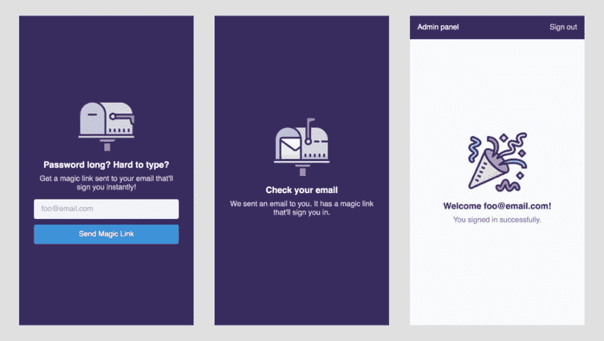

# Elixir 和 Phoenix 基本无密码和无数据库认证(第 1 部分)

> 原文：<https://dev.to/bigardone/elixir-and-phoenix-basic-passwordless-and-databaseless-authentication-pt-1-3clj>

这个帖子属于 **Elixir 和 Phoenix basic 无密码无数据库认证**系列。

1.  [项目设置以及存储和验证认证令牌的初始功能](https://dev.to/bigardone/elixir-and-phoenix-basic-passwordless-and-databaseless-authentication-pt-1-3clj)
2.  [发送认证链接邮件和用户套接字连接](https://dev.to/bigardone/elixir-and-phoenix-basic-passwordless-and-databaseless-authentication-pt-2-1haa)
3.  [将 webpack 设置为我们的资产捆绑器和 Elm 单页应用程序](https://dev.to/bigardone/elixir-and-phoenix-basic-passwordless-and-databaseless-authentication-pt-3-4o0g)

你有没有发现自己在做一个小项目，在某个时候，你被要求让一些用户访问应用程序的私有部分或某种小型管理面板？根据项目的限制，我们可以用许多不同的方法来解决这种情况。例如，如果拥有管理员配置文件和角色构成了业务逻辑和项目范围的一部分，那么拥有一个标准的授权和身份验证系统可能是正确的选择。另一方面，如果我们只需要对管理员用户进行身份验证并允许他们访问私有部分，我们可以依赖其他简单的替代方法，如 HTTP 基本身份验证，这可能不像我们需要的那样灵活和安全。

### 无密码认证

几年前，我读过[这篇关于身份验证现状的优秀文章](https://www.smashingmagazine.com/2016/06/the-current-state-of-authentication-we-have-a-password-problem/)，其中展示了最常见的用户身份验证方式，描述了它们的优缺点。在所有这些方法中，无密码身份验证是我最喜欢的一种，因为它在实现的容易性和安全强度之间达到了完美的平衡，从那以后在许多不同的项目中使用了这种方法。如果您不熟悉这项技术，它主要包括向用户询问电子邮件地址，并发送一个链接，该链接将自动验证他们进入应用程序，就像 Slack 所做的那样。到目前为止，我对结果非常满意，因为我的用户不再需要记住密码(密码往往很容易忘记)，我也不再需要处理凭证存储、验证和恢复。

### 无数据库认证

如前所述，有时我们不需要复杂的身份验证系统，该系统需要修改数据库模式或更改现有的业务逻辑来让少数用户访问应用程序的特定部分。因此，我想尝试存储凭证的替代方法，而 Elixir 非常适合这个特殊的用例。

### 我们在建造什么

对于这个实验，我们正在构建一个小型的 [Elixir 保护伞项目](https://elixir-lang.org/getting-started/mix-otp/dependencies-and-umbrella-projects.html#umbrella-projects)，它由两个应用程序组成:

*   **passless _ auth**:负责令牌生成、存储和认证逻辑。
*   **passless _ auth _ web**:负责发送认证邮件，并为 Elm SPA 提供服务，以便在 Phoenix socket 上测试我们的认证实验。

最终结果看起来像这样:

[T2】](https://res.cloudinary.com/practicaldev/image/fetch/s--Uq4Hr2yM--/c_limit%2Cf_auto%2Cfl_progressive%2Cq_auto%2Cw_880/https://monosnap.com/image/5VUT424b4Hu9ITi8r1SGae7HQleCPT.png)

我们将有三个屏幕:

*   图像中的最后一个屏幕对应于管理面板的根路径，它只显示给经过身份验证的用户。
*   第一个屏幕对应于“/登录”，显示给任何未经身份验证试图访问“/”的用户。
*   第二个屏幕对应于在请求神奇链接后向用户显示的成功消息。

请记住，在我们阅读教程的过程中，这些屏幕可能会发生变化，因为我会不断地进行修改和重构。事不宜迟，我们开始吧！

### 项目设置

重要的事情先来。让我们用以下选项构建一个新的 Phoenix 项目:

```
$ mix phx.new passwordless_auth --umbrella --no-ecto --no-brunch 
```

Enter fullscreen mode Exit fullscreen mode

`--umbrella`告诉 mix 任务生成一个伞状项目，而不是常规项目。由于我们不需要处理任何数据库连接，我们使用`--no-ecto`选项来防止安装`Ecto`，并创建一个默认的存储库。最后，我一直有一些关于用 Brunch 构建资产的问题，所以让我们暂时用`--no-brunch`选项删除它，因为我们将使用定制的 Webpack 构建。

在运行 mix 任务之后，我们可以看到我们的新伞状项目在`/apps`文件夹中有两个应用程序:

```
passwordless-auth
├── README.md
├── apps
│   ├── passwordless_auth
│   └── passwordless_auth_web
├── config
│   ├── config.exs
│   ├── dev.exs
│   ├── prod.exs
│   └── test.exs
├── mix.exs
└── mix.lock 
```

Enter fullscreen mode Exit fullscreen mode

### 认证知识库

我们不依赖数据库来存储被接纳的用户电子邮件及其相应的认证令牌，但是我们必须将它们存储在其他地方。Erlang/Elixir 为内存存储提供了一个简单明了的解决方案，即 [GenServer](https://hexdocs.pm/elixir/GenServer.html) 行为，它似乎完全符合我们的需求。让我们继续创建`Repo`模块:

```
# apps/passwordless_auth/lib/passwordless_auth/repo.ex

defmodule PasswordlessAuth.Repo do
  use GenServer
  @name __MODULE__

  def start_link(opts) do
    opts = Keyword.put_new(opts, :name, @name)
    {:ok, emails} = Keyword.fetch(opts, :emails)

    GenServer.start_link( __MODULE__ , emails, opts)
  end

  @impl true
  def init(emails) when is_list(emails) and length(emails) > 0 do
    state = Enum.reduce(emails, %{}, &Map.put(&2, &1, nil))

    {:ok, state}
  end

  def init(_), do: {:stop, "Invalid list of emails"}
end 
```

Enter fullscreen mode Exit fullscreen mode

`start_link`函数接收选项以生成存储库的`GenServer`流程。这些选项包括:

*   `:name`可选，用于注册流程。
*   `:emails`是强制的，代表被接受的电子邮件列表，我们在`init`函数中使用它来构建流程的初始状态。

`init`函数接收电子邮件列表并创建一个`Map`，其中密钥是电子邮件，值将存储认证令牌，但目前我们将它们设置为`nil`。相反，如果接收的不是列表，我们希望它返回`{:stop, "Invalid list of emails"}`，退出进程，不让应用程序启动。

让我们创建一个测试模块来对此进行测试:

```
# apps/passwordless_auth/test/passwordless_auth/repo_test.exs

defmodule PasswordlessAuth.RepoTest do
  use ExUnit.Case, async: true

  alias PasswordlessAuth.Repo

  describe ".init/1" do
    test "returns error when emails are wrong" do
      Process.flag(:trap_exit, true)

      name = :repo_test_1
      Repo.start_link(name: name, emails: "")

      assert_receive {:EXIT, _, "Invalid list of emails"}
    end

    test "starts the repo when emails is a list" do
      name = :repo_test_1
      assert {:ok, _pid} = Repo.start_link(name: name, emails: ["foo@email.com"])
    end
  end
end 
```

Enter fullscreen mode Exit fullscreen mode

运行测试表明，一切都如我们预期的那样工作:

```
$ mix test test/passwordless_auth/repo_test.exs
==> passwordless_auth
..

Finished in 0.1 seconds
2 tests, 0 failures

Randomized with seed 407876
==> passwordless_auth_web
Test patterns did not match any file: test/passwordless_auth/repo_test.exs 
```

Enter fullscreen mode Exit fullscreen mode

酷！现在我们需要在应用程序启动后生成`Repo`流程，所以让我们将它添加到主监督树:

```
# apps/passwordless_auth/lib/passwordless_auth/application.ex

defmodule PasswordlessAuth.Application do
  use Application

  def start(_type, _args) do
    import Supervisor.Spec, warn: false

    children = [
      worker(
        PasswordlessAuth.Repo,
        [[emails: emails()]]
      )
    ]

    Supervisor.start_link(children, strategy: :one_for_one, name: PasswordlessAuth.Supervisor)
  end

  defp emails, do: Application.get_env(:passwordless_auth, :repo)[:emails]
end 
```

Enter fullscreen mode Exit fullscreen mode

如果我们试图在此时启动应用程序，它不会这样做，因为我们还没有在配置中设置电子邮件，就像我们在之前的测试中断言的一样:

```
$ iex -S mix
Erlang/OTP 21 [RELEASE CANDIDATE 1] [erts-10.0] [source] [64-bit] [smp:8:8] [ds:8:8:10] [async-threads:1] [hipe]

[info] Application passwordless_auth exited: PasswordlessAuth.Application.start(:normal, []) returned an error: shutdown: failed to start child: PasswordlessAuth.Repo
    ** (EXIT) "Invalid list of emails"
** (Mix) Could not start application passwordless_auth: PasswordlessAuth.Application.start(:normal, []) returned an error: shutdown: failed to start child: PasswordlessAuth.Repo
    ** (EXIT) "Invalid list of emails" 
```

Enter fullscreen mode Exit fullscreen mode

让我们在配置中添加一个电子邮件列表:

```
# apps/passwordless_auth/config/config.exs

use Mix.Config

config :passwordless_auth,
       :repo,
       emails: ~w(foo@email.com bar@email.com baz@email.com) 
```

Enter fullscreen mode Exit fullscreen mode

并尝试再次启动:

```
$ iex -S mix
Erlang/OTP 21 [RELEASE CANDIDATE 1] [erts-10.0] [source] [64-bit] [smp:8:8] [ds:8:8:10] [async-threads:1] [hipe]

Interactive Elixir (1.6.5) - press Ctrl+C to exit (type h() ENTER for help)
iex(1)> 
```

Enter fullscreen mode Exit fullscreen mode

它像预期的那样工作，所以让我们继续向`Repo`模块添加一些逻辑。

### 回购逻辑

在继续之前，让我们启动应用程序并检查一下`Repo`进程的当前状态是什么样子的:

```
$ iex -S mix
...
iex(1)> :sys.get_state PasswordlessAuth.Repo
%{"bar@email.com" => nil, "baz@email.com" => nil, "foo@email.com" => nil}
iex(2)> 
```

Enter fullscreen mode Exit fullscreen mode

这是我们将要存储身份验证令牌的地图。让我们继续添加一些功能来验证电子邮件是否有效，保存和获取令牌值:

```
# apps/passwordless_auth/lib/passwordless_auth/repo.ex

defmodule PasswordlessAuth.Repo do
  #...

  def exists?(pid \\ @name, email),
    do: GenServer.call(pid, {:exists, email})

  def save(pid \\ @name, email, token),
    do: GenServer.call(pid, {:save, email, token})

  def fetch(pid \\ @name, email),
    do: GenServer.call(pid, {:fetch, email})

  # ...

  @impl true
  def handle_call({:exists, email}, _from, state) do
    {:reply, Map.has_key?(state, email), state}
  end

  def handle_call({:save, email, token}, _from, state) do
    if Map.has_key?(state, email) do
      {:reply, :ok, Map.put(state, email, token)}
    else
      {:reply, {:error, :invalid_email}, state}
    end
  end

  def handle_call({:fetch, email}, _from, state) do
    {:reply, Map.fetch(state, email), state}
  end
end 
```

Enter fullscreen mode Exit fullscreen mode

*   接收一封电子邮件并检查它是否属于该州的密钥。
*   `save/3`获取一封电子邮件和一个令牌，并尝试将其存储到状态中，如果电子邮件存在，则返回`:ok`,如果不存在，则返回`{:error, :invalid_email}`。
*   `fetch/2`接收一封电子邮件并获取其令牌值的状态。

让我们为新功能添加一些测试:

```
# apps/passwordless_auth/test/passwordless_auth/repo_test.exs

defmodule PasswordlessAuth.RepoTest do
  use ExUnit.Case, async: true

  alias PasswordlessAuth.Repo

  # ...

    describe ".exists?/2" do
    test "returns true when passed email is in the repo's state" do
      name = :repo_test_2
      email = "foo@test.com"
      {:ok, _pid} = Repo.start_link(name: name, emails: [email])

      assert Repo.exists?(name, email)
    end

    test "returns false when passed email no it repo's state" do
      name = :repo_test_3
      email = "foo@test.com"
      {:ok, _pid} = Repo.start_link(name: name, emails: [email])

      refute Repo.exists?(name, "not_found@test.com")
    end
  end

  describe ".save/3" do
    test "returns :ok and sets token value in state when email exists" do
      name = :repo_test_4
      email = "foo@test.com"
      token = "token-value"
      {:ok, _pid} = Repo.start_link(name: name, emails: [email])

      assert :ok = Repo.save(name, email, token)
      assert %{"foo@test.com" => ^token} = :sys.get_state(name)
    end

    test "returns {:error, :invalid_email} when email does not exist" do
      name = :repo_test_5
      email = "foo@test.com"
      token = "token-value"
      {:ok, _pid} = Repo.start_link(name: name, emails: [email])

      assert {:error, :invalid_email} = Repo.save(name, "bar@test.com", token)
    end
  end

  describe ".fetch/2" do
    test "returns {:ok, token} for passed email" do
      name = :repo_test_6
      email = "foo@test.com"
      token = "token-value"
      {:ok, _pid} = Repo.start_link(name: name, emails: [email])
      :ok = Repo.save(name, email, token)

      assert {:ok, ^token} = Repo.fetch(name, email)
    end

    test "returns :error when token not found" do
      name = :repo_test_7
      email = "foo@test.com"
      token = "token-value"
      {:ok, _pid} = Repo.start_link(name: name, emails: [email])
      :ok = Repo.save(name, email, token)

      assert :error = Repo.fetch(name, "not_found@test.com")
    end
  end
end 
```

Enter fullscreen mode Exit fullscreen mode

并检查它们是否都通过:

```
$ mix test test/passwordless_auth/repo_test.exs
==> passwordless_auth
........

Finished in 0.1 seconds
8 tests, 0 failures 
```

Enter fullscreen mode Exit fullscreen mode

### 令牌逻辑

看起来我们已经包括了基本的东西，现在，让我们创建`Token`模块来处理令牌生成和验证。Phoenix 为这些目的提供了一个方便的模块， [Phoenix。令牌](https://hexdocs.pm/phoenix/Phoenix.Token.html)，我们可以构建包装它的模块:

```
# apps/passwordless_auth/lib/passwordless_auth/token.ex

defmodule PasswordlessAuth.Token do
  alias Phoenix.Token, as: PhoenixToken

  @salt "token salt"
  @max_age :timer.minutes(5) / 1000
  @secret Application.get_env(:passwordless_auth, __MODULE__ )[:secret_key_base]

  def generate(data) when data in [nil, ""], do: {:error, :invalid}

  def generate(data) do
    {:ok, PhoenixToken.sign(@secret, @salt, data)}
  end

  def verify(token, data, max_age \\ @max_age) do
    case PhoenixToken.verify(
           @secret,
           @salt,
           token,
           max_age: max_age
         ) do
      {:ok, ^data} ->
        {:ok, data}

      {:ok, _other} ->
        {:error, :invalid}

      {:error, reason} ->
        {:error, reason}
    end
  end
end 
```

Enter fullscreen mode Exit fullscreen mode

*   `generate/1`接受一些`data`并返回带有使用`Phoenix.Token.sign/4`生成的令牌的`{:ok, token}`，除非它正在接收的`data`要么是`nil`要么是空字符串，在这种情况下，它返回相应的`{:error, :invalid}`元组。
*   `verify/3`取一个`token`、`data`和一个`max_age`，用`Phoenix.Token.verify/4`查 id`token`对应`data`，还没到期。

让我们添加一个测试模块来检查一切是否正常:

```
# apps/passwordless_auth/test/passwordless_auth/token_test.exs

defmodule PasswordlessAuth.TokenTest do
  use ExUnit.Case, async: true

  alias PasswordlessAuth.Token

  describe ".generate/1" do
    test "returns {:error, :invalid} when value is nil" do
      assert {:error, :invalid} = Token.generate(nil)
      assert {:error, :invalid} = Token.generate("")
    end

    test "returns {:ok, token}" do
      assert {:ok, _token} = Token.generate("foo")
    end
  end

  describe ".verify/3" do
    test "returns {:ok, data} when token is valid" do
      {:ok, token} = Token.generate("foo")

      assert {:ok, "foo"} = Token.verify(token, "foo")
    end

    test "returns {:error, :invalid} when token is not valid" do
      {:ok, token} = Token.generate("foo")

      assert {:error, :invalid} = Token.verify(token, "bar")
    end

    test "returns {:error, reason} when token expires" do
      {:ok, token} = Token.generate("foo")

      Process.sleep(150)
      assert {:error, :expired} = Token.verify(token, "foo", 0.1)
    end
  end
end 
```

Enter fullscreen mode Exit fullscreen mode

现在我们可以运行测试并查看结果:

```
$ mix test test/passwordless_auth/token_test.exs
==> passwordless_auth

  1) test .verify/3 returns {:error, reason} when token expires (PasswordlessAuth.TokenTest)
     test/passwordless_auth/token_test.exs:30
     ** (UndefinedFunctionError) function nil.config/1 is undefined or private
     code: {:ok, token} = Token.generate("foo")
     stacktrace:
       nil.config(:secret_key_base)
       (phoenix) lib/phoenix/token.ex:202: Phoenix.Token.get_endpoint_key_base/1
       (phoenix) lib/phoenix/token.ex:111: Phoenix.Token.sign/4
       (passwordless_auth) lib/passwordless_auth/token.ex:25: PasswordlessAuth.Token.generate/1
       test/passwordless_auth/token_test.exs:31: (test) 
```

Enter fullscreen mode Exit fullscreen mode

看起来我们忘记了在配置中添加`:secret`值，所以让我们继续设置它:

```
# apps/passwordless_auth/config/config.exs

# ...

config :passwordless_auth,
       PasswordlessAuth.Token,
       secret_key_base: "your_secret_key_base" 
```

Enter fullscreen mode Exit fullscreen mode

要生成`secret_key_base`值，可以使用`phx.gen.secret`混合任务。在设置好值并再次运行测试之后，现在一切都应该正常了:

```
$ mix test test/passwordless_auth/token_test.exs
==> passwordless_auth
.....

Finished in 0.2 seconds
5 tests, 0 failures 
```

Enter fullscreen mode Exit fullscreen mode

### 提供和验证令牌

让我们编辑主`PasswordlessAuth`模块，并添加一个新的函数来提供新的令牌，使用我们到目前为止所做的:

```
# apps/passwordless_auth/lib/passwordless_auth.ex

defmodule PasswordlessAuth do
  alias PasswordlessAuth.{Repo, Token}

  def provide_token_for(repo \\ Repo, email)
  def provide_token_for(_, email) when email in [nil, ""], do: {:error, :invalid_email}

  def provide_token_for(repo, email) do
    with true <- Repo.exists?(repo, email),
         {:ok, token} <- Token.generate(email),
         :ok <- Repo.save(repo, email, token) do
      {:ok, token}
    else
      false ->
        {:error, :not_found}

      other ->
        {:error, :internal_error, other}
    end
  end
end 
```

Enter fullscreen mode Exit fullscreen mode

在继续添加验证逻辑之前，让我们停下来想一想我们需要什么。该函数将接收一个令牌，我们不仅要检查它是否对应于`Repo`中存储的令牌，还要检查令牌的签名值是否对应于存储的电子邮件密钥。因此，让我们添加一个新的函数，从`Repo`模块:
按令牌返回电子邮件

```
# apps/passwordless_auth/lib/passwordless_auth/repo.ex

defmodule PasswordlessAuth.Repo do
  # ...

  def find_by_token(pid \\ @name, token),
    do: GenServer.call(pid, {:find_by_token, token})

  # ...

  def handle_call({:find_by_token, token}, _from, state) do
    {:reply, Enum.find(state, &(elem(&1, 1) == token)), state}
  end
end 
```

Enter fullscreen mode Exit fullscreen mode

`find_by_token/2`检查状态中是否有元素带有值，如果没有找到，返回元组`{email, token}`或 nil。这可能不是最有效的方式，但是我们已经同意回购只存储几封邮件，为了简单起见，让我们保持这种方式。让我们来测试一下:

```
# apps/passwordless_auth/test/passwordless_auth/repo_test.exs

defmodule PasswordlessAuth.RepoTest do
  use ExUnit.Case, async: true

  alias PasswordlessAuth.Repo

  # ...

  describe ".find_by_token/2" do
    test "returns {email, token} when token exists" do
      name = :repo_test_8
      email = "foo@test.com"
      token = "token-value"
      {:ok, _pid} = Repo.start_link(name: name, emails: [email])
      :ok = Repo.save(name, email, token)

      assert {^email, ^token} = Repo.find_by_token(name, token)
    end

    test "returns nil when token not found" do
      name = :repo_test_9
      email = "foo@test.com"
      token = "token-value"
      {:ok, _pid} = Repo.start_link(name: name, emails: [email])
      :ok = Repo.save(name, email, token)

      assert nil == Repo.find_by_token(name, "other-token")
    end
  end

$ mix test test/passwordless_auth/repo_test.exs
==> passwordless_auth
..........

Finished in 0.1 seconds
10 tests, 0 failures 
```

Enter fullscreen mode Exit fullscreen mode

现在我们准备好继续我们离开的地方，所以让我们继续添加验证功能到`PasswordlessAuth`模块:

```
# apps/passwordless_auth/lib/passwordless_auth.ex

defmodule PasswordlessAuth do
  alias PasswordlessAuth.{Repo, Token}

  # ...

  def verify_token(repo \\ Repo, token) do
    repo
    |> Repo.find_by_token(token)
    |> do_verify()
  end

  # ...

  defp do_verify(nil), do: {:error, :not_found}
  defp do_verify({email, token}), do: Token.verify(token, email)
end 
```

Enter fullscreen mode Exit fullscreen mode

正如我们到目前为止所做的，让我们为`PasswordlessAuth`模块:
创建一个测试模块

```
# apps/passwordless_auth/test/passwordless_auth_test.exs

defmodule PasswordlessAuthTest do
  use ExUnit.Case, async: true

  alias PasswordlessAuth.Repo

  describe "provide_token_for/2" do
    test "returns error when email is blank" do
      assert {:error, :invalid_email} = PasswordlessAuth.provide_token_for(nil)
      assert {:error, :invalid_email} = PasswordlessAuth.provide_token_for("")
    end

    test "returns error when email does not exist" do
      repo = :"repo_test_#{ __MODULE__ }_1"
      email = "foo@test.com"
      {:ok, _pid} = Repo.start_link(name: repo, emails: [email])

      assert {:error, :not_found} =
               PasswordlessAuth.provide_token_for(repo, "not-found-email@test.com")
    end

    test "returns token when valid email" do
      repo = :"repo_test_#{ __MODULE__ }_2"
      email = "foo@test.com"
      {:ok, _pid} = Repo.start_link(name: repo, emails: [email])

      assert {:ok, token} = PasswordlessAuth.provide_token_for(repo, email)
      assert byte_size(token) > 0
    end
  end

  describe "verify_token/2" do
    test "returns error when token not found" do
      repo = :"repo_test_#{ __MODULE__ }_3"
      email = "foo@test.com"
      {:ok, _pid} = Repo.start_link(name: repo, emails: [email])
      {:ok, _token} = PasswordlessAuth.provide_token_for(repo, email)

      assert {:error, :not_found} = PasswordlessAuth.verify_token(repo, "not-found-token")
    end

    test "returns value when token valid" do
      repo = :"repo_test_#{ __MODULE__ }_4"
      email = "foo@test.com"
      {:ok, _pid} = Repo.start_link(name: repo, emails: [email])
      {:ok, token} = PasswordlessAuth.provide_token_for(repo, email)

      assert {:ok, ^email} = PasswordlessAuth.verify_token(repo, token)
    end
  end
end 
```

Enter fullscreen mode Exit fullscreen mode

最后运行它以确认一切正常:

```
$ mix test test/passwordless_auth_test.exs
==> passwordless_auth
.....

Finished in 0.07 seconds
5 tests, 0 failures

Randomized with seed 291795 
```

Enter fullscreen mode Exit fullscreen mode

耶！让我们暂时把它放在这里。在本系列的下一部分中，我们将通过电子邮件向用户发送认证链接，并使用该链接来验证令牌和认证 Phoenix 套接字连接。与此同时，不要忘记查看源代码和我们小实验的最终结果:

[源代码](https://github.com/bigardone/passwordless-auth)

编码快乐！

[T2】](https://res.cloudinary.com/practicaldev/image/fetch/s--zVIpSIO0--/c_limit%2Cf_auto%2Cfl_progressive%2Cq_auto%2Cw_880/http://feeds.feedburner.com/%257Er/CodeLoveAndBoards/%257E4/bBnuAZkGfT0)