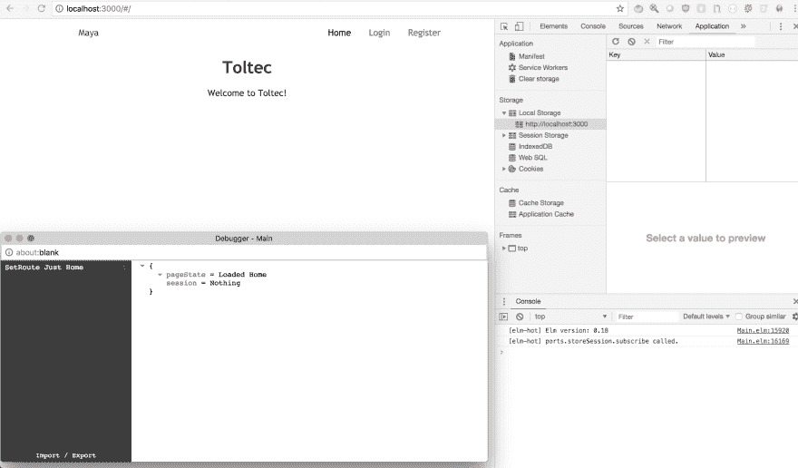
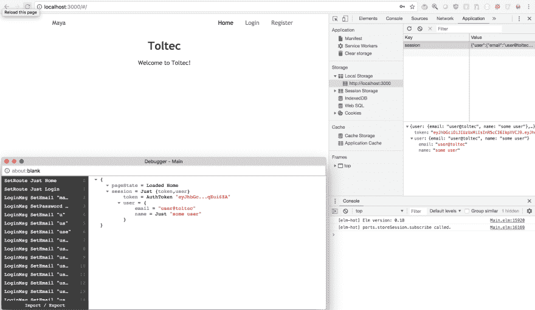
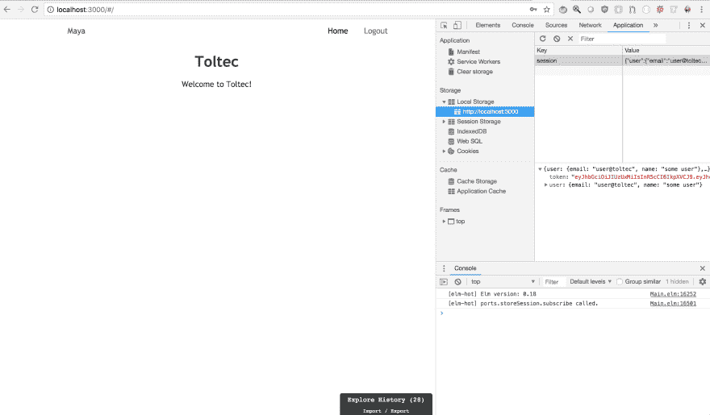
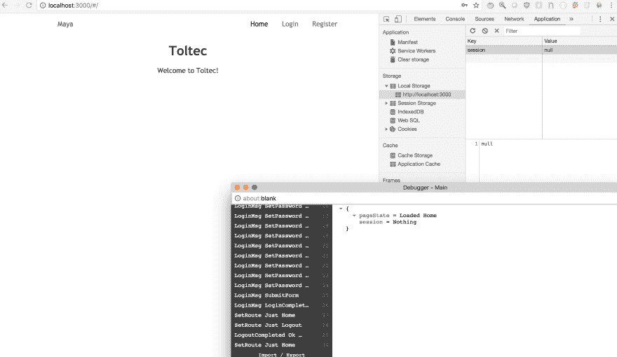
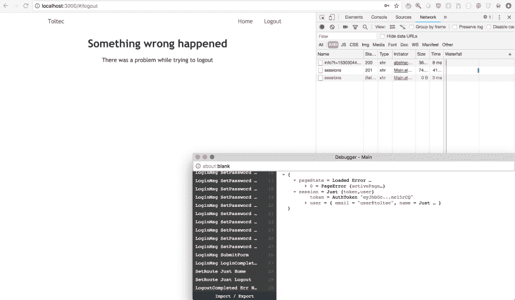

# Elixir API 和 Elm SPA -第 5 部分

> 原文：<https://dev.to/miguelcoba/elixir-api-and-elm-spa---part-5-4j1k>

# 第 5 部分:将会话数据保存到本地存储

我们将在应用程序启动时将会话(令牌)保存到本地存储，如果它存在，用户可以避免再次登录。我们还将实现 Logout 命令并添加一个通用错误页面。

## 系列

1.  [第 1 部分- Elixir 应用程序创建](https://dev.to/miguelcoba/elixir-api-and-elm-spa-4hpf)
2.  [第 2 部分-增加监护人认证](https://dev.to/miguelcoba/elixir-api-and-elm-spa---part-2-1pca)
3.  [第 3 部分- Elm 应用程序创建和路由设置](https://dev.to/miguelcoba/elixir-api-and-elm-spa---part-3-3n0h)
4.  [第 4 部分-添加登录和注册页面](https://dev.to/miguelcoba/elixir-api-and-elm-spa---part-4-4il0)
5.  第 5 部分-将会话数据保存到本地存储

## 将会话保存到本地存储

我们将序列化我们拥有的会话类型，并将其作为 JSON 存储在 localStorage 中。此外，在 app boostrap 中，我们将检查 localStorage 中是否有内容，如果有，我们将尝试获取它，使用 Session.decoder 对其进行反序列化，最后将其放在我们的模型中。

从添加一些需要的依赖项开始:

```
elm-app install lukewestby/elm-http-builder 
```

Enter fullscreen mode Exit fullscreen mode

将此功能添加到 app 模型:

```
-- src/Model.elm

decodeSessionFromJson : Value -> Maybe Session
decodeSessionFromJson json =
    json
        |> Decode.decodeValue Decode.string
        |> Result.toMaybe
        |> Maybe.andThen (Decode.decodeString Session.decoder >> Result.toMaybe) 
```

Enter fullscreen mode Exit fullscreen mode

这将获得一个可能包含字符串的值，然后尝试将其解码为一个会话对象。

我们将在 Elm 应用程序初始化中使用该函数从 localStorage 获取一个会话，并将其放在我们的模型上(如果它存在的话)。
修改 Model.elm 中的 *initialModel* 函数，如下所示:

```
-- src/Model.elm

initialModel : Value -> Model
initialModel val =
    { session = decodeSessionFromJson val
    , pageState = Loaded Blank
    } 
```

Enter fullscreen mode Exit fullscreen mode

## 添加端口

因为我们要与 JavaScript 世界交流，所以我们需要设置一些端口。

添加一个 Ports.elm 文件

```
-- src/Ports.elm

port module Ports exposing (onSessionChange, storeSession)

import Json.Encode exposing (Value)

port storeSession : Maybe String -> Cmd msg

port onSessionChange : (Value -> msg) -> Sub msg 
```

Enter fullscreen mode Exit fullscreen mode

这实际上向 Elm 运行时注册了两个函数，它们将用于与 JS 世界通信。第一个， *storeSession* 获取一个字符串(我们编码的会话类型)并发送给 JS world。第二个是 *onSessionChange* ，它将在每次 localStorage 值发生变化时被调用，这样我们就可以得到变化的通知，并在我们的 Elm 应用程序中做出适当的反应。

这些函数需要它们的 JS 对应物。打开 index.js，将其内容替换为:

```
-- src/index.js

import './main.css';
import { Main } from './Main.elm';
import registerServiceWorker from './registerServiceWorker';

var app = Main.fullscreen(localStorage.session || null);

app.ports.storeSession.subscribe(function(session) {
    localStorage.session = session;
});

window.addEventListener(
    "storage",
    function(event) {
        if (event.storageArea === localStorage && event.key === "session") {
            app.ports.onSessionChange.send(event.newValue);
        }
    },
    false
);

registerServiceWorker(); 
```

Enter fullscreen mode Exit fullscreen mode

我们正在改变应用程序的引导方式。以前，我们有这个:

```
 Main.embed(document.getElementById('root')); 
```

Enter fullscreen mode Exit fullscreen mode

它查找 id 设置为 root 的 DOM 元素，并用 Elm 应用程序替换其内容。
现在我们将使用*全屏*功能来使用整个屏幕。
这返回给我们一个 app 对象，我们可以用它来配置我们的端口。

第一个注册了每次调用 storeSession 时要调用的回调。它接收一个值并将其存储在 localSession.session 属性中。第二个有点复杂。它向浏览器窗口对象的 storage 属性添加一个事件侦听器，并注册一个回调，当 storage 属性发生变化时调用该回调。只有当 event.storageArea 是 localStorage 并且事件键是“session”时，我们才会采取行动。如果满足这些条件，我们使用 onSessionChange 函数将 eventNewValue 发送到 Elm 端口。
总之，我们等待来自 Elm 应用程序的会话更改，并将其写入 JS land 中的 localStorage，我们对 JS land 中 localStorage 上的事件做出反应，并将值发送到 Elm land。

鉴于我们是在全屏模式下引导应用程序，我们不再需要 id="root "元素。让我们移除它。把 index.html 的身体改成这样。

```
<!-- public/index.html -->

<body class="bg-white">
    <noscript>
        You need to enable JavaScript to run this app.
    </noscript>
</body> 
```

Enter fullscreen mode Exit fullscreen mode

## 存储会话

现在，让我们添加一个函数，使用我们刚刚创建的这些端口将会话保存到本地存储。将此函数添加到 Session/Model.elm 并公开它

```
-- src/Session/Model.elm

module Session.Model exposing (Session, decoder, encode, storeSession)

-- ..

import Ports

-- ...

storeSession : Session -> Cmd msg
storeSession session =
    encode session
        |> Encode.encode 0
        |> Just
        |> Ports.storeSession 
```

Enter fullscreen mode Exit fullscreen mode

这将获取一个会话，对其进行编码，并将其传递给 Ports.storeSession 以保存到 localStorage。

现在让我们在登录和注册页面上使用它来存储成功登录后的会话:

```
-- src/Session/Login.elm

import Session.Model exposing (Session, storeSession)

-- ..

-- and change the Login (Ok session) branch of the update function to
LoginCompleted (Ok session) ->
    model
        => Cmd.batch [ storeSession session, Route.modifyUrl Route.Home ]
        => SetSession session

-- src/Session/Register.elm

import Session.Model exposing (Session, storeSession)

-- ..

-- and change the Register (Ok session) branch of the update function to
RegisterCompleted (Ok session) ->
    model
        => Cmd.batch [ storeSession session, Route.modifyUrl Route.Home ]
        => SetSession session 
```

Enter fullscreen mode Exit fullscreen mode

最后一点，我们需要在 Elm 应用程序上添加一个订阅，以便在 JS land 触发会话更改时使用。让我们添加一条新消息来处理这个问题:

```
-- src/Messages.elm

import Session.Model exposing (Session)

-- ..

type Msg
    = SetRoute (Maybe Route)
    | SetSession (Maybe Session)
    | LoginMsg Login.Msg
    | RegisterMsg Register.Msg 
```

Enter fullscreen mode Exit fullscreen mode

当会话改变时，我们将发送 SetSession 消息。我们将添加发生这种情况时发送此消息的订阅:

```
-- src/Session/Model.elm
module Session.Model exposing (Session, decoder, encode, storeSession, sessionChangeSubscription)

-- ...

sessionChangeSubscription : Sub (Maybe Session)
sessionChangeSubscription =
    Ports.onSessionChange (Decode.decodeValue decoder >> Result.toMaybe) 
```

Enter fullscreen mode Exit fullscreen mode

然后我们在 Subscriptions.elm
中使用这个函数

```
-- src/Subscriptions.elm
import Session.Model exposing (sessionChangeSubscription)

subscriptions : Model -> Sub Msg
subscriptions model =
    Sub.batch
        [ pageSubscriptions (getPage model.pageState)
        , Sub.map SetSession sessionChangeSubscription
        ] 
```

Enter fullscreen mode Exit fullscreen mode

并在 *updatePage* 函数中添加一个分支来处理这个新消息:

```
-- src/Update.elm

updatePage : Page -> Msg -> Model -> ( Model, Cmd Msg )
updatePage page msg model =
    case ( msg, page ) of
        -- ..

        ( SetSession newSession, _ ) ->
            let
                cmd =
                    -- If we just signed out, then redirect to Home.
                    if model.session /= Nothing && newSession == Nothing then
                        Route.modifyUrl Route.Home
                    else
                        Cmd.none
            in
                { model | session = newSession }
                    => cmd 
```

Enter fullscreen mode Exit fullscreen mode

就是这样。我们将会话存储在 localStorage 上，并将 localStorage 中的值传递给 bootstrap 上的 Elm 应用程序。

进入应用程序，使用浏览器的开发工具查看登录前后的本地存储。

在第一次登录之前，它是空的:

[T2】](https://res.cloudinary.com/practicaldev/image/fetch/s--8q5vVmxI--/c_limit%2Cf_auto%2Cfl_progressive%2Cq_auto%2Cw_880/https://thepracticaldev.s3.amazonaws.com/i/edwhieuer4nhrhipet2g.png)

成功登录后，它应该包含会话数据:

[T2】](https://res.cloudinary.com/practicaldev/image/fetch/s--Z2M2myM4--/c_limit%2Cf_auto%2Cfl_progressive%2Cq_auto%2Cw_880/https://thepracticaldev.s3.amazonaws.com/i/lurirr2e336bg79cy1gm.png)

## 添加注销动作

我们现在将添加一个注销操作。这个动作将做几件事:

*   向/api/sessions 发出删除请求
*   在模型中将会话设置为空
*   在本地存储中不存储任何内容
*   重定向到回家路线

首先，如果我们登录了，就在标题上显示注销菜单，如果没有登录，就隐藏它。将此函数添加到 Page.elm

```
-- src/Page/Page.elm

import Session.Model exposing (Session)

-- ..

viewNavBar : Maybe Session -> ActivePage -> List (Html msg)
viewNavBar session activePage =
    let
        linkTo =
            navbarLink activePage
    in
        case session of
            Nothing ->
                [ linkTo Route.Login [ text "Login" ]
                , linkTo Route.Register [ text "Register" ]
                ]

            Just session ->
                [ linkTo Route.Logout [ text "Logout" ]
                ] 
```

Enter fullscreen mode Exit fullscreen mode

并在 *viewHeader* 函数上使用它，就像这样:

```
-- src/Page/Page.elm

viewHeader : Maybe Session -> ActivePage -> Bool -> Html msg
viewHeader session activePage isLoading =
    nav [ class "dt w-100 border-box pa3 ph5-ns" ]
        [ a [ class "dtc v-mid mid-gray link dim w-25", Route.href Route.Home, title "Home" ]
            [ text "Toltec" ]
        , div [ class "dtc v-mid w-75 tr" ] <|
            navbarLink activePage Route.Home [ text "Home" ]
                :: viewNavBar session activePage
        ] 
```

Enter fullscreen mode Exit fullscreen mode

如您所见，现在我们有了一个固定的主页链接和一组可变的菜单，这取决于用户是否登录。
随着签名的改变，我们需要同时改变*帧*功能:

```
-- src/Page/Page.elm

frame : Bool -> Maybe Session -> ActivePage -> Html msg -> Html msg
frame isLoading session activePage content =
    div []
        [ viewHeader session activePage isLoading
        , content
        ] 
```

Enter fullscreen mode Exit fullscreen mode

而这也迫使我们改变了*帧* :
的所有用法

```
-- src/View.elm

import Session.Model exposing (Session)

-- ..
view : Model -> Html Msg
view model =
    case model.pageState of
        Loaded page ->
            viewPage True model.session page

        TransitioningFrom page ->
            viewPage False model.session page

viewPage : Bool -> Maybe Session -> Page -> Html Msg
viewPage isLoading session page =
    let
        frame =
            Page.frame isLoading session
    in
        case page of
-- .. 
```

Enter fullscreen mode Exit fullscreen mode

现在让我们添加一条新消息

```
-- src/Messages.elm

import Http

-- ..

type Msg
    = SetRoute (Maybe Route)
    -- ..
    | LogoutCompleted (Result Http.Error ()) 
```

Enter fullscreen mode Exit fullscreen mode

发送到后端的注销请求需要包含 auth 令牌。添加这个新的助手函数:

```
-- src/Helpers/Request.elm

module Helpers.Request exposing (apiUrl, withAuthorization)

import HttpBuilder exposing (RequestBuilder, withHeader)
import Session.AuthToken exposing (AuthToken(..))
import Session.Model exposing (Session)

-- ...

withAuthorization : Maybe Session -> RequestBuilder a -> RequestBuilder a
withAuthorization session builder =
    case session of
        Just s ->
            let
                (AuthToken token) =
                    s.token
            in
                builder
                    |> withHeader "authorization" ("Bearer " ++ token)

        Nothing ->
            builder 
```

Enter fullscreen mode Exit fullscreen mode

更改 AuthToken.elm 中的模块签名

```
-- src/Session/AuthToken.elm

module Session.AuthToken exposing (AuthToken(..), decoder, encode) 
```

Enter fullscreen mode Exit fullscreen mode

并增加注销请求功能:

```
-- src/Session/Request.elm

module Session.Request exposing (login, register, logout)

-- ..
import Helpers.Request exposing (apiUrl, withAuthorization)
import HttpBuilder exposing (RequestBuilder, withExpect, withQueryParams)

-- ..

logout : Maybe Session -> Http.Request ()
logout session =
    let
        expectNothing =
            Http.expectStringResponse (\_ -> Ok ())
    in
        apiUrl "/sessions"
            |> HttpBuilder.delete
            |> HttpBuilder.withExpect expectNothing
            |> withAuthorization session
            |> HttpBuilder.toRequest 
```

Enter fullscreen mode Exit fullscreen mode

正如您所看到的，logout 函数接收会话并构建一个到“/api/sessions”端点的删除请求，不设置正文，也不期望响应正文，并在其中包含带有令牌的授权头。

现在我们需要更改 Update.elm 文件:

```
-- src/Update.elm

import Http
import Ports
import Session.Request exposing (logout)

-- ..

updateRoute : Maybe Route -> Model -> ( Model, Cmd Msg )
updateRoute maybeRoute model =
    case maybeRoute of

        -- ..

        Just Route.Logout ->
            model => (Http.send LogoutCompleted <| logout model.session)

-- ..

updatePage : Page -> Msg -> Model -> ( Model, Cmd Msg )
updatePage page msg model =
    case ( msg, page ) of

        -- ..

        ( LogoutCompleted (Ok ()), _ ) ->
            { model | session = Nothing }
                => Cmd.batch
                    [ Ports.storeSession Nothing
                    , Route.modifyUrl Route.Home
                    ] 
```

Enter fullscreen mode Exit fullscreen mode

请注意，注销操作有两个阶段，第一个阶段是当路由更改为 Route.Logout 时。这不会修改模型，但会创建一个命令将注销请求发送到后端，并用 LogoutCompleted 消息标记结果。Elm 运行时将对请求做出响应，并构建一条带有 Ok 或 Err 响应的消息。该消息将被传递给*更新当前型号的*功能。
第二阶段是当*更新*功能接收到 LogoutCompleted 消息时。如果消息是 LogoutCompleted (Ok())，我们将批处理两个命令:一个使用端口在 localStorage 中不存储任何内容，另一个移动到 Home 路由。

我们注销完毕。重新加载应用程序，并验证在本地存储中登录后应该有正确的序列化会话。当我们点击注销按钮时，请求被发出，然后一段时间后，LogoutCompleted 消息将被发送以继续注销。发生这种情况时，localStorage 将被设置为 Nothing，并且您应该在浏览器开发工具中看到一个 null 作为 localStorage.session 属性的值。另外，您应该在主页结束并注销。

[T2】](https://res.cloudinary.com/practicaldev/image/fetch/s--VSnMJkGN--/c_limit%2Cf_auto%2Cfl_progressive%2Cq_auto%2Cw_880/https://thepracticaldev.s3.amazonaws.com/i/232ih0ri0wqxx4mipaql.png)

点击注销菜单后，本地存储被设置为空

[T2】](https://res.cloudinary.com/practicaldev/image/fetch/s--veHJeR9g--/c_limit%2Cf_auto%2Cfl_progressive%2Cq_auto%2Cw_880/https://thepracticaldev.s3.amazonaws.com/i/3n8p4ytmoox18cuhde0k.png)

## 添加错误页面

您可能已经注意到，我们只处理成功注销响应。在更新功能中，故障将被完全忽略。我马上会解决这个问题，因为首先我们要添加一个错误页面，以防出错。现在它只显示一个普通的错误信息。

在 src/Page
中添加一个 Error.elm 页面

```
-- src/Page/Error.elm

module Page.Error exposing (PageError, pageError, view)

import Html exposing (Html, div, h1, main_, p, text)
import Page.Page exposing (ActivePage)

type PageError
    = PageError Model

type alias Model =
    { activePage : ActivePage
    , errorMessage : String
    }

pageError : ActivePage -> String -> PageError
pageError activePage errorMessage =
    PageError { activePage = activePage, errorMessage = errorMessage }

view : PageError -> Html msg
view (PageError model) =
    main_ []
        [ h1 [] [ text "Something wrong happened" ]
        , div []
            [ p [] [ text model.errorMessage ] ]
        ] 
```

Enter fullscreen mode Exit fullscreen mode

并将新页面添加到页面类型:

```
-- src/Model.elm

import Page.Error as Error exposing (PageError)

-- ..

type Page
    = Blank
    | NotFound
    | Error PageError
    -- .. 
```

Enter fullscreen mode Exit fullscreen mode

添加一个帮助函数生成错误页面:

```
-- src/Update.elm

import Page.Error as Error
import Page.Page as Page exposing (ActivePage)

-- ..

pageError : Model -> ActivePage -> String -> ( Model, Cmd msg )
pageError model activePage errorMessage =
    let
        error =
            Error.pageError activePage errorMessage
    in
        { model | pageState = Loaded (Error error) } => Cmd.none 
```

Enter fullscreen mode Exit fullscreen mode

现在处理*更新页面*函数中的注销错误:

```
-- src/Update.elm
updatePage : Page -> Msg -> Model -> ( Model, Cmd Msg )
updatePage page msg model =
    case ( msg, page ) of

        -- ..

        ( LogoutCompleted (Err error), _ ) ->
            pageError model Page.Other "There was a problem while trying to logout" 
```

Enter fullscreen mode Exit fullscreen mode

我们需要处理视图文件上的错误页面:

```
-- src/View.elm

import Page.Error as Error

-- ..

viewPage : Bool -> Maybe Session -> Page -> Html Msg
viewPage isLoading session page =

-- ..

            Error subModel ->
                Error.view subModel
                    |> frame Page.Other 
```

Enter fullscreen mode Exit fullscreen mode

最后，处理 Subscriptions.elm 上的错误页面

```
-- src/Subscriptions.elm

pageSubscriptions : Page -> Sub Msg
pageSubscriptions page =

-- ..

        Error _ ->
            Sub.none 
```

Enter fullscreen mode Exit fullscreen mode

就是这样。现在登录应用程序，停止后端 API 并尝试注销。您应该会看到错误页面

[T2】](https://res.cloudinary.com/practicaldev/image/fetch/s---Ksills3--/c_limit%2Cf_auto%2Cfl_progressive%2Cq_auto%2Cw_880/https://thepracticaldev.s3.amazonaws.com/i/zzxb3992vhlxsvfdfw57.png)

你可以在 part-05 分支的这里找到源代码[。](https://github.com/miguelcoba/toltec-web/tree/part-05)

好吧，让我们把它留在那里，因为这个帖子已经太长了。下一篇文章我们将从应用程序的 CRUD 部分开始。