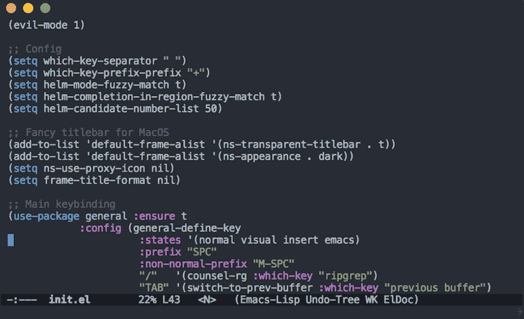

# Emacs 从零开始

> 原文：<https://dev.to/huytd/emacs-from-scratch-1cg6>

原贴[在我的博客](https://huytd.github.io/emacs-from-scratch.html)

* * *

Spacemacs 是我使用的第一个 emacs 版本，所以我有点喜欢上了
、`evil-mode`和`SPC`助记键绑定。

但我总觉得有些事情不对劲，Spacemacs 隐藏了很多东西，它装载了很多我在启动时不需要的东西。这将是一个巨大的浪费，我需要
有一个新的设置，我可以控制我的编辑器中的每一件事。

所以我创建了自己的 Emacs 配置，它比我想象的要简单得多。

[T2】](https://res.cloudinary.com/practicaldev/image/fetch/s--Sb970a_9--/c_limit%2Cf_auto%2Cfl_progressive%2Cq_auto%2Cw_880/https://huytd.github.io/img/custom-emacs.png)

在这篇文章中，我将介绍我构建一个最小的类似 Spacemacs 的版本的步骤，包括一些基本的键绑定:

```
General:
  SPC /     : ripgrep
  SPC TAB   : previous buffer
  SPC SPC   : Open M-x

Files:
  SPC p f   : find files

Buffers:
  SPC b b   : buffers list

Window:
  SPC w l   : move right
  SPC w h   : move left 
  SPC w j   : move down
  SPC w k   : move up
  SPC w /   : split right
  SPC w -   : split bottom
  SPC w x   : close window

Other:
  SPC a t   : open terminal in the current buffer 
```

Enter fullscreen mode Exit fullscreen mode

# 配置文件

首先，我们需要创建一个`init.el`文件:

```
$ mkdir -p ~/.emacs.d
$ touch ~/.emacs.d/init.el 
```

Enter fullscreen mode Exit fullscreen mode

现在，Emacs 将从难看的工具栏和状态栏开始，就像任何我会马上卸载的编辑器一样。让我们改变这一点。

# 最小化 UI

现在，我们需要禁用所有丑陋的东西，让 Emacs 像 Vim 或 Sublime、Atom 一样干净、清晰，...或者今天的现代编辑
拥有的任何东西。

将这些放在您的`init.el`的开头:

```
;; Minimal UI
(scroll-bar-mode -1)
(tool-bar-mode   -1)
(tooltip-mode    -1)
(menu-bar-mode   -1) 
```

Enter fullscreen mode Exit fullscreen mode

接下来，我们将添加一个包管理器来开始安装主题/包。

# 包管理器

默认情况下，Emacs 被配置为使用`ELPA`包归档，我们将
需要添加更多的存储库，如`GNU ELPA`、`MELPA`、...

将此放在您的`init.el`的开头:

```
;; Package configs
(require 'package)
(setq package-enable-at-startup nil)
(setq package-archives '(("org"   . "http://orgmode.org/elpa/")
                         ("gnu"   . "http://elpa.gnu.org/packages/")
                         ("melpa" . "https://melpa.org/packages/")))
(package-initialize) 
```

Enter fullscreen mode Exit fullscreen mode

接下来，我们将使用 [use-package](https://github.com/jwiegley/use-package)
来更好地配置我们的包，如果你不知道的话，这个包
提供了一个宏，允许你以一种既面向性能又
整洁的方式轻松地安装包和隔离
包配置。

```
;; Bootstrap `use-package`
(unless (package-installed-p 'use-package)
  (package-refresh-contents)
  (package-install 'use-package))
(require 'use-package) 
```

Enter fullscreen mode Exit fullscreen mode

# Vim 键与邪恶模式绑定

现在你已经设置了包管理器，让我们安装我们的第一个
包:`evil-mode`，这个包允许你在 Emacs 中使用类似 Vim 的键
绑定。

```
;; Vim mode
(use-package evil
  :ensure t
  :config
  (evil-mode 1)) 
```

Enter fullscreen mode Exit fullscreen mode

就是这样！现在重启您的 Emacs，您将看到模式行显示当前的 Vim 模式
，您将能够使用`hjkl`进行导航。

# 安装主题

我能找到的 Emacs 最好的主题之一是`doom-themes`包，
，里面有很多很酷的主题。下面的代码将安装这个
包并加载它的旗舰主题`doom-one`:

```
;; Theme
(use-package doom-themes
  :ensure t
  :config
  (load-theme 'doom-one t)) 
```

Enter fullscreen mode Exit fullscreen mode

# 安装舵

[Helm](https://github.com/emacs-helm/helm) 是 Emacs 中
增量完成和缩小选择的框架。许多人更喜欢 T0，因为它更轻便，对我来说，这无关紧要。我发现`helm`更容易使用和配置。

下面的代码片段将安装`helm`并配置*模糊
匹配*:

```
;; Helm
(use-package helm
  :ensure t
  :init
  (setq helm-mode-fuzzy-match t)
  (setq helm-completion-in-region-fuzzy-match t)
  (setq helm-candidate-number-list 50)) 
```

Enter fullscreen mode Exit fullscreen mode

# 安装哪个键

在 Spacemacs 中，当你按下`SPC`或任何其他键序列时，会弹出一个小的
缓冲区，显示你接下来可以做的功能列表，
安装`which-key`会给你这个。

```
;; Which Key
(use-package which-key
  :ensure t
  :init
  (setq which-key-separator " ")
  (setq which-key-prefix-prefix "+")
  :config
  (which-key-mode)) 
```

Enter fullscreen mode Exit fullscreen mode

# 自定义键绑定

最后，你可以用`general`
包开始配置你的自定义键绑定，这是我的配置，前缀是`SPC`就像在 Spacemacs 中一样:

```
;; Custom keybinding
(use-package general
  :ensure t
  :config (general-define-key
  :states '(normal visual insert emacs)
  :prefix "SPC"
  :non-normal-prefix "M-SPC"
  ;; "/"   '(counsel-rg :which-key "ripgrep") ; You'll need counsel package for this
  "TAB" '(switch-to-prev-buffer :which-key "previous buffer")
  "SPC" '(helm-M-x :which-key "M-x")
  "pf"  '(helm-find-file :which-key "find files")
  ;; Buffers
  "bb"  '(helm-buffers-list :which-key "buffers list")
  ;; Window
  "wl"  '(windmove-right :which-key "move right")
  "wh"  '(windmove-left :which-key "move left")
  "wk"  '(windmove-up :which-key "move up")
  "wj"  '(windmove-down :which-key "move bottom")
  "w/"  '(split-window-right :which-key "split right")
  "w-"  '(split-window-below :which-key "split bottom")
  "wx"  '(delete-window :which-key "delete window")
  ;; Others
  "at"  '(ansi-term :which-key "open terminal")
)) 
```

Enter fullscreen mode Exit fullscreen mode

# 匹配 MacOS 上的标题栏颜色

如果你在 macOS 上使用 Emacs，你可以添加这个来改变你的标题栏
颜色并匹配你的颜色主题:

```
;; Fancy titlebar for MacOS
(add-to-list 'default-frame-alist '(ns-transparent-titlebar . t))
(add-to-list 'default-frame-alist '(ns-appearance . dark))
(setq ns-use-proxy-icon  nil)
(setq frame-title-format nil) 
```

Enter fullscreen mode Exit fullscreen mode

* * *

从这里开始，你可以根据需要继续定制 Emacs，比如
为
项目管理添加[弹丸](https://github.com/bbatsov/projectile)包，添加更多语言支持，定制你的模式
行，...

我希望这篇文章对你有所帮助，并且能够构建你自己的 Emacs 配置。还有，你可以在这里查看我的[定制配置
。](https://gist.github.com/huytd/6b785bdaeb595401d69adc7797e5c22c)