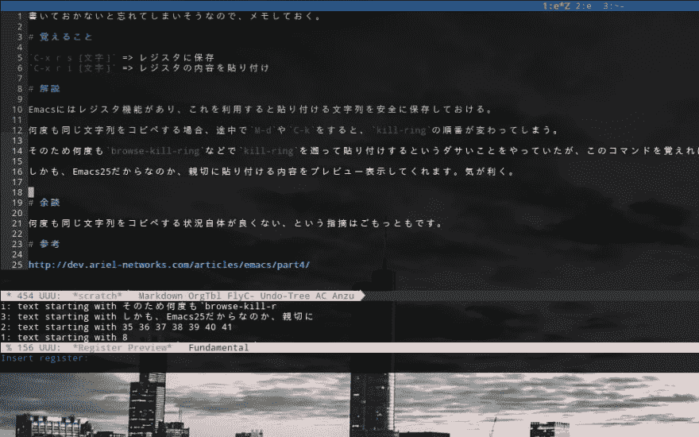

# Emacs 寄存器-保存 kill-ring

> 原文：<https://dev.to/acro5piano/emacs-registers---save-kill-ring-3078>

你用过 Emacs 的寄存器吗？
如果没有，我推荐试试。

# 什么是寄存器

当我们重复进行复制粘贴时，`kill-ring`顺序会在`M-d`(删除字)或`C-k`(删除线)期间发生变化。
所以我用`browse-kill-ring`找到文本并粘贴。这要花很多时间。

这就是寄存器发挥作用的地方。
我们可以保存一个文本(和很多东西)到 named Register，即使给`kill-ring`添加东西也不会遗漏文本。

# 如何

Registers 是标准的 Emacs 函数，所以只需键入:

*   `C-x r s [key]` = >保存区域到寄存器
*   `C-x r i [key]` = >粘贴登记簿的内容

Emacs25 显示粘贴前的内容预览。不错:)

[T2】](https://res.cloudinary.com/practicaldev/image/fetch/s--xIhvFpw---/c_limit%2Cf_auto%2Cfl_progressive%2Cq_auto%2Cw_880/https://qiita-image-store.s3.amazonaws.com/0/103885/ce4d5eb0-4e04-9e66-f9e9-5b6c85af5cf5.png)

...虽然这是一个有用的特性，但是我必须承认大量的复制粘贴并不是一个好习惯。

# 参

如果您想了解更多有关 Emacs 寄存器的信息，请查看文档:

*   [https://www . GNU . org/software/emacs/manual/html _ node/emacs/registers . html](https://www.gnu.org/software/emacs/manual/html_node/emacs/Registers.html)
*   [http://dev.ariel-networks.com/articles/emacs/part4/](http://dev.ariel-networks.com/articles/emacs/part4/)