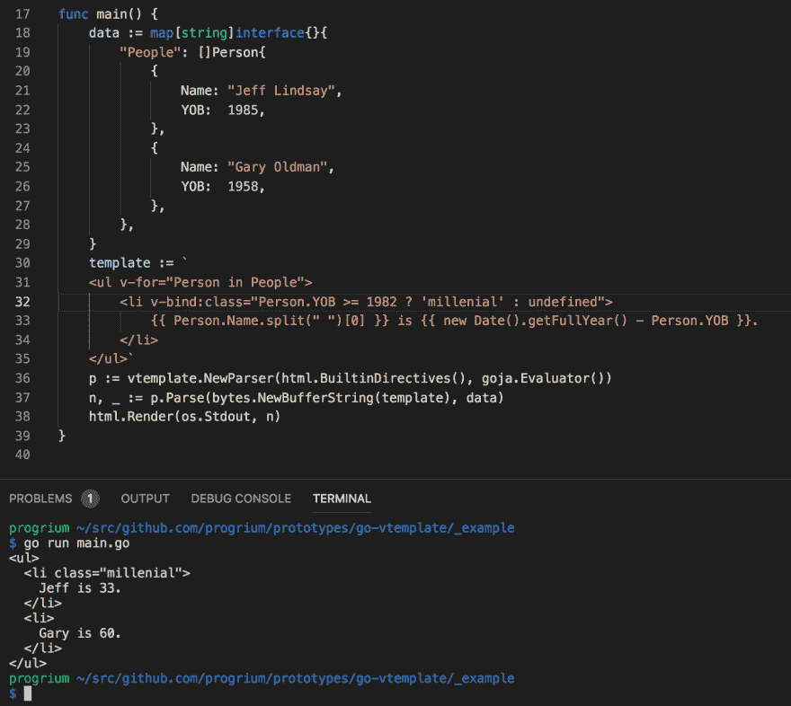

# 面向 Go 的 Vue 风格模板中的嵌入式 JavaScript

> 原文：<https://dev.to/progrium/embedded-javascript-in-vue-style-templating-for-go-46pj>

周六晚上在 Go 中制作 Vue 风格的模板，让你可以使用 JavaScript。_(ツ)_/

[T2】](https://res.cloudinary.com/practicaldev/image/fetch/s--O8Qlbpri--/c_limit%2Cf_auto%2Cfl_progressive%2Cq_auto%2Cw_880/https://thepracticaldev.s3.amazonaws.com/i/m1pft7lpr3ekss5s3dsj.png)