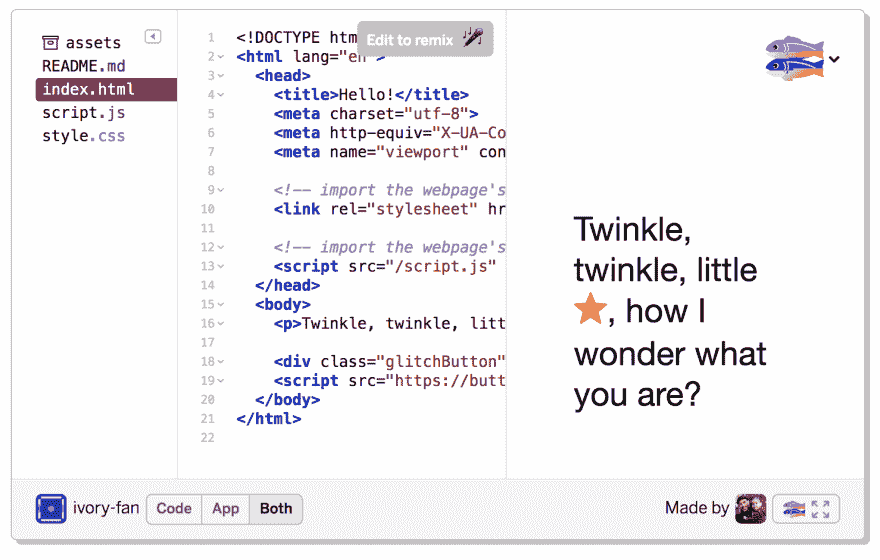

# 在 App-Only 模式下嵌入 Glitch？

> 原文：<https://dev.to/bennypowers/embedding-glitch-in-app-only-mode-4en8>

帮助文档简单明了地解释了嵌入故障，比如:

```
 
```

Enter fullscreen mode Exit fullscreen mode

(是的，我自己想出了那个 glitch slug)

这将在`both`模式下嵌入一个应用程序，显示代码和输出:

[T2】](https://res.cloudinary.com/practicaldev/image/fetch/s--jCL2MmWz--/c_limit%2Cf_auto%2Cfl_progressive%2Cq_auto%2Cw_880/https://thepracticaldev.s3.amazonaws.com/i/015as77hzvh53jpmzmhx.png)

我的问题:我可以在纯应用或纯代码模式下嵌入 glitch 应用，而不是默认的两种模式吗？