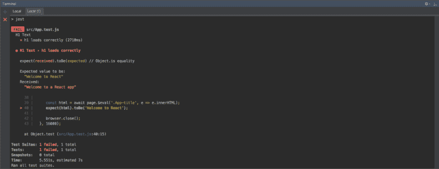
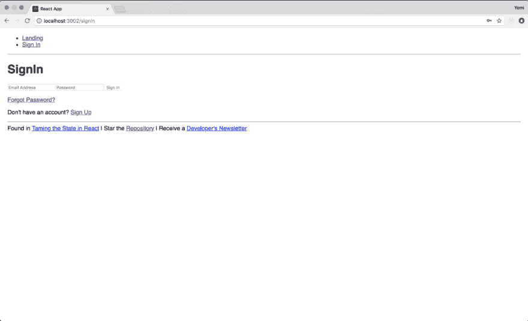
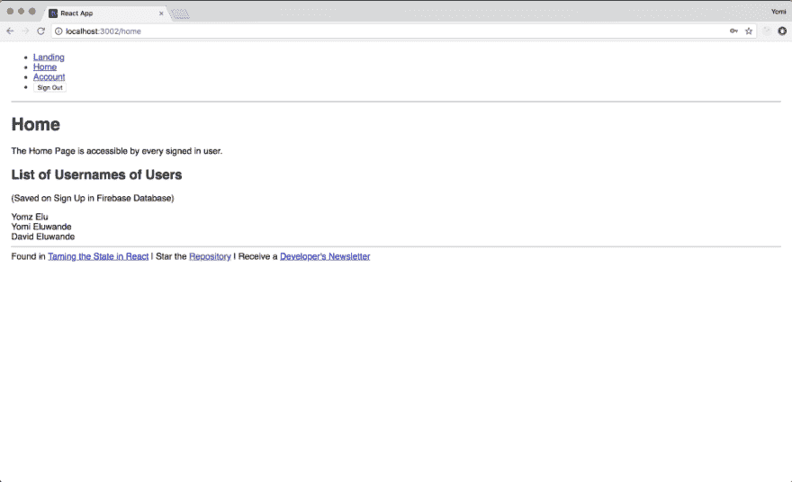

# 端到端测试使用木偶师和 Jest 对应用程序做出反应

> 原文：<https://dev.to/bnevilleoneill/end-to-end-testing-react-apps-with-puppeteer-and-jest-4ch3>

[T2】](https://res.cloudinary.com/practicaldev/image/fetch/s--IBzV0fOs--/c_limit%2Cf_auto%2Cfl_progressive%2Cq_auto%2Cw_880/https://cdn-images-1.medium.com/max/500/1%2ArV3Wuv-DfvLwvO9u81OOYA.jpeg)

在本教程中，我们将看到如何使用 [Jest](https://facebook.github.io/jest/) 和[木偶师](https://github.com/GoogleChrome/puppeteer)为 React 应用编写测试。测试是现代 web 应用程序开发的一个重要部分，它有助于检查您编写的代码是否可接受，是否按接受的方式工作。这是一种在“上线”之前捕捉代码中 bug 的方法。

谈到测试，有不同的方法；

**单元测试—** 单元测试有助于检查单个代码单元(主要是函数)是否按预期工作。

**集成测试—** 集成测试是将应用程序的单个单元/功能组合起来作为一个组进行测试的测试。

**端到端测试—** 该测试有助于在用户使用实际应用程序时，从用户的角度确认所有功能是否正常工作。

对于本教程，我们将进行端到端的测试，并检查某些功能是否真的如预期的那样工作。为此，我们将使用 Jest 和木偶师(你可以在这里阅读关于木偶师[)。](https://blog.logrocket.com/introduction-to-headless-browser-testing-44b82310b27c)

### **打造 React app**

我们将为一个功能性的 React 应用程序编写测试，看看测试通过和失败时会发生什么。首先，我们将使用 [create-react-app](https://github.com/facebook/create-react-app) 包来快速搭建 react 应用程序。

```
npx create-react-app react-puppeteer 
```

Enter fullscreen mode Exit fullscreen mode

创建并安装项目目录后，导航到新创建的目录，并在终端中运行下面的命令。

```
npm i --save-dev jest jest-cli puppeteer faker 
```

Enter fullscreen mode Exit fullscreen mode

Jest——由脸书创建的测试工具，用于测试 React 应用程序或基本上任何 JavaScript 应用程序

Jest-cli—Jest 的 CLI 运行程序

[木偶师](https://github.com/GoogleChrome/puppeteer) —一个节点库，它提供了一个高级 API 来控制[无头](https://developers.google.com/web/updates/2017/04/headless-chrome) Chrome 或通过 [DevTools 协议](https://chromedevtools.github.io/devtools-protocol/)的 Chrome。我们将用它来从用户的角度进行测试。

faker——一种帮助在浏览器中生成大量虚假数据的工具。我们将用它来为木偶师生成数据。

在 package.json 文件中，在 scripts 对象中添加以下代码行。

```
"test": "jest" 
```

Enter fullscreen mode Exit fullscreen mode

安装完所有必需的包后，您可以使用 npm start 命令运行 React 应用程序，并让它在后台运行。

[T2】](https://logrocket.com/?cid=banner_a)

### **写测试**

从测试开始，我们将首先编写一个测试来检查页面上是否有特定的文本，还要编写一个测试来查看联系人表单是否提交成功。让我们从检查页面上是否有特定的文本开始。

App.test.js 文件是我们编写测试的地方。Jest 被自动配置为在包含单词 test 的文件上运行测试。打开 App.test.js，使用以下代码进行编辑。

[https://medium . com/media/449540 e7e 273566000 fac 7 db 2e 28068 c/href](https://medium.com/media/449540e7e273566000fac7db2e28068c/href)

在上面代码块的第一部分中，faker 和 puppeteer 都被导入，我们从 faker 生成一堆数据，这些数据将在以后使用。

describe 函数充当一个容器，用于创建一个块，将相关的测试分组到一个测试套件中。如果您希望将测试组织成组，这可能会很有帮助。Jest 用测试套件的名称来声明测试函数。

在测试函数中，使用 Puppeteer 启动一个浏览器，并将 headless mode 选项设置为 false。这意味着我们可以在测试时看到浏览器。browser.newPage()允许您创建一个新页面。

的。emulate()函数使您能够模拟某些设备指标和用户代理。在上面的代码块中，我们将其视口设置为 500x2400。

打开页面并定义其视窗后，我们告诉它导航到我们将使用测试的应用程序。goto()函数。的。waitForSelector()函数告诉木偶师保持不动，直到特定的选择器加载到 DOM 中。一旦它被加载，选择器的 innerText 就被存储在一个名为 html 的变量中。

下一行是真正的测试。

```
expect(html).toBe('Welcome to React') 
```

Enter fullscreen mode Exit fullscreen mode

在上面的代码行中，Jest expect 函数被设置为检查变量 html 的内容是否与 Welcome to React 相同。如前所述，我们正在测试应用程序上的特定文本是否是它应该是的，这是一个非常简单的测试。测试结束时，浏览器关闭，并显示。close()函数。

现在让我们运行测试，在您的终端中，运行下面的命令。

```
npm run test 
```

Enter fullscreen mode Exit fullscreen mode

[T2】](https://res.cloudinary.com/practicaldev/image/fetch/s--cC-JjxYF--/c_limit%2Cf_auto%2Cfl_progressive%2Cq_auto%2Cw_880/https://cdn-images-1.medium.com/max/1024/1%2AiLyFSvvF9uvwc_8UtdFbUg.png)

测试将会通过，因此您的命令输出应该与上面的一样。您实际上可以更改。应用程序标题选择器，看看失败的测试会发生什么。

[T2】](https://res.cloudinary.com/practicaldev/image/fetch/s--HMeEQq9O--/c_limit%2Cf_auto%2Cfl_progressive%2Cq_auto%2Cw_880/https://cdn-images-1.medium.com/max/1024/1%2AMA5n_y_pCddn1uz5x3LS9A.png)

这里，输出实际上表明了测试失败以及失败的原因。在这种情况下，收到的值与预期值不同。

### **更多测试！**

在下一个测试中，我们将模拟和测试在 React 应用程序上提交联系表单。

在 React 应用程序代码中，打开 App.js 文件并使用下面的代码进行编辑。

[https://medium . com/media/4545 ea 04 bbff 24175 CAAC 629 e 5 E1 a 7 bb/href](https://medium.com/media/4545ea04bbff24175caac629e5e1a7bb/href)

App.js 已经更新为一个联系人表单，submit 按钮只是将表单数据记录到控制台。

接下来，将下面的代码块添加到 App.test.js 文件中。

[https://medium . com/media/3e 02 e 8 a 9 a 5d 3d F2 d 63 ACC 543 b 0 f 878 f 0/href](https://medium.com/media/3e02e8a9a5d3df2d63acc543b0f878f0/href)

这个测试套件类似于上面的测试套件，puppeteer.launch()函数启动一个新的浏览器和一些配置。在这种情况下，有两个额外的选项，devtools 显示 Chrome devtools，slowMo 将木偶进程减慢指定的毫秒数。这让我们看到了正在发生的事情。

木偶师有。单击和。输入动作实际上模拟了点击输入字段和输入值的整个过程。表单字段的细节是从早先在 person 对象中设置的 faker 中获取的。

该测试套件填充联系人表单，并测试用户是否能够成功提交该表单。

您可以在您的终端中运行 npm run test 命令，您应该打开一个 Chrome 浏览器并观察实际的测试过程。

对于下一组测试，我们将编写测试来断言以下内容:

—用户可以登录

—用户可以注销

—用户被重定向到登录页面进行未经授权的查看

—不存在的视图/路线返回 404 页面

上面的测试是从用户的角度进行的端到端测试。我们正在检查用户是否能真正使用该应用程序来完成最基本的事情。

为了进行这些测试，我们需要一个 React 应用程序。我们将在 GitHub 上使用 Robin Wieruch 的 [React Firebase 认证](https://github.com/rwieruch/react-firebase-authentication)样板代码。它带有一个内置的认证系统，所有需要做的就是创建一个 Firebase 项目并添加 [Firebase](https://console.firebase.google.com) 密钥。

我修改了一点代码，并添加了一些选择器和 id，使应用程序适合测试。你可以在 GitHub 上看到。继续将 GitHub repo 克隆到您的本地系统，并运行以下命令。

```
npm i

npm start 
```

Enter fullscreen mode Exit fullscreen mode

不要忘记创建一个 [Firebase](https://console.firebase.google.com) 帐户，并将您的凭证添加到 src/firebase/firebase.js 文件中。

<figure>[](https://res.cloudinary.com/practicaldev/image/fetch/s--53D7sSTP--/c_limit%2Cf_auto%2Cfl_progressive%2Cq_auto%2Cw_880/https://cdn-images-1.medium.com/max/1024/1%2APokATdZ25TV90MiVw1TCrw.png)

<figcaption>React Firebase 认证样板 App</figcaption>

</figure>

让我们继续为 React 应用程序编写测试。同样，我们需要安装 jest faker 和 puppeteer，还需要一个 App.test.js 文件。

```
npm i --save-dev jest jest-cli puppeteer faker 
```

Enter fullscreen mode Exit fullscreen mode

安装完成后，创建一个名为 App.test.js 的文件，让我们从下面的代码块开始编辑。

```
**const** faker = require('faker');
**const** puppeteer = require('puppeteer');

**const** person = {
 email: faker.internet.email(),
 password: faker.random.word(),
};

**const** appUrlBase = 'http://localhost:3002'
**const** routes = {
**public** : {
 register: `${appUrlBase}/register`,
 login: `${appUrlBase}/login`,
 noMatch: `${appUrlBase}/ineedaview`,
 },
**private** : {
 home: `${appUrlBase}/home`,
 account: `${appUrlBase}/account`,
 },
}; 
```

Enter fullscreen mode Exit fullscreen mode

就像上面写的测试一样，faker 和 puppeteer 都是进口的。创建了一个 person 对象，它存储了一个随机的电子邮件和密码，将用于测试。appUrlBase 常量是 React 应用程序的链接—如果您尚未启动 React 应用程序，请在终端中运行 npm start，并将 appUrlBase 更改为链接。

routes 对象包含我们将要测试的视图的各种 URL。public 对象包含 React 应用程序中任何人(未登录)都可以查看的路线链接，而 private 对象包含只有登录后才能查看的路线链接。

请注意，noMatch 将用于测试*不存在的视图/route 返回 404 页面，*这就是为什么它恰当地导致/ineedaveview。

好了，现在让我们写第一个测试。

### **用户可以登录**

[https://medium . com/media/0 c 89 A8 bcc 331 a 569d 843 C1 f 7d 4 e 72 a 1 a/href](https://medium.com/media/0c89a8bcc331a569d843c1f7d4e72a1a/href)

上面的代码块不同于我们上面写的第一组测试。首先， [beforeAll](https://facebook.github.io/jest/docs/en/api.html#beforeallfn-timeout) 函数用于启动一个带有选项的新浏览器，并在该浏览器中创建新页面，而不是像我们之前在测试中那样在每个测试套件中创建新浏览器。

那么我们如何在这里测试呢？在测试套件中，浏览器被定向到登录页面 routes.public.login，就像联系人表单测试一样，使用 puppeteer 来填写表单并提交它。提交表单后，puppeteer 等待一个选择器 data-testid='homepage ',这是一个出现在[主页](https://github.com/yomete/react-firebase-authentication/blob/master/src/components/Home/index.js#L25)上的 data-id——React 应用程序在成功登录后重定向到的页面。

我已经用代码块中的用户详细信息创建了一个帐户，因此这个测试应该通过。

[T2】](https://res.cloudinary.com/practicaldev/image/fetch/s--pZ7KyEnC--/c_limit%2Cf_auto%2Cfl_progressive%2Cq_auto%2Cw_880/https://cdn-images-1.medium.com/max/1024/1%2AyteBNSwCeDrUT-j3kOkkAg.png)

[afterAll](https://facebook.github.io/jest/docs/en/api.html#afterallfn-timeout) 函数在测试结束后发生，并关闭浏览器。

### **用户可以注销**

<figure>[](https://res.cloudinary.com/practicaldev/image/fetch/s--rAVCB19m--/c_limit%2Cf_auto%2Cfl_progressive%2Cq_auto%2Cw_880/https://cdn-images-1.medium.com/max/1024/1%2AWoS9teZ7-90ccOkJVV6SCA.png)T4】🤮这不是 CSS 教程</figure>

这是成功登录后显示的视图。现在我们想测试当用户点击*退出*按钮时会发生什么。预期的结果是本地存储被清除、注销，用户被重定向回登录页面。

在同一个 App.test.js 文件中，将下面的代码添加到 afterAll 函数之前。

[https://medium . com/media/9036 e 76353 a94c 796 c 7 c 6 ab 23 f 717094/href](https://medium.com/media/9036e76353a94c796c7c6ab23f717094/href)

这个测试相当简单。木偶师等待[。导航链接选择器](https://github.com/yomete/react-firebase-authentication/blob/master/src/components/Navigation/index.js#L17)点击数据属性为 [data-testid="signoutBtn"](https://github.com/yomete/react-firebase-authentication/blob/master/src/components/SignOut/index.js#L9) 的[按钮](https://github.com/yomete/react-firebase-authentication/blob/master/src/components/SignOut/index.js#L9)，这实际上是在测试按钮是否可以被点击。在 page.click()函数之后，木偶师等待选择器。签到表可在页面的[签到上找到。](https://github.com/yomete/react-firebase-authentication/blob/master/src/components/SignIn/index.js#L68)

恭喜你，又一个测试通过了。

[T2】](https://res.cloudinary.com/practicaldev/image/fetch/s--n_EAc4Zb--/c_limit%2Cf_auto%2Cfl_progressive%2Cq_auto%2Cw_880/https://cdn-images-1.medium.com/max/1024/1%2ApykecL8ifFGIIquDVztBVg.png)

### **用户被重定向到未授权查看的登录页面**

我们不希望用户访问他们无权查看的视图和路线。所以让我们测试一下代码是否能做到这一点。

将下面的代码块添加到现有代码中，就在 afterAll 函数之前

[https://medium . com/media/63a 7606 a 3d 47 f 691 bbacc 7 a 72 c 0 e 46 c 6/href](https://medium.com/media/63a7606a3d47f691bbacc7a72c0e46c6/href)

在上面的代码块中，我们测试了 React 中的私有路由，然后等待 signin-form 选择器。

这意味着在用户导航到私人路线后，他们会被自动重定向到登录表单。

[T2】](https://res.cloudinary.com/practicaldev/image/fetch/s--dLZPpP2I--/c_limit%2Cf_auto%2Cfl_progressive%2Cq_auto%2Cw_880/https://cdn-images-1.medium.com/max/1024/1%2A82yuhpmSjZZTH54ffnIaaA.png)

### **不存在的观点/路线返回 404 页**

重要的是所有的应用程序都有一个 404 页面，以便向用户解释特定的路线并不存在。它也在这个 React 应用程序中实现了，让我们测试一下它是否像预期的那样工作。

将下面的代码块添加到现有代码中，就在 afterAll 函数之前。

[https://medium . com/media/718d 38 df 549 c 0 CDE 049d 24 fcef 0 da 38 c/href](https://medium.com/media/718d38df549c0cde049d24fcef0da38c/href)

我们之前创建的 routes.public.noMatch 链接指向一个不存在的路由。因此，当木偶师转到那个链接时，它希望自动重定向到 404 页面。的。不匹配选择器位于 [404 页面](https://github.com/yomete/react-firebase-authentication/blob/master/src/components/NoMatch/index.js#L4)上。

[T2】](https://res.cloudinary.com/practicaldev/image/fetch/s--ijE73EMQ--/c_limit%2Cf_auto%2Cfl_progressive%2Cq_auto%2Cw_880/https://cdn-images-1.medium.com/max/1024/1%2ADualM5SwLrF-TWOEFrAkXA.png)

### **结论**

在本教程中，我们已经直接看到了如何使用 Jest 作为测试套件，使用木偶师进行模拟，如输入、点击等，来编写 React 应用程序的测试。

Jest 和 Puppeteer 是一个组合，在测试 React 应用程序时肯定不会出错。木偶师仍在积极开发中，所以请确保查看 API 参考以了解更多功能。

本教程的代码可以在 GitHub [这里](https://github.com/yomete/react-puppeteer)和[这里](https://github.com/yomete/react-firebase-authentication)看到。

### **资源**

是:https://Facebook . github . io/is/

木偶师:[https://github.com/GoogleChrome/puppeteer](https://github.com/GoogleChrome/puppeteer)

### Plug: [LogRocket](http://logrocket.com) ，一款适用于网络应用的 DVR

[T2】](http://logrocket.com)

LogRocket 是一个前端日志工具，可以让你回放问题，就像它们发生在你自己的浏览器中一样。LogRocket 不需要猜测错误发生的原因，也不需要向用户询问截图和日志转储，而是让您重放会话以快速了解哪里出错了。它可以与任何应用程序完美配合，不管是什么框架，并且有插件可以记录来自 Redux、Vuex 和@ngrx/store 的额外上下文。

除了记录 Redux 操作和状态，LogRocket 还记录控制台日志、JavaScript 错误、堆栈跟踪、带有头+正文的网络请求/响应、浏览器元数据和自定义日志。它还使用 DOM 来记录页面上的 HTML 和 CSS，甚至为最复杂的单页面应用程序重新创建像素级完美视频。

免费试用。

* * *