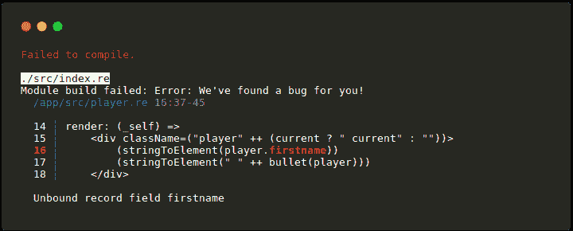
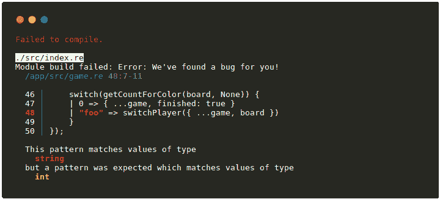

# 享受理性的无痛打字！

> 原文：<https://dev.to/juliendemangeon/enjoy-painless-typing-with-reasonml-298j>

注意:这个帖子最初发布在[marmelab.com](https://marmelab.com/blog/2018/04/09/enjoy-painless-typing-with-reason.html)。

在 Marmelab 的一个普通的 hackdays，我想学习一种语言，自从我在 2017 年 React Europe 上听说它以来，我一直藏在脑海里。

这种语言被称为[Reason](https://reasonml.github.io/)(Reason ml 的快捷方式)，实际上是 [OCaml](https://ocaml.org/index.fr.html) 的语法和工具链覆盖，这种语言以其健壮性、强大的静态类型和无处不在的函数范式方法而闻名。

据 Reason 网站称，其主要目标是为寻求性能、一致性和类型安全的 JavaScript 开发人员提供一个友好的语法/环境。

> Reason 几乎可以被认为是一个稳定的静态类型，更快更简单的 JavaScript 的表亲，减去了历史上的缺陷，加上您今天可以使用的 ES2030 的功能，并且可以访问 JS 和 OCaml 生态系统！

顺便说一下，我认为这个简单的例子应该足以说明它的力量，并激起你进一步阅读的欲望。

```
type schoolPerson = Teacher | Director | Student(string);

let greeting = (stranger) =>
  switch (stranger) {
  | Teacher => "Hey professor!"
  | Director => "Hello director."
  | Student("Richard") => "Still here Ricky?"
  | Student(anyOtherName) => "Hey, " ++ anyOtherName ++ "."
  }; 
```

Enter fullscreen mode Exit fullscreen mode

为了在实践中探索这种语言，我编写了一个在浏览器中运行的[黑白棋游戏](https://marmelab.com/reversi-reason/)。我将用它来概述推理能力，并解释为什么我认为它为 JavaScript 生态系统打开了一个全新的视野。

但在进入技术细节之前，让我从历史和实践的角度介绍一下理性。

## 原因是 OCaml 变得更容易

正如我之前所说，Reason 是基于 OCaml 的。这样，它就受益于 OCaml 的所有优势，比如多态/推断类型、模式匹配、垃圾收集器、复杂的模块系统等等。

OCaml 是 Caml 的主要实现。Caml 是一种安全、可靠、富于表现力的编程语言，由一家名为 [INRIA](https://www.inria.fr/) 的法国计算机科学研究所于 1985 年创建。但是，OCaml 怎么了？为什么不直接用？的确，这个问题值得一问。

OCaml 基于复杂的原理，使用一种笨拙的语法。下面是一个 OCaml 代码的例子，它从一个列表中递归地添加值:

```
let rec sum xs =
  match xs with
    | [] -> 0
    | x :: xs' -> x + sum xs';;

(* sum [1;2;3;4;5] => 15 *) 
```

Enter fullscreen mode Exit fullscreen mode

**提示**:事实上，没有必要为此使用递归函数，因为[核心标准库](https://caml.inria.fr/pub/docs/manual-ocaml/libref/index.html)有许多内置函数，可以满足大多数需求。

OCaml 的复杂性解释了为什么 OCaml 长期局限于学术项目。

直到几年前，在脸书工作的[Jordan walker](https://twitter.com/jordwalke)用 SML (一种衍生的 OCaml 语言)创建了著名的 [React](https://reactjs.org/) 库[，并创建了 ReasonML。不久之后，他决定将 ReactJS 移植到普通 JavaScript，以获得更广泛的采用。](https://www.reactiflux.com/transcripts/jordan-walke/)

[T2】](https://res.cloudinary.com/practicaldev/image/fetch/s--d5NRHyeS--/c_limit%2Cf_auto%2Cfl_progressive%2Cq_auto%2Cw_880/https://marmelab.cimg/blog/reasonml/react.png)

## BuckleScript 将 OCaml 带到了网络上

事实上，Reason 并不直接编译成 JavaScript。为此，它保持了对另一个名为 [BuckleScript](https://bucklescript.github.io/) 的库的强依赖性。

BuckleScript 将自己定义为理性的“姐妹”项目。事实上，**两家共享同一个社区**(他们有相同的[不和](https://discord.gg/reasonml))，并且有相同的目的:将 OCaml 的能力带到浏览器中。此外，两个项目之间的文档是非常互补的。

下面是从 Reason 到 JavaScript 的编译工作流程的一个小模式。在幕后，原因文件(`.re`)通过原因的 [OCaml 预处理程序被转换成普通的 OCaml](https://github.com/reasonml/reason-cli) [AST](https://en.wikipedia.org/wiki/Abstract_syntax_tree) 。然后这个 OCaml AST 由名为`bsc`的 [BuckleScript 编译器](https://github.com/BuckleScript/bucklescript)处理，生成普通的 JS 文件。

[T2】](https://res.cloudinary.com/practicaldev/image/fetch/s--PxtHLvAg--/c_limit%2Cf_auto%2Cfl_progressive%2Cq_auto%2Cw_880/https://marmelab.cimg/blog/reasonml/reasontojs.png)

编译过程比这里解释的要复杂一些。为了更详细地了解它，我建议你看一下[这个优秀的知识库](https://github.com/chenglou/intro-to-reason-compilation)归[成楼](https://github.com/chenglou)所有，他是在 [React Europe](https://www.react-europe.org/) 给我介绍讲道理的演讲者。

## 为什么不是打字稿或者流？

JavaScript 是一种非类型化语言，但是大型项目通常需要通过类型来实现额外的编程安全性。这就是为什么在 JavaScript 之上创建了许多工具来填补这一空白。其中，最受欢迎的大概是[打字稿](https://www.typescriptlang.org/)和[流](https://flow.org/)。

[T2】](https://res.cloudinary.com/practicaldev/image/fetch/s--OItHXieg--/c_limit%2Cf_auto%2Cfl_progressive%2Cq_auto%2Cw_880/https://marmelab.cimg/blog/reasonml/tsvsflow.png)

*   **TypeScript** 是微软开发的开源编程语言。它作为 JavaScript 的一个严格的**语法超集，为其添加了静态类型。它也被认为是 [Angular](https://angular.io/) 开发的一级语言。**
*   **Flow** 是一个由脸书开发的用于 JavaScript 的开源静态类型检查器。它作为一种**特定的语法(一种注释),在现有代码上添加类型**。

理性与这两者相比如何？事实上，Reason 并不是 JavaScript 的新语法，也不是简单的类型叠加。**理性是一种完整的语言**。它引入了在 TypeScript 或 Flow 中永远找不到的新的控制结构。Reason 以类型化为核心，只需*将*编译成 JavaScript。

如果您需要强类型，我认为使用 TypeScript 或 Flow 的唯一有效理由是移植现有的 JavaScript 代码库。如果您需要强类型而没有现有的代码库，那么最好使用 real typed 语言，比如 Reason。

## 原因可以编译到其他平台

推理使用 OCaml 作为中间语言，BuckleScript 的工作是将 OCaml 代码翻译成 JavaScript。

但是还有其他工具链可以在其他平台上运行 OCaml 代码。例如，OCaml 可以被编译成本机代码，这要感谢[ocamlot 编译器](http://caml.inria.fr/pub/docs/manual-ocaml-4.00/manual025.html)。在这方面，有一些成功的[跨平台项目](https://jaredforsyth.com/posts/making-a-cross-platform-mobile-game-in-reason-ocaml/)用 Reason 编写，编译到 native，browser，Android 和 iOS。

在我看来，这种意想不到的可能性打开了一个全新的发展视野。最重要的是，这个机会允许远离“全 JavaScript”趋势，我认为这是危险的。我们永远不应该把自己局限在单一的技术上。

好了，语言介绍到此为止。让我们看看一些代码！

## 绑定和表达式

与 JavaScript 不同，在 Reason 中只有一种方法来声明/分配变量。事实上，因为一切本质上都是不可变的，所以唯一的 assignation 关键字是`let`。因此，赋值动作被称为“让绑定”。

```
let message = "hello world"; 
```

Enter fullscreen mode Exit fullscreen mode

“不变性”意味着一个值不能随着时间的推移而改变——这并不意味着您不能创建一个同名的新绑定来替换现有的绑定。这就是为什么`let`被称为*绑定*而不是*分配*的原因。**一个绑定给一个值**一个名字，它不改变这个值。

```
let message = "hello";
print_endline(message); /* Prints "hello" */
/* totally legal */
let message = "world";
print_endline(message); /* Prints "world" */ 
```

Enter fullscreen mode Exit fullscreen mode

为了有效地改变一个已经绑定的“值”，你必须使用一个`ref`。这个主题将在后面的“迫切的出路”一节中讨论。

绑定的作用域也可以是“块”作用域(`{}`)。在这种情况下，块的最后一个表达式被隐式返回。没有明确的理由。和 JavaScript 一样，**绑定只在各自的作用域内可用。**

```
let message = {
    let part1 = "hello";
    let part2 = "world";
    part1 ++ " " ++ part2
};

/* part1 & part2 not availables here */ 
```

Enter fullscreen mode Exit fullscreen mode

## 基本类型

像大多数其他编程语言一样，Reason 支持所有基本类型，比如布尔值、数字、字符串和字符。由于 Reason 是一种静态类型语言，**类型可以手动定义，或者可以在编译时从程序 AST 中推断出**。

```
let score = 10; /* type is infered */
let score: int = 10; /* type is manually defined */ 
```

Enter fullscreen mode Exit fullscreen mode

使用 Reason，就像使用 Python 一样，没有隐式类型转换。**开发者必须使用显式的类型转换函数**(如`string_of_int`或`string_of_bool`)从一种类型切换到另一种类型。这些函数是 [Pervasives](https://reasonml.github.io/api/Pervasives.html) 的一部分，它是每次编译开始时最初打开的模块。它提供了对内置类型的所有基本操作。

## 自定义类型

和 OCaml 一样，也可以用 Reason 创建自己的类型。在这方面，这里有两种不同类型的 reversi“细胞”模块。

`color`型被称为[变体](https://reasonml.github.io/docs/en/variant.html)。一个变体是一种**组可能的常数**。这些常量被称为“构造函数”或“标记”，由“|”条分隔。在我看来，变体是理性的关键特征。它们允许我们携带值(作为参数)，并支持模式匹配。

```
/* cell.re */
type color = White | Black; 
```

Enter fullscreen mode Exit fullscreen mode

这种`cell`类型被称为[记录](https://reasonml.github.io/docs/en/record.html)。在其他语言中，它通常被称为`struct`。基于记录创建的对象是不可变的、固定的，并且非常快。记录需要强类型定义。这就是为什么每个字段都是显式类型的。

```
/* cell.re */
type cell = {
    x: int,
    y: int,
    color: option(color),
}; 
```

Enter fullscreen mode Exit fullscreen mode

正如您在`cell`类型的`color`字段中看到的，一个类型可以包含另一个类型。它允许快速简单地创建[复杂的递归数据结构](http://2ality.com/2017/12/variants-reasonml.html#self-recursive-data-structures-via-variants)(比如树)。

```
type intTree =
  | Empty
  | Node(int, intTree, intTree); 
```

Enter fullscreen mode Exit fullscreen mode

## 参数化和特殊类型

在前面的一个例子中，您可能已经问过自己关于`option(color)`函数调用的问题。实际上，`option`不是一个函数，它是一个参数化的变体，由[标准库](https://reasonml.github.io/api/index.html)直接公开。

由于 Reason 中没有`null`值(因此没有空指针异常)，`option`允许模拟任何值的缺失。可以是`None` ( `null`当量)也可以是`Some(value)`。可以比作著名的[也许是](https://en.wikibooks.org/wiki/Haskell/Understanding_monads/Maybe)单子。

```
type option('a) =
    | None
    | Some('a); 
```

Enter fullscreen mode Exit fullscreen mode

`'a`是什么意思？按理来说，**每种类型都可以接受参数**。唯一引用意味着“任何类型的值”。这对于创建泛型类型结构非常有用。

## 列表和数组

在情理之中，最常用的一种类型是[列表](https://reasonml.github.io/docs/en/list-and-array.html#list)。顾名思义，列表是同一类型元素的集合。

列表在下面被表示为[链表](https://en.wikipedia.org/wiki/Linked_list)(甚至在透明的 JavaScript 中是[！](https://reasonml.github.io/en/try.html?reason=DYUwLgBAJglgTiAxmGB7AdgZwgXggbQCgISIAKABgBoIBGAShogHoAqCAZRNeeNMpoBaBjTYQAct16lytGhUYkxAUSl8SZOXUUt2HVT3W6IAOjMRDAXQDcQA))。正因为如此，它们本质上是**动态大小和不可变的**，并且它们允许非常快速地添加或移除元素。

```
/* board.re */
let directions = [
    (0, 1),  /* S  */
    (0, -1), /* N  */
    (1, 0),  /* E  */
    (1, 1),  /* SE */
    /* ... */
]; 
```

Enter fullscreen mode Exit fullscreen mode

列表的更新速度非常快，但是访问速度非常慢。读操作速度与链表的大小成正比( **O(n)复杂度**)。这也是为什么理智还提供一个[阵](https://reasonml.github.io/docs/en/list-and-array.html#array)型的原因。

与列表相反，**数组是固定大小的集合**，对于读取操作来说是可变且快速的( **O(1)复杂度**)。

```
let myArray = [|"hello", "world", "how are you"|]; 
```

Enter fullscreen mode Exit fullscreen mode

简而言之，列表更适合不需要快速访问的动态和中等大小的集合。数组更适合需要快速访问的固定和大型集合。

你可以在[探索原因 ML 在线书籍](http://reasonmlhub.com/exploring-reasonml/ch_arrays.html#lists-vs.arrays)中找到更多关于列表和数组的信息，这本书非常完整。

## 模式匹配和解构

我已经介绍了类型和变体，这样我就可以谈论 rational 最有趣的特性之一:模式匹配。

[T2】](https://res.cloudinary.com/practicaldev/image/fetch/s--_nGrjtdI--/c_limit%2Cf_auto%2Cfl_progressive%2Cq_auto%2Cw_880/https://marmelab.cimg/blog/reasonml/matching.png)

简而言之，模式匹配允许从结构中检查和提取数据。这是 JavaScript 中 RegExp.test 和 RegExp.exec 的一种混合，但是适用于所有类型的数据和任何地方(绑定和函数参数)。

在下面的例子中，我使用`switch`表达式针对多个模式测试`color`值。当一个模式匹配时，紧接在`=>`之后的值被返回并赋给“标识符”。

```
/* cell.re */
let identifier = switch (color) {
    | Some(Black) => "black"
    | Some(White) => "white"
    | None => ""
}; 
```

Enter fullscreen mode Exit fullscreen mode

上面的例子当然是最简单的一个。您还可以匹配值的一部分，然后使用它，甚至可以在异常时进行匹配！

```
/* board.re */
let getCell = (x, y, cells) =>
    switch (List.find(cell => cell.x == x && cell.y == y, cells)) {
        | ({ color }) => color /* color is extracted from the cell record */
        | exception Not_found => None
    }; 
```

Enter fullscreen mode Exit fullscreen mode

自然，匹配也伴随着[析构](https://reasonml.github.io/docs/en/destructuring.html)。这就是为什么甚至可以很容易地提取部分数据结构，甚至从函数 args 中提取！

```
/* board.re */
let init = (width, height) => {
    let (mw, mh) = (width / 2, height / 2); /* tuple destructuring */
    /* ... */
};

let isOutOfBound = ({ width, height }, (x, y)) => /* function args destructuring */
    x < 0 || y < 0 || x > (width - 1) || y > (height - 1); 
```

Enter fullscreen mode Exit fullscreen mode

关于模式匹配有很多东西要说，太多了，无法涵盖这里的所有内容。我劝你看一下[这篇文章](http://2ality.com/2017/12/pattern-matching-reasonml.html)，很全面。

## 功能

正如你可能已经理解的，理性完全集中在函数范式上。在这方面，它突出了很多类似于**高阶函数**、**递归性**、**部分应用** (via currying)等概念。Reason 函数语法和 [ES6](http://exploringjs.com/es6/index.html) 非常接近。它使用了著名的“箭/体”对。

```
let add = (first, second) => first + second;
add(1,2); /* 3 */ 
```

Enter fullscreen mode Exit fullscreen mode

按理说，每个函数都至少有一个参数，即使你没有声明/注意到它！当你声明一个没有任何参数的函数时，在引擎盖下，Reason 给它添加了一个[单元](https://reasonml.github.io/docs/en/function.html#no-argument)参数。在下面的例子中，`locationReload`后面的一对括号`()`是一个`unit`。所以，在现实中，你实际上是在没有意识到的情况下用一个参数调用了`locationReload`。

```
let locationReload = () => {
  /* ... */
};
locationReload(); 
```

Enter fullscreen mode Exit fullscreen mode

你可能会对这个“单位”感到失望，但你必须知道这是一个正常值。最重要的是，你不能混淆“单位”和“选项”。“选项”代表“值或空值”，而“单元”代表没有值(想想`undefined`或“没有”)。

## 逢迎

Reason 提供了所有函数的内置[curry](https://reasonml.github.io/docs/en/function.html#currying)。这意味着每个带有一个或多个参数的函数都被转换成一系列带有一个参数的函数。

```
let add = (first, second) => first + second;
add(1)(2); /* 3 */ 
```

Enter fullscreen mode Exit fullscreen mode

您可能认为创建额外的函数调用是浪费资源，但事实并非如此。OCaml 优化输出以避免不必要的函数分配，如果部分函数在你的程序中从未被调用([见这个例子](https://reasonml.github.io/en/try.html?reason=DYUwLgBAhgJjEF4IAoAeBKRA+FBPTCOqEA1BLgNwBQVA9AFQTAD2zA1tJGABYgTMBXMAAchAQmhwAYgEsAbnxkBnaBAD6SmQDsA5qDUQAZgK0BjMDOZaIpqMGAT6tKqEiwYshYkkxkAVnRqF3AITWIkd08QZABGQKA))。通过这种方式，OCaml 提供了开箱即用的 currying，而没有任何性能损失。

这里是另一个 currying 的例子，我利用了 reversi `Board`模块
中的`getCountForColor`函数的部分应用

```
let getCountForColor = (board, color) =>
    board.cells
        |> List.filter(c => c.color == color)
        |> List.length;

let countForColorFromMyBoard = getCountForColor(myBoard);

let countWhite = countForColorFromMyBoard(Some(White));
let countBlack = countForColorFromMyBoard(Some(Black)); 
```

Enter fullscreen mode Exit fullscreen mode

管道运算符`|>`(也称为“反向应用运算符”)允许将表达式的结果作为下一个表达式的第一个参数进行传递。想想 Linux 管道。鉴于函数本身允许部分应用，它的工作非常棒！

## 标注参数

Reason 函数也可以处理命名参数(称为[，标记为](https://reasonml.github.io/docs/en/function.html#labeled-arguments))。它们也可以与奉承相兼容:

```
let add = (~first, ~second) => first + second;
let addFirst = add(~second=1);
addFirst(~first=2); 
```

Enter fullscreen mode Exit fullscreen mode

为了充分利用部分应用，建议将最常改变的参数放在函数的末尾，或者使用带标签的参数。

带标签的参数也可以是可选的。为此，您只需添加一个问号作为默认值，如下例所示。这样，相应的参数将作为选项类型自动提供，如前所述。

```
let addOptional = (~first, ~second=?) => first + switch(second) {
  | None => 0
  | Some(nb) => nb
};

let addDefault = (~first, ~second=0) => first + second 
```

Enter fullscreen mode Exit fullscreen mode

写一整本关于函数范例和推理的书是可能的。在这一节中，很多概念都被故意忽略了。

关于函子、递归、互递归的更多信息，我建议你看一看[2 真理性函数](http://2ality.com/2017/12/functions-reasonml.html)和[2 真理性函子](http://2ality.com/2018/01/functors-reasonml.html)。如果你对函数式编程感兴趣，我也建议你阅读我的同事 Thiery 写的这篇 [Marmelab 博客文章【T5:)](https://marmelab.com/blog/2018/03/14/functional-programming-1-unit-of-code.html)

## 设置原因项目

在我的黑客生涯中，第一步是在 [Docker](https://www.docker.com/) 中设置整个 Reason 堆栈，就像我们在 Marmelab 为所有项目所做的那样。使用 Docker，我们可以通过简单的安装在不同的环境中共享项目。

老实说，这是我很长时间以来最糟糕的一次安装体验。我花了大约一个小时来处理许多权限问题[【1】](https://github.com/BuckleScript/bucklescript/issues/2051)[【2】](https://github.com/BuckleScript/bucklescript/issues/1972)。来自[官方安装指南](https://reasonml.github.io/docs/en/global-installation.html)的全球安装建议似乎是问题的核心。

尽管如此，我很确定社区会找到解决方案使这第一步变得更容易。顺便说一句，我不是唯一一个为此而挣扎的人。目前，使用“node:6”docker 映像似乎可以完成这项工作...

## 开发者体验优先！

一旦安装完毕，开发者体验的原因就是*惊人的*。底层的 BuckleScript 编译器非常快，它在不到 100 毫秒的时间内增量地构建 [mosts 项目](https://reasonml.github.io/blog/2017/09/08/messenger-50-reason.html)。

而且，错误报告器(基于[梅林](https://github.com/ocaml/merlin))刚刚好。由于 OCaml 的 100%类型覆盖率，它给出了所有可能错误的详细解释。语法错误不太明显，但仍然给出了很好的反馈。这里有两个小例子，让你预览这些权力。

[](https://res.cloudinary.com/practicaldev/image/fetch/s--N8o250DX--/c_limit%2Cf_auto%2Cfl_progressive%2Cq_auto%2Cw_880/https://marmelab.cimg/blog/reasonml/error1.png)
[T6】](https://res.cloudinary.com/practicaldev/image/fetch/s--kQ3LwvAJ--/c_limit%2Cf_auto%2Cfl_progressive%2Cq_auto%2Cw_880/https://marmelab.cimg/blog/reasonml/error2.png)

## 一个 React App 秒变！

由于其历史原因，React 与 React 保持着密切的关系。在这方面，用 React 项目来设置 React 项目是相当容易的。在我的黑白棋项目中，我能够证实这一点。

[create-react-app](https://github.com/facebook/create-react-app) 允许专注于功能，无需担心工具链配置。所以我决定将它与[推理脚本](https://github.com/reasonml-community/reason-scripts)结合使用。

```
create-react-app reversi-reason --scripts-version reason-scripts 
```

Enter fullscreen mode Exit fullscreen mode

完成安装步骤后，我发现自己有了这个熟悉的文件夹结构:

```
reversi-reason/
  README.md
  node_modules/
  package.json
  bsconfig.json
  .gitignore
  public/
    favicon.ico
    index.html
  src/
    index.re
    index.css
    app.re
    app.css
    logo.svg 
```

Enter fullscreen mode Exit fullscreen mode

与经典 JS 项目的唯一区别是带有`.re`扩展名的文件(正如您可能猜到的，它们是 Reason 文件)和`bsconfig.json`文件，后者是 BuckleScript 配置。

```
{  "name":  "reversi-reason",  "sources":  [  "src"  ],  "bs-dependencies":  [  "reason-react",  "bs-jest"  ],  "reason":  {  "react-jsx":  2  },  "bsc-flags":  [  "-bs-super-errors"  ],  "refmt":  3  } 
```

Enter fullscreen mode Exit fullscreen mode

BuckleScript 配置是 linter 配置(如[)的一种混合。eslintrc](https://eslint.org/docs/user-guide/configuring) )和一个编译器配置(比如[)。babelrc](https://babeljs.io/docs/usage/babelrc/) 。这很正常，因为 BuckleScript 完成了这两个任务。

## 让领域驱动设计变得简单

当我开始一个全新的项目时，在开始编码之前，我总是试图定义[无处不在的语言](https://martinfowler.com/bliki/UbiquitousLanguage.html)和相关的[领域对象](https://en.wikipedia.org/wiki/Domain-driven_design)。对于这个项目，我已经了解了我的领域，因为黑白棋游戏是我学习一门新语言的最喜欢的项目，我已经围绕它写了很多代码。

所以，我的域对象如下:**游戏**、**玩家**、**棋盘**和**单元格**。我的第一步是为每个对象创建一个[模块](https://reasonml.github.io/docs/en/module.html)，以及相关的测试文件。你可以在[reversi-reason Github 资源库](https://github.com/marmelab/reversi-reason/tree/master/src)中找到它们！

```
src/
├── app.re
├── app_test.re
├── board.re
├── board_test.re
├── cell.re
├── cell_test.re
├── game.re
├── game_test.re
├── index.css
├── index.re
├── player.re
└── player_test.re 
```

Enter fullscreen mode Exit fullscreen mode

在 OCaml / Reason 中，每个文件都映射到一个模块；这种内置的能力使大多数项目拥有了**开箱即用的领域驱动设计架构**和强大的表达能力。

没有必要让`require`、`use`或`import`合理地使用一个模块。直接调用模块就可以了。这样我之前讲的所有域对象都是通过名字自动可用的。

也可以使用`module`关键字手动创建模块。因此，您可以使用点符号(例如:`MyModuleFile.MyModule.MySubModule.myFunction`)嵌套和访问它们。

```
/* MyModuleFile.re */
module MyModule = {
  module MySubModule = {
    let myFunction = () => "hello";
  };
};

/* ... in another file ... */

let message = MyModuleFile.MyModule.MySubModule.myFunction; 
```

Enter fullscreen mode Exit fullscreen mode

事实上，你不必每次想访问一个模块中的值时都使用点符号。模块定义可以在本地和全局打开，以避免这种重复。

下面的`applyCellClick`函数就是一个“本地”打开的例子。`Board.({ ... })`调用从`Board`模块中公开`applyCellChange`和`getCountForColor`，而不必重复模块名。

```
/* game.re */
let applyCellClick = (game, x, y) => Board.({
    let color = Some(currentPlayer(game).color);
    let board = applyCellChange(game.board, { x, y, color });

    switch(getCountForColor(board, None)) {
        | 0 => { ...game, finished: true }
        | _ => switchPlayer({ ...game, board })
    };
}); 
```

Enter fullscreen mode Exit fullscreen mode

该“局部”开口可以被位于`Game`模块顶部的“全局”开口所取代。然而，使用全局开放[并不可取](https://reasonml.github.io/docs/en/module.html#open-ing-a-module)，必须谨慎使用，因为它会破坏推理。

```
/* game.re */
open Board;

let applyCellClick = (game, x, y) => {
    /* ... */
}; 
```

Enter fullscreen mode Exit fullscreen mode

## 势在必行的出路

Reason 使用了很多并不总是容易处理的概念(递归，currying，...).幸运的是，它不像 [Haskell](https://www.haskell.org/) 那样严格，并且它使得在需要时使用一些强制性的和不安全的代码成为可能。这种务实的方法在 Reason 网站上得到了很好的强调。

> 理性具有伟大的传统命令&可变的编程能力。您应该谨慎使用这些特性，但有时它们会让您的代码更具性能，并以更熟悉的模式编写。

这是我的 reversi-reason 项目中“最丑陋”的代码片段之一。此函数收集预定义方向的所有翻转单元格。这是最合适的例子，因为它使用了许多理性允许的“遗留”(听说“非功能性”)功能。

```
/* board.re */
let flippedCellsInDirection = (board, cell, (dirx, diry)) => {
    let cells = ref([]);
    let cursor = ref((cell.x + dirx, cell.y + diry));
    let break = ref(false);

    while (! break^) {
        cells := switch(cursor^) {
            | cursor when isOutOfBound(board, cursor) => break := true; []
            | (x, y) => switch(getCell(x, y, board.cells)) {
                | None => break := true; []
                | color when (color == cell.color) => break := true; cells^
                | _ => {
                    cursor := (x + dirx, y + diry);
                    [{ x, y, color: cell.color }, ...cells^]
                }
            }
        };
    };

    cells^
}; 
```

Enter fullscreen mode Exit fullscreen mode

当您查看这段代码时，首先突出的是众所周知的`while`循环的用法。实际上，Reason ( [和 OCaml](https://realworldocaml.org/v1/en/html/imperative-programming-1.html#for-and-while-loops-1) )允许使用[命令循环](https://reasonml.github.io/docs/en/imperative-loops.html)。

此外，为了能够中断 while 循环，我必须使用可变标志。按理说，所有的变量本质上都是不变的。为了能够改变一个值，我必须用一个像盒子一样的 [`ref`](https://reasonml.github.io/docs/en/mutation.html) 来包装它。

之后，为了检索底层的`ref`值，使用后缀`^`操作符。事实是，`ref`只是预定义可变记录类型的语法糖。[自己测试！](https://reasonml.github.io/en/try.html?reason=DYUwLgBAZg9jEF4IG8DGMB2YRYM4C4IBWAXwG4AoUSKASwDcRFo4A6dLHMXS2GdzNjzMAbGSA)

在接下来的章节中，我将试图解释理性和反应之间的联系有多紧密。先说[原因反应](https://reasonml.github.io/reason-react/)，再说与[酶](https://github.com/airbnb/enzyme)的相关试验。

## 内置 JSX 支持

在更进一步之前，你应该知道理性天生就包括 [JSX 支持](https://reasonml.github.io/docs/en/jsx.html)。事实上，JSX 只是作为一种合成糖，被翻译成普通的函数调用，包装成表达式。

JSX 翻译成一个与 JSX 标签相同的模块名上的`make`函数调用:

```
<MyComponent foo={bar} /> 
```

Enter fullscreen mode Exit fullscreen mode

变成了

```
([@JSX] MyComponent.make(~foo=bar, ~children=[], ())); 
```

Enter fullscreen mode Exit fullscreen mode

这就是为什么有必要正确地命名模块。如果你愿意，你仍然可以在同一个文件中创建多个组件，因为有了[嵌套模块](https://reasonml.github.io/docs/en/module.html)。

JSX 语法与 JavaScript 语法不完全相同的原因。的确，没有道具传播，只有孩子传播。也就是说，你不能做`<Foo {...bar} />`，但是你可以做`<Foo> ...baz </Foo>`。

## 理性反应为基石

如何在 Reson 中创建 React 组件？这里有一个例子:

```
/* player.re */

let component = ReasonReact.statelessComponent("Player");

let make = (~player, _children) => {
    ...component,
    render: (_self) => 
        <div className=("player")>
            (stringToElement(player.name))
        </div>
}; 
```

Enter fullscreen mode Exit fullscreen mode

我结合来自 [ReasonReact](https://reasonml.github.io/reason-react/) 模块的`statelessComponent`函数创建了组件模板。传播`...component`有点像说我的组件“继承”自`statelessComponent`，只不过
[类组件](https://reactjs.org/docs/react-component.html)并不合理存在。

传递给`statelessComponent`的`"Player"`字符串主要充当调试标记，它相当于`displayName`。

## Redux 类组件！

虽然`statelessComponent`充当功能组件 mixin，但是还有另一个特殊的 ReasonReact 函数叫做`reducerComponent`。该功能允许将类似“状态机”的架构直接包含到我们的组件中。

[T2】](https://res.cloudinary.com/practicaldev/image/fetch/s--X5PYxvMb--/c_limit%2Cf_auto%2Cfl_progressive%2Cq_auto%2Cw_880/https://marmelab.cimg/blog/reasonml/redux.png)

使用该组件需要定义一个`initialState`和一个`reducer`函数，这两个函数包含所有的状态操作逻辑。那些已经使用过 [redux](https://redux.js.org/) 的人肯定会认出这个模式。

```
/* game.re */

/* ... action type, state type and reducer ... */

let component = ReasonReact.reducerComponent("Game");

let make = (~game, _children) => {
  ...component,
  initialState: () => { game, message: None },
  reducer,
  render: (self) => {
    let { game, message } = self.state;

    let messageElement = switch(message) {
        | None => nullElement
        | Some(message) => stringToElement(message)
    };

    <div className="game">
        (messageElement)
        <Board
            board=game.board
            onCellClick={(x, y) => self.send(Click(x, y))}
        />
        /* ... */
    </div>
  }
}; 
```

Enter fullscreen mode Exit fullscreen mode

结合`reducerComponent`，通常定义两种类型:

*   动作的一种类型(表示为变体)，以及
*   状态的一种类型(表示为记录)

这样，理性能够自己推断出`initialState`类型。`action`类型用于表示动作，这些动作可以在 reducer 函数中进行模式匹配。

```
/* game.re */

type action = Click(int, int) | Restart;

type state = { game, message: option(string) };

let reducer = (action, state) => switch (action) {
    | Restart => ReasonReact.SideEffects(locationReload)
    | Click(x, y) => switch(applyCellClick(state.game, x, y)) {
        | game => ReasonReact.Update({
            game,
            message: None
        })
        | exception Board.InvalidMove => ReasonReact.Update({
            ...state,
            message: Some("Invalid Move")
        })
        | exception InsolubleGame(game) => ReasonReact.Update({
            game,
            message: Some("No One Can Play")
        })
        | exception CantSwitchPlayer(game) => ReasonReact.Update({
            game,
            message: Some("Opponent can't play, play again!")
        })
    }
};

/* ... react component ... */ 
```

Enter fullscreen mode Exit fullscreen mode

根据理性哲学，减速器必须是纯净的。此外，使用纯函数使得代码更易测试和阅读。只能返回 4 个不同的值:

*   `ReasonReact.NoUpdate`:不更新状态
*   `ReasonReact.Update`:更新状态
*   `ReasonReact.SideEffects`:不更新状态却触发副作用
*   `ReasonReact.UpdateWithSideEffects`:更新状态，触发副作用

## 严谨的互操作性

由于[外部](https://reasonml.github.io/docs/en/external.html)(也称为 FFI 或“interop”)，Reason 允许与其他语言进行通信。使用“外部”是在 Reason 和任何其他语言之间编写安全、可预测和可靠的类型化代码的方法。

[T2】](https://res.cloudinary.com/practicaldev/image/fetch/s--OXERF7rs--/c_limit%2Cf_auto%2Cfl_progressive%2Cq_auto%2Cw_880/https://marmelab.cimg/blog/reasonml/interop.png)

外部世界是安全的理性世界和不安全的外部世界之间的一种类型化的契约/接口。正是这个系统允许 [bs-jest](https://github.com/glennsl/bs-jest) 和 [bs-enzyme](https://github.com/rhysforyou/bs-enzyme) 库进一步工作。

这里有一个简单的例子，来自 JavaScript 著名的`alert()`函数，它接受一个参数，不返回任何内容(也称为“单元”)。

```
[@bs.val] external alert : string => unit = "alert";
alert("hello"); 
```

Enter fullscreen mode Exit fullscreen mode

如果你是一个喜欢冒险的人，并且在 JavaScript 中使用 Reason，你也可以通过 [JS 模块](https://bucklescript.github.io/bucklescript/api/Js.html)使用 JS 代码，或者直接注入代码。

```
/* Using the JS module */
Js.log("I'm logged via JS Module externals");

/* Direcly inject raw code */
[%bs.raw {| console.log("I'm logged via raw JS code"); |}]; 
```

Enter fullscreen mode Exit fullscreen mode

JavaScript 互操作的完整指南可以在[原因](https://reasonml.github.io/docs/en/interop.html)和 [Bucklescript](https://bucklescript.github.io/docs/en/intro-to-external.html) 文档中找到。

## 单元测试原因代码

在引擎盖下，“create-react-app”使用 [Jest](https://github.com/facebook/jest) 作为测试运行程序，这要感谢 [bs-jest](https://github.com/glennsl/bs-jest) 绑定。没什么特别的，测试架构几乎和 JavaScript 中的一样。

```
/* board_test.re */
open Jest;
open Expect;

describe("Board", () => {
    /* ... */

    describe("getCountForColor", () => {
        test("should return the number of cells of corresponding color", () => Board.({
            expect(getCountForColor(init(4, 4), Some(Cell.Black))) |> toBe(2);
            expect(getCountForColor(init(4, 4), Some(Cell.White))) |> toBe(2);
            expect(getCountForColor(init(4, 4), None)) |> toBe(12);
        }));
    });

    /* ... */
}); 
```

Enter fullscreen mode Exit fullscreen mode

顺便说一下，在任何其他 ReactJS 项目中，也可以使用[酶](https://github.com/airbnb/enzyme)来测试组件。

```
/* cell_test.re */
open Jest;
open Enzyme;
open Expect;

configureEnzyme(react_16_adapter());

describe("<Cell />", () => {
    test("should render a disk with the right identifier", () => {
        let test = (color, expectedClass) => {
            let wrapper = shallow(
                <Cell
                    color
                    onClick=((_) => ())
                />
            );

            expect(wrapper |> find(expectedClass) |> length) |> toBe(1);
        };

        test(Some(Cell.Black), ".cell.black");
        test(Some(Cell.White), ".cell.white");
        test(None, ".cell");
    });
}); 
```

Enter fullscreen mode Exit fullscreen mode

## 一个务实的社区

在开发过程中，我有很多关于最佳实践的问题。面对文档的缺乏，我去找了语言[不和谐](https://discord.gg/reasonml)。

尽管明显缺乏在线资源，但 Reason 受益于一个庞大的反应式社区(约 200 人始终保持联系)。我的问题没有超过 5 分钟没有得到回答。

最近，我还发现社区引入了一个[集中式论坛](https://reasonml.chat/)，看起来非常拥挤和活跃。还有我都听过的[精彩播客](https://reason.town/)！不要犹豫，听听他们的意见，这一倡议很难得，值得强调。

其他开发人员的一些话听起来与我非常相关。它们完美地反映了这种语言的哲学，似乎是实用主义。

> 我的哲学是**我的时间比电脑的时间**更有价值，所以如果我用我理解的方式写，就没问题。-艾森伯格
> 
> 如果这是一个将由人类玩的游戏，那么如果评估棋盘需要 2 毫秒而不是 2 微秒，这个人会注意到吗？大概不会。-艾森伯格

“什么和为什么？”语言网站的证实了这一理念并不特定于社区，而是语言本身。

> 简约之眼&实用主义。我们允许选择加入副作用、变异和熟悉的对象&互操作，同时保持语言的其余部分是纯粹的、不可变的和功能性的。

的确，理性真的是一种务实的语言，我喜欢。此外，这一原则与我们在 marmelab 的每个项目中实践的[敏捷性](https://marmelab.com/blog/2017/09/29/project-initialization.html)是一致的。

## 这是现成的吗？

是的，它已经可以用于生产了！脸书每天都在大项目上支持和使用理性。这样，我想你可以相当信任它。

此外，Reason 是一种**非常稳定的编程语言**，它源于**几十年的研究**和来自 OCaml 语言的编译器工程。它的互操作能力使得**能够被逐渐集成到任何现有的 JavaScript 项目中，所以为什么还要等待呢？**

就我而言，毫无疑问，我希望再次理性地发展。在这个项目中，我从未感到停滞不前，**一切都是为了产生干净的代码，在遇到困难时有实用的替代方案**！开发者体验简直太棒了！

最后，它的**活跃社区**和**跨平台能力**让我相信，理性还有美好的未来。所以，不要与它擦肩而过！所以，不要忘记，使用类型可以拯救小猫！

多亏了在线编译器的[，你可以不用建立一个完整的栈就能测试 Reason，这个编译器非常完整而且速度惊人！](https://reasonml.github.io/en/try.html)

如果你想阅读其他作者关于这个主题的更多内容，我推荐以下内容:

*   什么是 ReasonML？(2ality.com-JavaScript 和更多)
*   [探索理性与函数式编程(reasonmlhub.com)](http://reasonmlhub.com/exploring-reasonml/)
*   [JS 互操作/跨平台原因(jaredforsyth.com-贾里德·福赛思博客)](https://jaredforsyth.com/tags/reason/)
*   [ReasonML 工具链(khoanguyen.me - Khoa Nguyen 博客)](https://khoanguyen.me/reasonml-toolchain/)