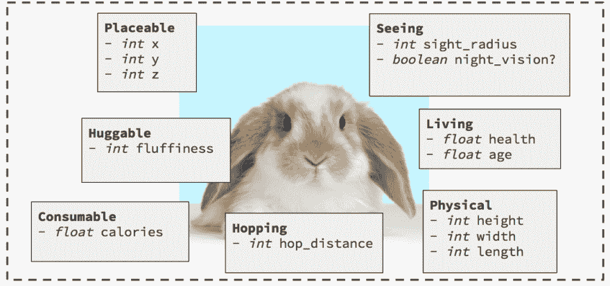

# 酏剂中的实体组件系统

> 原文：<https://dev.to/yos/entity-component-systems-in-elixir--2cph>

[T2】](https://res.cloudinary.com/practicaldev/image/fetch/s--kDd5NP0n--/c_limit%2Cf_auto%2Cfl_progressive%2Cq_auto%2Cw_880/https://i.imgur.com/7yJLXLX.png)

实体-组件-系统(ECS)是一种分布式组合架构设计模式，主要用于游戏开发。它支持特定领域行为的灵活解耦，这克服了传统面向对象继承的许多缺点。

Elixir 是一种构建在 Erlang VM 之上的动态函数式语言，旨在构建可伸缩和可维护的应用程序。

在本文中，探索我们如何使用 ECS 和 Elixir 以一种新颖的方式来构造我们的程序，超越基于类的继承范例。

> 这是我的[实体组件系统](https://speakerdeck.com/yosriady/entity-component-systems)演讲的后续文章。我在 Elixir 中实现 ECS 的源代码在 [Github](https://github.com/yosriady/ecs) 上是开源的。

[T2】](https://res.cloudinary.com/practicaldev/image/fetch/s---w0X24Zx--/c_limit%2Cf_auto%2Cfl_progressive%2Cq_auto%2Cw_880/https://i.imgur.com/Chhscxq.png)

# 基于类的继承的弊端

构建游戏世界的传统方式是拥有一个面向对象的游戏对象层次结构来模拟世界。然而，即使是简单的对象也会有大量未使用的功能。考虑下面的例子:

我们正在构建一个游戏引擎，我们发现自己处于以下等级:

[T2】](https://res.cloudinary.com/practicaldev/image/fetch/s--P4xfjvTV--/c_limit%2Cf_auto%2Cfl_progressive%2Cq_auto%2Cw_880/https://i.imgur.com/ycQyv8Y.png)

我们有一个 base `GameObject`，由`Animal`子类化。`Animal`又细分为`Bunny`和`Whale`，分别有自己的特殊行为`hop()`和`swim()`。我们还有一个`Killer Whale`，是`Whale`的子类，比 can `kill()`。

让我们试着向我们的世界介绍一种新动物:

[T2】](https://res.cloudinary.com/practicaldev/image/fetch/s--DsgLMOKZ--/c_limit%2Cf_auto%2Cfl_progressive%2Cq_auto%2Cw_880/https://i.imgur.com/tw03lpC.png)

> 我们希望`Killer Bunny`能够`hop()`和`kill()`，但是`Killer Bunny`应该从哪个类继承呢？

对于只有单一继承的语言/平台，我们运气不好。我们必须将`hop()`和`kill()`都移到某个超类中，比如`Killer Bunny`可以继承的`Animal`。然而，`Animal`的所有其他子类将继承他们不需要的东西。`Whale`继承`hop()`；`Bunny`继承`swim()`和`kill()`。随着时间的推移，`Animal`将会成为一个拥有大量行为的神物。

多重继承也不行。假设`Killer Bunny`同时继承了`Bunny`和`Killer Whale`。`Killer Bunny`将继承`swim()`，这是不需要的功能。

我们面临许多其他问题:

**刚性功能:**只有`Killer Whale`可以`kill()`。我们不能在以后改变主意，很容易地制造出其他动物`kill()`。行为只适用于专门编码来支持该行为的类。随着游戏实体数量的增长，我们在等级体系中寻找新实体的位置时面临着更大的困难。

[T2】](https://res.cloudinary.com/practicaldev/image/fetch/s--a0l_uIbd--/c_limit%2Cf_auto%2Cfl_progressive%2Cq_auto%2Cw_880/https://www.programmerinterview.cimg/Diamond_inheritance.png)

**钻石问题**:“钻石问题”(有时被称为“死亡的致命钻石”)是当两个类 B 和 C 从 A 继承，而类 D 从 B 和 C 继承时产生的歧义，如果 A 中有一个方法被 B 和 C 覆盖，而 D 没有覆盖它，那么 D 继承该方法的哪个版本:B 的版本，还是 C 的版本？

**Blob 反模式:**有了继承，游戏最终会有一个巨大的单个根类或其他具有大量功能的叶节点。子类被不需要的功能压得喘不过气来。

## 在关闭

上述困难长期困扰着游戏开发者，实体组件系统试图弥补这些烦恼。我们将在下一节学习 ECS。

# 实体组件系统

ECS 中有三个关键的抽象概念:

*   `Entity`
*   `Component`
*   `System`

我们将从`Component`开始详细检查每一个。

## 组件

一个实体的品质或方面。

组件是最小的、可重用的数据对象，被插入到实体中以支持某些行为。组件用单一质量标记实体。组件本身没有行为。通常，它被实现为一个结构或字典。

想象我们的世界里有一个`Bunny`实体:

[T2】](https://res.cloudinary.com/practicaldev/image/fetch/s--9Lliem00--/c_limit%2Cf_auto%2Cfl_progressive%2Cq_auto%2Cw_880/https://i.imgur.com/7usNJkI.png)

我们可以把兔子定义为独立组件的集合。在上面的例子中，兔子是由`Physical`和`Seeing`等组件“组成”的。

每个组件支持一些行为。举例来说，`Seeing`具有属性`sight_radius`来支持视觉行为。但是请注意，组件本身没有行为。每个组件只是一个最小的数据对象。

## 实体

组件的集合或容器。

实体仅仅是其组成部分的总和。实体被实现为与组件集合相关联的全局唯一的 IDs。请注意，实体本身没有实际的数据或行为。每个组件给一个实体数据来支持一些行为。

让我们再来看看我们的`Bunny`:

[T2】](https://res.cloudinary.com/practicaldev/image/fetch/s--NRH4nLEE--/c_limit%2Cf_auto%2Cfl_progressive%2Cq_auto%2Cw_880/https://i.imgur.com/Q7fX5M1.png)

看到我们组件周围的虚线框了吗？这就是`Bunny`实体——只不过是一个组件容器。我们可以将实体定义为任何组件子集的集合，就像这个`Carrot`:

[T2】](https://res.cloudinary.com/practicaldev/image/fetch/s--si8TP7ML--/c_limit%2Cf_auto%2Cfl_progressive%2Cq_auto%2Cw_880/https://i.imgur.com/OzBVB92.png)

还有这个`Ghost`:

[T2】](https://res.cloudinary.com/practicaldev/image/fetch/s--7ELpPW_g--/c_limit%2Cf_auto%2Cfl_progressive%2Cq_auto%2Cw_880/https://i.imgur.com/8Df8XTS.png)

实体只不过是组件的集合。

> 一些 ECS 实现允许您在运行时修改实体的组件集合。这允许您动态地“变异”实体。例如，我们可以有一个`Poisoned`组件，它使得用这个组件标记的实体随着时间的推移而失去健康。我们可以动态地添加和移除这个组件来施加和治疗毒素。你可能还会有一个“盲”状态效果，移除它所触及的实体的`Seeing`组件。

到目前为止，我们还没有触及任何逻辑或行为。实体只是组件的集合；组件只是数据对象。ECS 中的行为来自哪里？他们来自系统。

## 系统

系统赋予实体和组件生命。

[T2】](https://res.cloudinary.com/practicaldev/image/fetch/s--_jlThfbe--/c_limit%2Cf_auto%2Cfl_progressive%2Cq_auto%2Cw_880/https://i.imgur.com/ZjqrfQI.png)

系统枚举组件或组件组，根据内部规则或外部事件更新它们的状态。思考行为的一种方式是从一种状态到另一种状态的变化。让我们看一个例子:

[T2】](https://res.cloudinary.com/practicaldev/image/fetch/s--wBzip63R--/c_limit%2Cf_auto%2Cfl_progressive%2Cq_auto%2Cw_880/https://i.imgur.com/mMo6Ez1.png)

> 行为:“树上的兔子因重力而坠落。”

我们如何实现上述行为？我们可以让`z`值大于 0 的`Placeable`分量随着时间减少到 0。

> 行为:“生物会衰老。”

我们如何实现上述行为？我们可以让`Living`组件的`age`值随时间增加。

我们为我们希望支持的每种行为创建了一个专用系统。一个`GravitySystem`枚举所有`Placeable`组件；一个`TimeSystem`枚举了所有`Living`组件。请记住，系统是在组件而不是实体上运行的。

## 实体-组件-系统中的数据流

为了进一步巩固您对该模式的理解，让我们看一下该架构中的典型数据流:

[T2】](https://res.cloudinary.com/practicaldev/image/fetch/s--grhpIxGN--/c_limit%2Cf_auto%2Cfl_progressive%2Cq_auto%2Cw_880/https://i.imgur.com/oR44M3E.png)

每个系统监听一些事件流，如时间或玩家输入，并更新其组件的状态以响应该事件和一些内部规则。这些不断变化的状态可供其所属的实体访问，从而产生行为。

> 再比如:假设玩家按下了“向左移动”键。PlayerInputSystem 执行并检测按键，更新动作组件。MotionSystem 执行并“看到”实体向左运动，向左施加物理力。RenderSystem 执行并读取实体的当前位置，并根据空间定义(可能包括纹理区域/动画信息)进行绘制。
> 
> [*实体系统介绍*](https://github.com/junkdog/artemis-odb/wiki/Introduction-to-Entity-Systems)

## 比喻电子表格

另一种看待 ECS 的方式是将其视为一个关系表，就像电子表格一样:

[T2】](https://res.cloudinary.com/practicaldev/image/fetch/s--5jQ06z8A--/c_limit%2Cf_auto%2Cfl_progressive%2Cq_auto%2Cw_880/https://i.imgur.com/nThdtwx.png)

一个实体组件系统可以被想象成一个由组件列和实体行组成的表格。为了操作单个组件，我们选择它的列并查看每个单元格。为了操作一个实体，我们选择它的行并查看每个单元格。

## ECS 的优势

现在我们对实体-组件-系统架构有了更好的理解，让我们考虑一下这种方法与基于类的继承相比如何。

**良好的解耦，单一责任原则:**每个行为或领域在独立的组件和/或系统中是相互解耦的。与基于类的继承中的整体 god 对象不同，我们可以提取功能的任何子集，并以任何组合来组装它。ECS 也鼓励小界面。

**可组合性和运行时对象定义:**任何类型的游戏对象都可以通过向实体添加正确的组件来创建。这也可以允许开发者容易地将一种类型的对象的特征添加到另一种类型的对象，而没有任何依赖性问题。比如我们可以在运行时做`Entity.build([FlyingComponent, SeeingComponent])`。

**可测试**:根据定义，每个部件和系统都是一个单元。我们也可以用模拟或演示组件来代替组件进行测试。

可并行化:在许多现实世界的 ECS 实现中，比如 MMOs，一个系统被实现为一个分布式系统或者一个工人池，可以在它们之间分配工作。这让我们可以通过增加池中系统工作者的数量来横向扩展模拟的规模。

**数据和行为的分离**:组件保存数据，系统保存行为。这两者没有混合。该属性允许您即插即用不同的行为来应用于相同的数据。

## ECS 的挑战

尽管这给我们带来了灵活性，但 ECS 也带来了许多不小的挑战:

**ECS 是一种相对未知的模式:**由于这种设计模式主要局限于游戏开发，讨论如何将 ECS 用于 it 之外的领域，比如构建 web 应用程序，可能会很有挑战性。很少有资源可以将这种模式应用到其他领域，如果有的话。

**处理进程间通信:**我们如何处理系统和组件之间的通信？我们需要某种消息总线或发布-订阅系统来使我们的 ECS 的各个部分能够相互通信。根据实现 ECS 的语言或平台，这可能会导致复杂性激增。遍历组件和实体的开销也可能导致性能下降。

[T2】](https://res.cloudinary.com/practicaldev/image/fetch/s--oY-JPG99--/c_limit%2Cf_auto%2Cfl_progressive%2Cq_auto%2Cw_880/https://engineeringblog.yelp.cimg/posts/2016-07-14-billions-of-messages-a-day-yelps-real-time-data-pipeline/1.jpg)

**组件间通信:**当一个系统需要访问和修改多个组件中的数据时会发生什么？组件可能需要与其他组件共享状态，并在与系统通信之前相互通信。例如，假设我们在一个实体中有一个`Position`和`Sound`组件。我们可以有一个需要与两个组件通信的`PositionalSoundSystem`。我们可能需要一个单独的组件间通信通道来支持这个用例。

**系统间通信:**当两个系统需要访问和修改同一个组件时会发生什么？假设我们有两个系统:一个将属性`x`乘以`-1`，另一个将`x`加上`10`。根据两个系统的应用顺序，最终结果会有所不同。除非操作是关联的，否则我们可能需要引入一种方法来确保系统的顺序是正确的。

不像 MVC 等其他设计模式那样具体定义:有许多方法可以实现 ECS。每种语言或平台都有不同的可用抽象，这导致了不同风格的 ECS。

# 现实世界中的 ECS

除了作为视频游戏的流行架构，ECS 的当前应用是用于大规模分布式模拟。这包括实时城市交通、互联网电信网络和物理模拟。它还被用于为拥有惊人数量实体的视频游戏构建大型多人游戏后端。

[T2】](https://res.cloudinary.com/practicaldev/image/fetch/s--YbYjUVqU--/c_limit%2Cf_auto%2Cfl_progressive%2Cq_auto%2Cw_880/https://i.imgur.com/bgW0JX4.png)

特别是一家初创公司，正在构建名为 [SpatialOS](https://improbable.io/) 的 ECS 即服务。

# 仙丹中的一个 ECS 实现

在这一节中，我们将看看 Elixir 中实体-组件-系统的一种可能的实现。我将首先简要介绍为什么 Elixir(也叫 Erlang)及其并发原语非常适合 ECS 模式。

> 从现在开始，因为 Elixir 编译成了 Erlang 字节码，所以我说的 Elixir 也指 Erlang。

## 演员模特

Elixir 的关键抽象之一是流程——它们类似于演员模型的演员。参与者是计算实体，可以:

*   发送消息
*   接收消息
*   产生新演员

[T2】](https://res.cloudinary.com/practicaldev/image/fetch/s--6AqOaqPr--/c_limit%2Cf_auto%2Cfl_progressive%2Cq_auto%2Cw_880/https://i.imgur.com/ANwj1Ak.png)

在上图中，Actor `A`向 Actor `C`发送消息`1`和`2`，Actor`C`收到消息。作为对这些消息的响应，参与者 C 可以发送新的消息，或者产生新的参与者并等待接收来自这些参与者的消息。

```
# Try running this in an Elixir interpreter (iex)

# We first spawn a new actor that listens for messages, returning a process id (pid)
jeff = spawn(fn ->
        receive do
          {sender, message} -> IO.puts "Received '#{message}' from process #{inspect sender}"
        end
       end)

# We send a message to jeff's pid, adding our own pid in the message
send jeff, {self(), “Hello world”}

# send, receive, and spawn are built-in Elixir primitives 
```

Enter fullscreen mode Exit fullscreen mode

Elixir 还为构建角色提供了更高层次的抽象，称为`GenServers` :

```
defmodule Stack do
  use GenServer

  # Callbacks

  def handle_call(:pop, _from, [h | t]) do
    {:reply, h, t}
  end

  def handle_cast({:push, item}, state) do
    {:noreply, [item | state]}
  end
end

# Start the server
{:ok, pid} = GenServer.start_link(Stack, [:hello])

# This is the client
GenServer.call(pid, :pop)
#=> :hello

GenServer.cast(pid, {:push, :world})
#=> :ok

GenServer.call(pid, :pop)
#=> :world 
```

Enter fullscreen mode Exit fullscreen mode

> 考虑如何在参与者的帮助下实现 ECS。

## 用法举例

下面是我们的实现在使用时的样子:

```
# Instantiates a new entity with a set of parameterized components
# TimeComponent is a component that counts up
> bunny = ECS.Entity.build([TimeComponent.new(%{age: 0})])

# We trigger the TimeSystem to enumerate over all TimeComponents
# In the real world this could be in response to an event stream such as player input
> TimeSystem.process

# We pull the latest state of the components
> bunny = ECS.Entity.reload(bunny)

# We can repeat this process
> TimeSystem.process
> bunny = ECS.Entity.reload(bunny)

# Modifies an existing entity at runtime by adding a new component to it
bunny = ECS.Entity.add(bunny, TimeComponent.new(%{age: 10}))

# We can repeat this process, and both TimeComponents will receive state updates
TimeSystem.process
bunny = ECS.Entity.reload(bunny) 
```

Enter fullscreen mode Exit fullscreen mode

我在 Elixir 中的 ECS 实现是在 [Github](https://github.com/yosriady/ecs) 上开源的。您可以从根文件夹中通过`iex -S mix`克隆并运行它。您的计算机上必须安装有 Elixir。

# 实现

## 实体

实体是具有随机字符串`id`和组件列表的结构。我们可以创建实体，并通过添加组件来扩展它。两者都可以在运行时完成。

```
defmodule ECS.Entity do
  @moduledoc """
    A base for creating new Entities.
  """

  defstruct [:id, :components]

  @type id :: String.t
  @type components :: list(ECS.Component)
  @type t :: %ECS.Entity{
    id: String.t,
    components: components
  }

  @doc "Creates a new entity"
  @spec build(components) :: t
  def build(components) do
    %ECS.Entity{
      id: ECS.Crypto.random_string(64),
      components: components
    }
  end

  @doc "Add components at runtime"
  def add(%ECS.Entity{ id: id, components: components}, component) do
    %ECS.Entity{
      id: id,
      components: components ++ [component]
    }
  end

  @doc "Pulls the latest component states"
  @spec reload(t) :: t
  def reload(%ECS.Entity{ id: _id, components: components} = entity) do
    updated_components = components
      |> Enum.map(fn %{id: pid} ->
        ECS.Component.get(pid)
      end)

    %{entity | components: updated_components}
  end
end 
```

Enter fullscreen mode Exit fullscreen mode

下面是一个实际的实体，`Bunny` :

```
# A bunny prefab
defmodule Bunny do
  def new do
    ECS.Entity.build([TimeComponent.new(%{age: 0})])
  end
end 
```

Enter fullscreen mode Exit fullscreen mode

> 上面的代码引入了“预制品”的概念，它们是具有一组公共组件的实体的便利工厂。使用预设可以让你不用输入太多，并且可以充当门面。

## 组件

`Component`和`Component.Agent`模块提供了获取和设置状态的工具。每个组件都由一个参与者(一个代理——一种 GenServer)支持。)像`TimeComponent`这样的组件实现了`Component`行为(接口。)

```
ddefmodule ECS.Component do
  @moduledoc """
    A base for creating new Components.
  """

  defstruct [:id, :state]

  @type id :: pid()
  @type component_type :: String.t
  @type state :: map()
  @type params :: map()
  @type t :: %ECS.Component{
    id: id, # Component Agent ID
    state: state
  }

  @callback new(state) :: t # Component interface

  defmacro __using__(_options) do
    quote do
      @behaviour ECS.Component # Require Components to implement interface
    end
  end

  @doc "Create a new agent to keep the state"
  @spec new(component_type, state) :: t
  def new(component_type, initial_state) do
    {:ok, pid} = ECS.Component.Agent.start_link(initial_state)
    ECS.Registry.insert(component_type, pid) # Register component for systems to reference
    %{
      id: pid,
      state: initial_state
    }
  end

  @doc "Retrieves state"
  @spec get(id) :: t
  def get(pid) do
    state = ECS.Component.Agent.get(pid)
    %{
      id: pid,
      state: state
    }
  end

  @doc "Updates state"
  @spec update(id, state) :: t
  def update(pid, new_state) do
    ECS.Component.Agent.set(pid, new_state)
    %{
      id: pid,
      state: new_state
    }
  end
end 
```

Enter fullscreen mode Exit fullscreen mode

```
defmodule ECS.Component.Agent do
  @moduledoc """
    Create a simple Agent that gets and sets.
    Each component instantiates one to keep state.
  """

  @doc "Starts a new bucket. Returns {:status, pid}"
  def start_link(initial_state \\ %{}, opts \\ []) do
    Agent.start_link((fn -> initial_state end), opts)
  end

  @doc "Gets entire state from pid"
  def get(pid) do
    Agent.get(pid, &(&1))
  end

  @doc "Gets a value from the `pid` by `key`"
  def get(pid, key) do
    Agent.get(pid, &Map.get(&1, key))
  end

  @doc "Overwrites state with new_state."
  def set(pid, new_state) do
    Agent.update(pid, &Map.merge(&1, new_state))
  end

  @doc "Updates the `value` for the given `key` in the `pid`"
  def set(pid, key, value) do
    Agent.update(pid, &Map.put(&1, key, value))
  end
end 
```

Enter fullscreen mode Exit fullscreen mode

下面是一个实际的组件，`TimeComponent`，它实现了`Component`行为:

```
defmodule TimeComponent do
  @moduledoc """
    A component for keeping an age for something.
    {id: pid, state: state} = TimeComponent.new(%{age: 1})
  """
  use ECS.Component

  @component_type __MODULE__

  @doc "Initializes and validates state"
  def new(%{age: _age} = initial_state) do
    ECS.Component.new(@component_type, initial_state)
  end
end 
```

Enter fullscreen mode Exit fullscreen mode

## 系统和注册表

系统枚举其类型的所有组件。

```
defmodule TimeSystem do
  @moduledoc """
    Increments ages of TimeComponents
  """

  def process do
    components()
      |> Enum.each(fn (pid) -> dispatch(pid, :increment) end)
  end

  # dispatch() is a pure reducer that takes in a state and an action and returns a new state
  defp dispatch(pid, action) do
    %{id: _pid, state: state} = ECS.Component.get(pid)

    new_state = case action do
      :increment ->
        Map.put(state, :age, state.age + 1)
      :decrement ->
        Map.put(state, :age, state.age - 1)
      _ ->
        state
    end

    IO.puts("Updated #{inspect pid} to #{inspect new_state}")
    ECS.Component.update(pid, new_state)
  end

  defp components do
    ECS.Registry.get(:"Elixir.TimeComponent")
  end
end 
```

Enter fullscreen mode Exit fullscreen mode

需要注意的几件事:

*   接受外部动作，根据内部规则对其进行评估，并返回新状态。这部分的灵感主要来自我使用 Redux 减速器和 Elm 的`update`的经历。
*   `components`方法返回系统将枚举的组件集。每当一个组件被实例化时，它就向跟踪所有活动组件的`Registry`注册它的代理。注册中心本身就是一个参与者，如下所示:

```
defmodule ECS.Registry do
  @moduledoc """
    Component registry.
    iex> {:ok, r} = ECS.Registry.start
    iex> ECS.Registry.insert("test", r)
    :ok
    iex> ECS.Registry.get("test")
    [#PID<0.87.0>]
  """

  def start do
    Agent.start_link(fn -> %{} end, name: __MODULE__)
  end

  def insert(component_type, component_pid) do
    Agent.update(__MODULE__, fn(registry) ->
      components = (Map.get(registry, component_type, []) ++ [component_pid])
      Map.put(registry, component_type, components)
    end)
  end

  def get(component_type) do
    Agent.get(__MODULE__, fn(registry) ->
      Map.get(registry, component_type, [])
    end)
  end
end 
```

Enter fullscreen mode Exit fullscreen mode

就是这样！

> 这个特定的 ECS 实现可能有点粗糙。ECS 有很多种，但这肯定不是让 ECS 工作的唯一方式。非常欢迎您的反馈！

## 在关闭

ECS 是一种被忽视的架构模式，它克服了 OOP 风格继承的一些缺点，非常适合分布式系统。

扩展到不熟悉的领域(如游戏开发)是编写更好软件的新思想和模式的丰富来源。

感谢阅读！我希望你觉得这篇文章有用或者有趣。通过下面的评论让我知道你的想法！