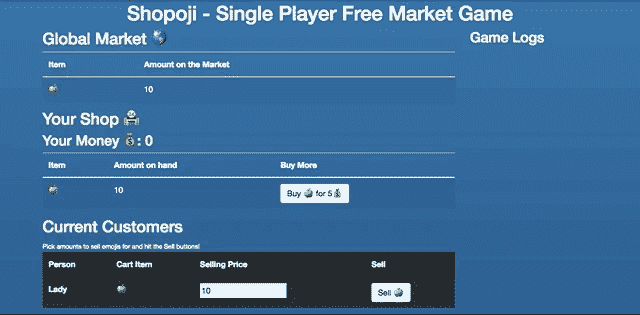
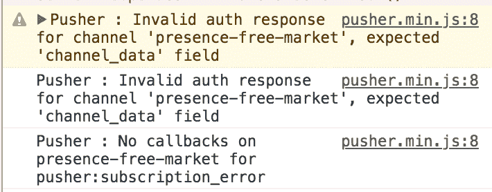
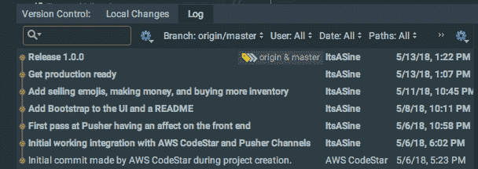

# [Entry] Shopoji -自由市场店铺游戏

> 原文：<https://dev.to/itsasine/entry-shopoji---a-free-market-shopkeep-game-3449>

# 我造了什么

Shopoji 是一款单人游戏，在这里你可以买卖存货。表情符号市场很强大，所以你正试图取得重大突破，以挖掘所有这些甜蜜的，甜蜜的💰。

虽然你看不到其他玩家，但你的商店知道全球市场的影响。每次有新店加入，他们都会给市场带来更多的表情符号，从而影响稀缺性。在未来的迭代中，这将在你如何为你自己的物品定价中发挥更大的作用。

## 试玩

[T2】](https://res.cloudinary.com/practicaldev/image/fetch/s--w3rUGXcf--/c_limit%2Cf_auto%2Cfl_progressive%2Cq_66%2Cw_880/https://raw.githubusercontent.com/ItsASine/shopoji/master/public/assets/img/shopoji.gif)

[链接到更多信息和现场演示](http://shopoji.xyz)

## 代码

[GitHub](https://github.com/ItsASine/shopoji)

# 我是如何建造的

## 技术堆栈

*   [推动器 API](https://pusher.com/)
*   Java Script 语言
    *   节点. js
    *   jQuery——用于在游戏中修改 DOM
    *   MomentJS -用于在游戏消息中添加时间戳
    *   香草
*   半铸钢ˌ钢性铸铁(Cast Semi-Steel)
    *   引导程序
*   超文本标记语言
*   [AWS CodeStar](https://aws.amazon.com/codestar/)
    *   AWS 代码管道
    *   AWS 代码构建
    *   AWS 云阵
    *   自动气象站λ
    *   AWS S3
    *   可能更多

### 开发工具

*   Github -源代码控制开发的公共和私有回购
    *   我保持了适当的 Git 流，并且有`master`、`develop`和特性分支
    *   还有一个奇怪的分支`public`,我避开了没有凭证的`master`,即`master`,所以我可以将该代码用于公共回购的`master`分支
*   网络风暴集成开发环境
*   基特克拉肯

## 绊脚石

现在，我最大的问题是:

[T2】](https://res.cloudinary.com/practicaldev/image/fetch/s--K66Y4pfC--/c_limit%2Cf_auto%2Cfl_progressive%2Cq_auto%2Cw_880/https://i.imgur.com/ELRsnyh.png)

我在上一篇文章中提出的“尝试切换到存在通道”的想法完全行不通。目前，我将坚持使用公共频道，并在 2.0 中引入用户意识。

AWS 是有压力的，但是从全局来看并没有花费太多时间。在 JS 中处理应用程序逻辑花了一些时间，但是因为我知道它并且可以看到进展，所以感觉不像基础设施部分那么糟糕。

## 酷玩意儿

在我尝试重写我的 Pusher 逻辑之前，Pusher API 本身非常简单并且易于设置。

我将在一周内构建一个应用程序的容易程度归功于 Pusher QuickStart Node 和 JS 指南。

这可能看起来微不足道，但我对 GitHub Pages 的一个特性感到非常惊讶。如果你在没有实际的顶级前端的情况下启用它，它将使用 Jekyll 从你的自述文件中创建一个。这意味着

1.  实际上，在整个项目过程中，我一直在更新自述文件
2.  我现在没有借口不在 GitHub 上为我所有的项目设置登陆页面了
3.  我不必为了这个应用程序而放弃开发工作，去为它开发一个“营销”网站

我一直认为 GitHub Pages 是用来免费部署静态网站和 Jekyll 博客的，但 README 网站这个东西超级好，非常有用。我猜我是今天一万个中的[之一。](https://www.xkcd.com/1053/)

# 附加资源/信息

## 吸取教训

我用一周的时间做了一个 app。这太令人兴奋了。

[T2】](https://res.cloudinary.com/practicaldev/image/fetch/s--veaNJEv---/c_limit%2Cf_auto%2Cfl_progressive%2Cq_auto%2Cw_880/https://i.imgur.com/2LD5ZLa.png)

我的教育背景(和前景，由于研究生院)是数学，我的工作是软件测试自动化。下一次当我对编码有所察觉时，**我在一周内开发并发布了一个应用程序**。

当然，我学到了一堆很酷的新技术，但最重要的是，我学到了我真的可以做事情。我可能“只是”一个 QA，但我可以开发东西，如果我想，该死的。

## 未来更新

我不打算把它运出去然后忘记它，但是我确实需要休息一下。在我的暑期实习偷走我的时间之前，我有一些家庭项目要做，如果我在这个月剩下的时间里不冷静下来，AWS 将开始收取我的代码构建费用。

### 面向未来的 Shopoji 2.0

*   单元测试
*   修复定价中的错误
*   获得授权工作
    *   将所有内容更改为在线频道
    *   让客户端衍生的事件工作
*   为价格范围设置 NPC 首选项
    *   让他们受到全球市场的影响
*   解决技术债务——为了快速解决问题，有些地方走了捷径，所以没有最后期限，解决问题会更容易
    *   代码与🍏s
    *   引入 DynamoDB 来存储游戏信息，而不是一切都在客户端
*   添加更多的 NPC，而不是总是想要的女士🍏s
*   添加更多表情符号，以便女士可以购买一些🥧也

## 沿途设卡

 [## 推销商店游戏-最初的想法

### 伊塔辛(凯拉)5 月 5 日 183 分钟阅读

#pushercontest #inprogress](/itsasine/pusher-shopkeep-game---initial-idea-36po) [## 推动器项目-为什么我永远不会是 Devops

### 伊塔辛(凯拉)5 月 6 日 182 分钟阅读

#pushercontest #inprogress](/itsasine/pusher-project---why-ill-never-be-devops-520d) [## Shopoji -具有工作效果的初始前端！

### 伊塔辛(凯拉)5 月 9 日 182 分钟阅读

#pushercontest #inprogress](/itsasine/shopoji---initial-front-end-with-working-effects-i56) [## Shopoji - Pusher 存在渠道很酷

### 伊塔辛(凯拉)5 月 13 日 182 分钟阅读

#pushercontest #inprogress](/itsasine/shopoji---pusher-presence-channels-are-cool-4nhg)