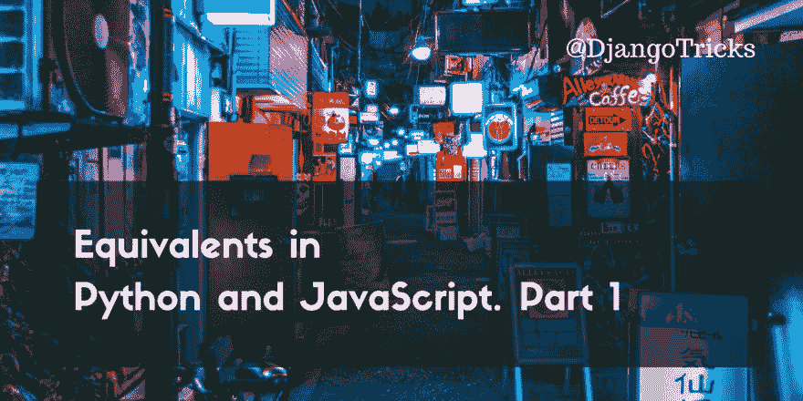

# Python 和 JavaScript 中的等价物。第一部分

> 原文：<https://dev.to/djangotricks/equivalents-in-python-and-javascript-part-1-3317>

[T2】](https://res.cloudinary.com/practicaldev/image/fetch/s--iGP5ac8P--/c_limit%2Cf_auto%2Cfl_progressive%2Cq_auto%2Cw_880/https://2.bp.blogspot.com/-vPKYTFzcQIE/WzrCDyN3S_I/AAAAAAAAB5k/7bCSikeIKrgP27OEDrcJp4NsjDZnSt2YACLcBGAs/s1600/equivalents-in-python-and-javascript-part-1.png)

虽然 **Python** 和 **JavaScript** 是截然不同的语言，但是有一些类比是全栈 **Python** 开发者在开发 web 项目时应该知道的。在这个由 4 部分组成的系列中，我将探索每种语言的相似之处，以及解决常见问题的常用方法。这并不意味着是一个参考，我将跳过像原始变量类型，条件和循环的基础知识。但是我将同时使用 **Python** 和 **JavaScript** 来深入研究更复杂的结构和数据操作。此外，我将努力把重点放在实际的用例上。对于 Django、Flask 或另一个 **Python** 框架的开发者来说，这个系列应该很有趣，他们希望掌握传统和现代的普通 JavaScript**和**。另一方面，它将对前端用户有用，他们希望更好地了解后端是如何工作的，甚至可能开始他们自己的 Django 网站。

## 解析整数

我们将从整数解析开始。

在 **Python** 中，这很简单:

```
number = int(text) 
```

Enter fullscreen mode Exit fullscreen mode

但是在 **JavaScript** 中，你必须解释你所期望的数字系统:十进制、八进制、十六进制或二进制:

```
number = parseInt(text, 10); 
```

Enter fullscreen mode Exit fullscreen mode

为了使用“正常的”十进制数字系统，我们将数字 10 作为`parseInt()`函数的第二个参数。8 代表八进制，16 代表十六进制，2 代表二进制。如果第二个参数**缺少**，文本中的数字从零开始，并且您使用的是稍旧的浏览器，文本中的数字将被解释为八进制。例如，

```
parseInt('012') == 10  // in some older browsers
parseInt('012', 10) == 12 
```

Enter fullscreen mode Exit fullscreen mode

这真的会打乱你的计算。

## 条件赋值

对于条件赋值， **Python** 和 **JavaScript** 有不同的语法，但是条件赋值在两种语言中都相当流行。这很流行，因为它只是一个包含条件检查、真值和假值的语句。

从 **Python** 2.7 开始你可以这样写条件赋值:

```
value = 'ADULT' if age >= 18 else 'CHILD' 
```

Enter fullscreen mode Exit fullscreen mode

在 **JavaScript** 中，条件赋值是使用三元运算符`?:`完成的，类似于 C、C++、C#、Java、Ruby、PHP、Perl、Swift 和 ActionScript 中的运算符:

```
value = age >= 18? 'ADULT': 'CHILD'; 
```

Enter fullscreen mode Exit fullscreen mode

## 对象属性值由属性名决定

访问一个对象的属性的正常方式是用点符号， **Python** 和 **JavaScript** :

```
obj.color = 'YELLOW' 
```

Enter fullscreen mode Exit fullscreen mode

但是，如果您想通过保存为字符串的名称来引用属性，该怎么办呢？例如，属性名可能来自一个属性列表，或者属性名由两个字符串组合而成，如`'title_' + lang_code`。

为此，在 **Python** 中，有函数`getattr()`和`setattr()`。我经常使用它们。

```
attribute = 'color'
value = getattr(obj, attribute, 'GREEN')
setattr(obj, attribute, value) 
```

Enter fullscreen mode Exit fullscreen mode

在 **JavaScript** 中，你可以像对待字典一样对待一个对象，并传递方括号中的属性名:

```
attribute = 'color';
value = obj[attribute] || 'GREEN';
obj[attribute] = value; 
```

Enter fullscreen mode Exit fullscreen mode

为了在对象没有这样的属性时检索默认值，在 **Python** 中，`getattr()`有第三个参数。在 **JavaScript** 中，如果`obj`属性不存在，将返回`undefined`值。然后，它可以与您想要分配的默认值进行“或”运算。这是在许多 JavaScript 库和框架中都能找到的常见做法。

## 按键字典值

这个和上一个差不多。在两种语言中，通过键分配字典值的通常方式是使用方括号:

```
dictionary = {}
dictionary['color'] = 'YELLOW' 
```

Enter fullscreen mode Exit fullscreen mode

要在 **Python** 中读取一个值，可以使用方括号符号，但是对于不存在的带有`KeyError`的键，它会失败。更灵活的方法是使用为不存在的键返回`None`的`get()`方法。您还可以传递一个可选的默认值作为第二个参数:

```
key = 'color'
value = dictionary.get(key, 'GREEN') 
```

Enter fullscreen mode Exit fullscreen mode

在 **JavaScript** 中，你将使用与对象属性相同的技巧，因为字典和对象在这里是相同的:

```
key = 'color';
value = dictionary[key] || 'GREEN'; 
```

Enter fullscreen mode Exit fullscreen mode

## 切片列表和字符串

**Python** 有 slice `[:]`操作符来获取列表、元组和类似的更复杂的结构，例如 Django QuerySets:

```
items = [1, 2, 3, 4, 5]
first_two = items[:2]      # [1, 2] last_two = items[-2:]      # [4, 5] middle_three = items[1:4]  # [2, 3, 4] 
```

Enter fullscreen mode Exit fullscreen mode

在**中，JavaScript** 数组有效果相同、用法相似的`slice()`方法:

```
items = [1, 2, 3, 4, 5];
first_two = items.slice(0, 2);     // [1, 2] 
last_two = items.slice(-2);        // [4, 5]
middle_three = items.slice(1, 4);  // [2, 3, 4] 
```

Enter fullscreen mode Exit fullscreen mode

但是不要和修改原始数组的`splice()`方法混淆！

* * *

**Python** 中的`[:]`切片操作符也适用于字符串:

```
text = 'ABCDE'
first_two = text[:2]      # 'AB' last_two = text[-2:]      # 'DE' middle_three = text[1:4]  # 'BCD' 
```

Enter fullscreen mode Exit fullscreen mode

在 **JavaScript** 中，字符串就像数组一样有`slice()`方法:

```
text = 'ABCDE';
first_two = text.slice(0, 2);    // 'AB'
last_two = text.slice(-2);       // 'DE'
middle_three = text.slice(1, 4); // 'BCD' 
```

Enter fullscreen mode Exit fullscreen mode

## 与列表项的操作

在编程中，收集和分析元素序列是很常见的。在 **Python** 中，这通常用列表来完成，在 **JavaScript** 中用数组来完成。它们有相似的语法和操作，但是添加和移除值的方法名称不同。

这是如何在 **Python** :
中把两个列表串联起来，在末尾加一个值，在开头加一个值，在开头获取和移除一个值，在末尾获取和移除一个值，通过索引删除某个值

```
items1 = ['A']
items2 = ['B']
items = items1 + items2  # items == ['A', 'B'] items.append('C')        # ['A', 'B', 'C'] items.insert(0, 'D')     # ['D', 'A', 'B', 'C'] first = items.pop(0)     # ['A', 'B', 'C'] last = items.pop()       # ['A', 'B'] items.delete(0)          # ['B'] 
```

Enter fullscreen mode Exit fullscreen mode

这就是如何在 **JavaScript** :
中对数组进行完全相同的操作

```
items1 = ['A'];
items2 = ['B'];
items = items1.concat(items2);  // items === ['A', 'B']
items.push('C');                // ['A', 'B', 'C']
items.unshift('D');             // ['D', 'A', 'B', 'C']
first = items.shift();          // ['A', 'B', 'C']
last = items.pop();             // ['A', 'B']
items.splice(0, 1);             // ['B'] 
```

Enter fullscreen mode Exit fullscreen mode

## 连接字符串列表

有了一个字符串列表或数组后，通常用逗号或换行符之类的分隔符将它们组合成一个字符串。

在 **Python** 中，这是通过字符串的`join()`方法完成的，在这里你传递列表或元组。虽然这可能感觉不自然，但您可以从分隔符开始。但是我可以保证你用几次就习惯了。

```
items = ['A', 'B', 'C']
text = ', '.join(items)  # 'A, B, C' 
```

Enter fullscreen mode Exit fullscreen mode

在 **JavaScript** 中，数组有一个`join()`方法，在这里你传递分隔符:

```
items = ['A', 'B', 'C'];
text = items.join(', ');  // 'A, B, C' 
```

Enter fullscreen mode Exit fullscreen mode

## 外卖

*   **Python** 中的列表和元组类似于 **JavaScript** 中的数组。
*   **Python** 中的字典类似于 **JavaScript** 中的对象。
*   **Python** 中的字符串类似于 **JavaScript** 中的字符串。
*   JavaScript 中的数字应该小心解析。
*   单行条件赋值在两种语言中都存在。
*   在 **Python** 中连接字符串序列是令人困惑的，但是你可以很快习惯它。

我把所有与 **Python** 和 **JavaScript** 等价的东西编辑成了一个备忘单，你可以打印出来并永久使用。并列比较了传统的 **Python** 2.7 和基于 ECMAScript 5 标准的 **JavaScript** ，以及更新的 **Python** 3.6 和基于 ECMAScript 6 标准的 **JavaScript** 与字符串插值、lambdas、生成器、类等好东西。

<center>[✨✨✨
Get the Ultimate Cheat Sheet of
Equivalents in Python and JavaScript
✨✨✨](https://www.djangotricks.com/goodies/YbnpiLKBmAZi/)</center>

在本系列的下一部分中，我们将了解 JSON 的创建和解析、正则表达式的操作以及错误处理。敬请期待！

* * *

本杰明·洪的封面照片。

[T2】](https://res.cloudinary.com/practicaldev/image/fetch/s--TpNjbUUW--/c_limit%2Cf_auto%2Cfl_progressive%2Cq_auto%2Cw_880/http://feeds.feedburner.com/%257Er/djangotricks/%257E4/GeUgbRasTww)