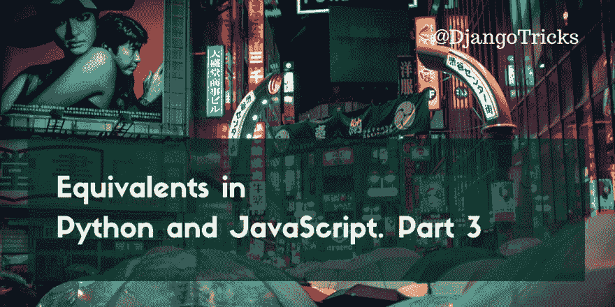

# Python 和 JavaScript 中的等价物。第三部分

> 原文：<https://dev.to/djangotricks/equivalents-in-python-and-javascript-part-3-4icc>

[T2】](https://res.cloudinary.com/practicaldev/image/fetch/s--gbwH6Aqg--/c_limit%2Cf_auto%2Cfl_progressive%2Cq_auto%2Cw_880/https://1.bp.blogspot.com/-QOkE0Sse2NU/WzrCwrbe4qI/AAAAAAAAB54/Y0P1FNJqDc4gnR1JiAjv4MLGllcrZDFvACLcBGAs/s1600/equivalents-in-python-and-javascript-part-3.png)

这是关于在 **Python** 和 **JavaScript** 中的类比的 4 篇文章系列的第 3 部分。在[的前几部分](https://dev.to/djangotricks/equivalents-in-python-and-javascript-part-2-3fej)中，我们讲述了传统的 **Python** 2.7 和 **JavaScript** 基于 ECMAScript 5 标准的大部分内容。这次我们将开始研究基于 ECMAScript 6 标准的 **Python** 3.6 和 **JavaScript** 。ECMAScript 6 标准相当新，只支持最新版本的浏览器。对于老版本的浏览器，你需要 [Babel](https://babeljs.io/) 将你的下一代 **JavaScript** 代码编译成跨浏览器兼容的代码。它为许多有趣的事情打开了探索之门。我们将从字符串插值、解包列表、lambda 函数、无索引迭代、生成器和集合开始！

## 字符串中的变量

用变量值构建字符串的旧而低效的方法是这样的连接:

```
name = 'World'
value = 'Hello, ' + name + '!\nWelcome!' 
```

Enter fullscreen mode Exit fullscreen mode

这可能会变得非常稀疏，难以阅读。同样，在变量周围的句子中也很容易漏掉空格。

由于**Python**3.6 版和 **JavaScript** 基于 ECMAScript 6 标准，你可以使用所谓的字符串插值。这些是用变量的值填充的字符串模板。

在 **Python** 中，它们也被称为 f-string，因为它们的符号以字母“f”开始:

```
name = 'World'
value = f"""Hello, {name}!
Welcome!"""

price = 14.9
value = f'Price: {price:.2f} €'  # 'Price: 14.90 €' 
```

Enter fullscreen mode Exit fullscreen mode

在**中，JavaScript** 字符串模板以反斜线开始和结束:

```
name = 'World';
value = `Hello, ${name}!
Welcome!`;

price = 14.9;
value = `Price ${price.toFixed(2)} €`;  // 'Price: 14.90 €' 
```

Enter fullscreen mode Exit fullscreen mode

请注意，字符串模板可以是单行的，也可以是多行的。对于 Python 中的 f 字符串，你可以传递变量的格式，但是你不能调用变量的方法，除非它们是属性并调用 getter 方法。

## 开箱清单

Python 和现在的 **JavaScript** 有一个有趣的特性，将序列项分配到单独的变量中。例如，我们可以用下面的语法将一个列表的三个值读入变量 a、b 和 c:

```
[a, b, c] = [1, 2, 3] 
```

Enter fullscreen mode Exit fullscreen mode

* * *

对于元组，括号可以省略。下面是在 **Python** 中交换两个变量的值的一个非常流行的方法:

```
a = 1
b = 2
a, b = b, a  # swap values 
```

Enter fullscreen mode Exit fullscreen mode

有了下一代 **JavaScript** 这也可以实现:

```
a = 1;
b = 2;
[a, b] = [b, a];  // swap values 
```

Enter fullscreen mode Exit fullscreen mode

* * *

在 **Python** 3.6 中，如果我们在一个列表或元组中有未知数量的条目，我们可以将它们分配给一个由几个值组成的元组，同时将其余的解包到一个列表:

```
first, second, *the_rest = [1, 2, 3, 4]
# first == 1
# second == 2
# the_rest == [3, 4] 
```

Enter fullscreen mode Exit fullscreen mode

这也可以用**JavaScript**(ECMAScript 6):
来完成

```
[first, second, ...the_rest] = [1, 2, 3, 4];
// first === 1
// last === 2
// the_rest === [3, 4] 
```

Enter fullscreen mode Exit fullscreen mode

## λ函数

Python 和 JavaScript**有一个非常简洁的功能，可以在一行中创建函数。这些函数被称为 lambdas。Lambdas 是非常简单的函数，接受一个或多个参数并返回一些计算值。通常，当您需要将一个函数作为回调函数传递给另一个函数，或者作为操作序列中每个单独元素的函数时，会使用 lambdas。**

在 **Python** 中，你可以使用`lambda`关键字定义一个 lambda，就像这样:

```
sum = lambda x, y: x + y
square = lambda x: x ** 2 
```

Enter fullscreen mode Exit fullscreen mode

在 **JavaScript** 中，lambdas 使用了`=>`符号。如果有多个参数，它们必须放在括号中:

```
sum = (x, y) => x + y;
square = x => Math.pow(x, 2); 
```

Enter fullscreen mode Exit fullscreen mode

## 无索引迭代

许多编程语言只允许通过使用索引和递增它们的值来遍历序列。然后在某个位置获取一个项目，你可以从一个数组中读取它，例如:

```
for (i=0; i<items.length; i++) {
    console.log(items[i]);
} 
```

Enter fullscreen mode Exit fullscreen mode

这不是一个好的语法，而且非常专业——读起来不自然。我们真正想要的只是从列表中获取每个值。并且 **Python** 有一个非常简洁的可能性，就是遍历元素:

```
for item in ['A', 'B', 'C']:
    print(item) 
```

Enter fullscreen mode Exit fullscreen mode

在现代的 **JavaScript** 中，这也可以通过`for..of`操作符:
来实现

```
for (let item of ['A', 'B', 'C']) {
    console.log(item);
} 
```

Enter fullscreen mode Exit fullscreen mode

* * *

你也可以在 **Python** :
中遍历一个字符串字符

```
for character in 'ABC':
    print(character) 
```

Enter fullscreen mode Exit fullscreen mode

而在现代 **JavaScript** :

```
for (let character of 'ABC') {
    console.log(character);
} 
```

Enter fullscreen mode Exit fullscreen mode

## 发电机

Python 和 modern **JavaScript** 有可能定义特殊函数，通过这些函数你可以迭代。随着每次迭代，它们返回序列中下一个生成的值。这些函数称为生成器。使用生成器，你可以得到一个范围内的数字，一个文件中的行，来自不同分页 API 调用的数据，[斐波那契数列](https://www.youtube.com/watch?v=T8xgfVzef_E)，以及任何其他动态生成的序列。

从技术上讲，生成器类似于普通的函数，但是它们不是返回值，而是产生一个值。该值将在一次迭代中返回。只要到达函数的末尾，就会发生这种生成。

为了说明这一点，下面的 **Python** 代码将创建一个生成器`countdown()`，它将把给定的数字返回到 1，(比如 10，9，8，...，1):

```
def countdown(counter):
    while counter > 0:
        yield counter
        counter -= 1

for counter in countdown(10):
    print(counter) 
```

Enter fullscreen mode Exit fullscreen mode

在现代的 **JavaScript** 中可以实现完全相同的功能，但是请注意`function`语句中的星号。它定义它是一个生成器:

```
function* countdown(counter) {
    while (counter > 0) {
        yield counter;
        counter--;
    }
}
for (let counter of countdown(10)) {
    console.log(counter);
} 
```

Enter fullscreen mode Exit fullscreen mode

## 集

我们已经看了列表、元组和数组。但是这里有另一种类型的数据集。集合是确保每个元素只存在一次的元素组。集合论还规定了集合运算，如[并、交和差](http://2ality.com/2015/01/es6-set-operations.html)，但我们今天不会在这里讨论它们。

这就是如何创建一个集合，向其中添加元素，检查一个值是否存在，检查集合中元素的总数，遍历它的值，并使用 **Python** :
删除一个值

```
s = set(['A'])
s.add('B'); s.add('C')
'A' in s
len(s) == 3
for elem in s:
    print(elem)
s.remove('C') 
```

Enter fullscreen mode Exit fullscreen mode

下面是如何用现代的 **JavaScript** :
实现同样的功能

```
s = new Set(['A']);
s.add('B').add('C');
s.has('A') === true;
s.size === 3;
for (let elem of s.values()) {
    console.log(elem);
}
s.delete('C') 
```

Enter fullscreen mode Exit fullscreen mode

## 外卖

*   字符串插值或文字模板允许你有更干净和更好的代码，即使可能有多行文本。
*   您可以在不使用索引的情况下循环访问序列或组中的元素。
*   当你有一个几乎无限的元素序列时，使用生成器。
*   如果要确保快速检查数据是否存在于集合中，请使用集合。
*   需要简短清晰的单行函数时使用 lambdas。

正如你从前面的部分中所知道的，我提供了一个备忘单，上面有 **Python** 和 **JavaScript** 的等价类的完整列表，两者都是久经考验的。在你眼前打印一些东西比在窗口间切换或上下滚动直到你找到你要找的东西要方便得多。所以我建议你拿到小抄，好好利用它！

<center>✨✨✨
[Get the Ultimate Cheat Sheet of
Equivalents in Python and JavaScript
✨✨✨](https://www.djangotricks.com/goodies/YbnpiLKBmAZi/)</center>

在本系列的下一个也是最后一个部分中，我们将看看函数参数、类、继承和属性。敬请期待！

* * *

封面照片由[亚历山大·奈特](https://unsplash.com/photos/Akz00I_GGjU)

[T2】](https://res.cloudinary.com/practicaldev/image/fetch/s--ro6EUNIm--/c_limit%2Cf_auto%2Cfl_progressive%2Cq_auto%2Cw_880/http://feeds.feedburner.com/%257Er/djangotricks/%257E4/D6BXc0mUq3Q)