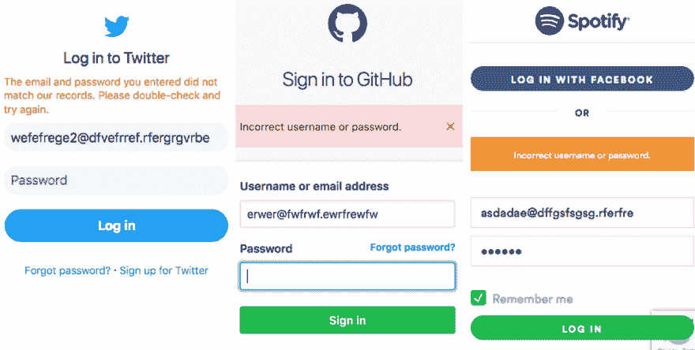
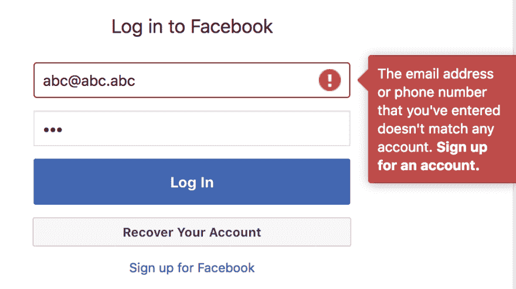
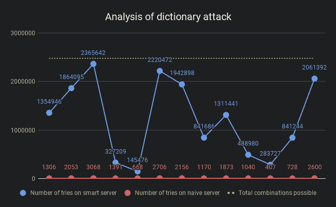

# 登录过程中的错误消息:隐私和安全

> 原文：<https://dev.to/tbking/error-messages-in-login-process-privacy-and-security-4fin>

我们中的大多数人在开发网站时，都坚持让错误信息尽可能具体地呈现给最终用户，这对创建一个友好的 UX 大有帮助。但是，如果在登录流中使用相同的规则，可能会有很大的隐私和安全隐患。当输入错误的登录凭证时，大多数站点会在登录屏幕上显示各种类型的`Invalid username/password`错误。

[T2】](https://res.cloudinary.com/practicaldev/image/fetch/s--4R1Lkj8o--/c_limit%2Cf_auto%2Cfl_progressive%2Cq_auto%2Cw_880/https://tarunbatra.com/daimg/Error-messages-in-login-process-Privacy-and-Security/twitter-github-spotify.png)

可以有把握地假设，不存在使用这类电子邮件的用户，然而这些显著网站显示的错误消息并没有表明这一点。你知道为什么吗？

## 保护用户基础信息

在随机发送电子邮件时，简单的登录/重置密码可能会显示该用户不存在，因此不可能有登录/重置密码。恶意客户端可能会根据这些信息创建一个有效用户列表。然而，并不是每个网站都关心这个问题。脸书没有。

[T2】](https://res.cloudinary.com/practicaldev/image/fetch/s--b38hn6mm--/c_limit%2Cf_auto%2Cfl_progressive%2Cq_auto%2Cw_880/https://tarunbatra.com/daimg/Error-messages-in-login-process-Privacy-and-Security/facebook.png)

像脸书这样的网站泄露用户群是无害的，因为每个人都在上面，但当网站像阿什利·马迪森这样的时候，就有可能产生影响。

### 关闭循环

人们经常争辩说，用户群无论如何都会在注册过程中泄露，如果用户已经存在，注册就无法继续。这种泄漏也是可以避免的，通过电子邮件继续注册。如果用户已经存在，电子邮件可以这样说，否则它可以指示接收者继续注册过程。

## 威慑到蛮干

在暴力攻击中，大量用户名和密码的组合被尝试进入用户的帐户。字典攻击更快更好，因为它利用了人们使用普通密码和重复使用旧密码的倾向。像`Invalid username`这样的特定消息通过在几次尝试中消除大量组合，使这些攻击变得更快。

### 演示

为了量化详细的错误消息对暴力攻击或字典攻击的影响，我创建了一个脚本， [login-attack-demo](https://github.com/tarunbatra/login-attack-demo) ，其中包括:

#### 字典

基于 [danielmiessler/SecLists](https://github.com/danielmiessler/SecLists/blob/master/Passwords/probable-v2-top1575.txt) 的 1575 个最常用密码的集合。

#### 幼稚服务器

根据登录过程的失败阶段给出特定错误消息的服务器。如果用户名无效，它会说`Invalid username`。

#### 智能服务器

登录失败时，服务器会给出模糊的错误消息。如果密码无效而不是用户名无效，它仍然会显示`Invalid username/password`。

#### 攻击者

恶意客户端使用字典生成一对用户名和密码，并使用它们闯入系统。它还分析以下规则的错误消息:

*   显示密码无效的错误消息表明用户名是有效的。
*   显示用户名无效的错误消息，表明没有密码组合将导致成功登录。
*   忽略不确定的错误消息，并尝试下一个组合。

### 结果

[T2】](https://res.cloudinary.com/practicaldev/image/fetch/s--EDozEUBT--/c_limit%2Cf_auto%2Cfl_progressive%2Cq_auto%2Cw_880/https://tarunbatra.com/daimg/Error-messages-in-login-process-Privacy-and-Security/chart.png)

蓝色的点表示攻击者用模糊的错误消息闯入用户帐户的尝试次数，而红色的点表示错误消息是具体的。黄线是可以尝试的最大组合数。

很明显，理论上模糊的错误信息使攻击者变得非常困难，有时甚至困难 1000 倍。然而，堵塞所有的漏洞可能会使 UX 远离理想。最终，这一切都要在 UX 和安全之间进行权衡。根据您操作的空间，这些方法可用于保护用户。

> 最初在 tarunbatra.com 发表[。](https://tarunbatra.com/blog/security/Error-messages-in-login-process-Privacy-and-Security)