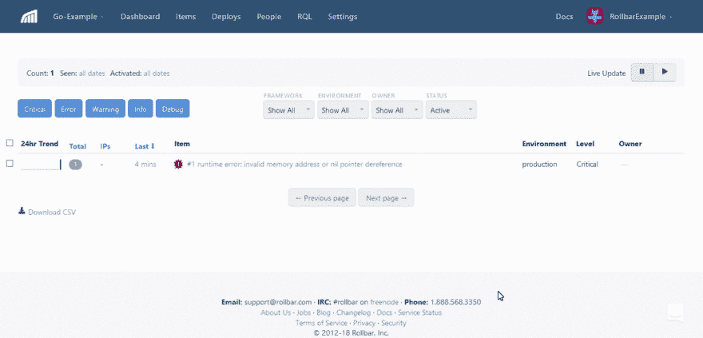
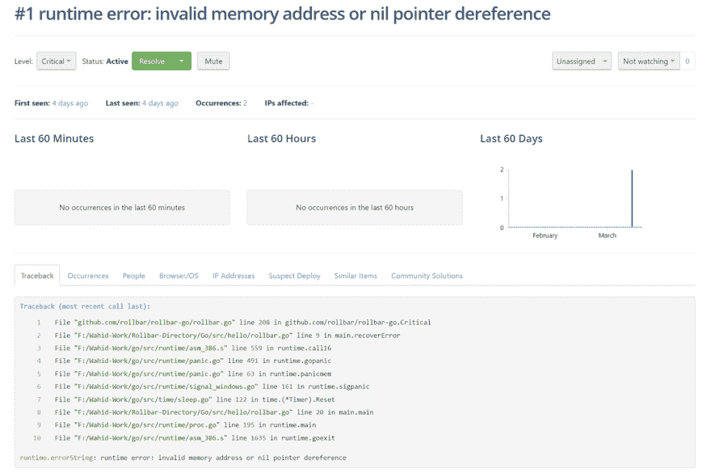

# Golang 中的错误监控

> 原文：<https://dev.to/mostlyjason/error-monitoring-in-golang-51a8>

Go 是一种开源编程语言，最初由 Google 创建，现在越来越受欢迎。它是一种像 C 一样的低级语言，但也提供垃圾收集、易于使用的包系统和其他功能。

如果你习惯于 Java 或 Javascript 这样的语言，那么 Go 处理错误的方式对你来说将是全新的。我们将简要介绍 Go 中错误处理的工作原理，然后介绍如何使用[滚动条](https://rollbar.com)来监控生产应用程序中的错误。

## 使用错误类型

Go 使用错误类型来指示异常状态。例如，`os.Open`函数在打开文件失败时会返回一个错误值。许多人认为这比抛出一个错误或返回一个空值更清楚。

类型是一个接口，你可以实现它来创建你自己的错误。错误接口需要一个返回字符串的`Error`方法。这允许您在控制台或日志消息中打印错误。特定的错误实现可能有其他方法。

```
type error interface {
  Error() string
} 
```

Enter fullscreen mode Exit fullscreen mode

Go 还允许你用[多个返回值](http://golangtutorials.blogspot.in/2011/06/return-values-from-go-functions.html)实现函数。这通常用于在成功时提供一个值，在出错时提供第二个值。让我们深入一个例子，展示我们如何处理多个返回值。

下面，当你传递一个负数时，`calculateSqrt`函数会返回一个错误。那是因为负数的平方根没有定义。

```
func calculateSqrt(f float64) (float64, error) {
 //return an error as second parameter if invalid input
  if (f < 0) {
    return float64(math.NaN()),errors.New("Not able to take the square root of a negative number")
  }
//otherwise use default square root function
  return math.Sqrt(f),nil
} 
```

Enter fullscreen mode Exit fullscreen mode

要使用这个函数，我们调用它并分配两个由逗号分隔的返回值。如果有错误，我们会在控制台上打印出来。如果没有，那么我们已经成功计算了平方根。

```
func main() {
  ret, err  := calculateSqrt(-1)    
  if err != nil {
    fmt.Println(err)
  }else{
    fmt.Println("The square root is ", ret)
  }
} 
```

Enter fullscreen mode Exit fullscreen mode

## 使用延期、死机和恢复

在 Go 中，我们不像在 Java 或 Javascript 中那样抛出异常。相反，在运行时错误后会出现死机。同样，我们可以使用内置函数[延迟和恢复](https://blog.golang.org/defer-panic-and-recover)来恢复处理，而不是[尝试和捕捉](https://dzone.com/articles/try-and-catch-in-golang)。

让我们从 defer 函数的基本描述开始。Defer 通常用于简化执行清理操作的功能。它将一个函数调用推送到一个列表上，保存的调用列表在周围的函数返回后执行。defer 函数也可以在 main 方法中使用，以便从应用程序的任何混乱中全局恢复。这对于记录或跟踪问题以进行分析非常有用。

Recover 是一个内置函数，用于重新获得对死机的 goroutine 的控制。它只能在不同的函数内部调用。一旦被调用，它将捕获导致死机的信息，然后恢复正常执行。

下面是一个如何使用 defer 从恐慌中恢复的示例:

```
func recoverError() {  
  if r := recover(); r!= nil {
    fmt.Println( r)
  }
}
func main() {
  defer recoverError()
} 
```

Enter fullscreen mode Exit fullscreen mode

你可以在 Go 的官方文档中详细了解这些函数:[错误处理](https://blog.golang.org/error-handling-and-go)和[延迟、惊慌](https://blog.golang.org/defer-panic-and-recover) [，恢复](https://blog.golang.org/defer-panic-and-recover)。

## 生产中的错误监控

控制台上的打印错误和混乱是在开发中处理它们的好方法。但是，在生产应用程序中，您无法访问控制台。相反，您应该捕获这些错误，并将它们发送到聚合服务进行跟踪和分析。

滚动条帮助您监控现实应用程序中的错误。它为您提供了实时的错误反馈、堆栈跟踪和上下文数据，以便快速调试错误。您还可以通过跟踪每个错误影响的对象来了解用户体验。了解更多关于我们[产品特性](https://rollbar.com/features/)的信息。

[T2】](https://res.cloudinary.com/practicaldev/image/fetch/s--mhPjgW1r--/c_limit%2Cf_auto%2Cfl_progressive%2Cq_66%2Cw_880/https://thepracticaldev.s3.amazonaws.com/i/4ty1qucn2iu6r8mis28r.gif)

下面是一些简单的步骤，描述了如何将 Go SDK 添加到您的代码中。你可以在 [Rollbar 的 Go 文档](https://docs.rollbar.com/docs/go)或者 [godocs](https://godoc.org/github.com/rollbar/rollbar-go) 中找到更多细节。

1.  访问 https://rollbar.com，如果你还没有注册免费账户，就注册吧。接下来，创建您的项目并选择“后端”,然后从通知列表中选择“Go”。选择为您生成的服务器端访问令牌。在下面的步骤中，您将需要它来配置 Rollbar。

2.  打开项目目录中的命令提示符，键入以下命令来安装 Go SDK。

```
 go get github.com/rollbar/rollbar-go 
```

Enter fullscreen mode Exit fullscreen mode

1.  在代码中导入 Rollbar 包。

```
 import ("github.com/rollbar/rollbar-go") 
```

Enter fullscreen mode Exit fullscreen mode

1.  在 main 函数中添加带有访问令牌的 Rollbar。

```
 rollbar.SetToken("ACCESS-TOKEN")
   rollbar.SetEnvironment("production") 
```

Enter fullscreen mode Exit fullscreen mode

1.  在将要捕获错误的地方添加 Rollbar 方法。

```
 func recoverError() {   
     if r := recover(); r!= nil {
       fmt.Println(r)
       rollbar.Critical(r)
       rollbar.Wait()    
     }
   } 
```

Enter fullscreen mode Exit fullscreen mode

`Wait`方法将一直阻塞，直到错误或消息队列为空。确保在退出应用程序之前跟踪这些错误是很重要的，这样它们就不会丢失。

## 用一个例子 Go app 测试滚动条

为了测试它的工作情况，编写一个会产生错误信息的程序。在下面的示例中，您可以通过在控制台上执行程序来生成错误。

```
package main
import (
  "github.com/rollbar/rollbar-go"
  "errors"
  "fmt"
  "time"
)

func recoverError() {  
  if r := recover(); r!= nil {
    fmt.Println(r)
    rollbar.Critical(r)
    rollbar.Wait()    
  }
}

func main() {
  defer catchError()
  rollbar.SetToken("ACCESS TOKEN")
  rollbar.SetEnvironment("production")
  var timer *time.Timer = nil
  timer.Reset(10) // crash
} 
```

Enter fullscreen mode Exit fullscreen mode

我们还添加了名为`Wrap`和`WrapAndWait`的便利功能。它们会调用一个函数，如果发生紧急情况，将会恢复并向 Rollbar 报告。我们建议将它添加到您的代码的高级别中，以处理全局的混乱。

```
func main() {
  rollbar.SetToken("MY_TOKEN")
  rollbar.WrapAndWait(doSomething)
}

func doSomething() {
  var timer *time.Timer = nil
  timer.Reset(10) // this will panic
} 
```

Enter fullscreen mode Exit fullscreen mode

你可以在 [Github](https://github.com/RollbarExample/Go) 上查看我们的工作示例应用。要运行它，克隆项目并用您的项目访问令牌替换访问令牌。要构建和执行该程序，请遵循以下步骤。

1.  在项目目录中打开命令提示符。

2.  键入`go build`并按回车键。如果程序构建成功，它将在同一目录下创建一个 exe 文件。

3.  键入生成的 exe 文件名，然后按 enter 键。

## 查看滚动条中的错误

打开滚动条，查看这些错误在您帐户的项目页面中的样子。我们刚刚生成的错误应该叫做“运行时错误:无效内存或 nil”。通过单击项目获取更多详细信息。现在您可以看到一个回溯，显示了产生错误的确切的源代码文件、方法和行号。

[T2】](https://res.cloudinary.com/practicaldev/image/fetch/s--IpjaYzFD--/c_limit%2Cf_auto%2Cfl_progressive%2Cq_auto%2Cw_880/https://thepracticaldev.s3.amazonaws.com/i/wvr6r75dse09rcfxcw3a.png)

滚动条还提供了许多其他上下文信息，可以帮助您更快地解决和调试问题。沿着上面的子选项卡行，您可以获得每个单独事件的额外深入信息，客户端应用程序中受影响的人，等等。滚动条的仪表板显示错误的摘要:每个错误发生了多少次，有多少人受到影响。您可以使用它来监视错误率，并深入排查影响较大的错误。

## 结论

由于简单和快速，Go 是一种越来越受欢迎的语言。由于其内置的错误类型和功能，如延迟和恢复，它有独特的处理错误的方式。当您在生产中运行 Go 应用程序时，监控可能影响服务可用性或用户体验的错误非常重要。滚动条将帮助您监控这些错误，优先考虑高影响的错误，并捕获更多的上下文数据，以便您可以更快地修复问题。报名参加[免费试用](https://rollbar.com/signup/)，停止盲目生产。