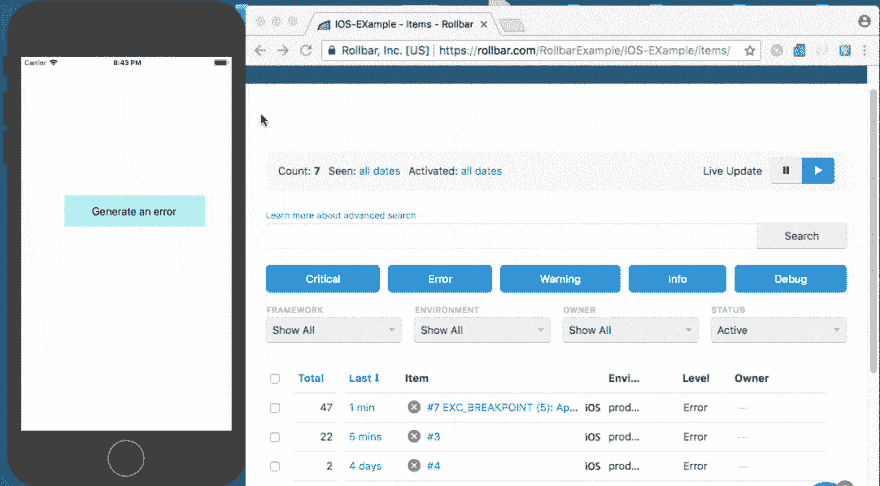
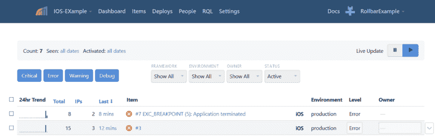
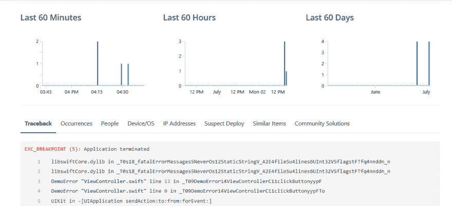

# iOS 中的错误监控

> 原文：<https://dev.to/mostlyjason/error-monitoring-in-ios-2ddi>

在移动应用中，监控错误很重要，这样你就可以了解用户的体验。当应用程序本身或后端服务出现问题时，你的团队应该很快知道，这样你就可以在更多客户受到影响之前解决问题。我们将向您展示如何处理 iOS 应用程序中的错误。然后，我们将向您展示[滚动条错误监控](https://rollbar.com/error-tracking/ios/)如何让您更好地了解错误，并帮助您更快地排除故障。

## [T1】iOS 中的原生错误处理](#native-error-handling-in-ios)

在 [Objective-C](https://developer.apple.com/library/archive/documentation/Cocoa/Conceptual/ProgrammingWithObjectiveC/ErrorHandling/ErrorHandling.html) 和 [Swift](https://docs.swift.org/swift-book/LanguageGuide/ErrorHandling.html) 中有多种方式实现异常处理。由于 Swift 是一种较新的语言，我们将在示例中重点关注它。您通常会使用 NSError 来创建运行时错误，并使用 do-catch 语句来处理它们:

```
do {
  throw NSError(domain: "my error description", code: 42, userInfo: ["ui1":12, "ui2":"val2"] )
} catch let error as NSError {
  // handle the error
  print("Caught NSError: \(error.localizedDescription), \(error.domain), \(error.code)")
} 
```

Enter fullscreen mode Exit fullscreen mode

Swift 还提供了处理未捕获异常的机制。这允许您跟踪错误、向用户显示消息或尝试恢复。请参见下面的示例。

```
NSSetUncaughtExceptionHandler { exception in
  // handle the error
  print("Uncaught exception", exception)
} 
```

Enter fullscreen mode Exit fullscreen mode

这让您可以在开发过程中轻松跟踪日志中的错误。然而，一旦应用程序安装到客户的手机上，它就不能提供一种简单的方法来跟踪错误。

## 用滚动条进行错误监控

滚动条提供了一种简单的方法来跟踪应用程序中的异常和错误。它自动捕捉应用程序中任何地方出现的错误，并实时报告它们。它自动对错误进行分组以便快速汇总，在 web 和服务器端提供完整的堆栈监控，以及人员跟踪，以便您可以对影响大多数人的错误进行优先排序。这些好处有助于开发人员快速识别和修复错误。

下面，你可以看到我们已经创建了一个[示例应用程序](https://github.com/RollbarExample/Rollbar-Ios-Example)，当用户点击一个按钮时它会触发一个异常。Rollbar 跟踪错误信息，并包括一个堆栈跟踪，您可以在其中看到导致错误的代码行。它还提供了大量的其他上下文信息来帮助您区分错误的优先级并更快地找到根本原因。

[T2】](https://res.cloudinary.com/practicaldev/image/fetch/s--fHtyAkVb--/c_limit%2Cf_auto%2Cfl_progressive%2Cq_66%2Cw_880/https://thepracticaldev.s3.amazonaws.com/i/vabcuoltnnifas4sjz5k.gif)

## 如何在滚动条上设置 iOS 项目

1.  访问 https://rollbar.com，如果你还没有注册账户，就注册吧。接下来，创建您的项目，并从通知列表中选择 Other。选择为您生成的客户端访问令牌。在下面的步骤中，您将需要它来配置 Rollbar。

2.  要在您的项目中安装 iOS SDK，请使用以下方法。你可以在[滚动条 iOS 文档](https://docs.rollbar.com/docs/ios)中了解更多信息。

**带椰子的**

在您的 pod 文件中添加滚动条 iOS SDK 并运行 pod 安装。您可以在项目中的 pods 目录下找到 pod。

```
pod "Rollbar", "~> 1.0.0" 
```

Enter fullscreen mode Exit fullscreen mode

确保在你的 Podfile 的顶部声明你的平台为 iOS:

```
platform :ios, '7.0' 
```

Enter fullscreen mode Exit fullscreen mode

**没有椰子**

1.  下载滚动条框架。
    请注意，根据您用来构建应用程序的 Xcode 版本，如果您启用了位代码，您可能需要下载不同版本的框架。这是因为它处理位代码序列化的方式。在[发布页面](https://github.com/rollbar/rollbar-ios/releases)上的最新版本应该有一个 Xcode 最新版本的 zip 文件。

2.  将 zip 文件中的滚动条目录解压到 Xcode 项目目录中。

3.  在 Xcode 中，选择*文件* - > *将文件添加到【您的项目名称】*，从步骤 2 中选择滚动条目录。
    注意:如果第 3 步不起作用，你还可以在任何地方提取滚动条目录并拖动。框架文件到 Xcode 中，允许 Xcode 正确配置框架。

4.  在库构建阶段，将 libc++库添加到链接二进制文件中。

5.  确保`-ObjC`在您的“其他链接器标志”设置中。注意，不推荐使用`-all_load flag`,但是如果你已经有了它，它也可以用于这个目的。

## 在代码中添加滚动条

1.  在桥接头文件中添加滚动条。如果没有桥接头文件，正确配置它的最简单方法是添加一个空的 objective-c(例如 dummy.m)文件。当您这样做时，Xcode 将提示您创建一个桥接头文件，并将配置您的构建环境，以便在您的所有 Swift 文件中自动包含这些头文件。创建桥接头文件后，您可以删除 objective-c 文件。

```
#import <Rollbar/Rollbar.h> 
```

Enter fullscreen mode Exit fullscreen mode

1.  在`AppDelegate`类中配置滚动条。你可以在项目中的模型目录下找到`AppDelegate`。

```
func application(_ application: UIApplication, didFinishLaunchingWithOptions   launchOptions: [UIApplicationLaunchOptionsKey: Any]?) -> Bool {
        // Override point for customization after application launch.
  let config: RollbarConfiguration = RollbarConfiguration()
  config.environment = "production"
  Rollbar.initWithAccessToken("ACCESS-TOKEN", configuration: config)
  return true
} 
```

Enter fullscreen mode Exit fullscreen mode

## 上传调试符号到滚动条

最后，您需要将 dSYM 文件上传到滚动条，这样它可以向您显示生成错误的源代码。要在发布模式下构建应用程序时自动将 dSYM 文件发送到滚动条，请在 Xcode 中向目标添加一个新的构建阶段:

1.  点击你的项目，然后选择“构建阶段”

2.  在顶部菜单栏中，单击“编辑器”，然后单击“添加构建阶段”，然后单击“添加运行脚本构建阶段”

3.  把“壳”改成`/usr/bin/python`。

4.  使用“粘贴并保留格式”(编辑- >粘贴并保留格式)，将下面 [upload_dysm.py](https://raw.githubusercontent.com/rollbar/rollbar-ios/master/upload_dsym.py) 脚本的内容粘贴到框中。

```
"""
Python script that zips and uploads a dSYM file package to Rollbar
during an iOS app's build process.

For instructions on setting up this script for your app in Xcode, see
the README at https://github.com/rollbar/rollbar-ios/blob/master/README.md.
"""

import os
import subprocess
import zipfile

if (os.environ['DEBUG_INFORMATION_FORMAT'] != 'dwarf-with-dsym' or
        os.environ['EFFECTIVE_PLATFORM_NAME'] == '-iphonesimulator'):
    exit(0)

ACCESS_TOKEN = 'POST_SERVER_ITEM_ACCESS_TOKEN'

dsym_file_path = os.path.join(os.environ['DWARF_DSYM_FOLDER_PATH'],
                              os.environ['DWARF_DSYM_FILE_NAME'])
zip_location = '%s.zip' % (dsym_file_path)

os.chdir(os.environ['DWARF_DSYM_FOLDER_PATH'])
with zipfile.ZipFile(zip_location, 'w', zipfile.ZIP_DEFLATED) as zipf:
    for root, dirs, files in os.walk(os.environ['DWARF_DSYM_FILE_NAME']):
        zipf.write(root)

        for f in files:
            zipf.write(os.path.join(root, f))

# You may need to change the following path to match your application
# settings and Xcode version plist_command = '/usr/libexec/PlistBuddy -c "Print :CFBundleVersion" "%s"'
p = subprocess.Popen(plist_command % os.environ['PRODUCT_SETTINGS_PATH'],
                     stdout=subprocess.PIPE, shell=True)
stdout, stderr = p.communicate()
version = stdout.strip()

curl_command = ('curl -X POST "https://api.rollbar.com/api/1/dsym" '
                '-F access_token=%s -F version=%s -F bundle_identifier="%s" '
                '-F dsym=@"%s"')
p = subprocess.Popen(curl_command % (ACCESS_TOKEN, version,
                     os.environ['PRODUCT_BUNDLE_IDENTIFIER'], zip_location),
                     shell=True)
p.communicate() 
```

Enter fullscreen mode Exit fullscreen mode

**注意:**确保在滚动条中用项目的服务器范围访问令牌替换`POST_SERVER_ITEM_ACCESS_TOKEN`。

## 用一个 iOS 应用实例测试滚动条

为了测试它的工作情况，创建一个会产生错误消息的控制器。在下面的示例中，您可以通过单击“生成错误”按钮来生成错误。在 GitHub 上下载我们的[开源示例](https://github.com/RollbarExample/Rollbar-Ios-Example)自己试试吧。

```
import UIKit
import Rollbar

class ViewController: UIViewController {
  var test: String!  // Nil variable declare.
  // Generate an error button which will show in the UI. While clicking on, this method will call and generate nil reference error.

  @IBAction func clickButton(_ sender: Any) {
    test.append("ab")  // Generating Nil reference exception due to null reference
  }

  override func viewDidLoad() {
    super.viewDidLoad()
  }

  override func didReceiveMemoryWarning() {
    super.didReceiveMemoryWarning()
  }

} 
```

Enter fullscreen mode Exit fullscreen mode

## 查看滚动条中的错误

打开滚动条，查看这些错误在您帐户的项目页面中的样子。您刚刚生成的错误应该标题为“应用程序终止”

[T2】](https://res.cloudinary.com/practicaldev/image/fetch/s--1UduD-3w--/c_limit%2Cf_auto%2Cfl_progressive%2Cq_auto%2Cw_880/https://thepracticaldev.s3.amazonaws.com/i/ovibs7026nhtfn104f6f.png)

通过单击项目获取更多详细信息。现在可以看到一个回溯，显示了产生错误的确切的源代码文件、方法和行号。在本例中，错误是在 ViewController.swift 的第 13 行生成的。

[T2】](https://res.cloudinary.com/practicaldev/image/fetch/s--3TdvWSN0--/c_limit%2Cf_auto%2Cfl_progressive%2Cq_auto%2Cw_880/https://thepracticaldev.s3.amazonaws.com/i/32amol8dtxl4hjtdaerw.png)

在整个应用程序中跟踪错误非常容易。设置 Rollbar 只需要几分钟，将来您将有更多的上下文来更快地跟踪和调试问题。您将立即知道错误，这样您的用户就可以按照预期的方式体验您的应用程序。了解更多关于 iOS 的[滚动条功能。](https://rollbar.com/error-tracking/ios/)