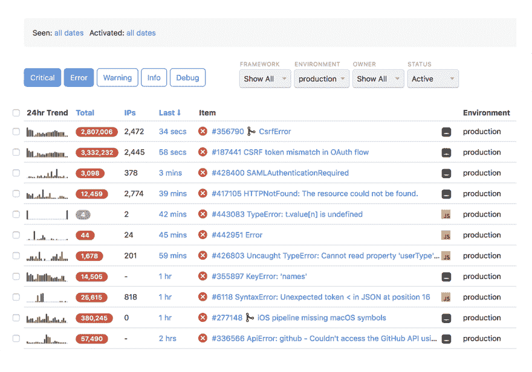
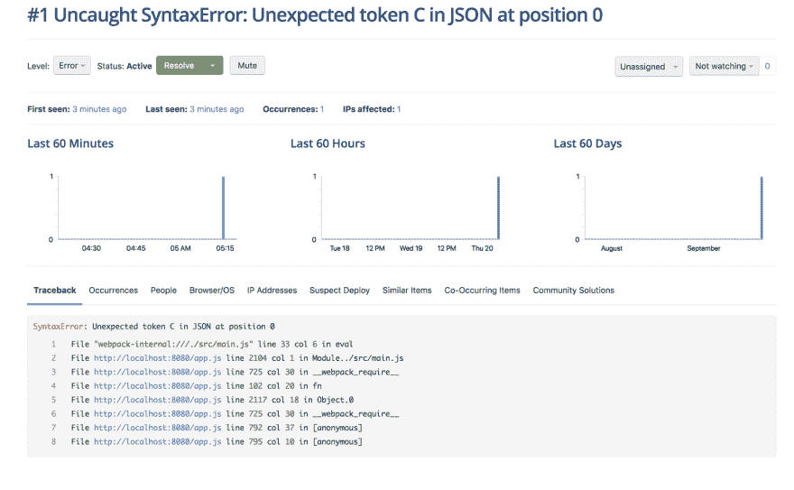

# 使用滚动条在 VueJS 中跟踪错误

> 原文：<https://dev.to/olumytee/error-tracking-in-vuejs-with-rollbar-c6g>

所以，你刚刚部署了你的杀手级应用程序，花了大量的精力来构建它，出于前瞻性的考虑，你决定使用 Vue JS，以便让你的用户在使用你的应用程序时有一个平滑无缝的体验。您广泛地测试了您的应用程序，并且对它的性能非常有信心，但是因为您知道用户将会从各种各样的浏览器和设备与您的应用程序进行交互，所以您需要一种方法来跟踪错误，在用户联系您之前看到他们看到了什么。

幸运的是，Vue JS 提供了一个全局错误处理程序，你可以用它来捕捉你的应用程序中任何地方抛出的所有未被捕获的异常。可以这样设置:

```
 // main.js
    Vue.config.errorHandler = function (err, vm, info) {
      // handle error
      // or log error
    }; 
```

Enter fullscreen mode Exit fullscreen mode

对于一个基本的应用程序，添加如上面代码片段所示的几行代码可能足以帮助您捕捉和处理异常，这样您的应用程序就不会意外崩溃并破坏您的用户体验。

然而，跨不同设备、浏览器和网络条件的许多用户使用的应用程序需要更精确的错误处理。这就是像 Sentry 和 Rollbar 这样的服务有用的地方。

我特别喜欢滚动条，因为它提供了对错误的实时可见性，以及相应的堆栈跟踪和您需要调试的所有数据，包括请求参数、浏览器、IP 以及通过 Slack 和电子邮件的实时通知，以便我们可以在错误发生时立即修复错误。

[T2】](https://res.cloudinary.com/practicaldev/image/fetch/s--fOAY72FB--/c_limit%2Cf_auto%2Cfl_progressive%2Cq_auto%2Cw_880/https://thepracticaldev.s3.amazonaws.com/i/wirluyun6x6b3649zdh0.png)

滚动条提供了一个 JavaScript SDK，你可以手动将它包含在你的应用程序中，但是如果你使用官方的`vue-rollbar`插件，将滚动条添加到你的应用程序中就更加简单了，只需通过从 npm 安装将该包包含在你的项目中即可。

```
yarn add vue-rollbar 
```

Enter fullscreen mode Exit fullscreen mode

然后在项目的主入口点导入并初始化 vue-rollbar，用自己的令牌替换`accessToken`。

```
 // main.js

import Vue from 'vue';
import Rollbar from 'vue-rollbar';
import App from './App.vue';

Vue.use(Rollbar, {
  accessToken: 'post_client_item_token_secret',
  captureUncaught: true,
  captureUnhandledRejections: true,
  enabled: true,
  environment: 'production',
  payload: {
    client: {
      javascript: {
        code_version: 'version-1',
      },
    },
  },
});

new Vue({
  render: h => h(App),
}).$mount('#app'); 
```

Enter fullscreen mode Exit fullscreen mode

继续，在 Vue 初始化之前添加下面一行来强制出错。

```
// main.js
JSON.parse('invalid json string');

new Vue({
  render: h => h(App),
}).$mount('#app'); 
```

Enter fullscreen mode Exit fullscreen mode

如果一切顺利，这个错误应该会出现在你的滚动条仪表板上，如下所示。

[T2】](https://res.cloudinary.com/practicaldev/image/fetch/s--fOAY72FB--/c_limit%2Cf_auto%2Cfl_progressive%2Cq_auto%2Cw_880/https://thepracticaldev.s3.amazonaws.com/i/wirluyun6x6b3649zdh0.png)

单击错误进行深入查看，并获得有关该特定错误的更多信息，如浏览器版本、设备操作系统和完整的堆栈跟踪，以便您可以轻松找到并修复问题。

[T2】](https://res.cloudinary.com/practicaldev/image/fetch/s--ginn-u7W--/c_limit%2Cf_auto%2Cfl_progressive%2Cq_auto%2Cw_880/https://thepracticaldev.s3.amazonaws.com/i/ryx93beroyfq03olu0hc.png)

您还可以使用`vue-rollbar`跟踪您已经在应用中妥善处理的错误，因为它公开了一个调试函数，您可以在应用中的任何地方手动调用该函数，例如:

```
 <template>
  <div id="app">
    
    <HelloWorld msg="Welcome to Your Vue.js App"/>
  </div>
</template>

<script>
import HelloWorld from './components/HelloWorld.vue';

export default {
  name: 'app',
  components: {
    HelloWorld,
  },
  mounted() {
    try {
      JSON.parse('Can not parse');
    } catch (error) {
      this.rollbar.debug(error);
    }
  },
};
</script> 
```

Enter fullscreen mode Exit fullscreen mode

如果您缩小您的 JavaScript 代码以用于生产，您需要为您的 JavaScript 文件上传相应的源映射，以便 Rollbar 可以理解您的代码并显示有意义的堆栈跟踪。

通常，上传源地图需要我们登录滚动条仪表盘，手动上传我们的源地图或向滚动条发送 POST 请求，但由于我们使用 webpack，我们可以使用`rollbar-sourcemap-webpack-plugin`
自动完成这项工作

```
yarn add rollbar-sourcemap-webpack-plugin -D 
```

Enter fullscreen mode Exit fullscreen mode

并将其添加到 webpack 配置文件
的插件块中

```
 // vue.config.js

import RollbarSourceMapPlugin from 'rollbar-sourcemap-webpack-plugin';

module.exports = {
  configureWebpack: {
    plugins: [
      new RollbarSourceMapPlugin({
        accessToken: 'post_server_item_token',
        version: 'version-1',
        publicPath: 'https://mywebsite.com'
      })
    ]
  }
} 
```

Enter fullscreen mode Exit fullscreen mode

现在，每次您构建应用程序时，源地图都会自动上传到滚动条，并且部署后发生的任何错误都会被捕获并报告给滚动条，同时提供适当的堆栈跟踪。

您将能够在错误发生时看到它们，它们发生的频率，以及要调试和修复的附加信息。