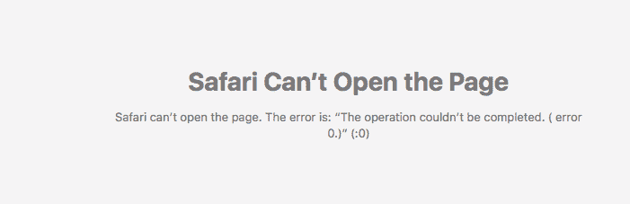

# github OAuth 出错

> 原文：<https://dev.to/ncminh/error-with-github-oauth-4ko5>

我已经登录了我的 Github 帐户，并记住了电脑的 Safari 钥匙串中的密码。当我用我的 Github 帐户登录 dev.to 时，钥匙串填充了我的帐户和密码，并显示了错误，如附件所示。也许在 OAuth 授权后，页面重定向会出现一些问题。这是我和 dev.to 的第一次经历！ ^

[T2】](https://res.cloudinary.com/practicaldev/image/fetch/s--t3THkr4g--/c_limit%2Cf_auto%2Cfl_progressive%2Cq_auto%2Cw_880/https://thepracticaldev.s3.amazonaws.com/i/kohvhmgavyu12dndq47s.png)