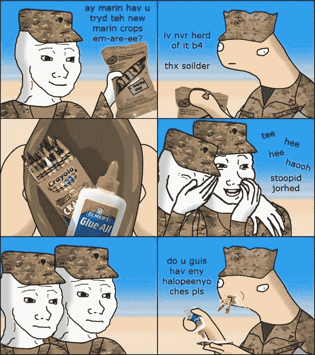

# ES6 用蜡笔破坏

> 原文：<https://dev.to/muddybootscode/es6-destructuring-with-crayons-1pip>

最近，为了成为一名更好的开发人员，我开始了一个导师项目。在我的日常工作中，我主要关注 Python，但我喜欢尝试掌握其他语言，所以我也花时间从事 Express.js、Node.js 和 React.js 项目。我是第一批 Udacity React 纳米学位课程的学员之一，虽然我通过了这个项目并获得了纳米学位，但这主要是因为我努力学习并理解了这些概念。长话短说，我读完了，但还远远没有掌握内容。

这门课讲过的核心概念之一是 ES6 析构，特别是 spread 和 rest 操作，但我在第一遍没有真正领会。凭借对概念的粗略理解和 Udacity 分配给我的导师的大量帮助，我勉强完成了课程的 Redux 部分。从那以后，我对这个概念有了很好的理解，作为一名前海军陆战队员，我决定用真正的锅盖头风格来分解它。

[T2】](https://res.cloudinary.com/practicaldev/image/fetch/s--ZF-v5eiQ--/c_limit%2Cf_auto%2Cfl_progressive%2Cq_auto%2Cw_880/https://thepracticaldev.s3.amazonaws.com/i/hxlmn92ggh9vwwmd8fa1.jpg)

如果你不明白这个笑话，或者不明白这个引用足以说明当海军互相取笑或者其他分支取笑的时候，我们基本上被认为足够愚蠢，认为吃蜡笔和胶水是我们做的事情。现在，我已经离开海军陆战队近 20 年了，但我仍然认为自己是一名海军陆战队队员，当我真的想确保我理解了一些事情时，我会尝试为自己和他人以“蜡笔”的方式分解它。因此，为了与一个概念的真正的蜡笔分解保持一致，下面是我如何理解其余和传播操作的概念的。

对于我的例子，我将使用一个 Javascript 对象来表示一盒蜡笔。

```
const boxOfCrayons = {
 yellow: "yellow",
   blue:  "blue",
   red:   "Red"
} 
```

Enter fullscreen mode Exit fullscreen mode

假设我们对蜡笔超级满意，只是画小太阳、水池和红房子，但过了一段时间后，我们厌倦了一遍又一遍地画基本的东西，我们希望我们的画多一点变化，或者如果我们是海军陆战队，我们希望我们的时间消耗更多。这就是价差的来源。为了制作一个新的物体，我们展开蜡笔，添加新的物体:

```
const biggerBoxOfCrayons = { ...boxOfCrayons,
                purple: "purple",
                green:  "green",
                orange: "orange"
               } 
```

Enter fullscreen mode Exit fullscreen mode

这复制了我们原来盒子里的所有物品，将新的彩色物品添加到我们的盒子里，现在我们有了一个更大的蜡笔盒，可以在我们的艺术项目中使用，或者为我们的烹饪工作添加适量的新蜡。然而，我们可能是纯粹主义者。我们只喜欢吃黄色和蓝色的蜡笔。其余的只是过于复杂，淹没了我们的基本托盘。所以我们销毁了大盒蜡笔:

```
const { blue, yellow, red, purple, green, orange } = biggerBoxOfCrayons 
```

Enter fullscreen mode Exit fullscreen mode

然后做一个更小的盒子，一个纯盒子:

```
const pureBox = { blue, yellow } 
```

Enter fullscreen mode Exit fullscreen mode

现在，我们有了一盒最美味的蜡笔。但是如果我们更有冒险精神呢？如果我们喜欢除了那些以外的所有蜡笔呢？好吧，这就是休息的地方。

毫不夸张地说，Rest 操作给出了对象的其余部分。在这种情况下，如果我们不想要黄色和蓝色的蜡笔，我们只想要剩下的，我们所要做的就是把它们从我们的大盒子里拿出来，就像这样。

```
const { blue, yellow, ...keepers } = biggerBoxOfCrayons 
```

Enter fullscreen mode Exit fullscreen mode

我们拿出蜡笔盒，指定我们不想要的颜色，然后简单地把我们想要的颜色标记为保留色或其他颜色！然后我们制作新的美味盒子:

```
const newDeliciousbox = {...keepers} 
```

Enter fullscreen mode Exit fullscreen mode

这是最简单的方式，这个蜡笔大嚼，胶水 swilling 前锅盖头可以找出如何打破如何使用扩展和休息在 ES6。感谢您花时间阅读它。愿你的蜡笔永远新鲜，你的胶水永远是埃尔默的。