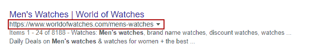
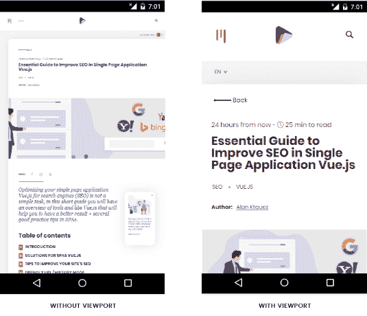
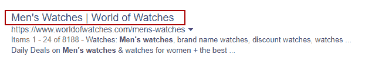
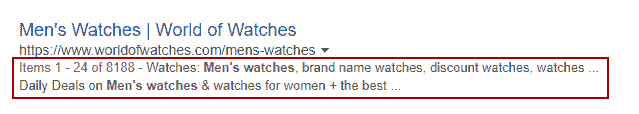
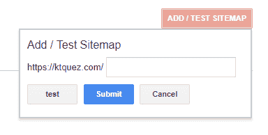
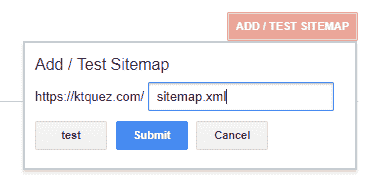
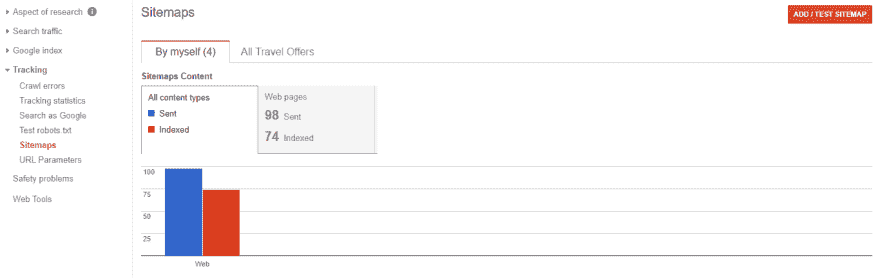

# 提高单页应用程序中 SEO 的基本指南 Vue.js

> 原文：<https://dev.to/ktquez/essential-guide-to-improve-seo-in-single-page-application-vuejs-96j>

## 简介

SEO(搜索引擎优化)是为搜索引擎优化您的网站的实践，提高其排名，带来更好的质量和增加的流量，从而为网站带来更多的可见性。

创建网站时，我们应该问的第一个问题是:

### 我要怎么做才能让我的网站在谷歌上看起来更好？

任何目前希望在这个竞争激烈的搜索引擎世界中生存下来的企业都应该考虑标记“搜索引擎结果页”(SERPs)的最佳实践和技术，就像在 Google、Bing、Yahoo！，问，还有其他人。

你不需要成为一个 SEO 专家来更好地定位你自己，但是你的定位将取决于一些好的实践，你的应用程序如何运行以及它在结果中意味着什么。

例如，单页面应用程序(SPA)是一种复杂的情况，因为只有一个页面`index.html`，当加载时，它将使用 JavaScript 编写，既有普通的，也有某些框架编写的。

当前的搜索引擎非常关心你的网站的每个页面的内容，通过他们的爬虫自动扫描。因为在 SPAs 中，内容在被请求时没有组织或结构化，所以当 JavaScript 呈现发生时，爬虫不能获得与用户在浏览器中看到的一样的内容。

在 SPAs 繁荣之前，谷歌(主引擎)通过它通过 <abbr title="HyperText Transfer Protocol">HTTP</abbr> 接收的内容进行分析，然而，由于这种需求，谷歌开发了一种等待 JavaScript 渲染的方法，以便能够收集最终结果。然而，从经验来看，你并不总是成功地正确索引，从而成为一个善变的赌注。

如果你想看看谷歌页面渲染是如何工作的，去下面的链接:
[https://www.google.com/webmasters/tools/googlebot-fetch](https://www.google.com/webmasters/tools/googlebot-fetch)

## 针对 SPAs Vue 的解决方案。射流研究…

### SSR(服务器端渲染)

在服务器端呈现(SSR)的上下文中，顾名思义，呈现是在服务器上完成的，那么搜索引擎爬虫在请求您的站点时将能够完全识别文档中的信息以进行读取和索引。

它非常适合需要 SEO 的动态项目，也非常适合那些寻求在社交网络中展示其内容以供用户共享的项目。

我写了一篇关于这个主题的文章(你可以查看[这个链接](https://ktquez.com/en/posts/when-to-use-server-side-rendering-ssr-in-vuejs-projects.html))，在这篇文章中，你可以更深入地了解使用服务器端渲染的好处，并对 [Nuxt.js](https://nuxtjs.org/) 有所了解，这无疑是解决 [Vue.js](https://vuejs.org/) 的通用应用的最佳工具。

### [预渲染](#prerender)

既然您现在知道了什么是服务器端渲染，那么在某些使用 Vue.js 的 spa 中，这种实现有时可能看起来有些过头。这可能是因为项目的类型或者缺少部署服务器的结构，以及其他一些业务规则。

这个特性有一个解决方案，你不需要服务器基础设施，我说的是一个使用 webpack 的预渲染插件，称为 [Prerender SPA 插件](https://github.com/chrisvfritz/prerender-spa-plugin)(由 Vue.js 的主要成员之一 [Chris Fritz](https://twitter.com/chrisvfritz) 创建)，这个插件不仅可以与 Vue.js 一起工作，还可以与 JavaScript vanilla 或更当前的框架一起工作。

它的作用是渲染你的页面(你通知你想要渲染的路径)并将它们转换成静态文档(HTML)，使内容完全可用，帮助阅读和索引。

### 静态站点

最近，Evan 发布了一款名为 [Vuepress](https://vuepress.vuejs.org/) 的静态站点生成工具。一个静态的网站并不新鲜，它只是网络从一开始就有的东西，每一页都是一个 HTML 文档，为所有的访问者显示相同的信息。

要在 Vuepress 中创建页面，我们可以使用 Markdown，甚至使用 Vue 组件，动态生成静态 HTML 站点，带来 SEO、性能和用户体验的所有好处，而不会在加载脚本后很快失去作为 SPA 的功能。

Vuepress 处于初始状态，有文档支持，尤其是默认的 doc 主题。所以如果你喜欢这个模板，你可以在几分钟内创建自己的模板。

博客支持是创建者想要的，因为它将是需要使用和发展工具的地方，但它仍然没有在核心层得到支持。

因为 Vuepress 是 Vue.js，而 Vue.js 的天空是无限的，所以可以将其改编并转化为博客、机构网站、登录页面等。这个博客是用 Vuepress 开发的，任何开发者都可以使用。只需克隆已经带有一些现成设置的样板文件[vue press-theme-ktquez-starter](https://github.com/ktquez/vuepress-theme-ktquez-starter)，你就可以将其用作你的博客工作人员或用于研究。

## 提高网站 SEO 的技巧

## 友好的网址/历史模式

URL(标准资源定位符或简单的网址)对我们这些普通人来说是可读的，并且被设计来代替数字 <abbr title="Internet Protocol">IP</abbr> (互联网协议)，除了在互联网上定位网页之外，它还规定了如何通过已知的协议来检索该特征，例如 <abbr title="Hypertext Transfer Protocol">HTTP</abbr> 、 <abbr title="Hypertext Transfer Protocol Secure">HTTPS</abbr> 、 <abbr title="File Transfer Protocol">FTP</abbr> 等等。

在 SPAs 开始的时候(主要是 Angular 1+出现的时候),经常可以看到使用 hashbang(！)，在[Vue-Router](https://router.vuejs.org/)(Vue . js 的主路由器)默认模式下启用`hash` (#)模拟一个(URL)，导致页面无法重新加载。

```
https://domain.com/#/about/ 
```

Enter fullscreen mode Exit fullscreen mode

哈希模式旨在解决浏览器中的兼容性问题。然而，现代浏览器已经支持 HTML5 历史 API。

在 VueRouter 中，我们可以将模式更改为`history`，去掉哈希(#)，并利用 HTML5 历史 API 提供的导航功能，使 URL 更加用户友好。

```
const router = new VueRouter({
  mode: 'history',
  routes: [...]
}) 
```

Enter fullscreen mode Exit fullscreen mode

结果:

```
https://domain.com/about/ 
```

Enter fullscreen mode Exit fullscreen mode

> 注意:当使用 mode: history 时，您需要在主机或 web 服务器中将所有路由定向到其 index.html，以避免用户访问特定路由时出现错误 404。

您可以通过[此链接](https://router.vuejs.org/guide/essentials/history-mode.html)使用全功能 vue-router 查看离开 Vue.js SPA 所需的设置。(有任何问题，放在评论里我会尽可能帮助)。

### 为什么友好的网址对 SEO 有好处？

首先，当 URL 在语义上被很好地制作时，它改善了用户体验并促进了对搜索引擎的理解。

[T2】](https://res.cloudinary.com/practicaldev/image/fetch/s--IsIw8jPi--/c_limit%2Cf_auto%2Cfl_progressive%2Cq_auto%2Cw_880/https://thepracticaldev.s3.amazonaws.com/i/d8ot7d47ruyyud5644ba.png)

看到明确定义的 URL 的用户将知道，不需要标题，将在页面上找到什么。当以`men's watch`的形式搜索术语时，`keyword focus`会在结果中出现得更多，因为它出现在标题、描述和链接中。

URL 不是一个很强的排名因素，然而，在某些场合使用关键字可能是有益的，但不要不顾一切地在 URL 中放置关键字，让你的可读性受到影响。

## 元数据(头标记)

### Viewport

通过控制页面的大小和缩放比例，指定预览窗口的行为方式可以改善用户在移动设备上的体验。

例如:

```
<meta name="viewport" content="width=device-width, initial-scale=1"> 
```

Enter fullscreen mode Exit fullscreen mode

*   **width=device-width** :与设备无关的屏幕宽度；
*   **initial-scale=1** :我们在 CSS 像素和独立像素之间建立了 1: 1 的关系，不禁用页面的大小调整和缩放；

有和没有视口的区别:

[T2】](https://res.cloudinary.com/practicaldev/image/fetch/s--6Z4uy3SK--/c_limit%2Cf_auto%2Cfl_progressive%2Cq_auto%2Cw_880/https://thepracticaldev.s3.amazonaws.com/i/2lyni42a80cni751qam2.png)

### 页面的标题(标签标题)

标题是 SERPs(搜索引擎结果页面)中最臭名昭著的部分，对用户来说，它无疑是最重要和可见的部分之一，它们必须有简短、简洁的描述，是页面特定的，足够吸引用户选择他的页面而不是其他页面。

在 Vue.js 中，你有一些完整的解决方案，比如( [vue-meta](https://github.com/declandewet/vue-meta) 和 [vue-head](https://github.com/ktquez/vue-head) )来改变 meta 标签，因此，你的网站在 SEO 方面的改进不仅限于标题。

使用`vue-head`的使用示例

```
export default {
  name: 'MyViewComponent',
  head: {
    title: {
      inner: `Men's Watches`,
      separator: '|',
      complement: 'World of Watches'
    }
 ... 
```

Enter fullscreen mode Exit fullscreen mode

使用`vue-meta`的使用示例

```
export default {
  name: 'MyViewComponent',
  metaInfo: {
      title: `Men's Watches`,
      titleTemplate: '%s | World of Watches', 
 ... 
```

Enter fullscreen mode Exit fullscreen mode

结果:

```
Men's Watches | World of Watches 
```

Enter fullscreen mode Exit fullscreen mode

[T2】](https://res.cloudinary.com/practicaldev/image/fetch/s--RAUmy_1F--/c_limit%2Cf_auto%2Cfl_progressive%2Cq_auto%2Cw_880/https://thepracticaldev.s3.amazonaws.com/i/lm3pg7v1t97m05i9479h.png)

**优化页面标题的技巧:**

*   您的标题大小应包含 50 到 60 个字符；
*   创造一个能激起人们点击欲望的标题；
*   在标题中插入关键字 focus

### 描述(元描述)

元描述几乎是你不能错过的元标签，它可以提供一个关于特定页面的连贯和有吸引力的摘要。它存在于 SERPs 中，是非常小且非常有价值的文本片段，有助于增加你网站的流量并增加 **CTR** (点击率)。

使用 vue 头的功能示例:

```
export default {
  name: 'MyViewComponent',
  head: {
    …
    meta: [
       { name: 'description', content: `Watches: Men's watches, brand name watches, discount watches, watches on sale, mens watch brands and ladies watches. Daily Deals on Men's watches &amp; watches for women + the best service guarantee.` }
    ]
 ... 
```

Enter fullscreen mode Exit fullscreen mode

[T2】](https://res.cloudinary.com/practicaldev/image/fetch/s--Ee5t3Jz4--/c_limit%2Cf_auto%2Cfl_progressive%2Cq_auto%2Cw_880/https://thepracticaldev.s3.amazonaws.com/i/jh79kwuueibodhoelu9s.png)

优化页面描述的技巧:

*   您的描述不能超过 160 个字符。我能给你的一个建议是，永远保持你的描述在 150 到 155 之间。您可以在图像中检查发布日期是否是描述的一部分；
*   要精准一致！不要让你的用户怀疑你的页面真正的意思，点击率非常重要；
*   根据你所在的市场，使用能够吸引用户的词语，比如“免费送货”、“免费课程”、“优惠”等等；
*   通常，社交网络使用描述和标题来形成他们的分享片段，如果你想以更个性化的方式对待你的社交网络用户，你可以使用元标签([开放图标记](https://developers.facebook.com/docs/sharing/webmasters)和[推特标记](https://developer.twitter.com/en/docs/tweets/optimize-with-cards/overview/markup.html)

### 规范标签

声明了如何使用 it `rel=canonical`来精确定义搜索引擎上索引的首选 URL。当我们使用它时，可以避免相同内容(重复)的问题。

当搜索引擎抓取多个内容非常相似的 URL 时，就会出现重复内容，导致多个 SEO 问题，大规模重复，会大大稀释你在 SERPs 中的排名。

理解重复内容的一个例子发生在 Vue.js SPA 在哈希模式下使用 VueRouter 而不使用 canonical:

```
https://mydomain.com/#/about/ 
```

Enter fullscreen mode Exit fullscreen mode

使爬网程序丢弃#后面的所有内容，并将余数用作参数:

```
https://mydomain.com/?_escaped_fragment_=about 
```

Enter fullscreen mode Exit fullscreen mode

这可能会产生重复的内容(所以我建议使用我们之前讨论过的模式:历史)，还建议使用规范链接来确保爬虫确切地知道官方 URL 是什么。

```
<link rel='canonical' href='https://mydomain.com/#/about/' /> 
```

Enter fullscreen mode Exit fullscreen mode

另一个例子，已经在历史模式的 URL，将是分页的使用。

```
https://mydomain.com/posts?page=2 
```

Enter fullscreen mode Exit fullscreen mode

如果您需要对页面进行索引，强烈建议您对每个分页页面使用 rel=canonical。嗯，如果不通知，爬虫会认为这个(URL) `https://mydomain.com/posts`等于那个`https://mydomain.com/posts?page=2`，但两者是不一样的。为了解决这个问题，我们可以使用 rel=canonical 创建一个自引用页面。

网址([https://mydomain.com/posts](https://mydomain.com/posts))

```
<link rel='canonical' href='https://mydomain.com/posts/' /> 
```

Enter fullscreen mode Exit fullscreen mode

网址([https://mydomain.com/posts?page=2](https://mydomain.com/posts?page=2))

```
<link rel='canonical' href='https://mydomain.com/posts/?page=2' /> 
```

Enter fullscreen mode Exit fullscreen mode

但是，如果您不想索引分页，对页面参数的所有更改都会保留相同的 rel=canonical `https://mydomain.com/posts`，告诉 Google 即使您更改了参数，也总是希望这个(URL)是首选的。

如何在 vue-head 中使用 rel=canonical 设置链接标签的示例:

```
export default {
  name: 'MyViewComponent',
  head: {
    …
    link: [
      { rel: 'canonical', href: 'https://mydomain.com/posts' }
    ]
 ... 
```

Enter fullscreen mode Exit fullscreen mode

这个主题和本文中提到的大多数主题一样，应该有一篇单独的文章，但是您可以通过 [Google support](https://support.google.com/webmasters/answer/139066) 了解更多关于规范 URL 的信息。

## Sitemap.xml

它是一个 XML 文件(可扩展标记语言),用来详细描述你的站点的所有 URL，对于单页应用程序来说非常重要，帮助机制知道你的应用程序的所有路径。

其结构举例:(由[sitemap.org](https://www.sitemaps.org/protocol.html))

```
<?xml version="1.0" encoding="UTF-8"?>
<urlset xmlns="http://www.sitemaps.org/schemas/sitemap/0.9">
   <url>
      <loc>http://www.example.com/</loc>
      <lastmod>2005-01-01</lastmod>
      <changefreq>monthly</changefreq>
      <priority>0.8</priority>
   </url>
</urlset> 
```

Enter fullscreen mode Exit fullscreen mode

Vue 和 Nuxt 有自动的 sitemap.xml 生成器:

*   [vue-router-sitemap](https://github.com/40818419/vue-router-sitemap) :通过 vue-router 配置生成 sitemap.xml
*   [sitemap-Module](https://github.com/nuxt-community/sitemap-module):nuxt . js 的 Sitemap 模块；

创建自己的 sitemap.xml 并能够手动指定你认为哪些链接与 Google 相关并不太复杂，比如 Ktquez Play [sitemap.xml](https://ktquez.com/sitemaps/sitemap_pt-br.xml) 。

要创建一个完美的网站地图，你可以通过[sitemap.org](https://www.sitemaps.org/protocol.html)更深入，我在那里学到了很多。

Sitemap.xml 可以通过[谷歌搜索控制台](https://www.google.com/webmasters/tools/home)添加到谷歌，该控制台旨在跟踪、分析你的网站的流量和搜索性能，修复可能破坏索引的问题，为你的网站提供提示和工具以获得更好的结果。

要在谷歌上注册你的网站地图，只需:

访问[这个链接](https://www.google.com/webmasters/tools) > >边菜单跟踪> >网站地图

点击按钮`ADD/TEST SITEMAP`，你一点击它就会打开一个对话框，询问你的站点地图的地址。

[T2】](https://res.cloudinary.com/practicaldev/image/fetch/s--pj9Ds7lt--/c_limit%2Cf_auto%2Cfl_progressive%2Cq_auto%2Cw_880/https://thepracticaldev.s3.amazonaws.com/i/t5azsyc0v8qyvi1p2v9d.png)

在使用 Vue.js 的应用程序中，您通常应该将 sitemap.xml 访问放在公共目录中，在使用 vue-cli 3 和 vuepress 构建的应用程序中，理想的目录是`/public`。用 Nuxt.js 插入`/static`。

[T2】](https://res.cloudinary.com/practicaldev/image/fetch/s--tgmYLP7S--/c_limit%2Cf_auto%2Cfl_progressive%2Cq_auto%2Cw_880/https://thepracticaldev.s3.amazonaws.com/i/q0gvup4dq73bhgbtiyc2.png)

一旦你提交了你的站点地图，你就可以看到你的站点的索引是如何通过图片来实现的:

[T2】](https://res.cloudinary.com/practicaldev/image/fetch/s--o738Fh9P--/c_limit%2Cf_auto%2Cfl_progressive%2Cq_auto%2Cw_880/https://thepracticaldev.s3.amazonaws.com/i/haf87zlhmx0cn9uxrvp5.png)

你需要知道的一件事是，sitemap.xml 并不索引你的站点，但是它确实给了你一个提示。谷歌将索引那些他们认为相关且质量足够好值得索引的页面。

为您的站点创建 sitemap.xml 的优势:

*   当你有动态页面时；
*   当你没有一个好的结构与内部联系时；
*   当你的网站是新的，你在搜索引擎工具中注册；

## HTTPS 安全网址

超文本传输协议安全(HTTPS)站点或人类所说的安全站点可以通过加密来保护站点的连接。目前超过一半的网站在使用 HTTPS。

即使有其他搜索引擎，谷歌是带头提出这一要求的人，并已经评论说，未加密的连接在最后的日子里(Chrome 已经向用户表明，网站在未加密时是不安全的)。

大多数主机都将 SSL 证书作为一种差异，所以你的网站已经发布了 HTTPS，但如果你有自己的服务器，你可以使用[让我们加密项目](https://letsencrypt.org/getting-started/)免费获得它，这是值得一试的。

是否使用 HTTPS 与主题单页应用程序(SPA)没有直接关系，但对于当前任何网站来说都是必要的。

### 使用 HTTPS 对 SEO 有什么影响

#### 排名

具有 HTTPS 的站点和在 SERPs 中的较高排名之间存在相关性，但总是结合其他因素(良好的 SEO 实践)，许多专家认为这是决胜局。在[这个链接](https://webmasters.googleblog.com/2014/08/https-as-ranking-signal.html)上，你可以看到一个关于这个主题的谷歌笔记。

#### 交通

收视率好，流量就会增加。用户除了能在搜索结果中看到你的网站，还能看到你的网站是安全的，而不是安全的，这进一步决定了点击率。

* * *

**原发布于 ktquez . com:**
T3】https://ktquez . com/en/posts/essential-guide-to-improve-SEO-in-single-page-application-vuejs . html