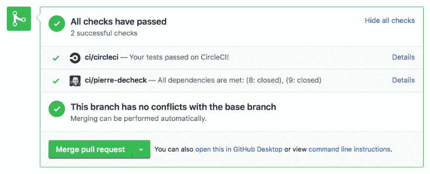

# 曾经希望进行拉取请求依赖检查吗？你已经得到它了。

> 原文：<https://dev.to/alvarocavalcanti/ever-wished-for-a-pull-request-dependency-check-youve-got-it--177g>

## 拉请求是一件事(喜欢不喜欢)

我们这些使用 GitHub 的人，无论是参与一些开源项目还是在私有存储库工作，都熟悉拉请求。即使你的团队精通[基于主干的开发](https://trunkbaseddevelopment.com)，你也应该听说过 PRs 是“邪恶的东西”。

但是，如果你属于第一类，就像我一样，并且处理两个不同的存储库，它们之间有任何依赖关系，你可能会合并一个依赖于另一个尚未合并的回购 PR 的 PR。我知道我有！

## 小插曲

这是一个依赖于 Django-Rest-Framework 后端的 RoR 前端。我们在后者之前合并了前者，因此出现了一些生产缺陷，我们必须处理它们。

那一集之后，我开始寻找可以防止这种情况再次发生的工具。如果有一些工具可以发布公关状态/检查，就像 CI 服务一样，比如 [Jenkins](https://jenkins.io) 和 [CircleCI](https://circleci.com) 以及 GitHub 的一些功能，那就太棒了。

老实说，我确实发现了一些工具/服务似乎提供了这个特性。然而，我不喜欢的是，他们有一大堆功能。我不想要那个，我想要一个简单的检查器。

## 不喜欢就自己做

从那时起，我改变了我的研究。我没有去找工具，而是开始看 GitHub API 的文档。我决定自己开发一个工具，在我最初的研究之后，我觉得这是完全可以实现的。

因为我觉得使用 Python 很舒服，也很有效率，所以它是我的首选平台。但是我没有选择 [Django-Rest-Framework](http://www.django-rest-framework.org) 而是选择了 [Flask](http://flask.pocoo.org) 有两个原因，1)Flask 应用程序比 DRF 的要苗条得多，而且苗条和简单更好，2)我想试用 Flask。:)

## 你知道了:皮埃尔·德切克

经过大约 2 个月的时间和一次彻底的重写，我有了一个可以进行真实世界测试的工作版本。在这里我向你们介绍:[皮埃尔·德切克](https://github.com/alvarocavalcanti/pierre-decheck)

Pierre 的概念很简单，它应该配置为给定存储库的 webhook，然后您使用关键字(如“依赖于#2”表示相同回购问题/PRs，或“依赖于所有者/回购#2”表示外部问题)将依赖项添加到 PR，然后它将发布对您的 PR 状态的检查，告诉您是否满足依赖项:

[T2】](https://res.cloudinary.com/practicaldev/image/fetch/s--BYK5YUDG--/c_limit%2Cf_auto%2Cfl_progressive%2Cq_auto%2Cw_880/https://github.com/alvarocavalcanti/pierre-decheck/raw/master/pull_request_checks.png)

安装和使用细节可以在 Pierre 的 GitHub 页面上找到，唯一需要注意的是，现在，依赖检查是同步的。这意味着当 GitHub 向 webhook 发送事件时，检查和状态更新将在请求过程中进行。我知道这不是最理想的，但这是一个开始。

**编辑:** Pierre 将仅在 PR 创建和评论活动(添加/删除)时执行检查。在每种情况下，它将获取所有 PR 的主体(PR 主体本身及其所有评论)，提取依赖项并执行检查。因此，它**不会**观察依赖项本身，如果它们的状态发生变化，也不会重新运行检查。但是谁知道未来会怎样呢？请随意[创建问题/功能请求](https://github.com/alvarocavalcanti/pierre-decheck/issues/new)！:)

## 求援

所以，如果你认为这个工具可以帮助你的团队，如果你可以测试它，为你发现的错误制造问题，甚至做出贡献，那就太好了！

非常感谢！