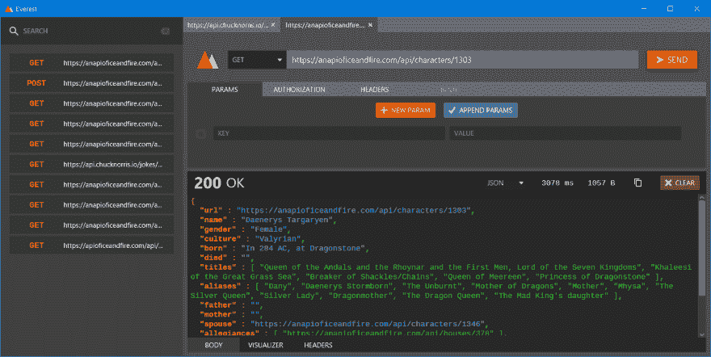

# Everest:用 JavaFX 编写的华丽的 REST API 客户端

> 原文：<https://dev.to/rohit/everest-a-gorgeous-rest-api-client-written-in-javafx-25f2>

嗨！我是 Rohit，目前是计算机工程二年级的学生。在过去的 4 个月里，我一直在用 JavaFX 构建一个 REST API 客户端。我真的很兴奋能和你们分享我的作品！

[T2】](https://res.cloudinary.com/practicaldev/image/fetch/s--U90spCNs--/c_limit%2Cf_auto%2Cfl_progressive%2Cq_auto%2Cw_880/https://user-images.githubusercontent.com/23148259/41772368-f9276dae-7635-11e8-97ec-1a1e8aa608c4.PNG)

我这个项目的目标是做一些类似于*邮差*和*失眠*的东西，但是在一个更轻的包中使用 JavaFX，而不损害基于电子的应用程序的漂亮设计，同时保持相当的功能水平。我目前专注于优化我所关注的每一件事，但我也会偶尔添加新功能。

以下是一些核心功能:

*   华丽的用户界面。
*   发出获取、发布、上传、删除和修补请求。(*咄*)
*   **多标签**布局。
*   “历史记录”选项卡快速搜索您最近的请求。
*   通过 JavaFX CSS 支持**自定义主题**！
*   一个**可视化器**向你展示了一个漂亮的响应体树
*   用 Java 写，Everest 本来就是**跨平台**。

够了，我美丽的自述越来越嫉妒了，所以你为什么不去 GitHub 上看看她:[https://github.com/RohitAwate/Everest](https://github.com/RohitAwate/Everest)

请尝试阿尔法，让我知道你的想法！:)