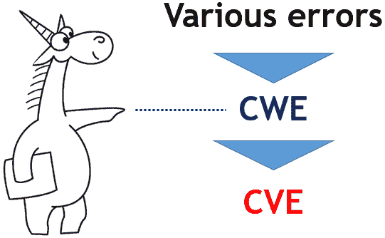

# 每 4000 行 Android 代码都包含一个潜在的漏洞

> 原文：<https://dev.to/alexastva/every-4000-lines-of-android-code-contain-a-potential-vulnerability-37ak>

[T2】](https://res.cloudinary.com/practicaldev/image/fetch/s--HSIxqbZL--/c_limit%2Cf_auto%2Cfl_progressive%2Cq_auto%2Cw_880/https://www.viva64.com/medimg/content/b/0579_Android/image2.png)

去年，静态代码分析器 PVS-Studio 的开发者已经引用了他们对操作系统 Tizen 的研究结果，现在选择又落在了另一个同样受欢迎的操作系统 Android 上。展望未来，我想指出的是，我没有想到在如此受欢迎的产品中会出现如此大量的错误！

在这篇文章中，即使是如此高质量的代码中出现的错误也会在例子中被剥离出来，事实上，即使是那些经过 Coverity 测试的例子也是如此。

开发者总共描述了大约 490 个潜在的漏洞。例如，CWE-14:编译器删除代码以清除缓冲区，这是一种严重的潜在漏洞，会导致访问私有数据。

除此之外，您还可以找到:
、CWE-119:内存缓冲区边界内的操作限制不当
、CWE-393:返回错误的状态代码
、CWE-480:使用不正确的运算符
、CWE-561:死代码
、CWE-690:未经检查的空指针取消引用返回值
、CWE-762:不匹配的内存管理例程

以及其他许多有趣的例子，几乎有 200 万行 C 和 C ++代码！哇！

来源-[https://www.viva64.com/en/b/0579/](https://www.viva64.com/en/b/0579/)