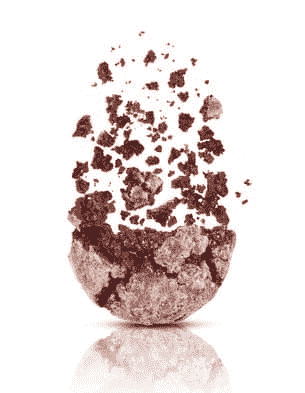

# 每个人都在看你在网上做什么。使用 cookies 跟踪用户的工作原理

> 原文：<https://dev.to/ruidfigueiredo/everyone-is-watching-what-you-do-online-how-user-tracking-with-cookies-works-aon>

你有没有访问过一个网站来查看你想买的东西，结果却被其他网站上该产品的广告淹没了？

这个问题我已经被问过很多次了，所以我认为这是一个很好的练习，可以试着解释它是如何工作的。

这篇博文解释了看似完全不相关的网站是如何知道你在网上做什么的。

[T2】](https://res.cloudinary.com/practicaldev/image/fetch/s---nsLkTUO--/c_limit%2Cf_auto%2Cfl_progressive%2Cq_auto%2Cw_880/https://www.blinkingcaret.com/wp-content/uploads/2018/06/cookie-trail-of-crumbes.jpg)

## 一切从饼干开始

在我们描述什么是 cookie(在 web 环境中)之前，让我们先来描述一下为什么需要它们。

网络基本上是一个不相连的系统。当网络几乎是连接的同义词时，这是一件奇怪的事情。在这种情况下，断开连接意味着当您使用浏览器打开访问网站时，浏览器连接到托管该网站的服务器，获取网页并断开连接。网络服务器只在很短的时间内了解你。

这使得一个网站有可能满足数百万个请求。它不需要在内存中长时间保存你的信息。

好吧，如果是这样的话，我们怎么会有网站**做**“记住”我们，在那里我们可以登录并看到属于我们的数据？

这就是饼干的由来。cookie 是储存在你的电脑中的关于你访问过的网站的信息。

当您访问一个网站时，您的浏览器会向监听该网站地址的 web 服务器发送 HTTP 请求。web 服务器发回一个 HTTP 响应，其中包含网站的内容(HTML)和一些“头”。头只是一个键值对(例如:`Server: TheServerName`)。

有一个名为`Set-Cookie`的标题，当它出现在 HTTP 响应中时，会让您的浏览器为您正在访问的网站创建一个 cookie。实际上比这个要复杂一点。cookie 与网站的域相关联，但是对于这个讨论来说，如果你认为 cookie 属于一个网站也没关系。

此外，cookie 只是保存在计算机上的文本文件。

下面是一个来自对`myawesomewebsite.com`的响应的`Set-Cookie`头的例子:

```
Set-Cookie: the_cookie_name=the_cookie_value; path=/; expires=Tue, 06 Jun 2028 21:50:30 GMT; domain=.myawesomewebsite.com 
```

Enter fullscreen mode Exit fullscreen mode

在此响应之后，在 2028 年 6 月 6 日之前，每次您访问`myawesomewebsite.com`时，您的浏览器都会在请求中发送一个`Cookie`标头，如下所示:

```
Cookie: the_cookie_name=the_cookie_value 
```

Enter fullscreen mode Exit fullscreen mode

最容易想象的使用这种方法的网站是一个允许用户选择背景颜色的网站。在对更改背景颜色的请求的响应中，web 服务器将添加一个标题，如下所示:`Set-Cookie: background_color=blue ...`。

现在，每次你访问那个网站时，你的浏览器都会“告诉”网站你希望背景是蓝色的，其方式是在请求中包含`Cookie`头:`Cookie: background_color=blue`。

允许您登录网站的机制与此非常相似。当您访问登录页面并输入正确的用户名和密码时，web 服务器将发回一个带有`Set-Cookie`标题的响应，其内容将允许 web 服务器找到您的数据。这个 cookie 的值通常是加密的，因此只有服务器可以创建它，也只有服务器能够读取它。通过这种方式，用户不能只是更改值，还可能以另一个人的身份登录。

## 用 cookies 跟踪用户

我相信你已经看到过类似这样的信息:“我们使用 cookies 来改善你在我们网站上的体验，并向你展示相关的广告。

cookies 被用来“向你显示相关广告”的方式取决于浏览器如何对待它们。每次你的浏览器向一个有 cookie 的网站发出请求时，它都会发送那个 cookie。

此外，当请求来自不同于 cookie 所针对的网站时，浏览器会添加一个名为`Referer`的头(是的，它拼错了，但这是[规范](https://developer.mozilla.org/en-US/docs/Web/HTTP/Headers/Referer)中的方式，所以我们必须接受它)。该头将包含来自发起请求的网站的 URL。

这个用一个例子更容易理解。比方说你去维基百科看世界杯。在这样做的同时，您在参考资料部分发现了一些有趣的东西，您想探索一下。例如，在您之前访问过的另一个网站(如:sofascore.com)中托管的关于 2018 年资格的页面。

当你点击到 sofascore.com 的链接时，你的浏览器会将`Cookie`头添加到对`sofascore.com`的请求中，它还会添加一个带有来自维基百科的 url 的`Referer`头，例如:`Referer: https://en.wikipedia.org/wiki/2018_FIFA_World_Cup`。

这怎么可能被利用？

为简单起见，假设你访问过的原始网站名为 *tracker* 。现在想象一下*追踪器*为你设置了一个 cookie，它有一个唯一的值(将作为一个标识符)并且有一个很长的有效期。此外，*追踪器*与许多其他网站有协议，这些网站拥有来自 *追踪器*的 1x1 像素透明图像**。**

每次你访问这些网站时，你的浏览器都会向*追踪器*请求透明图像，并发送带有你的*标识符*和*推荐人*标题的 cookie。这样,*追踪器*不仅知道你是谁，还知道你在访问哪些网站。

然后,*追踪器*可以把你的信息卖给其他网站，这些网站可以选择如何处理这些信息。主要给你看他们认为你感兴趣的东西相关的广告。就这么简单。

此外，这项技术被称为[网络信标](https://en.wikipedia.org/wiki/Web_beacon)，它是最简单的技术之一。还有[更精细的版本](https://en.wikipedia.org/wiki/Evercookie)，它将使用多种功能组合来“标记”你，即使你删除了浏览器 cookies。

如果你想知道为什么饼干被称为饼干，也许是因为它像一个幸运饼干？里面有一条信息。我其实不知道，但如果你知道，请留下评论。