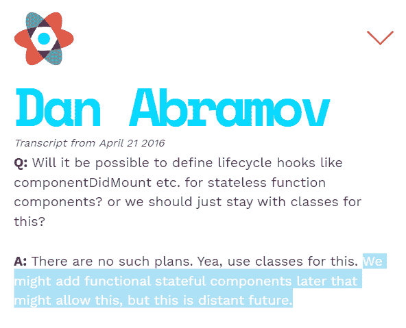

# 关于 React Hooks 你需要知道的一切

> 原文：<https://dev.to/vcarl/everything-you-need-to-know-about-react-hooks-doh>

React 刚刚公布了一个新功能:[钩子](https://reactjs.org/docs/hooks-overview.html)。这是一组全新的 API，支持在组件之间共享有状态逻辑的强大新方法，无需大量重写即可优化性能，获得 Redux 风格的关注点分离的一些好处，等等。他们还实现了 React 团队几年前许下的承诺——有状态功能组件。早在 2016 年 4 月，[丹·阿布拉莫夫关于 react flux](https://www.reactiflux.com/transcripts/dan-abramov/)的 Q & A 中就提出了从功能组件使用状态的可能性。

[T2】](https://res.cloudinary.com/practicaldev/image/fetch/s--zEOqOun0--/c_limit%2Cf_auto%2Cfl_progressive%2Cq_auto%2Cw_880/https://i.imgur.com/vIcMPdc.png)

已经过了很久了，但是他们来了！不仅仅是 state，总共有 11 个新的函数应该支持我们今天使用的类和生命周期的全部功能。

*   `useState`
*   `useEffect`
*   `useContext`
*   `useCallback`
*   `useMemo`
*   `React.memo`(不是钩子，而是新的)
*   `useReducer`
*   `useRef`
*   `useLayoutEffect`
*   `useImperativeMethods`
*   `useMutationEffect`

让我们来看看它们每一个都是干什么用的。

## `useState`

通过新功能`useState`启用有状态功能组件。

```
import { useState } from "react";

const SomeComponent = props => {
  const [state, setState] = useState(initialState);
  return (
    <div>
      {state}
      <input onChange={e => setState(e.target.value)} />
    </div>
  );
}; 
```

如果您曾经使用过库`recompose`，这个 API 可能看起来很熟悉。`useState`以初始状态为参数，返回当前状态和更新函数。它返回的`setState`与类组件使用的*几乎*相同——它可以接受一个回调，该回调将当前状态作为一个参数，但它不会自动合并顶级对象键。

对`useState`的每个调用都与一个组件成对出现，其状态在渲染中保持不变。这意味着您可以在单个函数组件中多次调用`useState`来获得多个独立的状态值。因为返回的`setState`不局限于单个组件，所以我们可以定义独立于组件的有状态行为。这为抽象有状态逻辑提供了强大的新方法。

让我们看一个我在几个项目中遇到的例子:管理几个组件中的排序状态。我发现表组件公开的 API 不够灵活，所以我倾向于一次性编写数据表。我当前的项目有一些代码，用于管理按什么键排序，按哪个方向，复制粘贴到几个不同的组件中。有了`useState`，我们获得了将它定义为一个独立模块的能力。

```
const useSort = (someArray, initialSortKey) => {
  const [state, setState] = useState({
    isAscending: false,
    sortKey: initialSortKey
  });

  // Let's pretend `makeSortComparator` exists for simplicity
  const comparator = makeSortComparator(state);
  const sortedData = someArray.slice().sort(comparator);

  return {
    ...state,
    sortedData,
    toggleAscending: () =>
      setState(state => ({
        ...state,
        isAscending: !state.isAscending
      })),
    setSortKey: sortKey =>
      setState(state => ({ ...state, sortKey }))
  };
}; 
```

现在我们有了一个可重用的方法来使用我们的数据表组件。我们有一个简单的 API，可以跨许多不同的表使用，每个组件都有自己独立的状态。

```
const SomeTable = ({ data }) => {
  const { sortedData, ...sortControls } = useSort(
    data,
    "id"
  );
  return (
    <table>
      <TableHeading {...sortControls} />
      <tbody>
        {sortedData.map(datum => <TableRow {...datum} />)}
      </tbody>
    </table>
  );
}; 
```

请注意:React 团队强烈建议在这些类型的模块名称前加上前缀`use`,这样就有了它提供何种行为的强烈信号。参见[完整文档](https://reactjs.org/docs/hooks-custom.html)了解更多关于编写自己的钩子的信息。

我对这种分享功能的新方式感到非常兴奋。从各方面来看，它都比 HOC 轻便得多；要编写的代码更少，要安装的组件更少，警告也更少。查看 [API 文档](https://reactjs.org/docs/hooks-reference.html#usestate)了解所有细节。

## `useEffect`

作为安装或重新渲染的一部分，许多组件必须启动不同类型的效果。获取数据、订阅事件以及强制性地与页面的另一部分进行交互都是常见的例子。但是处理这些类型效果的代码最终分散在`componentDidMount`、`componentDidUpdate`和`componentWillUnmount`中。

如果你想在道具改变时运行同样的效果，你要么在`componentDidUpdate`中添加一堆比较，要么在组件上设置一个`key`。使用`key`简化了你的代码，但是它将效果的控制分散到另一个文件中——完全在组件的控制之外！

`useEffect`简化了所有这些情况。命令式交互是每次渲染后运行的简单函数。

```
const PageTemplate = ({ title, children }) => {
  useEffect(() => {
    document.title = title;
  });
  return (
    <div>
      <h1>{title}</h1>
      {children}
    </div>
  );
}; 
```

对于数据获取和其他您不希望发生的不必要的交互，您可以传递一个值数组。该效果仅在其中一项发生变化时运行。

```
const ThingWithExternalData = ({ id, sort }) => {
  const [state, setState] = useState({});
  useEffect(() => {
    axios
      .get(`/our/api/${id}?sortBy=${sort}`)
      .then(({ data }) => setState(data));
  }, [id, sort]);
  return <pre>{JSON.stringify(state, null, 2)}</pre>; }; 
```

组件卸载时需要某种清理的订阅和其他效果可以返回一个函数来运行。

```
const ThingWithASubscription = () => {
  const [state, setState] = useState({});
  useEffect(() => {
    someEventSource.subscribe(data => setState(data));
    return () => {
      someEventSource.unsubscribe();
    };
  });
  return <pre>{JSON.stringify(state, null, 2)}</pre>; }; 
```

这太强大了。就像`useState`一样，它们可以被定义为独立的模块——这不仅将这些复杂效果所需的所有代码放在一个位置，*它们可以在多个组件之间共享*。结合`useState`，这是一种概括逻辑的优雅方式，比如跨组件加载状态或订阅。

## `useContext`

上下文 API 很棒，与以前相比，在可用性方面有了很大的改进。它将文档中的“你可能不应该使用这个”警告提升到了 API 的可接受部分。然而，使用上下文可能会很麻烦。它必须被用作渲染道具，这是一种不能优雅合成的模式。如果你需要来自多个不同渲染道具的值，你很快就会陷入极端的困境。

向前迈出了实质性的一步。它接受由现有的`React.createContext`函数创建的值(您可以将`.Consumer`作为渲染道具使用的同一个函数),并从上下文提供者返回当前值。每当上下文值改变时，组件将重新呈现，就像它为状态或属性所做的那样。

```
// An exported instance of `React.createContext()`
import SomeContext from "./SomeContext";

const ThingWithContext = () => {
  const ourData = useContext(SomeContext);
  return <pre>{JSON.stringify(ourData, null, 2)}</pre>; }; 
```

这消除了我对上下文的最后抱怨。这个 API 简单直观到了极点，将成为一种强大的方式来管理应用程序的状态。

# 更高级的钩子

上面提到的 3 个钩子被认为是基本钩子。只使用`useState`、`useEffect`和`useContext`来编写整个应用程序是可能的——实际上，你可以只使用前两个。接下来的钩子提供了优化和越来越实用的功能，这在您的应用程序中可能从来没有遇到过。

## `useCallback`

React 有许多优化，这些优化依赖于在渲染中保持不变的道具。打破这一点的最简单的方法之一是通过内联定义回调函数。这并不是说内联定义函数会导致性能问题——在许多情况下，这没有影响。然而，当您开始优化并确定是什么导致频繁的重新渲染时，您可能会发现内联函数定义是许多不必要的道具更改的原因。

在当前的 API 中，将内联函数更改为在不同的渲染中不会改变的东西可能是一个重大的变化。对于函数组件，这意味着重写一个类(包括所有必需的更改)并将函数定义为一个类方法。`useCallback`提供了一种简单的方法来优化这些函数，通过记忆提供给它的函数来最小化对代码的影响。就像`useEffect`一样，我们可以告诉它依赖什么值，这样它就不会做不必要的改变。

```
import doSomething from "./doSomething";

const FrequentlyRerenders = ({ id }) => {
  return (
    <ExpensiveComponent
      onEvent={useCallback(() => doSomething(id), [id])}
    />
  );
}; 
```

这是可用性方面另一个令人兴奋的改进。过去意味着组件的重大重写现在可以直接用 React 中的函数就地完成。

## `useMemo`

关于优化的主题，还有另一个让我兴奋的问题。很多时候，我需要从我提供的道具组件中计算派生数据。它可能是将一组对象映射到稍微不同的形式，将一组数据组合成一个值，或者排序或过滤。通常`render`是这个处理发生的逻辑位置，但是当其他道具或状态改变时，它将不必要地运行。

输入`useMemo`。和`useCallback`关系密切，但是为了优化数据处理。它有与`useEffect`和`useCallback`相同的 API 来定义它所依赖的值。

```
const ExpensiveComputation = ({
  data,
  sortComparator,
  filterPredicate
}) => {
  const transformedData = useMemo(
    () => {
      return data
        .filter(filterPredicate)
        .sort(sortComparator);
    },
    [data, sortComparator, filterPredicate]
  );
  return <Table data={data} />; }; 
```

我对此感到兴奋，原因和`useCallback`一样。以前，优化这种类型的处理通常意味着将逻辑提取到一个单独的函数中并加以记忆。因为记忆化工具通常依赖函数*参数*来使记忆化无效，这意味着创建一个纯函数。这种重构可能会过于庞大，因此只有最极端的性能问题才会得到解决。这个挂钩应该有助于避免“千刀万剐”式的性能问题。

## `React.memo`

这不是一个钩子，但它是一个新的 API 和一个重要的优化。记忆计算和确保属性不会不必要地改变对性能有好处，但当与`shouldComponentUpdate`或`PureComponent`特性结合时，这两者更有效——这两者都不适用于函数组件。

`React.memo`是一个新的函数，支持类似于函数`PureComponent`的行为。它比较正确的值，只有当它们改变时才重新渲染。它不比较状态或上下文，就像 PureComponent 一样。它可以接受第二个参数，这样你就可以对道具进行自定义比较，但与`shouldComponentUpdate`有一个重要的区别:它只接收道具。因为`useState`没有提供单一的状态对象，所以它不能用于这个比较。

## `useReducer`

这个挂钩对生态系统有着有趣的影响。Redux 最强大的好处之一是 Redux 的 reducer/action 模式。它鼓励将 UI 建模为状态机，具有清晰定义的状态和转换。然而，使用 Redux 的一个挑战是将它们粘合在一起。动作创建者，其中组件为`connect()`、`mapStateToProps`，使用选择器，协调异步行为...Redux 上有一大堆相关的代码和库，让人应接不暇。

结合对上下文的可用性改进、记忆计算的新技术和运行效果的挂钩，允许以更少的概念开销获得许多与 Redux 相同的好处。我个人从来没有被 Redux 的样板问题所困扰，但是考虑到这些钩子将如何组合，我对如何在应用程序中定义和限定特性感到兴奋。

## `useRef`

有时候，在编写组件时，我们最终会得到一些需要跟踪的信息，但是当这些信息发生变化时，我们不想重新呈现这些信息。最常见的例子是对我们已经创建的 DOM 节点的引用，例如，我们需要跟踪光标位置或强制聚焦的`input`节点。对于类组件，我们可以跟踪并直接将它们赋给`this`上的属性，但是函数组件没有上下文可以引用。

`useRef`为这些情况提供了一种机制。它创建一个只要组件被安装就存在的对象，公开作为一个`.current`属性分配的值。

直接从[文档](https://reactjs.org/docs/hooks-reference.html#useref)(和[常见问题](https://reactjs.org/docs/hooks-faq.html#is-there-something-like-instance-variables) :

```
// DOM node ref example
function TextInputWithFocusButton() {
  const inputEl = useRef(null);
  const onButtonClick = () => {
    // `current` points to the mounted text input element
    inputEl.current.focus();
  };
  return (
    <>
      <input ref={inputEl} type="text" />
      <button onClick={onButtonClick}>Focus the input</button>
    </>
  );
}

// An arbitrary instance property
function Timer() {
  const intervalRef = useRef();

  useEffect(() => {
    const id = setInterval(() => {
      // ...
    });
    intervalRef.current = id;
    return () => {
      clearInterval(intervalRef.current);
    };
  });

} 
```

这段代码比在类组件中使用实例属性更加冗长，但是您需要以这种方式存储值的情况应该相对较少。

# 很少使用的钩子

上面提到的挂钩涵盖了我在编写应用程序时遇到的所有用例。通读剩余钩子的文档，我理解它们为什么存在，并且我确信我正在使用将实现它们的库，但是我不期望在应用程序代码中使用它们。

## `useLayoutEffect`

如果我使用这 3 个中的任何一个，我预计它将是`useLayoutEffect`。当您需要在 DOM 发生变化之后、浏览器绘制新布局之前读取计算样式时，推荐使用这个钩子。

至关重要的是，这为您提供了一个应用动画的机会，最大限度地减少了视觉瑕疵或浏览器渲染性能问题。这是目前由 [react-flip-move](https://github.com/joshwcomeau/react-flip-move) 使用的方法，当项目改变位置时，这是一个惊人的过渡库，但可能会有我自己需要使用它的情况。

## `useImperativeMethods`

据我所知，这个钩子是`forwardRef`的对应部分，是库通过`ref`属性的一种机制，否则就会被吞噬。对于像 Material UI、React Bootstrap 这样的组件库或者像 styled-components 这样的 CSS-in-JS 工具来说，这是一个问题，但是我还没有遇到需要自己解决这个问题的情况。

## `useMutationEffect`

这是我最难理解的一个问题。它在 React 用来自`render`的结果改变 DOM 之前立即运行，但是当您必须读取计算的样式时，`useLayoutEffect`是更好的选择。文档指定它在兄弟组件更新之前运行，并且应该用于执行定制的 DOM 突变。这是唯一一个我想不出用例的钩子，但是它可能对一些情况有用，比如当你想要一个不同的工具(比如 D3，或者一个 canvas 或者 WebGL 渲染器)来接管输出的实际渲染。但是不要让我坚持。

# 总之

Hooks 让我对 React 的未来充满期待。我从 2014 年开始使用这个工具，它不断引入新的变化，让我相信它是 web 开发的未来。这些挂钩没有什么不同，并且再次大大提高了开发人员的体验，使我能够编写持久的代码，并通过提取重用的功能来提高我的生产率。

我以为悬疑是 2018 年唯一让我兴奋的即将上映的电影，但我很高兴被证明是错的！结合起来，我希望 React 应用程序将为最终用户体验和代码稳定性设立一个新的标杆。

* * *

感谢阅读！我在 Twitter 上的名字是 [@cvitullo](https://twitter.com/cvitullo) (但在其他大多数地方我都是 vcarl)。我主持了 React 开发者聊天室[React flux](http://join.reactiflux.com/)和 Node 聊天室 [Nodeiflux](https://discordapp.com/invite/vUsrbjd) 。JS 开发者。如果您有任何问题或建议，请联系我们！封面图片来自于[未涂抹上的 raw pixel](https://unsplash.com/photos/kAwqA_yB_Fk)