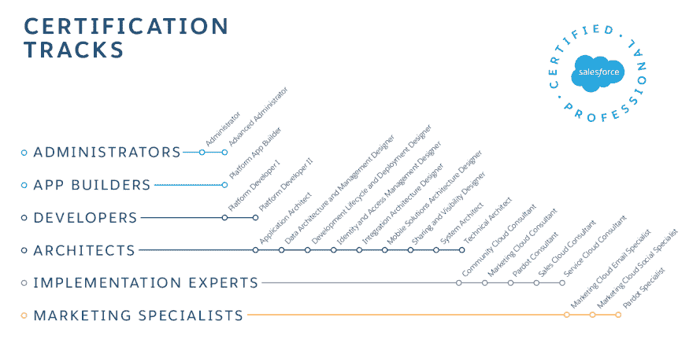

# 关于 Salesforce 认证您需要知道的一切

> 原文：<https://dev.to/nishthasinghuk/everything-you-need-to-know-about-salesforce-certification--49ic>

作为一个巨大的平台，SalesForce 得到了全球所有开发人员、管理员、顾问和客户的认可。这就是为什么需要提供不同种类的证书来认可技能和专业知识的原因。但我们很多人不知道的是，Salesforce 认证是如何恰当地进行的。我相信你对以下问题很好奇:

*   如果你是营销专家，那么谁有营销他们产品的眼光呢？
*   如果你学过架构师，那么谁来策划高性能的技术框架呢？
*   你是管理员吗？如果是，谁让 Salesforce 在管理级别上平稳运行？
*   你是开发人员吗？你开发新的应用程序来扩展功能和定制默认特性吗？

因此，无论您的角色是什么，每个目标都可以通过简单的认证轻松实现。或者，你甚至可以考虑联系英国的 Salesforce 开发服务提供商，他们有潜力提供几乎所有可能的利基解决方案。

[T2】](https://res.cloudinary.com/practicaldev/image/fetch/s--JpkDzcWg--/c_limit%2Cf_auto%2Cfl_progressive%2Cq_auto%2Cw_880/http://www.forcetalks.com/wp-content/uploads/2018/02/certi.png)

*   **Salesforce Administrator**-该认证考试特别面向非新手，并且已经作为 Salesforce 管理员在平稳运行 sales force 的所有管理级别方面获得了足够的经验的个人。
*   **Salesforce 高级管理员** -获得该认证尤其意味着您在 Salesforce 的管理级别上拥有高级专业知识。除此之外，您还需要选择通过 [Salesforce](https://www.salesforce.com) 管理员考试的先决条件认证。
*   **sales force Platform App Builder**-该认证主要面向那些能够使用 force.com 平台的功能构建和设计定制应用的人员。
*   **平台开发人员 I**——这种认证是为那些具备在 Force.com 平台上构建自定义声明式和编程式应用程序的基本知识、技能和编码经验的人建立的。它是编码技能和一些自定义自动化的混合。
*   **平台开发人员 II** -顾名思义，该认证专为那些在编程能力方面拥有高级知识和技能的人员而设立。为此，您必须先通过平台开发人员 I 考试。上面说的那个。
*   **数据架构和管理设计师** -您认为自己有能力为架构环境设计可扩展的高性能解决方案吗，当然是在 force.com 平台上？如果是这样，您可以选择该认证，因为它与企业数据管理相关。
*   **开发生命周期和部署设计师**——这个认证尤其是为那些评估需求和开发架构环境，然后实现管理解决方案以满足需求的人而建立的。
*   **身份和访问管理设计师** -您喜欢评估架构环境并设计满足单点登录(SSO)要求的可扩展高性能解决方案吗？如果是这样，那么这个认证适合你！
*   **集成架构设计者**——专为那些计算和评估环境架构的人设计并提供满足端到端集成流程的高级技术解决方案。
*   **移动解决方案架构设计师**——该认证专为那些具备架构环境质量、设计和实施移动解决方案以满足要求的人员而设立。
*   **共享和可见性设计师**——该认证专为那些评估架构环境、需求以及设计和技术解决方案以满足共享和可见性要求的人而设立。
*   **技术架构师** -只需通过应用架构师和系统架构师考试，就能获得该认证，具备安全设计的高技能、多种开发平台和高性能技术解决方案的知识。
*   **社区云顾问** -如果你有在[实施和咨询](https://www.forcetalks.com/blog/how-to-make-a-successful-salesforce-implementation-with-these-ten-steps/)社区应用的经验，那么这个认证很适合你。别忘了给管理员考试。
*   **营销云顾问** -专为那些能够设置和实施 Salesforce 营销云电子邮件应用工具的人打造，旨在为各种电子邮件活动提供解决方案。为此，您还需要申请营销云电子邮件专员考试的先决条件认证。
*   **Pardot 顾问** -顾名思义，这是为那些有为客户的业务需求实施 Pardot 的经验的人建立的。
*   **销售云顾问** -您在实施销售云及其角色、成功设计和实施解决方案方面经验丰富吗？如果有，马上去考销售云顾问认证。
*   **营销云社交专家** -该认证专为那些在使用 Social Studio 组件进行帖子创建、管理和对话分析以及报告方面拥有丰富知识和技能的人员而设计。