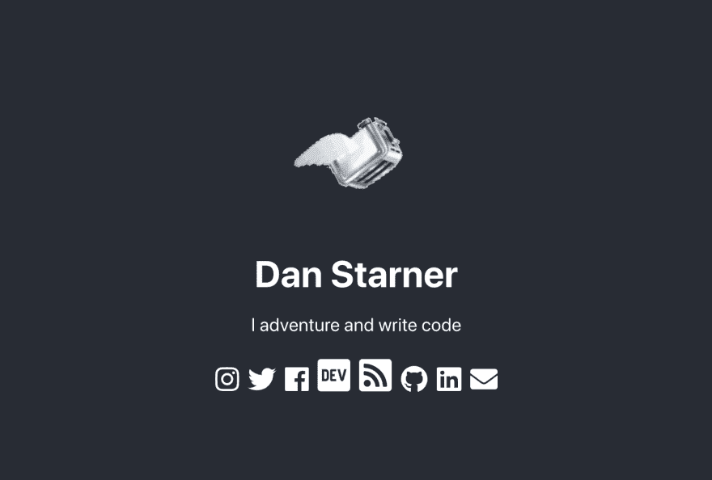

# 我的个人网站的发展

> 原文：<https://dev.to/dan_starner/evolution-of-my-personal-site-1849>

我刚刚重新设计了我的个人网站，这似乎是第 500 次 T2 了。老实说，我这样做是因为我懒得重新访问我以前的网站上的 DigitalOcean droplet。

这一次，我用了一个非常非常基本的布局；全灰色的背景，我的名字，一些标语，我账户的链接，还有一张 90 年代黑暗后屏保里的[飞行烤面包机的 gif。](https://en.wikipedia.org/wiki/After_Dark_(software))

[T2】](https://res.cloudinary.com/practicaldev/image/fetch/s--aaB4NTDe--/c_limit%2Cf_auto%2Cfl_progressive%2Cq_auto%2Cw_880/https://thepracticaldev.s3.amazonaws.com/i/t2xlc5mi7k70nl57flmd.png)

这个网站只花了我大约一个小时。完全公开，布局只是`create-react-app`的初始布局，为我的链接添加了一些额外的酱料。

我意识到，随着时间的推移，我的个人网站变得越来越简单，我对它们的优先排序也越来越少。

## 前几个地点

我最初的几个网站是在一次黑客马拉松上得到的免费域名下的。我刚刚开始学习 web 开发，所以我谷歌了一下“*免费的 HTML 简历模板*，挑选了第一个看起来吸引我的模板。

我用 Python Flask 建立了这个网站，尽管它很小，但代码相当混乱。我最初是通过 [Heroku](https://www.heroku.com/) 部署它的，因为我对设置反向代理或服务器管理一无所知。**不过我不在乎，我有一个属于我的网站，感觉很好。**

从那以后，我变得有点贪婪，也学到了一些东西。我在 Python 的 Django 和 Flask 框架之间来回跳了几次，但它们都做了同样的事情。我试图加入一个动态博客，这让我第一次了解了什么是数据库。太疯狂了...比如，我可以控制在我的网站上显示什么数据，甚至不需要重新部署？那真是太酷了。

这些网站变得越来越复杂，我会花上几天甚至几周的时间试图添加我想要的所有功能；降低 HTML 帖子的价格，帖子标签，评论，标记...整整 9 码。

慢慢地，建立我的个人网站比我在上面展示的项目花费更多的时间。我痴迷于让我的网站尽可能做到最好...然而...

## 倦怠

我慢慢开始对我自己的网站不太关心，因为它变得太大了。随着时间的推移，随着我学习如何做事，我一个功能一个功能地把它拼凑了起来。这意味着我没有留下任何关于如何管理或护理任何东西的文档。更新静态信息或部署补丁从来没有发生过，因为我找不到时间、精力或动机去做。甚至为我的博客写作也慢慢停止了，因为我发现这太麻烦了。

对我的网站来说，这是一个悲伤的时刻，但它改变了我的思维过程，让我知道我应该如何去做每一件事...

我有一种"*的程序员心态，我知道这个工具是存在的，但我只是打算构建我自己的版本。*“这在某些方面是可以的，但是为什么我要为一个主要是静态的站点重建整个服务器和 webstack 呢？所以，我屈服了。

## 静止地点的时间

我尝试过使用静态站点生成器，比如 Jekyll、Metalsmith、Wintersmith 等等，但我就是无法真正爱上它们。我一直想要一种在浏览器中更新和创建新内容的体验。我不想每次都要重新部署。

我还发现，我不太擅长编辑小胡子或玉石模板，让它们看起来像我喜欢的样子，默认视图对我来说似乎太过简单。

我测试了 GitHub 页面，有一段时间我的个人网站是纯 HTML 的，没有 JavaScript 或 CSS，因为我在教的一个基础 web 设计课上用它做了一个例子。

我的个人网站无人问津，它就像一片贫瘠的荒地，充斥着多年的旧内容。多么令人悲伤的情况...

[T2】](https://res.cloudinary.com/practicaldev/image/fetch/s--rnGhEn08--/c_limit%2Cf_auto%2Cfl_progressive%2Cq_auto%2Cw_880/https://c1.staticflickr.com/3/2591/4086516126_5cafe7247f_z.jpg%3Fzz%3D1)

## 新的展望

经过一段时间的混乱，我开始重新考虑我的个人网站。我想开始更频繁地写博客，为了实现这一点，我需要一个令我自豪的网站。我当时工作的那家公司正在使用 [Ghost](https://ghost.org/) 管理他们的博客。过去，我尝试过创建自己的博客软件。我从未觉得这有多难，但这是我不想再做的事情。

我试了试 Ghost，用的是数字海洋的一键图片，哦，天哪，它是我在博客平台上想要的一切，甚至更多...另外！因为它是开源的(耶#Hacktoberfest) *它是免费的*🤑🤑(当然，DigitalOcean 的托管费是每月 5 美元，但还是值得的。)我用的仍然是的博客软件[，我没怎么接触过它，除了从 v1 升级到 v2 的那些很酷的新功能。我仍然向想开始写博客的朋友推荐这条路线(当然不包括 dev.to😃).](https://blog.danstarner.com/)

最后，我把我的个人网站简化为核心组件。我的名字，一两个标语，以及我所有账户的链接。不再有复杂的事情，不再有数据库或复杂的 MVC...GitHub 页面上托管的只是基础知识。

你知道吗？现在感觉好极了！如果我需要进行更新，只需一个简单的更改和一个`npm`命令。我有点回到了以前的静态网站的感觉，但是因为我所有的内容都在我的博客上，我觉得这一切都是可以管理的。说到博客，现在用 Ghost 写文章也一样简单快捷，没有任何麻烦！

你的个人网站经历了哪些历程？类似的迭代和挣扎，还是什么？我可能会在未来再次改变我的网站，但现在，一切都感觉很好。

[T2】](https://res.cloudinary.com/practicaldev/image/fetch/s--HtC5o847--/c_limit%2Cf_auto%2Cfl_progressive%2Cq_66%2Cw_880/https://media1.tenor.cimg/3a05745a1af582cca77b5d4fd8bf3539/tenor.gif%3Fitemid%3D11095594)