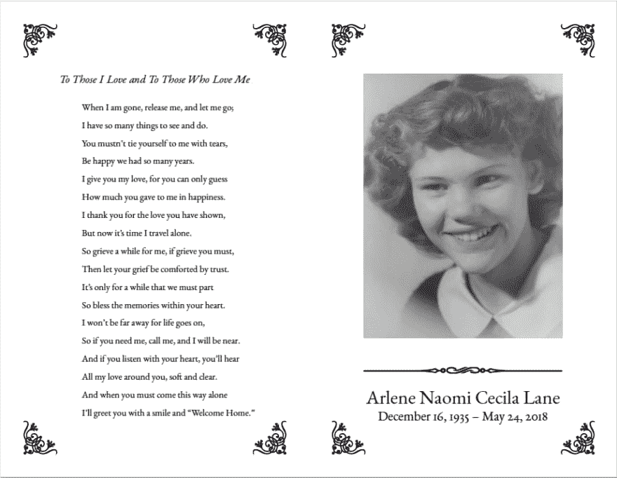
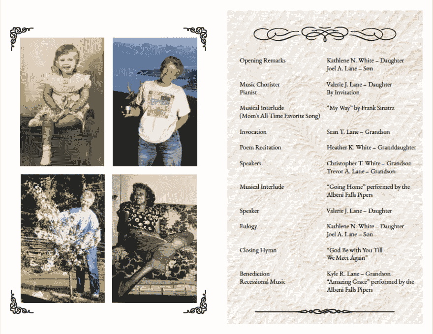

# LaTeX 葬礼或纪念计划示例

> 原文：<https://dev.to/seanlane/example-for-latex-funeral-or-memorial-program-53hj>

另一个快速的帖子，但我希望对其他人有用。在过去的几周内，我 83 岁的祖母去世了，我的家人为她举行了追悼会。有人问我是否可以帮忙制作一份计划手册或小册子，分发给与会者，既可以描述服务本身，也可以在我们聚集在一起纪念祖母时，与他们分享祖母的一段生活。阿林奶奶是一位优雅的女士，我想帮助她给所有能够纪念她的人留下永久的印象。作为一名计算机科学的研究生，我觉得使用 LaTeX 是一种很好的方式，尽管我的互联网搜索与我所寻找的有些差距。我们想要一个由四个“页面”组成的简单布局，其中两个页面将打印在标准尺寸的美国信纸的单面上，然后在打印后折叠成一个四页的小册子。这也可以很好地为那些需要一本 4 页小册子的宗教或其他服务寻找乳胶模板的人服务。

这个项目的文件可以在 GitHub 这里找到:【LaTeX 葬礼或纪念项目的例子

该项目使用标准的 LaTeX 组件以及`pgfornament`包来给程序添加一些风格。一般流程如下:

1.  根据需要编辑`main.tex`文件
    *   请注意，您需要根据需要调整纸张大小，以适合您打算使用的纸张大小的一半。按照目前的情况，它将被打印在 8.5 英寸×5.5 英寸的 8.5 英寸×11 英寸大小的美国信纸上
    *   也可以根据需要修改你的图片。我的祖母是一个惊人的被子，我们希望有一个她的被子作为第三页的背景，在那里实际服务的描述。
2.  使用`Makefile`默认命令制作主文件，它将在`main.tex`中指定的纸张尺寸上生成 4 页，然后将这 4 页放在美国信纸的两面，如`booklet.tex`所述。
3.  我发现输出`booklet.pdf`的页面仍然是纵向的，所以我使用了 Apple Preview 来旋转页面。可能有一个程序化的方法来解决这个问题，但是我从来没有费心去解决它。

下面是输出的截图。

* * *

第一页

[T2】](https://res.cloudinary.com/practicaldev/image/fetch/s--YhqrdWeY--/c_limit%2Cf_auto%2Cfl_progressive%2Cq_auto%2Cw_880/https://sean.lane.img/2018/06/latex_funeral_program_pg1.png)

* * *

第二页

[T2】](https://res.cloudinary.com/practicaldev/image/fetch/s--3b2aEksx--/c_limit%2Cf_auto%2Cfl_progressive%2Cq_auto%2Cw_880/https://sean.lane.img/2018/06/latex_funeral_program_pg2.png)