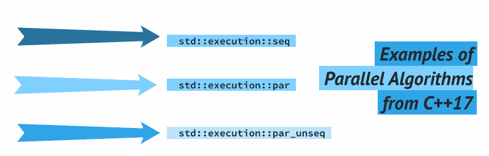

# C++17 中的并行算法示例

> 原文：<https://dev.to/fenbf/examples-of-parallel-algorithms-from-c17-3jej>

[T2】](https://www.bfilipek.com/2018/06/parstl-tests.html)

MSVC (VS 2017 15.8，2018 年 8 月底)是我所知道的唯一一个拥有并行算法的主流编译器/STL 实现。不是所有的事情都完成了，但是你可以使用很多算法，并在它们上面应用`std::execution::par`！

看看我运行的几个例子。

## 简介

从用户的角度来看，并行算法看起来出奇的简单。您有了一个新的参数——称为**执行策略**——您可以将它传递给大多数`std algorithms` :

```
std::algorithm_name(policy, /* normal args... */); 
```

Enter fullscreen mode Exit fullscreen mode

一般的想法是，你调用一个算法，然后你指定**如何执行**。它可以是并行的，可能是矢量化的，或者只是串行的。

作为代码的作者，我们只知道是否有副作用、可能的竞争条件、死锁，或者并行运行它是否没有意义(比如如果您有一个小的项目集合)。

### 执行策略

执行策略参数将告诉算法应该如何执行。我们有以下选择:

*   **`sequenced_policy`** -是一种执行策略类型，用作消除并行算法过载的唯一类型，并要求并行算法的执行不能并行化。
    *   对应的全局对象是`std::execution::seq`
*   **`parallel_policy`** -是一种执行策略类型，用作唯一类型来消除并行算法重载的歧义，并指示并行算法的执行可以并行化。
    *   对应的全局对象是`std::execution::par`
*   **`parallel_unsequenced_policy`** -是一种执行策略类型，用作唯一类型来消除并行算法过载的歧义，并指示并行算法的执行可以并行化和矢量化。
    *   对应的全局对象是`std::execution::par_unseq`

### 新算法

许多现有的算法被更新并过载了执行策略:请看这里的完整列表:
[并行扩展-cppreference.com](http://en.cppreference.com/w/cpp/experimental/parallelism)

我们得到了一些新的算法:

*   `for_each` -类似于`std::for_each`，除了返回`void`。
*   `for_each_n` -将函数对象应用于序列的前 n 个元素。
*   `reduce` -类似于`std::accumulate`，除了无序执行。
*   `exclusive_scan` -类似于`std::partial_sum`，从第 I 个和中排除第 I 个输入元素。
*   `inclusive_scan` -类似于`std::partial_sum`，在第 I 个和中包含第 I 个输入元素
*   `transform_reduce` -应用仿函数，然后无序化简
*   `transform_exclusive_scan` -应用仿函数，然后计算独占扫描
*   `transform_inclusive_scan` -应用仿函数，然后计算包含扫描

最强大的算法之一是`reduce`(以及它的形式`transform_reduce`)。简而言之，新算法提供了一个并行版本的`std::accumulate`。

Accumulate 返回一个范围内所有元素的总和(或者可能与总和不同的二元运算的结果)。

```
std::vector<int> v{1, 2, 3, 4, 5, 6, 7, 8, 9, 10};

int sum = std::accumulate(v.begin(), v.end(), /*init*/0); 
```

Enter fullscreen mode Exit fullscreen mode

该算法仅是顺序的；并行版本将尝试使用树方法计算最终总和(对子范围求和，然后合并结果，分而治之)。这种方法可以按照*不确定的* *顺序调用二元运算/求和。因此，如果`binary_op`不是结合的或不可交换的，行为也是非确定性的。

例如，对于一个整数向量，你会得到相同的 accumulate 和 reduce 结果(当进行求和时)，但是对于一个浮点数或双精度数的向量，你可能会得到稍微不同的结果。这是因为浮点运算是不相关的。

`transform_reduce`将对输入序列额外调用一个操作，然后对生成的结果执行归约。

## MSVC 实现

文章:[宣布:MSVC 符合 C++标准| Visual C++团队博客](https://blogs.msdn.microsoft.com/vcblog/2018/05/07/announcing-msvc-conforms-to-the-c-standard/)

参见章节**新特性:并行算法**:

> 以下算法是并行的。
> 
> *   adjacent_difference，adjacent_find，all_of，any_of，count，count_if，equal，exclusive_scan，find，find_end，find_first_of，find_if，for_each，for_each_n，inclusive_scan，mismatch，none_of，reduce，remove，remove_if，search，search_n，sort，stable_sort，transform_exclusive_scan，transform_inclusive_scan

我们可能会期待更多:

> 目标硬件上没有明显的并行性能提升；仅仅复制或置换没有分支的元素的所有算法通常都受到存储器带宽的限制。
> 
> *   复制，复制 _ 向后，复制 _n，填充，填充 _n，移动，向后移动，移除，移除 _ 如果，替换，替换 _ 如果，反转，反向 _ 复制，旋转，旋转 _ 复制，交换 _ 范围
> 
> 尚未评估；并行可能会在未来的版本中实现，并且被认为是有益的。
> 
> *   copy_if，includes，inplace_merge，is_heap，is_heap_until，is_partitioned，is_sorted，is_sorted，is_sorted_until，lexicographical _ compare，max_element，merge，min_element，minmax_element，nth_element，partition_copy，remove_copy，remove_copy_if，replace_copy，replace_copy_if，set_difference，set_intersection，set _ symmetric _ difference，set_union，stable_partition，unique_copy

反正很多新算法都做好了，可以玩玩`reduce`，排序，计数，查找等等。

## 例子

所有代码都可以在我的回购中找到:

[https://github.com/fenbf/ParSTLTests](https://github.com/fenbf/ParSTLTests)

我有三个例子:

*   带有一些算法的基准测试
*   计算目录的大小
*   计算字符串中的单词数

### 一个基本例子

一个简单的基准:

```
std::vector<double> v(6000000, 0.5);

RunAndMeasure("std::warm up", [&v] {
return std::reduce(std::execution::seq, v.begin(), v.end(), 0.0);
});

RunAndMeasure("std::accumulate", [&v] {
return std::accumulate(v.begin(), v.end(), 0.0);
});

RunAndMeasure("std::reduce, seq", [&v] {
return std::reduce(std::execution::seq, v.begin(), v.end(), 0.0);
});

RunAndMeasure("std::reduce, par", [&v] {
return std::reduce(std::execution::par, v.begin(), v.end(), 0.0);
});

RunAndMeasure("std::reduce, par_unseq", [&v] {
return std::reduce(std::execution::par_unseq, v.begin(), v.end(), 0.0);
});

RunAndMeasure("std::find, seq", [&v] {
auto res = std::find(std::execution::seq, std::begin(v), std::end(v), 0.6);
return res == std::end(v) ? 0.0 : 1.0;
});

RunAndMeasure("std::find, par", [&v] {
auto res = std::find(std::execution::par, std::begin(v), std::end(v), 0.6);
return res == std::end(v) ? 0.0 : 1.0;
}); 
```

Enter fullscreen mode Exit fullscreen mode

`RunAndMeasure`是一个助手函数，它运行一个函数，然后打印计时。此外，我们需要确保结果不会被优化掉。

```
template <typename TFunc> void RunAndMeasure(const char* title, TFunc func)
{
    const auto start = std::chrono::steady_clock::now();
    auto ret = func();
    const auto end = std::chrono::steady_clock::now();
    std::cout << title << ": " << 
              std::chrono::duration <double, std::milli>(end - start).count() 
              << " ms, res " << ret << "\n";
} 
```

Enter fullscreen mode Exit fullscreen mode

在我的机器上(Win 10，i7 4720H，4 核/8 线程)，我得到了以下结果(在发布模式下，x86)

```
std::warm up: 4.35417 ms, res 3e+06
std::accumulate: 6.14874 ms, res 3e+06
std::reduce, seq: 4.07034 ms, res 3e+06
std::reduce, par: 3.22714 ms, res 3e+06
std::reduce, par_unseq: 3.0495 ms, res 3e+06
std::find, seq: 5.13658 ms, res 0
std::find, par: 3.20385 ms, res 0 
```

Enter fullscreen mode Exit fullscreen mode

如你所见，速度有所加快！

### 计算文件大小

下面的例子基于 Nicolai Josutti 的 [C++17 - The Complete…中的一个代码样本。](https://leanpub.com/cpp17)

并行算法- `std::reduce`用于计算目录中文件的大小(使用递归扫描)。这是 C++17 两个特性的一个很好的例子:并行性和`std::filesystem`。

下面是代码中有趣的部分:

```
// Get all the available paths, recursively:
std::vector<std::filesystem::path> paths;
try {
    std::filesystem::recursive_directory_iterator dirpos{ root };
    std::copy(begin(dirpos), end(dirpos),
        std::back_inserter(paths));
}
catch (const std::exception& e) {
    std::cerr << "EXCEPTION: " << e.what() << std::endl;
    return EXIT_FAILURE;
} 
```

Enter fullscreen mode Exit fullscreen mode

获取所有的路径是由如此简洁的代码处理的！
目前`std::copy`不能以并行方式使用。

最后的计算:

```
template <typename Policy>
uintmax_t ComputeTotalFileSize(const std::vector<std::filesystem::path>& paths, 
                               Policy policy)
{
    return std::transform_reduce(
        policy,                                    
        paths.cbegin(), paths.cend(),            // range
        std::uintmax_t{ 0 },                    // initial value
        std::plus<>(),                            // accumulate ...
         {    //  file size if regular file
        return is_regular_file(p) ? file_size(p)
            : std::uintmax_t{ 0 };
    });
} 
```

Enter fullscreen mode Exit fullscreen mode

主调用:

```
start = std::chrono::steady_clock::now();
uintmax_t FinalSize = 0;
if (executionPolicyMode)
    FinalSize = ComputeTotalFileSize(paths, std::execution::par);
else
    FinalSize = ComputeTotalFileSize(paths, std::execution::seq);

PrintTiming("computing the sizes", start);

std::cout << "size of all " << paths.size()
            << " regular files: " << FinalSize/1024 << " kbytes\n"; 
```

Enter fullscreen mode Exit fullscreen mode

我发现的“问题”是`par`和`seq`策略不是一个类型。这就是为什么我把代码移到一个模板函数中，然后我可以通过布尔标志来控制它。

一些结果(在构建的中间目录下运行，108 个文件，总共约 20MB):

```
// parallel:
PS D:\github\ParSTLTests\Release> .\FileSizes.exe ..\IntDir\ 1
Using PAR Policy
gathering all the paths: 0.74767 ms
number of files: 108
computing the sizes: 0.655692 ms 
size of all 108 regular files: 20543 kbytes

// sequential:
PS D:\github\ParSTLTests\Release> .\FileSizes.exe ..\IntDir\ 0
Using SEQ Policy
gathering all the paths: 0.697142 ms
number of files: 108
computing the sizes: 1.0994 ms
size of all 108 regular files: 20543 kbytes 
```

Enter fullscreen mode Exit fullscreen mode

在这次测试中，我得到了`1.0994 ms`对`0.655692 ms`——支持`PAR`版本。

### 计算字符串中的单词

下面的例子来自 Bryce 关于并行算法的演讲。

https://www.youtube.com/watch?v=Vck6kzWjY88&t = 916s

他展示了一种计算字数的有趣方法:

*   在**的第一阶段**，我们将文本转换成`1`和`0`。我们希望在一个单词开始的地方有`1`，在所有其他地方有`0`。
    *   如果我们有一个字符串`"One Two Three"`，那么我们想要生成一个数组`1000100010000`。
*   然后我们可以减少`1`和`0`的计算数组——生成的和是一个字符串中的单词数。

这看起来像是一个“自然”的例子，其中可能会用到`transform_reduce`:

```
bool is_word_beginning(char left, char right) 
{ 
    return std::isspace(left) && !std::isspace(right); 
}

template <typename Policy>
std::size_t word_count(std::string_view s, Policy policy)
{
    if (s.empty())
        return 0;

    std::size_t wc = (!std::isspace(s.front()) ? 1 : 0);
    wc += std::transform_reduce(policy,
        s.begin(),
        s.end() - 1,
        s.begin() + 1,
        std::size_t(0),
        std::plus<std::size_t>(),
        is_word_beginning);

    return wc;
} 
```

Enter fullscreen mode Exit fullscreen mode

下面是一个基准代码:

```
const int COUNT = argc > 1 ? atoi(argv[1]) : 1'000'000;
std::string str(COUNT, 'a');

for (int i = 0; i < COUNT; ++i)
{
    if (i % 5 == 0 || i % 17 == 0)
        str[i] = ' '; // add a space
}

std::cout << "string length: " << COUNT << ", first 60 letters: \n";
std::cout << str.substr(0, 60) << std::endl;

RunAndMeasure("word_count seq", [&str] {
    return word_count(str, std::execution::seq);
});

RunAndMeasure("word_count par", [&str] {
    return word_count(str, std::execution::par);
});

RunAndMeasure("word_count par_unseq", [&str] {
    return word_count(str, std::execution::par_unseq);
}); 
```

Enter fullscreen mode Exit fullscreen mode

还有一些结果:

```
PS D:\github\ParSTLTests\Release> .\WordCount.exe
string length: 1000000, first 60 letters:
 aaaa aaaa aaaa a aa aaaa aaaa aaa  aaaa aaaa aaaa  aaa aaaa
word_count seq: 3.44228 ms, res 223529
word_count par: 1.46652 ms, res 223529
word_count par_unseq: 1.26599 ms, res 223529

PS D:\github\ParSTLTests\Release> .\WordCount.exe 20000000
string length: 20000000, first 60 letters:
 aaaa aaaa aaaa a aa aaaa aaaa aaa  aaaa aaaa aaaa  aaa aaaa
word_count seq: 69.1271 ms, res 4470588
word_count par: 23.342 ms, res 4470588
word_count par_unseq: 23.0487 ms, res 4470588

PS D:\github\ParSTLTests\Release> .\WordCount.exe 50000000
string length: 50000000, first 60 letters:
 aaaa aaaa aaaa a aa aaaa aaaa aaa  aaaa aaaa aaaa  aaa aaaa
word_count seq: 170.858 ms, res 11176471
word_count par: 59.7102 ms, res 11176471
word_count par_unseq: 62.2734 ms, res 11176471 
```

Enter fullscreen mode Exit fullscreen mode

并行版本有时几乎快 3 倍！而且对于`par_useq`甚至还有分歧。

## 总结

我希望你能在算法的并行版本中看到一些潜力。也许这不是 MSVC 实现的最终结果，所以也许我们可以期待未来更多的算法和性能提升。

下面是并行算法提案的链接: [P0024R2](https://isocpp.org/files/papers/P0024R2.html)

如果其他 STL 实现能赶上就太好了:

*   [LLVM libc++ C++1Z 状态](https://libcxx.llvm.org/cxx1z_status.html) -到目前为止，并行性的所有项目还没有完成。
*   [GNU libstdc++ C++17 状态](https://gcc.gnu.org/onlinedocs/libstdc++/manual/status.html#status.iso.2017) -尚未实现

还有来自第三方供应商的其他实施:

*   代码播放: [SyclParallelSTL](http://github.com/KhronosGroup/SyclParallelSTL)
*   [HPX](http://stellar-group.github.io/hpx/docs/html/hpx/manual/parallel.html)
*   [并行 STL](https://parallelstl.codeplex.com/)
*   [英特尔](https://software.intel.com/en-us/get-started-with-pstl)

看看 MSVC 实现与第三方实现相比是快还是慢可能会很有意思。

### 行动号召

如果您使用 Visual Studio，您可以复制文章中的示例(或者转到 my [GitHub](https://github.com/fenbf/ParSTLTests) 并下载解决方案)并报告您得到的结果。我想知道 MSVC 实施的平均速度有多快。

## 更多来自作者

Bartek 最近出版了一本书——[**《C++ 17 详解》**](https://leanpub.com/cpp17indetail?utm_source=devto&utm_campaign=expar)——与其阅读论文和 c++规范草案，不如用这本书以高效实用的方式学习新标准。