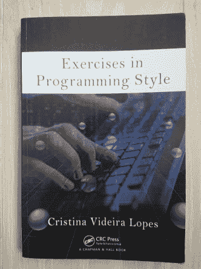

# 编程风格练习

> 原文：<https://dev.to/henrikwarne/exercises-in-programming-style-37ag>

在[工作中的读书俱乐部](https://henrikwarne.com/2016/11/08/developer-book-club/)，我们最近读完了 Cristina Videira Lopes 的编程风格的[练习。这本书包括一个用 33 种不同编程风格实现的简单程序。这是展示不同风格的好方法，这本书在读书俱乐部很受欢迎。这本书相对较新(2014 年出版)，我认为它还没有达到应有的知名度。因此，这里有一个总结和审查。](https://www.amazon.com/Exercises-Programming-Style-Cristina-Videira/dp/1482227371/) 

### 组织

灵感来自法国作家雷蒙·格诺 20 世纪 40 年代的一本书，名为《风格练习》。在书中，他用 99 种不同的风格讲述了同一个短篇故事。编程风格练习使用相同的概念，但是用 33 种不同的编程风格实现了一个短程序。每种风格都是由它对程序施加的约束来定义的。

该程序统计一个文件中出现的单词(词频)。样本输入是取自古腾堡收藏的书*傲慢与偏见*。该程序从文件中读取输入单词，删除所有非字母数字字符，规范化(小写)单词，删除停用单词(“The”、“a”、“for”等)，计算所有单词的出现次数，最后按顺序打印出 25 个最常用的单词。

所有的实现都是 Python，大部分程序都是书中的一两页。任务的大小刚刚好——需要一点编程逻辑，但是足够小，可以很快熟悉。同时，能够用所有不同的风格表达逻辑就足够了。

每种风格都以相同的方式在各自的章节中介绍。首先给出了样式的约束。然后列出这种风格的完整程序，包括行号，接着是对其关键特性的解释。接下来是对这种文体使用的评论、历史笔记、进一步阅读、词汇表和练习。

### 样式

不同的风格被归为九类。以下是对类别和样式的描述:

**历史。**这一类别中的第一个程序具有非常小的内存限制，并且没有标识符。只有记忆，可以用数字寻址。结果是一个在许多方面看起来像汇编程序的程序。第二种风格有一个数据栈，所有的操作都是在栈上的数据上完成的。

**基本款式。这里有三种风格来展示编程是如何发展的。第一种风格是*单片*，程序在功能上没有细分。相反，逻辑只是一长串语句。在下一种风格中，逻辑被分成函数，但是所有的函数都操作共享的全局变量。在第三种风格中，称为*管道*，函数不使用全局数据进行通信。相反，它们接收输入并产生输出。然后程序变成了一长串的函数调用。这一部分还包含 *Code Golf* ，重点是简短紧凑的程序(在这种情况下使用库来实现目标)。**

**功能构成。**本节展示了将函数调用连接在一起的三种不同方式。第一种使用递归。第二种使用了连续传递的风格，其中每个函数都被赋予了下一个应该被调用的函数。由此产生的程序有点难以阅读。第三个示例说明了 monad 的概念，所有函数调用和结果值都是通过 monad 完成的，创建了一个调用管道。

**物体与物体的相互作用。**这里有六种风格。前四个是常规面向对象的变体，从普通的面向对象程序和具有抽象类的程序，到如何实现面向对象的示例(例如，如何找到要调用的方法，以及如何存储对象的方法)。接下来是一个例子，说明在哪里注册回调，以及一个带有发布和订阅基础设施的版本。

反射和元编程。这里的主题是程序在执行时访问和改变自己。这种风格的第一个例子使用内省(Python 中的 *inspect.stack()* )来检查调用函数名。第二个使用 *exec/eval* 从包含 Python 代码的字符串中构建函数。第三个例子使用 Python decorators 来展示如何对函数进行剖析，即面向方面的编程(作者是 AOP 的创始人之一)。最后一个程序是一个插件架构的例子，其中来自外部文件的函数通过一个配置文件引入。

**逆境。这里展示了各种错误处理策略。在第一个示例中，当遇到错误时，会尝试使用“合理的”默认值继续。第二个在每个错误时抛出异常，第三个也抛出异常，但尝试在更高的级别处理错误。对于这些策略的利弊，以及实现起来是容易还是困难，有很好的讨论，这取决于语言是否支持异常。还有一个关于类型的例子，但是用 Python 来展示会变得非常笨拙。最后，受 Haskell 的 IO monad 设计理念的启发，有一个所有 IO 都被隔离的例子。**

**以数据为中心。**在这一节中，我们关注的是数据，而不是程序行为。第一个示例通过将所有单词放入数据库来解决这个问题，并使用 SQL 查询来查找最上面的单词。下一种样式模拟电子表格，其中更改的值触发依赖值的重新计算。最后一个示例处理流形式的可用数据(而不是一开始就获得完整的数据)。换句话说，数据是由接收器“拉”出来的，而不是从源端推出来的。Python 中的生成器(使用 *yield* )很好地解决了这个问题。

**并发。**这部分从我最喜欢的范例之一开始，演员。不同的线程发送和接收消息来解决任务，它们之间没有共享内存。这个例子的缺点是很难遵循程序流程。接下来的三个例子使用数据空间和 map reduce(两种变体)来划分任务，然后收集结果。

**互动性。**最后两个例子允许交互使用。第一个是 MVC(模型视图控制器)版本，尽管视图只是打印到控制台(没有 GUI)。第二个是 REST 解决方案，以最纯粹的形式，这意味着在每次交互中，下一个允许的动作总是被呈现出来以供选择。这两个例子都很好地说明了关键点。

### 观察

我读过相当多关于编程的书，但这本书是其中独一无二的。我非常喜欢通过以不同的方式实现同一个程序来展示各种编程风格和范例的方法。首先，每个案例都有一个具体的计划，而不仅仅是口头描述。第二，看到所有的程序一个挨着一个，以一种非常容易理解的方式突出了差异。

在工作中我们使用 Python，所以我们所有人在读这本书的时候都已经知道 Python 了。已经熟悉所使用的语言是很方便的，但是我认为即使你不知道 Python，这本书也很有用。有一些奇怪的地方，例如 Python 中的类，但是作者会在需要的时候解释这些。Python 唯一一次出现问题是在*逆境*部分展示类型如何防止错误的时候。

当谈到理解程序时，总会有一个非常好的章节叫做*解说*，详细解释每个程序是如何工作的。不过，在很大程度上，我更喜欢开始阅读代码，看看我是否理解它是如何工作的。通常这就足够了，但有时我会怀念没有 IDE 来搜索用法等的日子。不过我也可以这么做，因为所有的程序都可以在 [GitHub](https://github.com/crista/exercises-in-programming-style) 上下载。

每种风格都有参考资料和历史笔记。这些都很好，很有趣。尤其令人惊讶的是，有如此多的参考文件和书籍从 50 年代和 60 年代。也有很多提到 Smalltalk 和 Dijkstra。

在读这本书之前，我决定实施[我自己版本的](https://github.com/henrikw/exercises-in-programming-style/blob/master/word_count.py)项频程序。这让我稍微更好地理解了解决这个问题需要什么。不过，主要是为了好玩，看看我的解决方案是用哪种风格写的。最佳搭配竟然是*基本款*中的*流水线*。此外，在测试我的解决方案时，我注意到作者使用的*傲慢与偏见*样本输入除了书中的文本之外，还包括一些古腾堡计划的句子。我觉得这有点令人失望。

我对这本书唯一的批评是风格的命名。命名是众所周知的困难，但也是非常重要的，因为名字有助于你更好地记住风格，并使讨论更容易。在许多情况下，这些风格已经有了确定的名称，但是作者没有使用它们，而是想出了自己的名称。比如:*三位一体*代替 *MVC* ，*物*代替*物*，*好莱坞*代替*回调*，*公告牌*代替 *Pub/Sub* 和*向前踢*代替*传续*。那些名字都可以，但是坚持行业标准的名字要好得多。

### 结论

我非常喜欢这本书。它的方法是独一无二的，而且它真的成功地用适量的代码展示了各种各样的编程风格。看到概念被实现，并且能够容易地比较它们，是主要的优势。在大约 300 页的篇幅里，它设法用简洁的方式解释了很多。干得好！