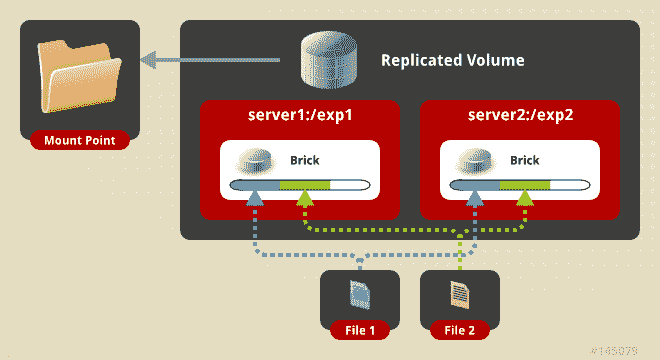
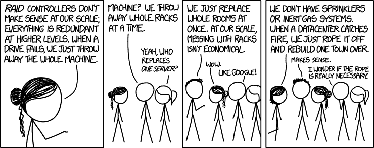

# 🤔解释分布式存储——以及它在 github / uilicious / cloud / etc 中的表现

> 原文：<https://dev.to/uilicious/explain-distributed-storage---and-how-it-goes-down-for-github--uilicious--cloud--etc-1mni>

# 背景语境

对系统管理员来说，这是糟糕的一个月(2018 年 10 月)，先是 youtube，然后是 github

> GitHub 状态@ GitHub 状态我们正在继续为[GitHub.com](https://t.co/IEoI8IWMw9)修复一个数据存储系统。在此过程中，您可能会看到不一致的结果。2018 年 10 月 22 日上午 04:12

首先:#感谢 github 的人们修复了他们的系统。保持大规模系统正常运行并不容易[(我自己也经历过)](https://blog.uilicious.com/uilicious-com-fileserver-downtime-incident-may-2018-part-1-9af14b72ec0c)

液体错误:内部

显然，尽管分布式数据存储在云中随处可见，但没有多少开发人员真正理解它...

那么，什么是分布式存储呢？为什么各大云提供商都在用？他们为什么会失败，又是如何失败的？

* * *

# 什么是分布式存储？

分布式存储，这里统称[“分布式数据存储”](https://en.wikipedia.org/wiki/Distributed_data_store)也叫“分布式数据库”[“分布式文件系统”](https://en.wikipedia.org/wiki/Clustered_file_system#Distributed_file_systems)。

从 NoSQL 潮流到最著名的 AWS S3 储物，它的应用形式多种多样。

核心概念是通过将数据分成多个部分，并确保在多个物理服务器上有副本(通常具有不同的存储容量)，在数据存储中形成冗余。

<figure>

[T2】](https://res.cloudinary.com/practicaldev/image/fetch/s--3aCBsgDZ--/c_limit%2Cf_auto%2Cfl_progressive%2Cq_auto%2Cw_880/https://thepracticaldev.s3.amazonaws.com/i/w897wff1d3z2gfn5vtzw.png)

<figcaption>GlusterFS replicated volume</figcaption>

</figure>

使用[擦除代码](https://en.wikipedia.org/wiki/Erasure_code)可以将数据副本存储为完整副本或压缩成多个部分

> 因为擦除代码、加密、奇偶校验位涉及复杂的数学来解释它们是如何工作的，并且除了压缩数据之外，对本文中的概念没有太大的改变。我会简单地用“复制品”这个不准确的词，来省去我们俩的数学课😉

无论使用哪种存储方法，这都有助于确保在 Y 台服务器上存储 X 份数据副本。其中 X <= Y(例如，5 台服务器上的 3 个副本)。

# 唉复杂的数学，我们为什么要这样做？

在大规模系统中，问题不是“如果”一个服务器将会失败，而是“何时”T2。毕竟，就硬件数量而言，这几乎是一个[统计事实](https://en.wikipedia.org/wiki/Mean_time_between_failures)。

您真的不希望这样一个大规模的系统在一台服务器打喷嚏时就崩溃。

这与过去更常见的单一服务器上的驱动器冗余(如 [RAID 1](https://en.wikipedia.org/wiki/Standard_RAID_levels#RAID_1) )形成鲜明对比，后者可以保护数据免受硬盘故障的影响。

如果操作正确，分布式存储系统有助于使系统在停机时存活下来，例如服务器完全故障，整个服务器机架被丢弃，甚至是数据中心发生[核](https://github.com/cockroachdb/cockroach) [爆炸](http://www.discovery.com/tv-shows/mythbusters/mythbusters-database/cockroaches-survive-nuclear-explosion/)的极端情况。

或者如 xkcd 所说...

[T2】](https://www.explainxkcd.com/wiki/index.php/1737:_Datacenter_Scale)

# 核证数据库？这样的系统岂不是速度极慢？

嗯，那要看情况...为什么会有这么多不同的分布式系统，部分原因是所有的系统都形成了某种折衷，有利于一个属性胜过另一个属性。例子包括延迟或[酸保证](https://en.wikipedia.org/wiki/ACID_(computer_science))。

分布式系统最常见的妥协之一是接受跨多个服务器协调数据所涉及的巨大开销。因此，当涉及到针对非分布式系统进行基准测试的单个服务器节点时，它们往往会失败。

然而，他们得到的回报是水平可伸缩性，比如跨越一千个节点的能力。

许多开发人员可能都经历过一个常见的例子:将单个大文件上传到云存储会有些慢。然而，另一方面，他们可以在钱包允许的情况下同时上传尽可能多的文件，因为负载将分布在多个服务器上。

<figure>

[T2】](https://res.cloudinary.com/practicaldev/image/fetch/s--2Jdmj6B4--/c_limit%2Cf_auto%2Cfl_progressive%2Cq_auto%2Cw_880/https://thepracticaldev.s3.amazonaws.com/i/ulkx1b4hwkwxnvnj9nz1.jpeg)

<figcaption>One giant death laser?</figcaption>

</figure>

或者对于 CERN(你知道，巨型大型强子对撞机)，这意味着 [11，000 台服务器](https://home.cern/about/computing)， [200 PB 数据](https://home.cern/about/updates/2017/07/cern-data-centre-passes-200-petabyte-milestone)，传输超过 [200 千兆比特/秒](https://home.cern/about/computing/processing-what-record)。迄今为止没有发现任何黑洞

所以没错，单个服务器“慢”。对于“快速”多服务器，您拥有并行性，副本分布在它们之间。

# 哦哇，爽。那么，这些复制品最初是如何产生的呢？

而不涉及任何一个分布式系统通常是如何工作的。

*   当客户端程序将一个数据写入系统时，它的副本会被同步创建到该过程中的各个其他节点中。

*   当读取一段数据时，客户端要么从一个副本中获取数据，要么从多个副本中获取数据，最终结果由多数投票决定。

*   如果发现任何副本由于崩溃而损坏或丢失，则从系统中删除其副本。并且创建一个新的副本并放置在另一个服务器上(如果可用的话)。这要么在读取时发生，要么通过背景检查过程发生。

*   决定什么数据是有效的或损坏的，以及每个副本数据应该在哪里，通常由“主节点”或通过“多数表决”来决定。有时是为了“随机”选择复制品的去向。

*   然而，需要注意的一个最重要的反复出现的事情是，在系统工作的所有冗余中，许多操作都需要多数表决。

# 有这么多冗余，它怎么还会失败？

开始时...这取决于你对失败的定义...

| 系统状态 | 描述 |
| --- | --- |
| 全部💚 | 每个节点和副本都在工作。耶！ |
| 大多数副本都是💚 | 一切都很好。副本可能会停机，但只要我们占多数，只要我们及时替换那些停机的副本，用户就不会注意到任何事情... |
| 大多数副本都是🔴 | 休斯顿，我们有麻烦了。根据系统设计，它要么进入只读模式，即硬故障状态，要么继续正常运行(罕见)其余节点，并遭受**裂脑**。 |
| 全部🔴 | 一切都完了。哎呀。希望我们可以恢复集群或还原那些备份。他们确实存在，对吗？😭 |

分布式系统的一大好处是，在许多情况下，当单个节点或副本出现故障时，在幕后会有一个系统可靠性工程师(或系统管理员)来替换受影响的服务器，而不会引起任何用户的注意。

> 这可能是所涉及的工作中最被忽视和费力不讨好的方面之一。没有人知道发生了什么。根据记录，这种情况今年已经在 Uilicious 内部发生过两次，对于谷歌和亚马逊这样规模的基础设施，我肯定这种情况每天都会发生。所以#hugops

另一件需要注意的事情是从商业角度对失败的定义。永久丢失所有客户数据比进入只读模式甚至系统崩溃要糟糕得多。

> 特别是对于 github，如果用户还没有提交数据，他们很清楚他们需要保存数据的本地副本，以便以后上传。但是，如果他们已经上传，他们可能会删除其本地副本，以便为其小于 1TB 的 SSD 存储笔记本电脑腾出空间。

因此，许多这样的系统被设计成首先关闭或进入只读状态，而这需要长时间的手动恢复，以确保数据安全。这被设计成“部分失效”。

最后...墨菲定律...意味着有时您的网络基础设施的多个节点或网段会出现故障。你将面临失去多数选票的情况。

# 那么冗余是如何确定的呢？

对于云系统，这通常意味着用新实例替换副本。

然而，取决于一个人的网络基础设施和数据集大小，时间是一个主要障碍。

例如，将单个 8TB 节点替换为千兆位连接(或有效的 800 兆位/秒)，大约需要 22.2 小时，或一整天。这是假设最佳传输速率会使系统饱和。为了保持系统正常运行而不出现明显的停机时间，我们可能会将传输速率减半，将所需时间增加一倍，达到整整两天。

自然，更复杂的因素将发挥作用，如 10 千兆位连接，或硬盘速度。

然而，要点保持不变，替换“大型”存储节点中损坏的副本几乎不是瞬间的。

> 这也是为什么你会看到关于数据在集群中同步需要多长时间的推文
> 
> > GitHub 状态@ GitHub 状态我们目前处于恢复操作的后期阶段，目标是在接下来的 2 小时内提供完全一致的数据。2018 年 10 月 22 日上午 06:51
> 
> 根据记录，考虑到他们可能正在运行一个多 Peta 字节的集群，在一天内同步数据是“很快的”

有时在这漫长的 48 小时里，系统管理员会感到紧张。对于 3 个副本的配置，如果要维护 2 个健康节点中的大多数，就没有出错的余地。对于 5 个副本的配置，将有 1 个备用空间。

当失去多数票时，会发生以下三种情况之一:

*   分裂的大脑:你最终会得到一个混乱的集群
*   只读模式:防止系统有两个不同的数据集(并因此分裂大脑)
*   硬系统故障:一些系统更喜欢引发硬故障，而不是导致大脑分裂。

# 唉，头好痛？什么是裂脑问题？

当你的集群开始分裂成两个部分时，分裂大脑就开始发生了。随着集群失去同步，您的系统将开始看到同一数据的两个不同版本。

当网络故障导致集群的一半与另一半隔离时，这种情况最常见。

如果发生数据更改，随后会发生的情况是，系统的一半会更新，而另一半会过时。

这是“正常的”，直到另一半重新上线。并且数据可能不同步，甚至由于与集群的另一半一起使用而被改变。

双方都会声称自己是“真实的”数据，并投票反对“另一半”。就像任何陷入僵局的投票系统一样，任何工作都无法完成。

<figure>

[T2】](https://res.cloudinary.com/practicaldev/image/fetch/s--fRFwlmRb--/c_limit%2Cf_auto%2Cfl_progressive%2Cq_66%2Cw_880/https://thepracticaldev.s3.amazonaws.com/i/u18ygco5oy42j4ah2ed9.gif)

<figcaption>Both: I'm the real one!</figcaption>

</figure>

即使副本数量为奇数，这种情况也会发生。例如，如果一个副本出现严重故障，并决定“不投票”

# 好的，那么我们首先该如何预防呢？

幸运的是，大多数分布式系统，只要配置得当，都是为了从一开始就防止裂脑的发生。它们通常有三种形式。

*   做出所有最终决定的主节点(然而，这可能会导致主节点的单点故障。一些系统退回到投票选举新的主节点(如果发生的话)。

*   硬系统故障，以防止这种分裂的大脑。直到群集全部正确同步备份；这确保不会显示“过时”的数据。

*   以只读方式锁定系统；这种情况最常见的迹象是某些节点以只读模式显示过时的数据。

后者是大多数分布式系统中最常见的，在最近的 github 宕机中也可以看到

> GitHub 状态@ GitHub 状态我们继续为[GitHub.com](https://t.co/IEoI8IWMw9)修复数据存储系统的工作。在此过程中，您可能会看到不一致的结果。2018 年 10 月 22 日上午 02:01

> 一个值得注意的例外是分布式缓存系统，如 [hazelcast](https://hazelcast.com/) :它将采用具有“最新”时间戳的数据方法来解决裂脑问题。
> 
> 在缓存用例中，这可能是“好的”,并且是有意这样做的，但是对于更持久的存储系统来说，这可能是一个大问题，因为它将导致数据被丢弃。在许多情况下，这种情况需要由程序员或系统管理员做出特定于上下文的决定来解决。

# 那太多了——那么我该如何使用其中的一个呢？

**你可能已经是了**

如今，大多数入门级的 AWS(T1)或 T2 GCP(T3)使用某种形式的硬盘“块存储”后端，这是一种分布式存储系统。

更著名的是对象存储，比如 S3 本身和几乎所有的云存储。即使对于专用服务器，大多数备份系统，如由 [linode](https://www.linode.com/backups) 和 [digital ocean](https://www.digitalocean.com/products/spaces/) 提供的备份系统，也使用某种形式的分布式存储。

除了云服务，还有许多使用分布式存储的开源部署。几乎所有的 NoSQL 数据库，甚至 kubernetes 本身，因为它部署了 [ETCD 分布式键值存储](https://github.com/etcd-io/etcd)。

随后针对值得注意的具体应用，有[蟑螂 DB (SQL)](https://github.com/cockroachdb/cockroach) ， [GlusterFS(文件存储)](https://docs.gluster.org/en/latest/)， [Elasticsearch (NoSQL)](https://www.elastic.co/) ， [Hadoop(大数据)](https://hadoop.apache.org/)。甚至 mysql 也可以部署在这样的设置中，称为[组复制](https://dev.mysql.com/doc/refman/8.0/en/group-replication.html)。或者可选地通过 [galera](http://galeracluster.com/products/) 。

使用这种分布式系统而不去想它的能力，最终是你为“云税”所支付的——为在幕后为你解决这些问题的人。

<figure>

[T2】](https://res.cloudinary.com/practicaldev/image/fetch/s--KNSnQ0RP--/c_limit%2Cf_auto%2Cfl_progressive%2Cq_auto%2Cw_880/https://thepracticaldev.s3.amazonaws.com/i/jx1k9a8nd5ax8euizvbc.jpg)

<figcaption>Cloud is not magic, someone actually needs to keep it working</figcaption>

</figure>

# 那么当 github 或者某个云提供商宕机了，我应该生气吗？

保持冷静和#hugops -给他们时间，他们可能已经尽力了。即使是最优秀的人也会犯同样的错误。

**特别感谢:**感谢 [@feliciahsieh](https://github.com/feliciahsieh) 帮我校对并修正我所有糟糕的逗号和语法。

* * *

# 关于 Uilicious

Uilicious 是一个简单而健壮的解决方案，用于自动化 web 应用程序的 UI 测试。[注册我们的免费试用](https://uilicious.com/pricing.html)并编写测试脚本来验证您的分布式系统，就像下面的脚本一样简单。