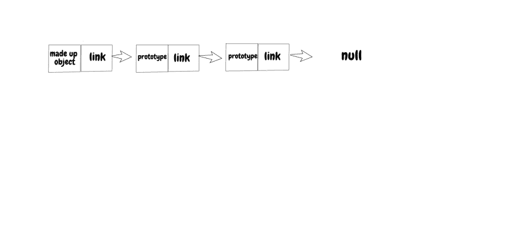
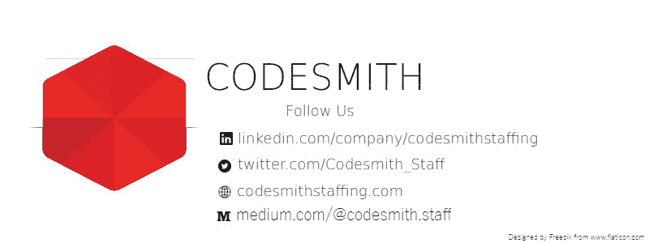

# 像五岁小孩一样解释 JavaScript 的原型链

> 原文：<https://dev.to/codesmith_staff/explain-javascripts-prototype-chain-like-im-five-51p>

* * *

[T2】](https://res.cloudinary.com/practicaldev/image/fetch/s--qUsD042l--/c_limit%2Cf_auto%2Cfl_progressive%2Cq_auto%2Cw_880/https://thepracticaldev.s3.amazonaws.com/i/5x4rpu4wh28ms82qqx1v.jpg)

*最初发表于 codburst.io 作为通过了解 JavaScript 的原型链来通过你的前端面试。*

当你第一次开始学习编程时，你可能会遇到面向对象编程这个术语。您查找了它的含义，发现它只是一个用属性将数据分组为“对象”的术语。

在许多编程语言中，用于创建这些对象的关键字是类。您用一个构造函数和几个公共和私有函数定义一个类。如果希望一个类继承另一个类，只需编写简单的继承语法和(wala！)你创造了一个继承链。

当然，如果您不是 JavaScript 开发人员，这一切都很棒。在 ES2015 之前，该语言没有实现一个类。相反，它使用并且仍然使用原型链。新的 ES6“类”只是一个甜言蜜语的句法混合物，隐藏了原型链的内部工作。如果您想在使用 JavaScript 的 OOP 范例的同时开发高性能代码，理解原型链的工作方式是至关重要的。

对于那些熟悉(或不太熟悉)计算机科学的人来说，原型链是一个链表。这太简单了，但是保持简单是理解的关键。以下是 Mozilla 对原型链的定义:

> 谈到继承，JavaScript 只有一个构造:对象。每个对象都有一个私有属性，该属性包含一个到另一个对象的链接，该对象称为其原型。该原型对象有自己的原型，依此类推，直到到达一个以 null 作为其原型的对象。根据定义，null 没有原型，并且充当这个原型链中的最后一环。

听起来很像一份清单，是吧？这个特定列表中的每个元素都包含一个称为原型的对象文字。

[T2】](https://res.cloudinary.com/practicaldev/image/fetch/s--DNmkkoge--/c_limit%2Cf_auto%2Cfl_progressive%2Cq_auto%2Cw_880/https://thepracticaldev.s3.amazonaws.com/i/fbol4z64ti4rom45ij2e.png)

上图有点误导，因为原型链中的最后一个元素总是 Object，函数和数组等所有实例都是从 Object 派生的。把原型链想成一个链表有什么帮助？

关于列表，我们应该知道一个主要的怪癖。当我们想遍历一个链表时，我们必须从链表的头部开始。因此，根据大 O 符号，在原型链中检索一个元素需要 O(n)时间。您可以开始想象如果原型链太长，您可能会面临的性能问题。

## 我们如何初始化我们的链？

我们需要做的第一件事是创建一个构造函数。按照 ES5 之前的标准编码，没有“经典”的方法来做到这一点。我们区分构造函数和其他函数的唯一方法是将第一个字母大写。然后，我们使用 new 关键字创建一个对象。注意:ES5 之前的例子是为了避开类语法。稍后我们将回到 ES5 的马车上。

```
function Bat(name){
 this.name = name;
}

let bob = new Bat('bob'); 
```

Enter fullscreen mode Exit fullscreen mode

我们初始化的每个构造函数都有一个免费的原型对象作为它的属性之一。我们可以命名一个键并给它赋值。

```
Bat.prototype.fly = function(){
  console.log('Im flying. Weeee');
};

Bat.prototype.detect = function(){
  console.log('I found a mouse!');
}; 
```

Enter fullscreen mode Exit fullscreen mode

您已经可以看到原型继承的优势了。我们可以在不修改类定义的情况下向类中添加方法，让链处理属性继承。这是我们的 Bat 对象的一个实例中的链的样子:

`Bob{name: bob}=>Prototype{fly: [Function], detect: [Function]} => Object {} => null`

现在，如果我们写 bob.name，我们得到“bob”。如果我们写`bob.fly()`，我们得到`‘Im flying. Weeee’`。嗯。我们如何在不呼叫`bob.prototype.fly()`的情况下进入`fly()`？

这不是魔法。JavaScript 的引擎首先在对象本身中寻找属性。如果它不在那里，它会遍历第一个原型，然后下一个……再下一个，直到找到它要找的东西或者命中 null。

## 把所有的东西放在一起

我们可以利用原型链来执行类继承。这种 OOP 方法也叫做子类化。

```
function Mammal(){
  this.bloodTemp = 'warm';  
}

function Carnivore(){

}

function Lion(name){
  Mammal.call(this);  //super. Inherit constructor
  this.name = name;
} 
```

Enter fullscreen mode Exit fullscreen mode

我们将创建一个超类和另外两个子类。食肉动物应该继承哺乳动物，狮子应该继承食肉动物和哺乳动物。

```
Mammal.prototype.growHair = function(){
   console.log('my hair is growing');
}

Carnivore.prototype = Object.create(Mammal.prototype);

Carnivore.prototype.eatMeat = function(){
  console.log('Mmm.Meat');
};

Lion.prototype = Object.create(Carnivore.prototype);

Lion.prototype.pride = function(){
  console.log('im king of the jungle');
}; 
```

Enter fullscreen mode Exit fullscreen mode

我们回到使用 ES5。将一个原型转换成一个独立的对象文字，然后我们可以将它指定为另一个对象的原型。这意味着我们在继承时忽略了超类的构造函数。
注意:这就是为什么我们在 Lion 的构造函数中调用了`Mammal.call(this)`，这样我们就可以借用哺乳动物的构造函数。

了解了 prototype chain 现在是如何工作的，您就可以看到从链接方法到链接对象是多么容易。下面是预期的输出:

```
var charlie = new Lion(‘charlie’)
charlie.growHair() // my hair is growing
charlie.eatMeat()  // Mmm.Meat
charlie.pride()    //im king of the jungle
charlie.bloodTemp  // warm 
```

Enter fullscreen mode Exit fullscreen mode

注意:为了达到同样的效果，你也可以用`Object.assign()`实现 mixins。

```
//classical inheritance
Lion.prototype = Object.create(Mammal.prototype);
//This is a mixin
Object.assign(Lion.prototype, Carnivore.prototype); 
```

Enter fullscreen mode Exit fullscreen mode

## 结论

与 sugary 类实现相比，使用 prototype 链创建方法和继承可能显得乏味。尽管如此，您开始欣赏的是 JavaScript 语言的动态和模块化特性。需要注意的一件重要事情是，你不希望被原型继承冲昏头脑。回想一下:charlie.growHair()函数在被执行之前必须沿着链向上移动很长一段距离。链越短，性能越好。

* * *

作者:
拉吉阿音拉|[https://dev.to/realrayinla](https://dev.to/realrayinla)|[rajiayinla858@gmail.com](mailto:rajiayinla858@gmail.com)

[T2】](https://res.cloudinary.com/practicaldev/image/fetch/s--lBFE85mW--/c_limit%2Cf_auto%2Cfl_progressive%2Cq_auto%2Cw_880/https://thepracticaldev.s3.amazonaws.com/i/rus3vez9s2udmpvfnjgm.jpg)