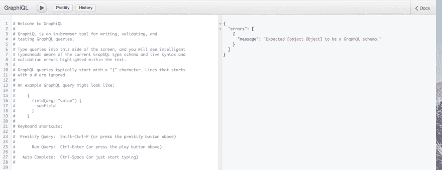
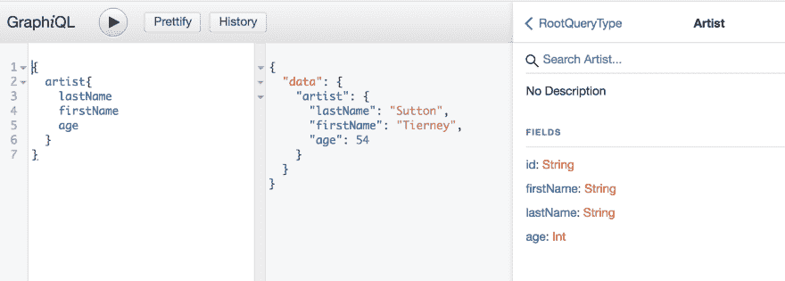

# 探索 GraphQL API

> 原文：<https://dev.to/aurelkurtula/exploring-graphql-api-serve-3abf>

在本教程中，我将介绍我所学到的关于 GraphQL 的知识。接下来的其他教程将建立在这里介绍的基础之上。从它的主页上我们了解到

> GraphQL 是一种 API 查询语言，也是一种用现有数据完成这些查询的运行时语言。GraphQL 为您的 API 中的数据提供了一个完整的、可理解的描述，让客户能够准确地要求他们所需要的，仅此而已

我们将使用 Express 作为 web 服务器，然后将 GraphQL 与它挂钩，让它充当 API

正如之前[所提到的](https://dev.to/aurelkurtula/creating-a-basic-website-with-expressjs-j92) express 是一个轻量级的 web 框架，它接受来自客户端的请求，并将适当的响应发送回浏览器。

我们现在可以将 GraphQL 挂接到 express(作为一个中间件)，并允许 GraphQL 接管对 GraphQL 的任何请求。

## 我们开始吧

在做任何事情之前，让我们从下载所需的包开始

```
npm install --save graphql express express-graphql 
```

Enter fullscreen mode Exit fullscreen mode

虽然`graphql`和`express`是意料之中的，`express-graphql`是连接 express 和 GraphQL 的粘合剂。

在`server.js`中，我们添加了以下代码。

```
import express from 'express';
import expressGraphQL from 'express-graphql';
const app = express()
app.use('/graphql', expressGraphQL({
    graphiql: true
}))
app.listen(4000, () => {
  console.log('http://localhost:4000')
}) 
```

Enter fullscreen mode Exit fullscreen mode

通常，如果我们单独使用 express，它会检查传入的客户端请求并发送响应。然而，通过上面的设置，Express 被设置为当向`/graphql`发出请求而不是响应时，Express 将请求移交给 GraphQL。

可以看出，`express-graphql`，我命名为`expressGraphQL`，作为一个 Express 中间件工作。

现在剩下要做的就是运行服务器(`npm start`)并导航到`http://localhost:4000/graphql`。在页面上，我们应该会看到一条错误消息:

```
{  "errors":  [  {  "message":  "GraphQL middleware options must contain a schema."  }  ]  } 
```

Enter fullscreen mode Exit fullscreen mode

让我们通过为 GraphQL
提供一个模式来解决这个问题

```
import schema from './schema/schema';
const app = express()
app.use('/graphql', expressGraphQL({
    schema,
    graphiql: true
}) 
```

Enter fullscreen mode Exit fullscreen mode

现在，当导航到`/graphql`时，我们得到一个不同的错误，但至少我们看到了 GraphiQL 接口

[T2】](https://res.cloudinary.com/practicaldev/image/fetch/s--tYbGB_WR--/c_limit%2Cf_auto%2Cfl_progressive%2Cq_auto%2Cw_880/https://thepracticaldev.s3.amazonaws.com/i/pn1msbj91l1okhmd7hio.png)

## 使用模式

模式文件用于指定数据的确切外观，并使用对象进行响应。我们将从这些数据开始:

```
{ 
    id: 1, 
    firstName: 'Tierney', 
    lastName: 'Sutton',
    age: 54
} 
```

Enter fullscreen mode Exit fullscreen mode

非常简单，当用户执行 GraphQL 查询时，他们将获得单个艺术家的信息。

在模式文件中，我们首先需要描述数据的属性，然后用与所描述的属性相匹配的数据进行响应。

先这样吧，

```
import {
    GraphQLObjectType,
    GraphQLString,
    GraphQLInt
 } from 'graphql';

const ArtistType = new GraphQLObjectType({
    name: 'Artist',
    fields:{
        id: {type: GraphQLString},
        firstName: {type: GraphQLString},
        lastName: {type: GraphQLString}, 
        age: {type: GraphQLInt},
    }
}) 
```

Enter fullscreen mode Exit fullscreen mode

这里我们指定了一个`Artist`类型，它有几个字段，每个字段都需要是一个特定的类型。每种类型都可以从我们已经安装的`graphql`包中获得，所以当使用每种类型时，不要忘记在顶部导入它。

## 根查询

根查询是 GraphQL 的入口点，它首先触发，然后暴露其他资源。在我们的例子中，根查询将公开`ArtistType`。

```
const RootQuery = new GraphQLObjectType({
    name: "RootQueryType",
    fields: {
        artist: {
            type: ArtistType,
            resolve() {
                return { 
                    id: 1, 
                    firstName: 'Tierney', 
                    lastName: 'Sutton',
                    age: 54,
                    description: 'this will not show'
                }
            }
        }
    }
}); 
```

Enter fullscreen mode Exit fullscreen mode

它仍然是`GraphQLObjectType`的一个实例，它仍然有一个名字和字段。它可能非常复杂，我们可能会在后面的教程中探索，但在这种情况下，它非常简单。

假设一个用户来到我们的应用程序并请求`artists`，在这种情况下，我们将返回我们已经指定的对象——对象`ArtistType`。

`resolve`是一个用数据填充对象属性的函数。`resolve`是一个 node/js 函数，因此我们将从其他 API 获取数据，或者从数据库中检索数据，并过滤它以适应`ArtistType`对象。但是上面我忽略了所有这些，只是简单地硬编码了一个对象，它具有`ArtistType`所要求的属性。

## 取数据而不是硬编码

我希望上面的例子能使`resolve`方法的使用非常清楚，但是更实际的用法应该是这个

```
const RootQuery = new GraphQLObjectType({
    name: "RootQueryType",
    fields: {
        artist: {
            type: ArtistType,
            resolve() {
                return axios.get(`https://gist.githubusercontent.com/aurelkurtula/0774efc9bf0d126a9d306964332f55b0/raw/8db0d128ba00ee69c298c0dc3f19265d1fcdefe7/artist.json`)
                .then(res => res.data)
            }
        }
    }
}); 
```

Enter fullscreen mode Exit fullscreen mode

如果您访问我们正在获取的的[内容，您会看到通过 axios 获取的 JSON 数据比我们需要的内容更多。但是 GraphQL 的用处正是如此，以一种易于使用的方式组织外部数据](https://gist.githubusercontent.com/aurelkurtula/0774efc9bf0d126a9d306964332f55b0/raw/7fe6f38bddaca3496743b8fd0d00eddb1e83210b/artist.json)

最后我们需要导出`RootQuery`

```
export default new GraphQLSchema({
    query: RootQuery
}); 
```

Enter fullscreen mode Exit fullscreen mode

仅此而已。

现在让我们转到浏览器`http://localhost:4000/graphql`并测试查询。

[T2】](https://res.cloudinary.com/practicaldev/image/fetch/s--91KLw4X7--/c_limit%2Cf_auto%2Cfl_progressive%2Cq_auto%2Cw_880/https://thepracticaldev.s3.amazonaws.com/i/3podva0z8zd2h5ndshpf.png)

我们需要做的就是打开一个空对象(访问根查询的内容)，然后“进入”`artists`，然后“获取”`ArtistType`
提供的属性

```
{
  artist{
    lastName
    firstName
    age 
  }
} 
```

Enter fullscreen mode Exit fullscreen mode

请注意，如果我们只想要他们的名字，我们可以简单地省略`lastName`和`age`