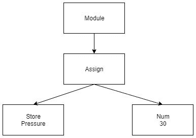

# 探索抽象语法树

> 原文：<https://dev.to/sheldonnunes/exploring-the-abstract-syntax-tree-2ce8>

# 探索抽象语法树

Hacktoberfest 让我走出了自己的舒适区，为不同的代码库做出了贡献。其中一个，一个 [python linter](https://github.com/wemake-services/wemake-python-styleguide) 给了我使用 python 抽象语法树的机会。

## 什么是抽象语法树？

> 抽象语法树(AST)是一种将编程语言的语法表示为分层树状结构的方式。

本质上，我们可以用这样一行代码:

```
pressure = 30 
```

并将其转换成树形结构:
[](https://res.cloudinary.com/practicaldev/image/fetch/s--UWpcgL7F--/c_limit%2Cf_auto%2Cfl_progressive%2Cq_auto%2Cw_880/https://thepracticaldev.s3.amazonaws.com/i/m1fj5ee4x1hrj27p5th2.jpeg)

维基百科的定义略有不同:

> AST 通常是编译器语法分析阶段的结果。它通常作为程序通过编译器要求的几个阶段的中间表示，并对编译器的最终输出有很大的影响。

所以 AST 是创建编译代码的一个阶段。显然，我们越来越接近机器所理解的东西了！

[T2】](https://i.giphy.com/media/zXmbOaTpbY6mA/giphy.gif)

这使我们能够遍历程序的结构，并报告任何问题(类似于 intellisense/linters ),甚至更改编写的代码。

Python 提供了一个用于解析和导航抽象语法树的库，被恰当地称为 ast。

使用前面的例子，我们可以使用下面的命令创建一个 ast:

```
import ast
code = 'pressure = 3'
tree = ast.parse(code) 
```

简单地打印树不会显示我们想要的结构和节点。相反，我们可以创建一个节点访问者，它将遍历树并给出每个节点的详细信息:

```
class Visitor(ast.NodeVisitor):
    def generic_visit(self, node):
            print(type(node).__name__)
        ast.NodeVisitor.generic_visit(self, node) 
```

现在，如果我们创建这个 visitor 类的一个实例，当我们调用 visitor.visit(code)时，我们将得到以下输出:

*模块*
*赋值*
*名称*
*存储*
*编号*

对于 linter 来说，这对于查看这些节点排序是否无效非常有用。一个很好的例子是当你有一个多余的 if 语句时，因为它总是得到相同的结果。

当我们在 if True 上运行 visit 我们得到以下结果:

*模块*
*If*
*name constant*
*Expr*
*省略号*

在这种情况下，`True`值就是`NameConstant`。ast 访问者允许我们创建特定的方法，当某个特定的`ClassName`被访问时，这些方法就会被调用。这是使用以下语法实现的:

```
def visit_{className}(self, node): 
```

在这种情况下，我们想要访问任何 If 节点并检查它的测试条件，以确保它不只是一个`NameConstant`(真、假或无)。这就是 [ast 文档](https://docs.python.org/3.7/library/ast.html)非常有用的地方，因为您可以看到每个节点类型都有哪些可用的属性。我们可以访问节点。测试条件如下:

```
statement = "If statement always evaluates to {} on line {} "
def visit_If(self, node):
    condition= node.test
   if isinstance(condition, ast.NameConstant):
      print(statement.format(condition.value, node.lineno))
   ast.NodeVisitor.generic_visit(self, node) 
```

在我们之前的例子中运行这个程序会给出一个很好的详细信息:

`If statement always evaluates to True on line 1`

您不仅限于“访问”AST 中的一个节点。使用另一个 pythons 类，你也可以使用`ast.NodeTransformer`来修改它们！这带来了非常酷的可能性，比如插入临时代码行来测试你的程序的代码覆盖率，或者甚至移植到其他语言

如果您想在 python 中使用 ast，我建议您查阅以下资源:

[绿树蛇-失踪的巨蟒 AST 文档](https://greentreesnakes.readthedocs.io/en/latest/index.html)

^:这个甚至包括一个实时的 web AST 可视化工具，可以帮助快速查看代码结构！

[官方 AST 文档](https://docs.python.org/3.7/library/ast.html)

这篇文章中的代码可以在[这里](https://github.com/SheldonNunes/AST-Example)找到

我想研究的下一件事是使用 NodeTransformer 将 python 转换成另一种语言，如 Javascript。

感谢阅读！
请在下面的评论中分享您的 AST 经验/使用案例！