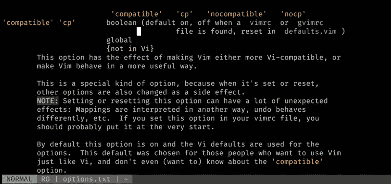

# 探索 Vim:将你的 Vim 设置得更好，或者...关于配置 Vim，您需要知道的最基本的事情

> 原文：<https://dev.to/vintharas/exploring-vim-setting-up-your-vim-to-be-more-awesome-at-vim-or-the-very-basic-things-you-need-to-know-about-configuring-vim-cbe>

*本文最初发布于[barbarianmeetscoding.com](https://www.barbarianmeetscoding.com/blog/2018/10/24/exploring-vim-setting-up-your-vim-to-be-more-awesome-at-vim)。😊*

> ### 欢迎来到探索 Vim 系列！
> 
> 如果你还没看过的话。看看这个系列之前的[篇。祝你生活愉快！](https://www.barbarianmeetscoding.com/blog/categories/exploring-vim)

在我们继续我们的 vim 牛逼之旅之前，我认为最好尽快解决一些问题，这样我们就不需要在传递本系列未来的每一篇文章时不舒服地把它塞进去:**如何设置、配置 vim 并保持它整洁、锋利和坚固，就像一把上了油的刀片**。

这不是一个关于如何配置 vim 的全面参考，而是一个快速、简短和甜蜜的指南，让您在几分钟内快速上手，更有效地学习和使用 vim。

[T2】](https://res.cloudinary.com/practicaldev/image/fetch/s--InyOh1WG--/c_limit%2Cf_auto%2Cfl_progressive%2Cq_auto%2Cw_880/https://www.barbarianmeetscoding.cimg/witcher-care-sword.jpg)

来自 thewitcher.com 的壁纸加上来自希里和杰洛特温馨团聚的引用。抱歉我刚刚看完《巫师 3》，无法阻止自己:D

## 如何配置 Vim？

您可以通过三种方式配置 vim:

1.  在命令行模式下使用 *Ex 命令*
2.  使用 vim 配置文件(`:h vimrc`)
3.  通过运行 vim 时终端提供的一组有限选项。(`:h vim-arguments`)

**Ex 命令**是命令行模式下以`:`为前缀的命令子集。例如，尝试打开 vim，键入:

```
:colo elflord 
```

Enter fullscreen mode Exit fullscreen mode

并按*键进入*。您会注意到，当您键入`:`时，无论您写了什么，都会出现在 Vim 屏幕的底部(当您处于命令行模式时，您的命令就会出现在那里)。按下*回车*后，这个 ex 命令将配置你当前的 vim 会话，并将配色方案改为强大的精灵领主常用的配色方案。

注意到我们如何使用`:colo`而不是`:colorscheme`了吗？你可以用速记来指代*前任指挥官*，维姆会尽力满足你的愿望，哦，主人。

### 如何编写可重用的配置？

你可以使用一次性的 *Ex 命令*来配置你的 vim 会话，但是那会很麻烦，而且对以后的会话没有多大用处。相反，vim 为您提供了将所有这些 *Ex 命令*配置放在一个文件中的可能性，只要您启动 vim，该文件就会被加载。`vimrc` ( `:h vimrc`)文件:

```
" Sample vimrc file.
" This is a comment :D
set nocompatible           " disable backwards compatibility with vi
filetype plugin indent on  " enable filetype plugins and indent
syntax enable              " enable syntax highlighting 
```

Enter fullscreen mode Exit fullscreen mode

注意没有命令是以`:`为前缀的？这是因为 vim 假设您放在 vimrc 中的任何东西都是 ex 命令。

有不同类型的选择，有不同的形状和形式。布尔选项很常见，比如上面通过`nocompatible`引用的选项。您可以使用`:set`命令以一种非常有趣和新颖的方式修改它们:

```
set compatible     " enable option
set nocompatible   " prepend 'no' to disable the option
set compatible!    " append ! to toggle the option
set compatible?    " find out whether the option is enabled
set compatible&    " reset to default vim option 
```

Enter fullscreen mode Exit fullscreen mode

您可以使用 vim 的帮助来查找关于可用选项以及如何配置它们的更多信息。尝试使用`:h option-list`查看所有可用选项的摘要，使用`:h options`查看完整交易。帮助非常好和详细。测试`:h compatible`来体验一下(注意这个选项只在 vim 中可用，因为 neovim 甚至不提供向后兼容 vi 的选项，如果你在 neovim 中，试试`:h 'filetype'`):

[T2】](https://res.cloudinary.com/practicaldev/image/fetch/s--e5Dl-hLS--/c_limit%2Cf_auto%2Cfl_progressive%2Cq_auto%2Cw_880/https://www.barbarianmeetscoding.cimg/vim-help-compatible.jpg)

## 你应该知道的一件事:如何定义你自己的键映射！

有一件事你会发现非常有用，那就是学习如何配置你自己的键映射。如果不编写自己的映射，至少要理解当有人建议您将 mapping ex 命令放到您的 *vimrc* 文件中时，它是做什么的。你不需要马上理解它，但是你可以理解它的要点，如果你将来需要的话，再回来。

用于映射的主要命令是`map`和`noremap`，其中`map`代表*映射*，而`noremap`代表*非递归映射*。让我们来看看它们是如何工作的，然后我们会看到递归部分的含义。

假设您已经完全疯了，您想要将`hjkl`键重新映射到键盘上一行的键。您应该在您的 vimrc 文件中编写类似这样的内容:

```
map y h
map u j
map i k
map o l 
```

Enter fullscreen mode Exit fullscreen mode

或者键入 ex 命令作为`:map y h`。这个命令的作用是创建新的自定义键映射，这样无论何时输入`yuio`，vim 都会将其理解为`hjkl`。

但是 vim 有模式！上面的键映射适用于哪些模式？

`map`命令在某种程度上是一种快捷方式，它一次将映射应用于三种 vim 模式:正常、可视和操作员待定模式。您可以通过提供希望映射应用于自己的模式来更加具体。比如:

```
" To make a mapping apply to a given mode, prepend it to the map command
" apply mapping only to visual mode
nmap y h
" apply mapping only to visual mode
vmap y h
" apply mapping only to insert mode
" (and now you can never insert the y letter again xD)
" (you're welcome! moahahaha!)
imap y h 
```

Enter fullscreen mode Exit fullscreen mode

好的，那么`map`做键映射。那`noremap`是做什么的？什么是递归和非递归映射？

`map`定义递归映射。当 vim 试图理解递归映射时，它会查看您输入的字符，并在发现新映射时递归地扩展它们。在上面的例子中，当您键入`y`时，vim 将查看`h`并尝试确定是否有任何其他的`h`映射。如果有，它将扩展映射。如果没有(像在我们的例子中)，它将只使用`h`。还不明白吗？放心吧！递归总是让我们难以理解。请看下面这个例子，它更能说明这些映射的递归性，也更容易理解:

```
" normally h means *left* and l means *right*
" this maps h to *right* instead of *left*
map h l
" this maps y to h.
" Normally that would mean that y would map to *right*
" However, this is recursive mapping, h will expand to l
" And therefore y will mean *right*
map y h 
```

Enter fullscreen mode Exit fullscreen mode

那么我们如何在保持`h`的**原始行为**的同时改变`h`映射，以便我们可以将它映射到`y`？这就是非递归映射的用武之地。非递归映射允许我们将 vim 键绑定到默认的 vim 键绑定。或者换句话说，非递归映射忽略所有其他映射，只做你明确告诉它们做的事情。(它们没有递归展开):

```
" this still maps h to *right* instead of *left*
map h l
" this maps y to h non-recursively
" which means that vim uses *h* default behavior which is *left*
noremap y h

" so h now gets the new meaning of *right*
" and y means *left* 
```

Enter fullscreen mode Exit fullscreen mode

何时使用递归和非递归映射？99%的情况下您希望使用非递归映射。非递归映射保证给定的映射将获得您想要的精确行为，因为它们完全不受其他映射的影响。一个新安装的插件可以改变一个映射，你自己也可以改变一个映射的含义，在任何一种情况下，你的非递归映射都不会受到影响。使用递归映射时，如果它突然停止工作，就像有人把地毯从你下面拉走一样。更糟糕的是，它还会产生一个死循环。剩下的 1%是什么？老实说，我想不出我想要使用普通映射的用例。如果你有，请写下评论！

您不仅限于将一个键映射到另一个键。您可以像这样创建更复杂的映射:

```
" This mapping comments a line in JavaScript
map c I//<Space><ESC>=<CR>
" It means, drop into insert mode at the beginning of the current line
" then add a couple of forward slashes (//) and go back to normal mode
" then adjust the indentation of the current line 
```

Enter fullscreen mode Exit fullscreen mode

或者甚至将键映射到 ex 命令:

```
" Mapping C-r to refreshing your vimrc configuration
map r :source $MYVIMRC<CR>
" Don't do this though. r is replace character in vim
" You'll probably replace characters far often than you
" refresh your vim config file 
```

Enter fullscreen mode Exit fullscreen mode

这里有一张来自 [vim-surround](https://github.com/tpope/vim-surround/blob/master/plugin/surround.vim) 插件的真实世界贴图供你欣赏。如果你有耐心和动力，试着去理解它做什么和奇怪的字符如`<silent>`、`<Plug>`等....卑鄙。如果你不喜欢运动，那就继续下一段吧！

```
" Used for changing the surrounding characters or tags of a bit of text
nnoremap <silent> <Plug>Csurround  :<C-U>call <SID>changesurround()<CR> 
```

Enter fullscreen mode Exit fullscreen mode

现在让我们结束这个映射的事情！没有第二个参数的`map`命令让您看到是否有任何映射与给定的键序列相关联。使用不带任何参数的`map`将显示所有可用的定制映射。您可以像在`:verbose map`中一样将它与`verbose`结合起来，以查看最后修改映射的文件。请注意，该命令将只显示自定义映射。如果您想检查 vim 的内置映射，您需要使用`:h index`(当您想确保您没有覆盖某些 vim 内置功能时，这很有用)。

最后，您可以使用`unmap`命令删除映射。它的工作方式与`map`和`noremap`类似，你可以使用`nunmap`、`iunmap`等替代命令将其应用于特定模式。

您可以使用 vim 的帮助`:h mapping`或`:h map-commands`找到关于映射和映射命令的更多信息

## 定义自己的命令

Vim 附带了大量命令，但是您也可以创建自己的命令。这是一个刷新 vim 配置的命令:

```
" User-defined commands must start with a capital letter
command! RefreshConfig source $MYVIMRC 
```

Enter fullscreen mode Exit fullscreen mode

把它放在你的`vimrc`中，你就可以像使用其他 ex 命令一样使用它:`:RefreshConfig`。为什么使用命令而不是自定义键映射？

我喜欢为我经常使用但不经常使用的东西创建自定义命令，它应该有自己的键映射。使用自定义命令，我可以方便地使用制表符补全，它们更容易记住，但它们不会妨碍我的键绑定，我保留这些键绑定是为了在编写和编辑代码时经常做的事情。

就像使用`map`一样，不带参数执行`:command`会列出所有可用的用户自定义命令，带单个参数执行`:command {cmd}`会列出所有以`{cmd}`开头的用户自定义命令。

要找到更多关于自定义命令的信息，请看一下`:h user-commands`(还有`:h 40.2`，它有一个用户自定义命令的入门指南)。

## 领队键

当您定制 vim 以满足您的需求并安装插件时，您可能会耗尽映射定制键绑定的空间。leader 键为您提供了一个新的命名空间，专门为用户定义的绑定保留，以便在您键入`<Leader><custom key sequence>`时释放混乱和破坏。默认情况下，前导键被分配给反斜杠`\\`，这可能很难键入。vim 用户通常会将那个键映射到另一个更容易到达的键。您可以使用下面的命令将它映射到不同的键:

```
let mapleader = "," 
```

Enter fullscreen mode Exit fullscreen mode

Vim 用户经常将 leader 键映射到`,`。如果您想这样做，请注意这会隐藏一个默认的键绑定，这在 vim 中非常有用:向后重复一次字符搜索，也就是说，与`;`相反。我更喜欢将我的 leader 键映射到`<Space>`，它总是在我右手拇指的下方，不会破坏任何内置的 vim 功能(据我所知):

```
" I have no clue why the first \ is needed
" in the line below but if I just map <Space>
" it doesn't work on my Mac
let mapleader = "\<Space>"; 
```

Enter fullscreen mode Exit fullscreen mode

您可以在自己的映射中使用 leader 键，将其称为`<Leader>` :

```
" remap J (join line) to go down 5 lines for faster movement
nnoremap J 5j

" but now I broke J (join line) which is quite nice if you write
" a lot of prose like I do (blog posts, books and such)
" So I remap it to <Leader>j
nnoremap <Leader>j J 
```

Enter fullscreen mode Exit fullscreen mode

## 用插件扩展 Vim

除了使用您的 vimrc 定制和扩展 vim 之外，vim 还支持第三方(通常是社区驱动和开发的)[插件](https://vimawesome.com/)来扩展它的新功能。不幸的是，vim 没有很好地集成插件浏览器/安装程序，也没有标准的插件管理器。相反，你所做的是使用 vim 生态系统中最常见的插件管理器之一:[vim-pathogent](https://github.com/tpope/vim-pathogen)、 [Vundle.vim](https://github.com/VundleVim/Vundle.vim) 或 [vim-plug](https://github.com/junegunn/vim-plug) 是最常用的。

> ### Vim 8 改进插件支持
> 
> Vim 8 内置了对插件的支持，这是以前版本的 Vim 所没有的。这个想法是把你的插件放到一个特殊的文件夹中，Vim 会在启动时加载它们。这比以前可用的要好，但是我认为有一个插件管理器可以简化很多事情。不用在这个特殊的文件夹中克隆 repos，你可以声明性地指定你想在你的 vimrc 文件中包含哪些插件，这样就可以了。
> 
> Neovim 也支持上述所有功能。其实这也是 Neovim 存在的原因之一。
> 
> 包和不同类型插件的本质已经超出了本文的范围，但是我保证会写一篇关于这个主题的更深入的文章！

我使用 [minpac](https://github.com/k-takata/minpac) (因为[德鲁·尼尔告诉我](https://amzn.to/2C1lozu))并且我过去使用过[vim-病原体](https://github.com/tpope/vim-pathogen)和 [Vundle.vim](https://github.com/VundleVim/Vundle.vim) 。对于我的简单用例来说，就是使用托管在 GitHub repos 上的插件，我没有发现这些选项有任何不同。所以你可以选择你想要的。

所有这些插件管理器都遵循相同的原则来扩展 vim:

1.  安装插件管理器(它本身就是一个 vim 插件)
2.  将它添加到您的`vimrc`
3.  在您的`vimrc`中以声明的方式添加您想要安装的插件列表。您将使用由您选择的插件定义的 DSL
4.  使用插件命令安装、更新和移除插件
5.  安装插件通常包括在 vim 插件文件夹中克隆 git repos

这是我的 vimrc 中的一个例子:

```
" Package manager minpac
" Initialize package manager
packadd minpac
call minpac#init()

" have minpac manage minpac :D
" use opt so that we can load the plugin via packadd before any other plugin
call minpac#add('k-takata/minpac', {'type': 'opt'})
"""""""" Add other plugins here:
" Colorschemes
call minpac#add('KeitaNakamura/neodark.vim')
call minpac#add('tomasr/molokai')
call minpac#add('Lokaltog/vim-distinguished')
call minpac#add('fenetikm/falcon')
call minpac#add('haishanh/night-owl.vim')
call minpac#add('rakr/vim-one')

" Editing
call minpac#add('tpope/vim-repeat')       " Enable repeating supported plugin maps with .
call minpac#add('tpope/vim-unimpaired')   " pairs of handy bracket mappings
call minpac#add('tpope/vim-surround')     " Quoting parenthesing made simple
call minpac#add('scrooloose/nerdcommenter') " Comments

" Customize UI
call minpac#add('itchyny/lightline.vim')  " Custom Status line

" File system
call minpac#add('junegunn/fzf')            " fuzzy file search
call minpac#add('junegunn/fzf.vim')        " fuzzy file search
call minpac#add('scrooloose/nerdtree')     " File tree explorer
call minpac#add('tpope/vim-projectionist') " Semantic based navigation configurable per project
call minpac#add('mhinz/vim-grepper')       " Search files

" etc... 
```

Enter fullscreen mode Exit fullscreen mode

所以，选择你最喜欢的一个，仔细阅读 vimawesome.org 的档案，寻找插件来为你通常开发的应用程序类型定制 vim。我的 wiki 中有一些关于有用插件的注释[(尽管它很大程度上是一个 WIP)，欢迎你先睹为快，看看我当前在 GitHub](https://www.barbarianmeetscoding.com/wiki/vim-plugins) 上的 [vimrc。](https://github.com/Vintharas/BarbaricNeoVim/blob/master/init.vim)

## 控制你的 vimrc

最后一条建议，作为一个好的伪君子，我自己还没有实施。检查 vimrc 的一个好主意是将它分解成更小的部分(就像软件模块化 FTW 一样)。您可以创建上下文特定的 vim 配置文件，并使用`source`命令:
将它们加载到您的 vimrc 中

```
" my vim config broken down
source plugins.vim
source navigation-mappings.vim
source editing-mappings.vim
source javascript.vim
" etc, etc... 
```

Enter fullscreen mode Exit fullscreen mode

> ### 更新:我现在已经在我的 vimrc 中实现了这个！耶！
> 
> 文件的路径必须是绝对路径。我在我的`.zshrc`中创建了一个 shell 变量`$VIMCONFIG`，它指向我的 vim config 文件夹:(在我的例子中是`/Users/vintharas/.config/nvim`)并使用该变量更新了上面的示例(例如`source $VIMCONFIG/navigation-mappings.vim`，等等)。欢迎你先睹为快我的 [vimrc](https://github.com/Vintharas/BarbaricNeoVim/blob/master/init.vim)

这也使您能够从 vimrc 中删除一些文件，并在需要时按需加载。

今天到此为止！很快再见！祝你有美好的一天！

## 更新！视频！！

以下是一些视频，带您了解如何设置 Vim。尽情享受吧！

[https://www.youtube.com/embed/QBMrKU-BWUk](https://www.youtube.com/embed/QBMrKU-BWUk)

## 好奇设置 Vim？

我们将在以后的文章中重新讨论 vim 的配置和定制，但是如果您不能等待，我有一个推荐给您。有一本**很棒的**书叫做:[学 Vimscript the Hard Way](http://learnvimscriptthehardway.stevelosh.com/) 作者是[史蒂夫·洛斯](https://twitter.com/stevelosh/)，这本书简直棒极了。绝对值得一读，因为您对 vim 越来越熟悉了。