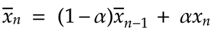

# 流数据的指数移动平均

> 原文：<https://dev.to/nestedsoftware/exponential-moving-average-on-streaming-data-4hhl>

> TL；dr:指数移动平均线比累积移动平均线对最近的数据更敏感，而且与累积移动平均线不同，随着数据量的增加，它不容易出现浮点精度问题。

我在[之前的一篇文章](https://dev.to/nestedsoftware/calculating-a-moving-average-on-streaming-data-5a7k)中写过关于累计移动平均线的内容。在本文中，我将探索这种思想的一种变体，称为指数移动平均线。

在一份评论中， [edA-qa](https://dev.to/mortoray) 指出，随着值的增加，累积移动平均仍然会带来精度问题。

我们会看到，[指数移动平均线](https://en.wikipedia.org/wiki/Moving_average#Exponential_moving_average)没有这个问题。它还有一个潜在的有用特性，即它对更新的值更敏感。

指数移动平均线的公式是[加权移动平均线](https://en.wikipedia.org/wiki/Moving_average#Weighted_moving_average)的特例。

> 加权平均值是简单平均值的变体。简单平均值是每个值的总和(总和)，除以值的个数(计数)。对于加权平均值，我们将每个值乘以一个数字，我们称之为其权重，然后将这些乘积相加，得出总数。然后我们除以所有权重之和。给定值的权重越高，它对加权平均值的贡献就越大。如果我们将每个值的权重指定为 1，那么加权平均值就变成了简单平均值。加权平均的公式为:
> [](https://res.cloudinary.com/practicaldev/image/fetch/s--6GS2Vidw--/c_limit%2Cf_auto%2Cfl_progressive%2Cq_auto%2Cw_880/https://thepracticaldev.s3.amazonaws.com/i/r1u9y6ep5npy3agfoxq7.png)

我不会展示加权移动平均的递归关系的完整推导。如果你感兴趣，详细内容在[托尼·芬奇的](https://dotat.at/)优秀论文[加权均值和方差的增量计算](http://people.ds.cam.ac.uk/fanf2/hermes/doc/antiforgery/stats.pdf)。推导过程和我们已经学过的累积平均值非常相似。

我们将从加权移动平均的递归关系开始:

[T2】](https://res.cloudinary.com/practicaldev/image/fetch/s--8YxY-W61--/c_limit%2Cf_auto%2Cfl_progressive%2Cq_auto%2Cw_880/https://thepracticaldev.s3.amazonaws.com/i/nywrf3qff6lpxhdq6o2y.png)

> 与累积平均值的公式相比，我们不是乘以 *1/n* ，而是乘以最近的重量与总重量之比。

*w<sub>n</sub>T3】是第 n 个值的权重，*x<sub>n</sub>T7】。*W<sub>n</sub>T11】是所有权重的总和:***

[T2】](https://res.cloudinary.com/practicaldev/image/fetch/s--fb1nIELn--/c_limit%2Cf_auto%2Cfl_progressive%2Cq_auto%2Cw_880/https://thepracticaldev.s3.amazonaws.com/i/ibbhnckvne0i7wfb9nrh.png)

如果我们将比率 *w <sub>n</sub> /W <sub>n</sub>* 设为一个常数，用希腊字母 alpha (α)表示，会发生什么？

[T2】](https://res.cloudinary.com/practicaldev/image/fetch/s--QZrhv2cf--/c_limit%2Cf_auto%2Cfl_progressive%2Cq_auto%2Cw_880/https://thepracticaldev.s3.amazonaws.com/i/b5cl7aqvzs4jsbol7s9g.png)

我们将 alpha 定义为介于 0 和 1 之间(不包括 0 和 1):

[T2】](https://res.cloudinary.com/practicaldev/image/fetch/s--me1cF_JK--/c_limit%2Cf_auto%2Cfl_progressive%2Cq_auto%2Cw_880/https://thepracticaldev.s3.amazonaws.com/i/0w2mticmgpqtv3o6fcyc.png)

定义α后，我们现在可以将其代入加权平均值公式:

[T2】](https://res.cloudinary.com/practicaldev/image/fetch/s--PC_cimIb--/c_limit%2Cf_auto%2Cfl_progressive%2Cq_auto%2Cw_880/https://thepracticaldev.s3.amazonaws.com/i/1xqh63lmmf8817gihq53.png)

这是指数移动平均线的递归关系。就基本逻辑而言，这就是全部了！我们将继续深入一点，以便我们可以理解选择定义α = *w <sub>n</sub> /W <sub>n</sub>* 所产生的性质。

我们可以用如下代码实现这个逻辑:

```
class ExponentialMovingAverage {
    constructor(alpha, initialMean) {
        this.alpha = alpha
        this.mean = !initialMean ? 0 : initialMean
    }

    update(newValue) {
        const meanIncrement = this.alpha * (newValue - this.mean)

        const newMean = this.mean + meanIncrement

        this.mean = newMean
    }
} 
```

Enter fullscreen mode Exit fullscreen mode

出现了几个问题:

*   阿尔法是做什么的？
*   我们应该将 alpha 设置为什么值？

为了帮助探究这些问题，我们将对递归关系进行一些修改。

首先，让我们将右边第二项和第三项中的α相乘:

[T2】](https://res.cloudinary.com/practicaldev/image/fetch/s--BmF8NtOP--/c_limit%2Cf_auto%2Cfl_progressive%2Cq_auto%2Cw_880/https://thepracticaldev.s3.amazonaws.com/i/ur5ik1pwad11ri2wt2gx.png)

重新排列顺序，我们得到:

[T2】](https://res.cloudinary.com/practicaldev/image/fetch/s--AgKBQ5RF--/c_limit%2Cf_auto%2Cfl_progressive%2Cq_auto%2Cw_880/https://thepracticaldev.s3.amazonaws.com/i/6oz8vi3m28dyayf9kzc2.png)

我们知道:

[")T2】](https://res.cloudinary.com/practicaldev/image/fetch/s--BHEnc6bW--/c_limit%2Cf_auto%2Cfl_progressive%2Cq_auto%2Cw_880/https://thepracticaldev.s3.amazonaws.com/i/005ekq80xutv3uc3ngky.png)

我们可以将此代入我们的等式，得到:

[T2】](https://res.cloudinary.com/practicaldev/image/fetch/s--weiHh-Yt--/c_limit%2Cf_auto%2Cfl_progressive%2Cq_auto%2Cw_880/https://thepracticaldev.s3.amazonaws.com/i/pm18ki3rf827k985e7vc.png)

这种形式的方程相当有用！我们可以看到，最近的值的权重为α，所有以前的值都调整为互补的权重 1-α。假设α是 0.7。最近的值将具有 0.7 的权重。也就是说，会贡献平均值的 70%。所有先前的值总共将贡献 1 - 0.7 = 0.3，或平均值的 30%。

我们可以用希腊字母 beta (β)来定义这个互补常数 *1 - alpha* :

[T2】](https://res.cloudinary.com/practicaldev/image/fetch/s--f4pbHRkg--/c_limit%2Cf_auto%2Cfl_progressive%2Cq_auto%2Cw_880/https://thepracticaldev.s3.amazonaws.com/i/3lvan4hlj61ai2317gop.png)

用β代替等式中的 1-α，我们得到:

[T2】](https://res.cloudinary.com/practicaldev/image/fetch/s--2uudDDLa--/c_limit%2Cf_auto%2Cfl_progressive%2Cq_auto%2Cw_880/https://thepracticaldev.s3.amazonaws.com/i/w5x0dsr31av3rgxjec90.png)

让我们修改前面的代码，使用这个版本的公式:

```
class ExponentialMovingAverage {
    constructor(alpha, mean) {
        this.alpha = alpha
        this.mean = !mean ? 0 : mean
    }

    get beta() {
        return 1 - this.alpha
    }

    update(newValue) {
        const redistributedMean = this.beta * this.mean

        const meanIncrement = this.alpha * newValue

        const newMean = redistributedMean + meanIncrement

        this.mean = newMean
    }
} 
```

Enter fullscreen mode Exit fullscreen mode

同样，让我们子类化`ExponentialMovingAverage`来跟踪每个新值使用的权重:

```
class ExponentialMovingAverageWithWeights
    extends ExponentialMovingAverage{
    constructor(alpha, mean) {
        super(alpha, mean)

        this.weights = [1]
    }

    update(newValue) {
        super.update(newValue)

        const updatedWeights = this.weights.map(w=>w * this.beta)

        this.weights = updatedWeights

        this.weights.push(this.alpha)
    }
} 
```

Enter fullscreen mode Exit fullscreen mode

> 跟踪重量是为了演示。生产中大概不可取吧！

权重是如何分配的？下面是到达 3 个值后的权重图，使用 0.1 的 alpha:

[T2】](https://res.cloudinary.com/practicaldev/image/fetch/s--jMUVFGlh--/c_limit%2Cf_auto%2Cfl_progressive%2Cq_auto%2Cw_880/https://thepracticaldev.s3.amazonaws.com/i/v19cru59vb2x4quydb3n.png)

这些权重是怎么算出来的？

*   我们将权重初始化为`[1]`:在任何数据通过之前，这个权重将被分配给平均值被初始化的值。如果平均值初始化为 0，那么第一个权重对移动平均值没有任何影响。
*   当第一个值出现时，我们将其权重指定为 0.1 (alpha)。之前的权重，目前只是`[1]`，乘以 0.9 (beta)。结果是我们现在有了`[0.9, 0.1]`的权重。
*   当第二个值出现时，我们依次将其权重指定为 0.1。之前的权重乘以β。权重变成`[0.9 * 0.9, 0.9 * 0.1, 0.1]` = `[0.81, 0.09, 0.1]`。
*   当第三个值到达时，我们再次重复这个过程:我们有`[0.9 * 0.81, 0.9 * 0.09, 0.9 * 0.1, 0.1]` = `[0.729, 0.081, 0.09, 0.1]`。

正如我们所见，权重之和总是等于 1。

让我们看看 alpha 为 0.1 的前 60 个值的权重:

[T2】](https://res.cloudinary.com/practicaldev/image/fetch/s--mm6YzraR--/c_limit%2Cf_auto%2Cfl_progressive%2Cq_auto%2Cw_880/https://thepracticaldev.s3.amazonaws.com/i/ul2nhjgfsw6yw2swthdf.png)

一旦值的数量足够多，我们可以看到一个指数曲线出现。Alpha 总是被分配给最近的值，权重从那里呈指数下降，因此被称为“指数移动平均”

> 因为我们选择了小于 0.5 的 alpha，所以在曲线的左侧总会有一个小的凸起。然而，从上图可以清楚地看出，随着新值的增加，这种影响很快变得不明显。

让我们来看看几个不同的 alpha 值(0.1，0.5，0.8)是如何影响权重的:

[T2】](https://res.cloudinary.com/practicaldev/image/fetch/s--Q_eN3hSJ--/c_limit%2Cf_auto%2Cfl_progressive%2Cq_auto%2Cw_880/https://thepracticaldev.s3.amazonaws.com/i/3fp3pnzx6brqgmdyvd64.png)

正如我们所看到的，alpha 值越高，最近的值越重要，其余数据的权重下降得越快。

现在让我们来看一些样本数据，并将指数移动平均线(alpha 设置为 0.1)与累积移动平均线进行比较:

[T2】](https://res.cloudinary.com/practicaldev/image/fetch/s--ieYrm090--/c_limit%2Cf_auto%2Cfl_progressive%2Cq_auto%2Cw_880/https://thepracticaldev.s3.amazonaws.com/i/f1ub7yyy3la2gugd7d7i.png)

我们马上可以看到的一个问题是，指数均值从 0 开始，需要时间向累积均值收敛。我们可以通过将指数平均值的初始值设置为第一个数据值来解决这个问题。或者，有时指数平均值是以初始值的较大样本的平均值作为种子的。

让我们再试一次，这次将指数平均值初始化为第一个值:

[T2】](https://res.cloudinary.com/practicaldev/image/fetch/s--zuh_Iz_U--/c_limit%2Cf_auto%2Cfl_progressive%2Cq_auto%2Cw_880/https://thepracticaldev.s3.amazonaws.com/i/09tvswud6d8p2wi3bk3e.png)

现在我们不必等待指数平均值赶上来了，太好了！

让我们再试一次，只是不使用 0.1 的 alpha，而是使用 0.8:

[T2】](https://res.cloudinary.com/practicaldev/image/fetch/s--5lC_OYBV--/c_limit%2Cf_auto%2Cfl_progressive%2Cq_auto%2Cw_880/https://thepracticaldev.s3.amazonaws.com/i/imz75m8wn3zzdsautlbm.png)

因为我们在这种情况下非常重视最近的数据，所以指数平均值几乎精确地跟踪实际数据，而不是非常接近累积平均值。

> 顺便提一下，虽然指数移动平均不会因为值的数量增加而遇到精度问题，但浮点仍然有问题:如果数据的密度非常高，我们可能希望使用非常小的α值，这可能会有问题。好消息是，这要么是个问题，要么不是。不会随着时间的推移而恶化。

那么，我们如何选择α的值呢？有两种方法:

*   找到一种分析方法，即公式。

*   使用特别的方法:换句话说，猜！

使用分析方法的一个例子是音频滤波，其中可以根据要滤波的频率阈值来选择 alpha(感谢示例中的 [edA-qa](https://dev.to/mortoray) )。然而，在许多情况下，经验法则或试错法可以产生适用于特定用例的 alpha。

> 指数移动平均也被称为[低通滤波器](https://en.wikipedia.org/wiki/Low-pass_filter)。那是因为它可以用来切断高频数据。例如，它可以用来消除音频中的高频噪声。
> 
> 在下图中，我们看到指数移动平均遵循函数 *f(x) = sin(x)* :
> 
> [")T2】](https://res.cloudinary.com/practicaldev/image/fetch/s--W8-MxaNE--/c_limit%2Cf_auto%2Cfl_progressive%2Cq_auto%2Cw_880/https://thepracticaldev.s3.amazonaws.com/i/xlx5cza91tnq460gyffk.png)
> 
> 现在我们给函数增加一个高频分量: *f(x) = sin(x) + sin(30x)*
> 
> [ + sin(30x)")T2】](https://res.cloudinary.com/practicaldev/image/fetch/s--Dz77vBdP--/c_limit%2Cf_auto%2Cfl_progressive%2Cq_auto%2Cw_880/https://thepracticaldev.s3.amazonaws.com/i/ydxovofo9i5vtrb6wdr3.png)
> 
> 我们可以看到，原始低频信号仍然非常清晰，但高频部分明显衰减。

在结束之前，我还将展示方差公式 s <sup>2</sup> ，它可用于计算指数移动平均的方差和标准差。我不会重复推导的步骤，但是你可以在[托尼·芬奇的](https://dotat.at/)论文[加权均值和方差的增量计算](http://people.ds.cam.ac.uk/fanf2/hermes/doc/antiforgery/stats.pdf)中找到推导。

[T2】](https://res.cloudinary.com/practicaldev/image/fetch/s--_YY8XFEO--/c_limit%2Cf_auto%2Cfl_progressive%2Cq_auto%2Cw_880/https://thepracticaldev.s3.amazonaws.com/i/in9md0ce1tr6wqi28ni6.png)

下面是这个逻辑的一个简单实现:

```
class ExponentialMovingStats {
    constructor(alpha, mean) {
        this.alpha = alpha
        this.mean = !mean ? 0 : mean
        this.variance = 0
    }

    get beta() {
        return 1 - this.alpha
    }

    update(newValue) {
        const redistributedMean = this.beta * this.mean

        const meanIncrement = this.alpha * newValue

        const newMean = redistributedMean + meanIncrement

        const varianceIncrement = this.alpha * (newValue - this.mean)**2

        const newVariance = this.beta * (this.variance + varianceIncrement)

        this.mean = newMean

        this.variance = newVariance
    }

    get stdev() {
        return Math.sqrt(this.variance)
    }
} 
```

Enter fullscreen mode Exit fullscreen mode

最后，让我们将简单标准差与 alpha 值为 0.1、样本数据与之前相同的指数版本进行比较:

[T2】](https://res.cloudinary.com/practicaldev/image/fetch/s--tueNjg0---/c_limit%2Cf_auto%2Cfl_progressive%2Cq_auto%2Cw_880/https://thepracticaldev.s3.amazonaws.com/i/kgr4zzfrfl7j6fmvz8x4.png)

> 探索指数移动平均线让我接触到了更广阔的过滤器世界。我们在本文中讨论的低通滤波器可能是最简单的滤波器之一。除此之外，整个世界打开了。过滤器用于许多不同的领域，包括图形和声音处理以及机器学习。

感谢 [edA-qa](https://dev.to/mortoray) 校对本文草稿并发现几个错误和问题。

参考资料:

*   [加权平均值和方差的增量计算](http://people.ds.cam.ac.uk/fanf2/hermes/doc/antiforgery/stats.pdf)，作者[托尼·芬奇](http://dotat.at/)
*   [移动平均线](https://en.m.wikipedia.org/wiki/Moving_average)
*   [低通滤波器](https://en.wikipedia.org/wiki/Low-pass_filter)

相关:

*   [计算流数据的移动平均值](https://dev.to/nestedsoftware/calculating-a-moving-average-on-streaming-data-5a7k)

*   [计算流数据的标准偏差](https://dev.to/nestedsoftware/calculating-standard-deviation-on-streaming-data-253l)

*   [标准差的几何形状](https://dev.to/nestedsoftware/the-geometry-of-standard-deviation--3m3o)