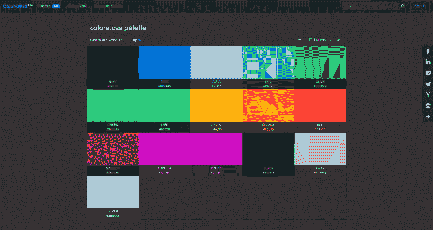

# 导出调色板到 SCSS/LESS/CSS 变量文件

> 原文：<https://dev.to/colorswall/export-colors-palette-to-scsslesscss-variables-file-1h0o>

1.  找到你的调色板或创建一个新的。
2.  用调色板打开链接(例如:[https://colorswall.com/palette/3](https://colorswall.com/palette/3))。
3.  按“导出”按钮。
4.  选择文件类型 SCSS，少或 CSS，并按下“下载”按钮。
5.  保存文件并享受。

视频版
[https://www.youtube.com/embed/M-APND5GUqE](https://www.youtube.com/embed/M-APND5GUqE)