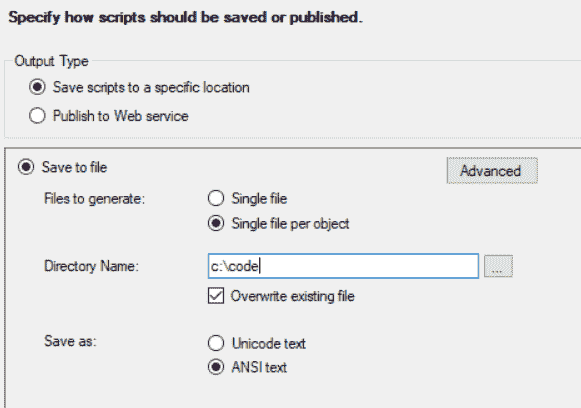
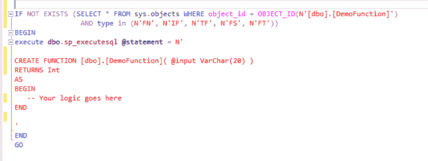

# 从 SQL Server 导出脚本以用于 DBUp

> 原文：<https://dev.to/goozenburger/exporting-scripts-from-sql-server-for-use-with-dbup-1j3>

最近我开始了一项新工作，我的首要任务之一是帮助改进数据库开发和部署过程。他们不再在开发数据库中管理所有变更，而是使用 SQL Compare 来推动变更。谢天谢地，他们已经开始了这个过程，使用 DbUp 编写和部署数据库增量脚本。这可以很好地工作，并且是我以前用于管理和部署数据库的技术。

改进该过程的下一步是将所有存储过程、函数和视图从数据库中编写出来，并作为代码库的一部分。应该对脚本进行任何更改，脚本现在在源代码控制中有一个历史记录，所有这些脚本都应该应用到每个部署的数据库中。

SQL Server Management Studio 确实提供了一些工具来帮助实现这一点，但是我发现我花了一些时间来获得所有正确的设置，以便按照我想要的方式导出内容，从而允许 DbUp 重复应用这些更改而不会出错。

右击数据库，选择任务，生成脚本
选择你想要的(进程、函数、视图等)
保存到文件，每个对象一个文件，并指定目标文件夹。我有一个单独的文件夹来存储过程、视图和函数，并分别导出它们。

[T2】](https://res.cloudinary.com/practicaldev/image/fetch/s--45kQUpj7--/c_limit%2Cf_auto%2Cfl_progressive%2Cq_auto%2Cw_880/https://thepracticaldev.s3.amazonaws.com/i/sr9ae1jvax4szw36r68g.png)

确保选择了 ANSI 文本，这样 git 就可以轻松区分文件。这是我第一次犯错的原因。

单击高级。
设置脚本使用数据库=假

对于存储的进程:
检查对象存在=真
脚本创建

这将为所有进程创建 CREATE + ALTER 脚本。(不需要编写 drop 脚本)。这样做的好处是不会删除现有的过程，以防您在过程上创建了自定义权限。

对于视图和函数，我们想做一些类似的事情，但是使用检查存在性的脚本 create 会生成字符串形式的 CREATE，这很难看，更难维护，并且只创建一次，而不是在创建后改变视图/函数。我认为这是由于 SQL Server 处理视图和函数的一些复杂性，而您可以很容易地创建一个伪存储过程并立即修改它。这里有一个例子:

[T2】](https://res.cloudinary.com/practicaldev/image/fetch/s--EJNVwLA6--/c_limit%2Cf_auto%2Cfl_progressive%2Cq_auto%2Cw_880/https://thepracticaldev.s3.amazonaws.com/i/9qyjsfqxztojdxflu3tg.PNG)

这显然没那么有用。但是我们不能总是删除和创建，因为如果视图/功能不存在(初始运行)，这将不起作用，并且我们不能总是创建，因为这是不可重新运行的。
所以:Do 2 生成。一个只用于水滴，检查是否存在。
第二次创建，不检查是否存在。取消选中覆盖，在高级中，设置附加到文件=真。

这为您提供了一组很好的文件，每个视图或函数一个，包括一个条件删除(如果存在的话),然后是一个创建，所以是可重新运行的。

要很好地了解如何将这些新导出的脚本与您的项目集成，并让 DbUp 在每次执行时运行它们，请点击这里:[http://wengier.com/reviewable-sprocs/](http://wengier.com/reviewable-sprocs/)