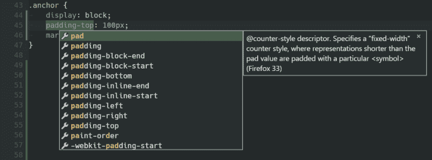
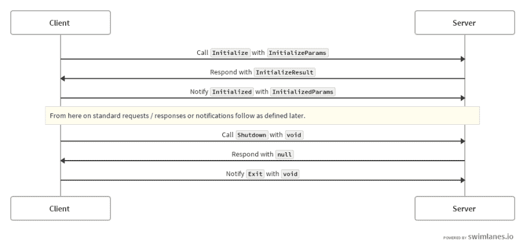
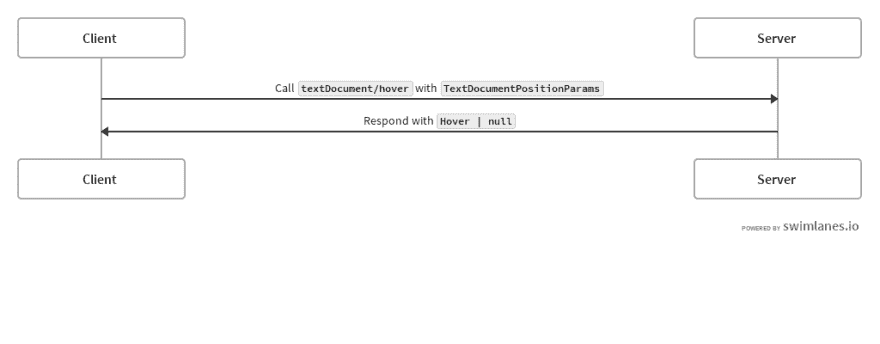
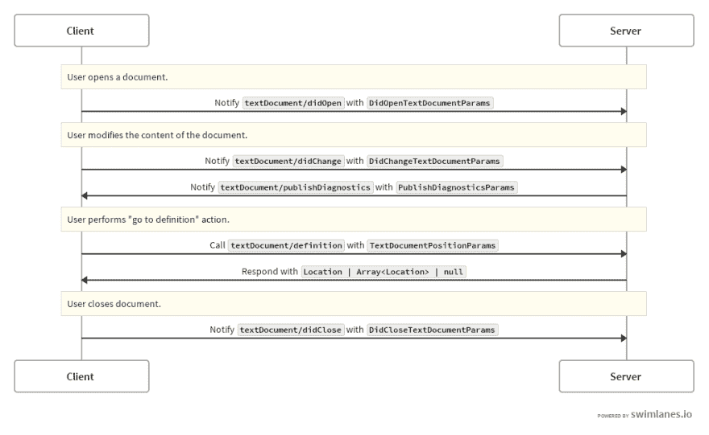
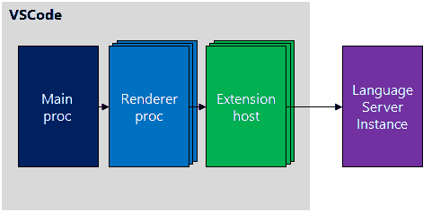
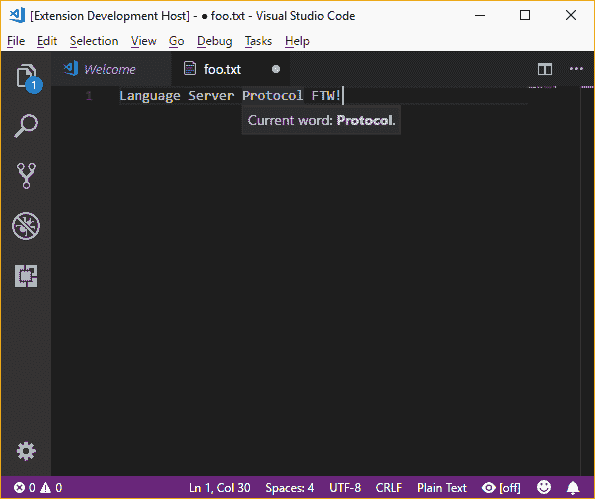

# 使用语言服务器协议扩展客户端

> 原文：<https://dev.to/bnevilleoneill/extending-a-client-with-the-language-server-protocol-2o74>

<figure>

<figcaption></figcaption>

</figure>

近年来，我们在编辑战线上看到了相当多的变动。一、[崇高文字](https://www.sublimetext.com/)来征服世界。它新颖的设计元素(预览栏、转到任何地方、即时命令提示符)与超强的可扩展性相结合，这对竞争对手来说太强了。后来，当 GitHub 启动了 [Atom 项目](https://github.com/danielbrodin/atom-project-manager)时，它似乎成了一个自然的继承者。

然而，性能问题和一般限制阻止了立即成功。编辑领域的网络技术之门似乎是敞开的，微软很高兴地介入了进来。VSCode 无非是 GitHub 的 Atom 用 Monaco 做代码编辑器，TypeScript 在扩展性核心的一个思路。

这种组合既优雅又强大。还有一件事让 VSCode 看起来如此吸引人:**语言服务器协议。**

语言服务器协议(LSP)是微软对旧的 n * m 问题的回答:考虑 n 种语言和 m 个编辑器——要使这些语言在所有编辑器上可用需要多少实现？

通过使用 LSP，我们可以将数量减少到语言的数量(或者如果一些语言是相似的并且可以被聚集，则甚至更进一步)。这怎么可能呢？好吧，我们所需要的是一个通用的规范，用于通信模式中常见的编辑任务。这个规范被称为语言服务器协议。

在本帖中，我们将研究如何使用语言服务器协议来实际扩展任何理解 LSP 的客户端。

### 语言服务器历史

这一切始于微软摆弄 C#(和 VBs)新的闪亮编译器的用例，代号为 [Roslyn](https://docs.microsoft.com/en-us/dotnet/csharp/roslyn-sdk/) 。罗斯林的特别之处在于，它的开发考虑到了可重用性和可扩展性。开发人员可以轻松地破解(或扩展)C#的基础，而不是成为一个黑盒。

此外，应该很容易将创建的基础用于未来的项目。微软创造了一些外部工具(其中一些甚至是在公司之外开发的)，但他们想创造一些不仅能展示这项新技术的伟大之处，还能增加 C# /的适应性的东西。NET 作为一个整体。

由于微软努力增加 C#在通常圈子之外的适应性， [OmniSharp](http://www.omnisharp.net/) 项目诞生了。它是一个简单的服务器，利用了。NET 及其新的编译器平台 Roslyn。

这个想法很简单:一个小的服务器层使得罗斯林的所有优点都很容易实现。因此，任何具有高级功能(即可扩展性)的编辑器都可以访问 Roslyn 的 C#文件信息，而不必重新实现这些细节。只需要将这样的服务器集成到编辑器中。

这个想法很有道理。不用在 N 个编辑器中开发一个高级的 C#语言扩展(因此复制了大量的特性，有不平等实现的风险和维护地狱的风险),只需要写几行代码；足够的线路连接到小型服务器。服务器本身可以完全使用 Roslyn，并在 C#中实现。

OmniSharp 项目相当成功。集成了所有已知的编辑器，如 vim、Sublime Text、Emacs 等。它们都提供了很好的体验，已经非常接近于在微软自己的旗舰 IDE Visual Studio 中使用 C#。

但是尽管 OmniSharp 为罗斯林和。NET 没有提供任何新的基础设施或语言集成基础。它只是展示了这样一个标准是完全缺失的，并且肯定会解决 OmniSharp 团队面临的一个问题:客户端(即各种编辑器)中缺失的集成导致了许多冗余的插件，这最终将导致维护地狱。

如果这种集成可以标准化，OmniSharp 团队将只需要处理服务器部分，而不是处理所有不同的扩展。

[T2】](https://logrocket.com/?cid=banner_a)

### 语言服务器基础知识

快进到 2018 年——我们意识到已经取得了进展，这样的标准已经存在，尽管该标准是人工产生的，尚未实现完全覆盖。该标准的最初工作由三家公司开始:微软、Red Hat 和 Codenvy。

今天，许多客户已经在那里，LSP 工作组的贡献者热衷于一起工作来改进现有的规范。在其核心，LSP 只为基于 JSON 的远程过程调用(RPC)定义了一个服务器，称为 JSON-RPC。JSON-RPC 已经相当古老、成熟并且相当简单。

有多种方法可以使用 JSON-RPC，但是在大多数实现中您会看到这两种方法:

1.  通信是通过标准输入/输出完成的，即命令行界面
2.  通过 TCP/IP 进行通信，即类似于 HTTP 的网络消息

该协议独立于通信格式。我们可以使用 telnet 或类似工具来建立连接。只要我们能发送字符串和接收字符串，我们就是好的。当然，字符串的格式需要遵循 JSON-RPC 规范，看起来像这样

[https://medium . com/media/8 F8 E8 a 163987 a 802686663 aeda 7 f 03 e 6/href](https://medium.com/media/8f8e8a163987a802686663aeda7f03e6/href)

总而言之，它只是一种基于 JSON 的 RPC 格式，带有一些特殊的规则和限制。一个重要的观察是 JSON-RPC 协议是完全异步的。对客户端的响应可以无序发送，并且没有时间限制。这激发了 id 参数的正确使用，该参数可用于将以前完成的请求与传入的响应进行映射。

#### 现在的问题是:JSON-RPC 是如何在 LSP 中使用的？

好吧，JSON-RPC 提供了所使用的通信和编程语言的抽象。因此，即使客户端(例如，VSCode)将使用一种技术(例如，Node.js)，语言服务也可以是完全不同的技术(例如，C#)，并且甚至不需要在本地运行。

理论上，这样的语言服务也可以在云中，尽管在 IDE 中包含如此高的延迟时间似乎不切实际。阻止这种实现的另一个限制是我们在客户机和服务器之间有一对一的关系。

引用该规范:

> 该协议目前假设一个服务器服务一个工具。该协议目前不支持在不同工具之间共享一个服务器。

简而言之:LSP 指定了几个定义良好的方法，包括它们的参数和结果(类型)。所有这些方法都应该可以通过 JSON-RPC 协议访问，因此自然与特定的技术或通信格式相分离。

### 协议要领

现在我们已经大致了解了 LSP 的基本原理，是时候实际研究一下协议了。默认情况下，协议假定服务器由客户端启动和关闭。因此，语言服务器的生命周期完全由其用户决定。

当然，多个实例是可能的，并且不应该相互冲突。协议的核心是区分双方发送的三种消息:

*   来自客户端的请求，应该有响应
*   来自服务器的响应，是对早期请求的回复
*   通知，即没有响应预期(发起者:客户端)或没有预先请求(发起者:服务器)的消息

在服务器启动后，客户端将发送一个初始化请求。然后，客户端将等待响应，并通过通知进行确认。然后交换标准通知和请求/响应，直到客户端发送关闭请求。但是，服务器在收到退出通知之前不会完全关闭。

下面的序列图说明了这个基础层:

<figure> 

<figcaption>语言服务器协议—基本消息流程</figcaption>

</figure>

对于初始化请求，有趣的部分是功能的交换。有两个很好的理由:

*   作为服务器，我们知道客户机支持什么，以及客户机是如何配置的；这影响了服务器应该如何处理事情
*   对于客户端，我们需要知道服务器可以做什么来避免没有(成功)响应的不必要的调用

请求信息包含的一条信息是当前项目的根路径(如果有的话)。当需要解析相对路径时，这将有助于确定正确的绝对路径。

交付的客户端功能分为两组，即单一文本文档功能和完整工作空间功能。还可以交付实验性客户端功能(未进一步指定)。在这篇文章中，我们将只讨论文本文档功能。

某个时候会出现一个问题:既然 LSP 主要处理文本文档，那么对二进制文档的支持是如何给出的呢？使用哪种二进制编码？

LSP 非常简单直接地回答了这些(以及类似的)问题:

> 目前不支持二进制文档。

因此，我们只能对基于文本的文件使用 LSP。因此得名**文本**文档。

回到我们之前介绍的响应，我们现在可能有兴趣看看初始化响应的接口看起来有多简单:

[https://medium . com/media/9e7d 9590 f 38 e73c 0 FCA 47425 ef 18 CD 17/href](https://medium.com/media/9e7d9590f38e73c0fca47425ef18cd17/href)

在这里，ServerCapabilities 实际上只是一个带有一些(可选的)预定义键的对象。每个键都解析为一个已知的能力。

这里，我们只实现一个。让我们假设我们实现了 hoverProvider 功能，该功能使客户端能够在悬停时获取打开的文本文档的部分信息(例如，文档或符号细节)。

因此，JSON-RPC 响应的结果片段可能如下所示:

[https://medium . com/media/d1dc 452 B1 b 23 AC 58 e 201567d 59 bad 75 a/href](https://medium.com/media/d1dc452b1b23ac58e201567d59bad75a/href)

在使用这种功能的情况下，交互看起来如何？这都归结于标准中规定的 textDocument/hover 方法。

直观演示:

<figure> 

<figcaption>语言服务器协议—悬停操作</figcaption>

</figure>

这里，悬停界面被指定为包含(可选)要显示的范围和要显示的内容。每个内容片段或者是一个简单的字符串，或者指定一种用于呈现的语言(例如 HTML)。TextDocumentPositionParams 是一个经常使用的接口。

它只包含两个属性:

*   对相关文档的引用(标准，是任何 textDocument/*方法的一部分)，该引用作为一个简单的{ uri: string }对象传输
*   感兴趣的位置，这是悬停时鼠标指针的列/行位置

位置包含两个属性，line(从 0 开始)和 character。后者比较棘手，因为它实际上是光标，总是在字符串的两个位置之间。因此，字符值 0 正好在第一个字符之前，而 1 在第一个和第二个字符之间。

事实上，对于前面显示的流，一个完整的(单个文档)流看起来更接近于:

<figure> 

<figcaption>语言服务器协议—文档编辑流程示例</figcaption>

</figure>

了解了这些知识之后，让我们来看一个示例服务器及其与真实客户机的集成。

### 一个样本服务器

现在，我们将为纯文本文件编写一个简单的服务器，它只有一个功能:处理悬停动作。对于该示例，我们希望显示一条格式良好的消息，其中包含实际悬停的单词。这也应该让我们对基本语言服务器 API 或工作流有所了解。

为了让下面的工作，我们需要安装 vscode-languageserver NPM 包。这个包(不管它的名字)并不紧密地绑定到 VSCode，可以很容易地用于通用语言服务器。正如我将在下一节中解释的，我们仍然需要一个专门的 VSCode 扩展(主要是为了元数据信息，但也有一些其他原因)。

使用前面提到的 NPM 包有几个原因。显然，这是语言服务器协议的一个经过实战检验的实现。它给了我们很好的语法糖，让我们快速前进。最值得注意的是，我们不必如此担心:

*   使用正确的功能名称(完全支持 TS)，
*   接收(和使用)能力(同样主要是 TS)，
*   整个初始化握手包括能力交换，
*   对 LSP(以及 JSON-RPC 之类的低级规范)的正确性，以及
*   处理整个连接

最后，让我们从一些基本功能开始。为了获得一些文本，我们可以使用下面的简单实现。注意:该算法显然只是一个粗略的近似，除了线边界之外，不处理*任何*边缘情况。

[https://medium . com/media/430d 9617 D8 cfe 9549 d4de 51378160730/href](https://medium.com/media/430d9617d8cfe9549d4de51378160730/href)

该函数将从 onHover 处理程序中使用。然而，在我们达到这个目标之前，我们需要建立连接。让我们来定义一下这是什么样子:

[https://medium . com/media/f 010d 839 b 31 b 6039 C4 f 49017 AC 38 AEC 3/href](https://medium.com/media/f010d839b31b6039c4f49017ac38aec3/href)

连接是 LSP 和底层 JSON-RPC 上的 vscode-languageserver 抽象。它支持多种类型的连接，这些连接通过读取器和写入器进行抽象。这甚至允许混合组合，如 IPC 读取器和控制台写入器。

现在我们可以实现 onHover 方法，返回一个悬停对象，以防我们需要响应。否则，为了简单起见，我们只返回 undefined。末尾的 connection.listen()启动实际的连接。

[https://medium . com/media/fca1a 7375952 fa 1a e2d 86 ed 1 F5 DDC 36 e/href](https://medium.com/media/fca1a7375952fa1ae2d86ed1f5ddc36e/href)

最重要的是，我们通过标识符(通过 uri 是唯一的)从连接的文档中获取文档。文档是一个很好的抽象层，负责通过 didOpen 和 didClose 之类的通知来管理文档的重复任务。然而，重要的是要认识到一个文档只包含几个函数。大多数函数只处理索引的位置解析，反之亦然。

最后，我们需要一种方式来告诉客户我们的服务器。这是我们需要深入编写 VSCode 扩展的地方。

### 扩展客户端

该协议有几种客户端实现。像往常一样，这个领域有一些大玩家。重要的是，如前所述，客户端也有传输能力。像服务器一样，客户端也可能不支持 LSP 的所有功能。主要是因为实施时间/重点，但有时也是因为技术挑战，例如插件层集成 LSP 的限制。最著名的实现存在于:

*   原子
*   Emacs
*   智能理念
*   崇高文本 3
*   vim/neovim
*   虚拟代码

这读起来有点像文本编辑器和/或 ide 的“谁是谁”，这不是巧合(除了 Visual Studio missing，它可能很快就会改变)。LSP 真正实现了它的承诺，毫不费力地将语言服务带到更多的平台上，这是任何文本编辑器(或 IDE)都可以从中受益的。

现有的 ide 可能抵制变化的一个原因是缺乏概要分析/调试。另一个可能是需要改变核心架构，以允许使用符合 LSP 的服务器或扩展。

像 Visual Studio 这样的产品的一个独特卖点是，它提供了集成的语言支持，对于所有受支持的语言来说，这种支持都是本地的、相同的。使用开源技术会带来许多不同的供应商，他们有不同的实现等级(和心态),这肯定会降低标准的用户体验。

> 此外，由于调试不是 LSP 的一部分，整个开发过程的很大一部分仍然会丢失，这使得微软的营销人员很难销售这种产品。

然而，我认为公平地说，支持 LSP 的好处远大于不必要的副作用。一旦发布了标准化的调试服务器协议(被称为调试适配器协议，简称 DAP ),由 DAP 和 LSP 组成的动态 duo 将会继续存在。

大多数客户端理论上可以使用几乎开箱即用的语言服务器，然而，有一些限制仍然要求我们编写某种粘合层(称为插件):

*   它使用户能够主动决定是否需要该服务器
*   它主动传输 LSP 之外的数据(与客户端相关的元数据)
*   它使插件的创建者能够使用多种技术，例如 DAP 和 LSP 与不同子系统的集成
*   它允许插件使用更多的特定客户端，例如，自定义通知、绑定到命令等。

现在，我们来看一个非常简单的 VSCode 插件。我们不会讨论太多细节，而是按照 KISS 来实现我们想要的一件事——集成我们的示例服务器。

此图说明了扩展如何使不同的呈现器超越 VSCode 的电子层；通过 JSON-RPC 访问外部流程。

<figure>

<figcaption>vs code 扩展主机通信到 LSP 实例。</figcaption>

</figure>

开始使用 VSCode 中的扩展的最简单的方法是安装 Yeoman 生成器(generator-code)。然后，我们可以继续使用 yo 代码创建一个新项目。不仅可以使用基本的样板文件，还可以使用有趣的工具，比如有效的 launch.json，只需按下 *F5* 就可以调试扩展。此命令将打开一个新的 VSCode 实例，并启用开发中的扩展，准备进行调试。

在 VSCode 扩展中，package.json 包含描述扩展的基本元数据。元数据用于例如决定何时激活扩展。激活是非常重要的，因为 VSCode 试图保守它的资源，并且不想将所有扩展全部加载到每个文件中。

为简单起见，我们可以只在选择某种语言时激活。在这里，假设我们的目标是一个纯文本文件(记住:最终我们的简单语言服务器只会在鼠标悬停时重复当前高亮显示的单词)。

[https://medium . com/media/e 9 e 57 b 32 b 029 ea 2d dbca e 674 A8 e 214 be/href](https://medium.com/media/e9e57b32b029ea2ddbcae674a8e214be/href)

当我们从(空的)样板文件开始时，我们的 package.json 只包含最少的内容。为了集成语言服务器，我们还应该添加 vscode-languageclient NPM 包。让我们将它添加到扩展的 devDependencies 中。

实际的扩展是什么样子的？正如 package.json 的 main 属性中所指定的，我们拥有 VSCode 扩展的根模块(例如，在 *src/extension.ts* 中)。这个需要导出激活函数。

通过前面提到的 vscode-languageclient 包可以很容易地激活符合 LSP 的服务器。它让我们专注于真正重要的事情；确定正确的应用程序，设置不同的通道，并定义与 VSCode 相关的元数据。

代码基本上是自我解释的。

[https://medium . com/media/F8 ebf cf 51915 a 90 e 24 AAF 03d 897 bbf 4a/href](https://medium.com/media/f8ebfcf51915a90e24aaf03d897bbf4a/href)

这里提供的执行上下文是唯一相关的部分。我们使用它来告诉 VSCode 关于创建的订阅，以便正确管理资源。然后，VSCode 将发送必要的命令来确保定义良好的行为。

调试服务器可以通过 launch.json 中的一个简单任务来完成(这样的文件是特定于 VSCode 的，需要存储在*中)。vscode* 目录)。

[https://medium . com/media/2d 7 BCE 0 bdda 9444 f2d 58053 D1 F2 cfe 69/href](https://medium.com/media/2d7bce0bdda9444f2d58053d1f2cfe69/href)

一个重要的注意事项:将服务器“安装”到我们的扩展中(如果我们想在单个存储库中创建它)是必要的，并且可能(取决于情况)不是直接的。VSCode 团队已经编写了一个小助手 installServerIntoExtension，它是通用语言服务器工具的一部分，因此如果我们已经安装了之前的包，它就已经可用了。

如下所示的命令将使用服务器的元数据和类型脚本配置(用于构建过程)将服务器从当前目录安装到 *client-dir* 目录中。

[https://medium . com/media/0 feaee 98 f 26221 be 05704642 D1 d 7624 f/href](https://medium.com/media/0feaee98f26221be05704642d1d7624f/href)

或者，通过 NPM 安装服务器或进行更熟练的磁盘搜索。关键的一点是服务器是独立启动的，因此需要自己的 *node_modules* 结构(以及其他东西)。

<figure> 

<figcaption>成功悬停显示信息。</figcaption>

</figure>

完成所有这些后，VSCode 现在可以融入我们提供的关于 hover 的信息。是时候在另一个编辑器中集成语言服务器了吗？

### 结论

LSP 的知识不仅仅在学术意义上有价值。它可以在许多不同的情况下给我们带来优势。语言服务器协议不仅是一项很好的技术，而且它还使用了其他值得了解的标准和技术。最后，使用 LSP 给了我们大量潜在的可重用性。

显然，我们不会定期编写自己的 IDE。然而，涉及某种语言处理的任务是相当标准的。如果所有的编译器/解析器都以 LSP 兼容工具的形式可用，我们可以很容易地连接和使用所提供的功能。

你在哪里接触过 LSP？你最喜欢 LSP 及其实现的哪些价值？有我们在这里没有提到的用例吗？请在评论中告诉我们！

### 参考文献

*   [语言](https://langserver.org)
*   [LSP 规范](https://microsoft.github.io/language-server-protocol/specification)
*   [JSON-RPC 规范](http://www.jsonrpc.org/)
*   [参考实现](https://github.com/Microsoft/vscode-languageserver-node)
*   长服务器坞站
*   [构建开发者工具的通用接口](https://developers.redhat.com/blog/2016/06/27/a-common-interface-for-building-developer-tools/)
*   [微软推出开源语言服务器协议](https://www.onmsft.com/news/devnation-microsoft-introduces-open-source-language-server-protocol)
*   [调试适配器协议模式](https://github.com/Microsoft/vscode-debugadapter-node/blob/master/debugProtocol.json)
*   [调试适配器协议问题/进度](https://github.com/Microsoft/vscode/issues/19636)
*   [示例语言服务器](https://code.visualstudio.com/docs/extensions/example-language-server)
*   [编写 VSCode 扩展](https://code.visualstudio.com/docs/extensions/overview)

### Plug: [LogRocket](http://logrocket.com) ，一款适用于网络应用的 DVR

[T2】](http://logrocket.com)

LogRocket 是一个前端日志工具，可以让你回放问题，就像它们发生在你自己的浏览器中一样。LogRocket 不需要猜测错误发生的原因，也不需要向用户询问截图和日志转储，而是让您重放会话以快速了解哪里出错了。它可以与任何应用程序完美配合，不管是什么框架，并且有插件可以记录来自 Redux、Vuex 和@ngrx/store 的额外上下文。

除了记录 Redux 操作和状态，LogRocket 还记录控制台日志、JavaScript 错误、堆栈跟踪、带有头+正文的网络请求/响应、浏览器元数据和自定义日志。它还使用 DOM 来记录页面上的 HTML 和 CSS，甚至为最复杂的单页面应用程序重新创建像素级完美视频。

免费试用。

* * *