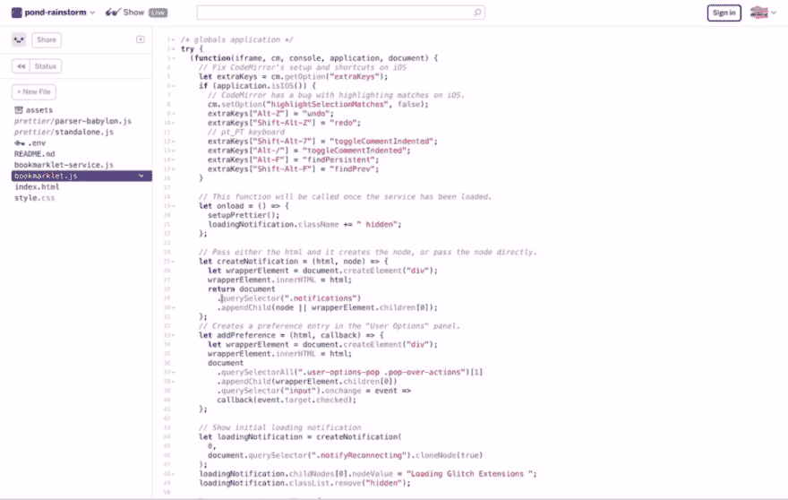
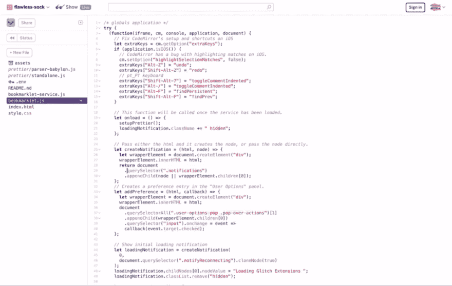
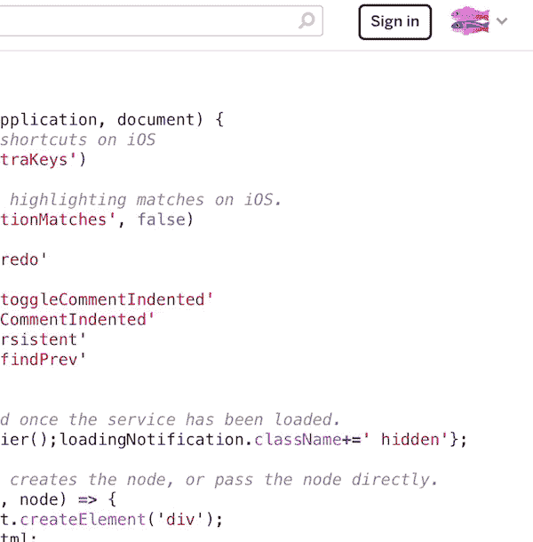
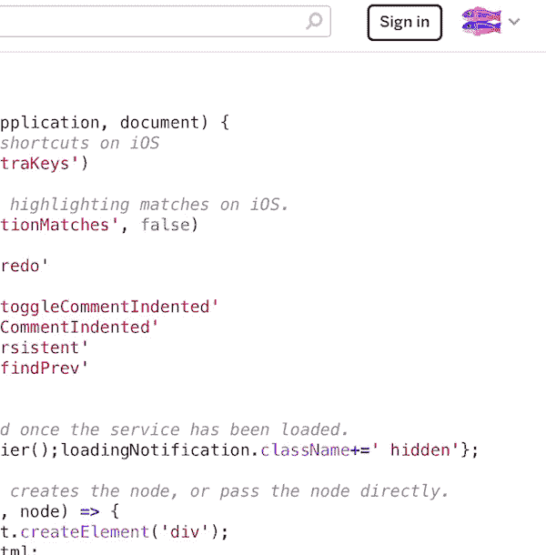
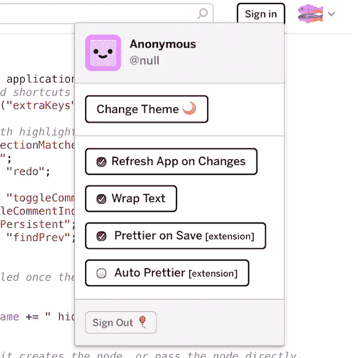

# 扩展毛刺

> 原文：<https://dev.to/aadsm/extending-glitch-2fe1>

如果你不熟悉它，Glitch 是“一个友好的社区，在这里每个人都可以在网上发现和创造最好的东西。”几个月前，在一位同事向我指出它之后，我发现了它，并立即爱上了它。我可以继续解释所有让我喜欢 Glitch 的东西(尽管有 50%是可爱的图形😍)但可以说，它为 iPad 带来了我在其他开发环境中从未见过的支持水平。由于现在我只使用 iPad，这对我来说是一个“游戏改变者”。
然而，尽管它很棒，但仍有一些问题拖慢了我的速度，所以我决定通过扩展来改进它。在这篇文章中，我将详细介绍我关注的两个主要方面——文本编辑器的改进和更漂亮的支持——但是在我继续之前，我将首先解释一下扩展的基础。

## 如何扩展(bookmarklets)

Glitch 不是开源的，所以我不能直接派生、修复和创建它的拉请求(就像我对 CodeSandbox 所做的那样[，我必须找到其他方法在它上面运行我的代码。最常见的方式可能是通过浏览器扩展，它们是可以安装在浏览器上的小应用程序，对浏览器上运行的内容具有强大的控制力。不幸的是，移动 Safari 不支持这种机制，所以对我来说这是一个没有去。](https://github.com/CompuIves/codesandbox-client/pull/749)

下一个最好的东西是 bookmarklets，这些是(顾名思义)书签，但不是在浏览器中加载一个特定的地址，而是运行代码！这是可能的，因为浏览器理解多种不同类型的 URL，URL 的类型(又名协议)是您在冒号之前看到的第一件事。比如在`https://www.glitch.com`中，`https`是类型，是最常见的一种，但是还有很多其他的，像`ftp`或者`mailto`也是..`javascript`！没错，如果你有一个网址`javascript:alert('My first Bookmarklet!')`，点击它，你会看到一个警告框，因为它只是一个网址，你可以把它保存为书签，每次你想运行那个代码时点击它。这是我做的所有扩展的基础。

如果你想尝试一下，你可以在这里安装扩展。

## iOS 上文本编辑器的改进

### 按键绑定

到目前为止，任何使用`Ctrl`或`Command` ( `Cmd`)的键绑定都不能在文本编辑器中工作。是的，这意味着，没有撤销(`Cmd-Z`)、搜索(`Cmd-F`)甚至阻止评论(`Cmd-/`)。这只是揭示了 Glitch 给我带来的价值，尽管我无法撤销它。]

所有这些都不是 Glitch 的错， [Mobile Safari 对`input type="text"`和`textarea`元素上的某些键](https://twitter.com/aadsm/status/1032694940684378112?s=21)的支持非常糟糕。到目前为止，由于没有按键事件发出，不可能知道该人何时按下了以下按键:`Left`、`Right`、`Up`、`Down`箭头、`Ctrl`和`Command`。
你可能注意到了，我没有提到`Alt`，那是因为这个发出事件！它需要，因为在 iOS(和 MacOS)上`Alt-<key>`将打印一个实际的字符(例如:在美国键盘上`Alt-P`将打印`π`)。

了解到这一点后，我做出了妥协:我用`Alt`键替换了所有的`Ctrl` / `Cmd`键绑定，代价是无法在美国键盘上打印某些“不常见”的字符，如`Alt-Z`的`Ω`，但现在我已经恢复了撤销的能力！

### 文本选择

还有一个问题让我抓狂，每当你在编辑器中选择一些文本时，它只会向下滚动到代码的某个随机部分，这使得几乎不可能选择文本。经过一些调试后，我意识到这是 CodeMirror 的`highlightSelectionMatches`功能中的一个错误(CodeMirror 是 Glitch 用于文本编辑的组件)。出于某种原因，当 CodeMirror 突出显示匹配选择的文本时，编辑器也会跳到那里。我还没有时间来理解为什么会发生这种情况，所以我只是禁用了这个功能。

<figure>

[T2】](https://res.cloudinary.com/practicaldev/image/fetch/s--rINW9fK0--/c_limit%2Cf_auto%2Cfl_progressive%2Cq_66%2Cw_880/https://cdn.glitch.com/0e714b41-7eb0-4c3b-9356-4a6c344ce977%252F28D0043E-E59E-44B7-8B5A-75A11E77D6B8.gif%3F1538962374057)

<figcaption>Editor jumping on selection</figcaption>

</figure>

### 改善它

你会问，所有这些如何转化为代码？好问题！CodeMirror 提供了一个非常全面的 API，所以我用它来改变按键绑定和禁用`highlightSelectionMatches`特性。然而，我需要首先获得 CodeMirror 实例，这实际上比我想象的要容易，因为 CodeMirror 将实例设置在相应的 DOM 元素上，虽然简单，但是很方便。因为整个文档中只有一个，所以我只需要`document.querySelector('.CodeMirror').CodeMirror`来获取它。以下是最终结果和最终代码:

<figure>

[T2】](https://res.cloudinary.com/practicaldev/image/fetch/s--VmdxRTvy--/c_limit%2Cf_auto%2Cfl_progressive%2Cq_66%2Cw_880/https://cdn.glitch.com/0e714b41-7eb0-4c3b-9356-4a6c344ce977%252F39CF730A-93D8-4D83-B9B6-DCE957F1E85A.gif%3F1538964226838)

<figcaption>Selection no longer makes editor jump and keybindings work</figcaption>

</figure>

```
let cm = document.querySelector('.CodeMirror').CodeMirror;
let extraKeys = cm.getOption('extraKeys');
cm.setOption('highlightSelectionMatches', false);
extraKeys['Alt-Z'] = 'undo';
extraKeys['Shift-Alt-Z'] = 'redo';
extraKeys['Alt-/'] = 'toggleCommentIndented';
extraKeys['Alt-F'] = 'findPersistent';
extraKeys['Shift-Alt-F'] = 'findPrev'; 
```

## 漂亮地支持

我每天在工作的时候都用漂亮的 save，现在我真的无法想象没有它的生活，所以我也不得不在 Glitch 上安装它。Prettier 通常在 node 上运行，但它也提供了一个在浏览器上运行的独立版本。这是我用来实现这个功能的。

一旦我开始，我很快意识到这不会像最初想的那么简单。通过 bookmarklet 添加新的脚本标签根本不起作用，这是因为`https://glitch.com/edit`实现了非常严格的内容安全策略(CSP)。

### 内容安全策略

CSP 是一组网页可以定义的规则，用来限制可以加载的资源类型。Glitch 有几个严重限制了运行外部代码的不同方式:

*   `script-src`:这个指令不仅指定了脚本标签中允许哪些源代码，还限制了从类似`eval()`或`Function()`的字符串中创建代码的能力。Glitch 只允许来自它自己的域`https://glitch.com/`和一些 CDN 域的脚本源加载静态资源，它还严格禁止通过 eval 创建任何代码。真是扫兴。
*   这个指令类似于上一个指令，它限制了框架或 iframe 可以加载的源代码。毛刺只允许`https://*.glitch.me https://*.glitch.staging.me https://*.glitch.development`。最后两个显然是为了 Glitch 本身的开发目的而包含的。
*   `connect-src`:这个指令指定了哪些源代码可以通过 JavaScript APIs 加载，比如`XMLHttpRequest`和`Fetch`。在 Glitch 的例子中，只允许它自己的 api 域——`https://api.glitch.com`——以及其他一些类似 github 的域。
*   `default-src`:该指令指定了未明确写出的任何其他指令的缺省值。在毛刺的情况下，这被设置为`'self'`，这意味着它自己的域。

所有这些都不允许我通过脚本标签包含任何漂亮的代码，或者通过 XHR 加载它，然后对它求值。

### 工作区

我在上面加入了`frame-src`指令，因为我注意到它实际上允许加载任何人创建的任何 Glitch 项目。这样做的原因是你可以并排看到代码和应用程序。iframe 和主窗口之间的通信是可能的，所以我利用它来加载和运行更漂亮的代码。

我创建了一个 Glitch 项目，它有一个独立版本的 prettier 和一个调用它的函数。我在 bookmarklet 创建的 iframe 上加载了这个项目，现在我只需要调用那个函数。

### iframe 的窗口

我的第一反应是使用`iframe.contentWindow`访问 iframe 的窗口，但是，只有当两个页面在同一个域中时，才能访问它的属性。这里的问题是主窗口在`*.glitch.com`上，而 iframe 在`*.glitch.me`上(所有 Glitch 应用程序运行的地方)。如果不是这样的话，我可以在两个页面上设置`window.document.domain = "glitch.com"`，把它们放在同一个域中，然后就完成了。但是，这只有在它们共享同一个二级域名时才有可能。

### 邮件 API

在不同域的页面之间进行通信的另一种方法是 postMessage API。这是一个简单的 API，由一个方法组成，这个方法在被调用时向窗口发送一个消息事件。`targetURI`参数是您想要将消息发送到的页面的 URL。这是一种确保你永远不会错误地将重要数据发送到另一个页面的方法，在我们的例子中，我们不在乎，所以我们使用`"*"`。
在我的例子中，我希望主窗口向 iframe 发送代码并接收格式化后的代码。我大致是这样编码的，首先是 bookmarklet，然后是 iframe:

<figure>

```
const editor = getEditor();
const iframe = createAndLoadIframe("https://glitch-extensions.glitch.me");
editor.onSave(function(code) {
  // Send the code to the iframe window.
  iframe.contentWindow.postMessage(code, "*");
  // Prepare to receive the formatted code back.
  window.addEventListener("message", function(event) {
    // Replace the editor text with the formatted code we got back.
    editor.setValue(event.data);
  });
}); 
```

<figcaption>Bookmarklet (running on `https://www.glitch.com/edit`)</figcaption>

</figure>

<figure>

```
<script src="prettier.js"></script> <script>
  // Listen to messages coming from the bookmarklet.
  window.addEventListener("message", function(event) {
    // Format the code received using the function provided by prettier.js
    const formattedCode = prettier.format(event.data);
    // Send back the formatted code.
    event.source.postMessage(formattedCode, "*");
  });
</script> 
```

<figcaption>iframe (running on `https://glitch-extensions.glitch.me`)</figcaption>

</figure>

正如你所看到的，这是一个异步 API，这意味着在保存和格式化代码之间可能需要一些时间。然而，由于两个页面都在浏览器上运行，这个操作非常快，你不会注意到任何延迟。

### 自动变漂亮(实验)

这是我正在尝试的一个功能，可以帮助我在手机上编写代码。在手机上格式化代码是一件非常痛苦的事情，更糟糕的是，在保存时没有简单的方法来触发更漂亮的代码。当打开时(默认情况下是关闭的)，它会在 2 秒钟不活动后自动格式化代码。

## 整合

最后，我希望这些扩展感觉像是 Glitch 生态系统的一部分。为此，我使用 Glitch 外观和感觉添加了通知和首选项:

### 加载扩展

<figure>

[T2】](https://res.cloudinary.com/practicaldev/image/fetch/s--yWm6ao9H--/c_limit%2Cf_auto%2Cfl_progressive%2Cq_66%2Cw_880/https://cdn.glitch.com/0e714b41-7eb0-4c3b-9356-4a6c344ce977%252FDC24057A-0990-4B7D-BC39-36476703AD1B.gif%3F1538967013939)

<figcaption>Notification of the extension being loaded</figcaption>

</figure>

### 美化

<figure>

[T2】](https://res.cloudinary.com/practicaldev/image/fetch/s--RJ1qWuFV--/c_limit%2Cf_auto%2Cfl_progressive%2Cq_66%2Cw_880/https://cdn.glitch.com/0e714b41-7eb0-4c3b-9356-4a6c344ce977%252FE9C59CB3-45E5-4E1C-BC7B-14BBA0E10DC0.gif%3F1538967013023)

<figcaption>Notification when prettierfying</figcaption>

</figure>

### 首选项

<figure>

[T2】](https://res.cloudinary.com/practicaldev/image/fetch/s--9UG1M4j_--/c_limit%2Cf_auto%2Cfl_progressive%2Cq_66%2Cw_880/https://cdn.glitch.com/0e714b41-7eb0-4c3b-9356-4a6c344ce977%252F51584132-68D0-4537-9EC7-78A1CE6F3C36.gif%3F1538967013818)

<figcaption>Additional user preferences for the extension</figcaption>

</figure>

这种集成的风险之一是它与毛刺产生的紧密耦合。作为第三方，这意味着 Glitch 可以单方面打破我的一些假设。但鉴于最终结果，我现在愿意冒这个险。

## 鸣谢

我要感谢 Glitch 团队提供了一个令人惊叹的产品，也感谢他们为所有代码提供了源代码图。这使我能够更好地理解底层逻辑，并挂钩和重用部分应用程序。