# 用无服务器微服务扩展传统软件

> 原文：<https://dev.to/scottlepp/extending-traditional-software-with-serverless-microservices-442m>

因此，我们有运行在 AWS ec2 实例上的“传统”软件。这太棒了，但现在我们希望增加新的功能。以下是一些传统的方法:

*   如果我们购买了软件(或开源软件)，我们必须请求这些功能，并希望它们发布下一个版本，然后我们必须等待下一个版本。
*   如果我们使用传统的方法开发软件，我们必须添加特性并通过严格的发布过程、回归测试等。

幸运的是，我们现在有了另一个选择:**微服务**。很好，但是现在我必须处理部署这些:使用容器，像 Kubernetes 这样的用于编排的东西，自动伸缩，更多 ec2 实例的成本，等等。啊...这似乎是一个麻烦。

幸运的是，我们还有另外一个选择:**无服务器微服务**。我们可以很快完成，没有任何麻烦，而且只有在使用时才需要付费。让我们深入一个真实的场景。

场景:我们在 ec2 上运行企业搜索软件。使用该软件，我们可以从几乎任何数据源索引数据，因此我们所有的企业内容都可以轻松搜索，包括我们放置大量内容的 S3 存储桶。这是伟大的，但当一些东西被添加到 S3，我们希望它立即出现在我们的搜索结果。该软件不支持“观察”S3 的变化。我们该怎么办？

幸运的是，该软件有许多 REST apis，包括一个对存储库执行“扫描”并拾取更改的 api。完美！这让它变得超级简单！在几分钟内，我们就可以添加一个 Lambda 函数来调用 ec2 实例上的 REST api。S3 允许我们在桶中添加任何东西时触发新的 Lambda 函数。瞧啊。我们有了新的 S3“观察”功能...这是一种独立的微服务。不需要传统的完整发布过程/回归测试！

我们开始吧！这只需要几分钟的时间！

让我们假设我们已经在使用 AWS，我们的“传统”软件已经在 ec2 上运行，并且它连接到我们已经创建的 S3 桶。我们将使用 AWS Lambda 函数添加新的“观察”功能。

步骤 1:添加一个 Lambda 函数

选择-服务>计算>λ
[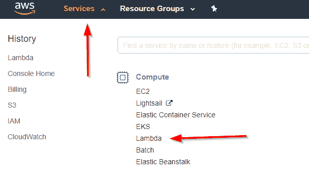](https://res.cloudinary.com/practicaldev/image/fetch/s--Th8jh3AO--/c_limit%2Cf_auto%2Cfl_progressive%2Cq_auto%2Cw_880/https://thepracticaldev.s3.amazonaws.com/i/ipfu1kpuy7rf4xnjc90w.png)

点击创建功能
[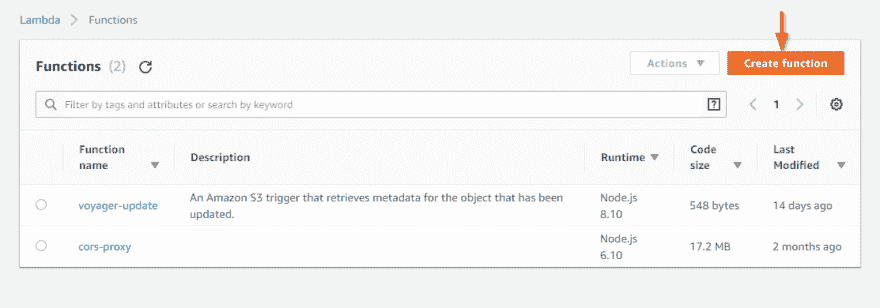](https://res.cloudinary.com/practicaldev/image/fetch/s--brd-dBaG--/c_limit%2Cf_auto%2Cfl_progressive%2Cq_auto%2Cw_880/https://thepracticaldev.s3.amazonaws.com/i/1dvn7l6133o9xncroag6.png)

创建您的函数。我们将使用 Node.js，因为我喜欢一种语言用于整个堆栈的想法，没有语言上下文切换，提高了生产率等(但那是另一个故事了)。

在创建之前，看下一个截图来选择你的角色。
[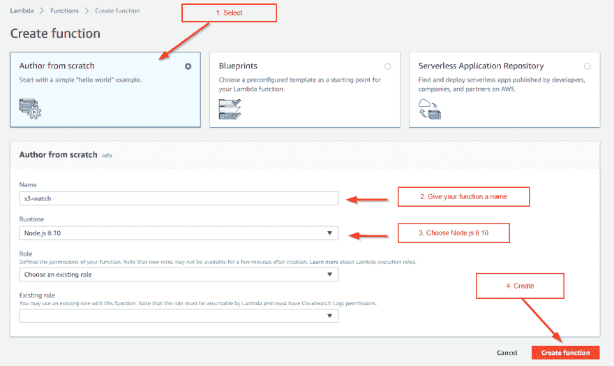T3】](https://res.cloudinary.com/practicaldev/image/fetch/s--F8UUB0LC--/c_limit%2Cf_auto%2Cfl_progressive%2Cq_auto%2Cw_880/https://thepracticaldev.s3.amazonaws.com/i/onjdsl8nsjs2lyjb3ur3.png)

选择您的角色，然后单击“创建功能”

[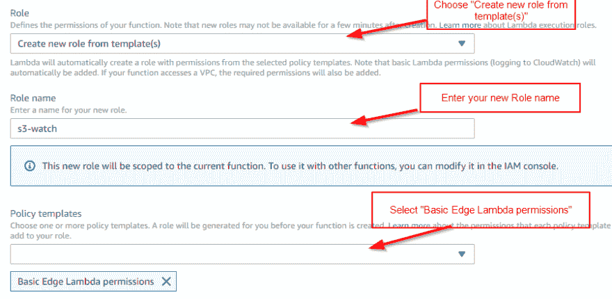T2】](https://res.cloudinary.com/practicaldev/image/fetch/s--HtINXan2--/c_limit%2Cf_auto%2Cfl_progressive%2Cq_auto%2Cw_880/https://thepracticaldev.s3.amazonaws.com/i/x4pu0wt1l5vspk1x901q.png)

1.  向 Lambda 函数添加触发器

[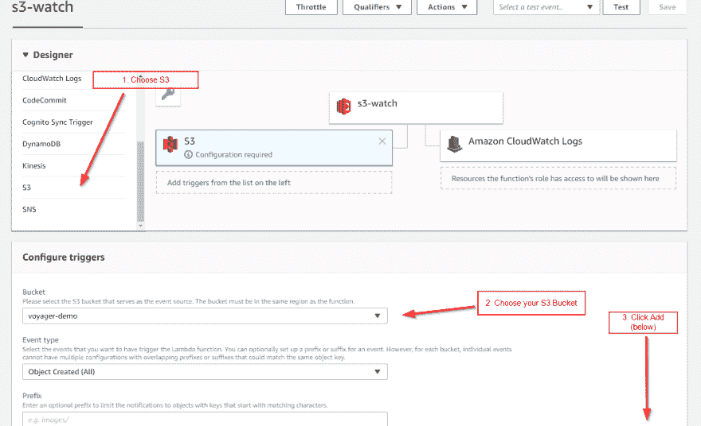T2】](https://res.cloudinary.com/practicaldev/image/fetch/s--yt0bbRec--/c_limit%2Cf_auto%2Cfl_progressive%2Cq_auto%2Cw_880/https://thepracticaldev.s3.amazonaws.com/i/1ufgf6u1rmqe7cwqt62v.png)

1.  添加 Javascript 代码来调用 REST api。

这是对运行我们的“传统”软件的 ec2 实例执行一个简单的 HTTP PUT，该软件将扫描我们的 S3 存储库的变化，并只索引变化，以便新内容是可搜索的。

为了简单起见，这里我们对 http 选项进行了硬编码，但是我们也可以轻松地创建这些环境变量。

在这里查看完整代码(没有 AWS 处理程序包装函数只有 20 多行代码):[https://gist . github . com/Scott lepp/0a 12873095336 c 9 cc 1 f 0 fa 296 c 3581 ef](https://gist.github.com/scottlepp/0a12873095336c9cc1f0fa296c3581ef)

[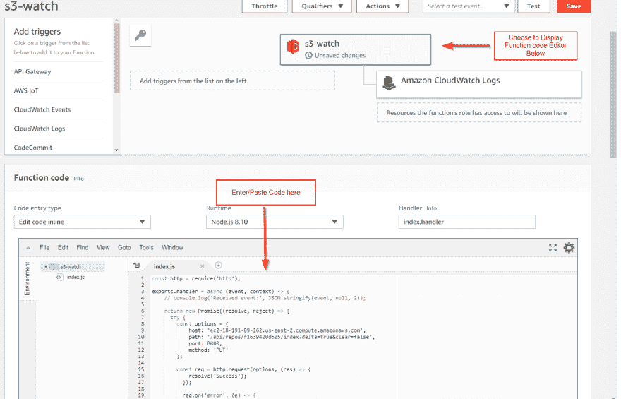T2】](https://res.cloudinary.com/practicaldev/image/fetch/s--A3lxdQKM--/c_limit%2Cf_auto%2Cfl_progressive%2Cq_auto%2Cw_880/https://thepracticaldev.s3.amazonaws.com/i/lokpau53d2pf9cr3sezy.png)

1.  省省吧。就是这样！

现在我们来测试一下。

第一步。配置新的测试事件

[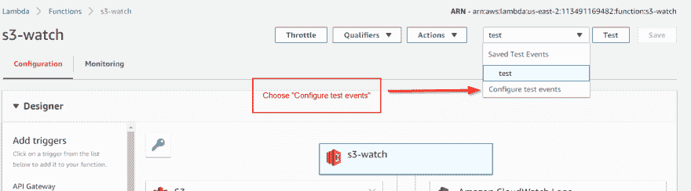T2】](https://res.cloudinary.com/practicaldev/image/fetch/s--ezNY1UEO--/c_limit%2Cf_auto%2Cfl_progressive%2Cq_auto%2Cw_880/https://thepracticaldev.s3.amazonaws.com/i/yorovksm42t7yl1bqrtk.png)

第二步。选择事件模板并创建

[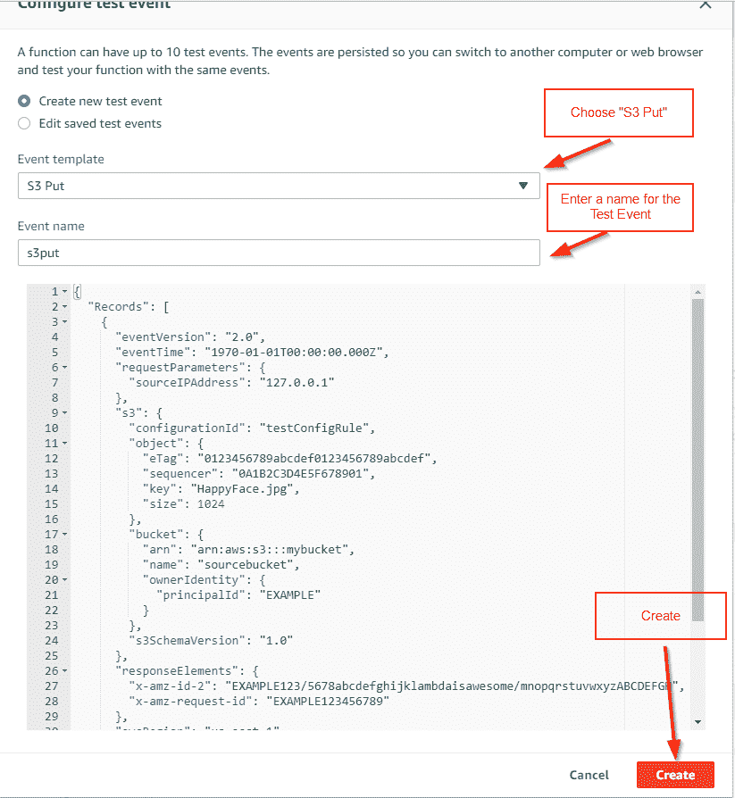T2】](https://res.cloudinary.com/practicaldev/image/fetch/s--ldjt-NL9--/c_limit%2Cf_auto%2Cfl_progressive%2Cq_auto%2Cw_880/https://thepracticaldev.s3.amazonaws.com/i/cbhvt07369q7h1n0cakv.png)

第三步。运行它！有用！可选:单击“日志”链接以确认/查看记录的内容。

[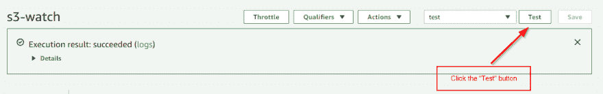T2】](https://res.cloudinary.com/practicaldev/image/fetch/s--959EcfRy--/c_limit%2Cf_auto%2Cfl_progressive%2Cq_auto%2Cw_880/https://thepracticaldev.s3.amazonaws.com/i/282h9709p59mgxoj5kvk.png)

现在，让我们通过向我们的 S3 桶中手动添加一些东西来真正测试它，并检查结果。

选择服务> S3，然后选择您的存储桶(假设您知道这一部分，因为您有一个存储桶)。

[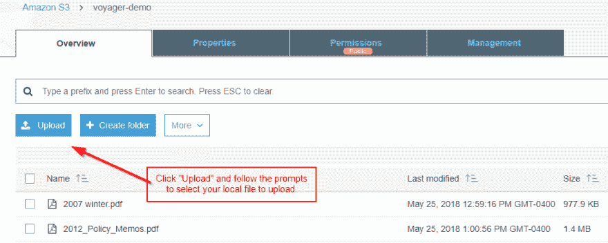T2】](https://res.cloudinary.com/practicaldev/image/fetch/s--MaP0TLiS--/c_limit%2Cf_auto%2Cfl_progressive%2Cq_auto%2Cw_880/https://thepracticaldev.s3.amazonaws.com/i/cq0ebjr4fzr3rnnieoqt.png)

确认

我已经上传了上面的文件和更多。让我们点击 ec2 实例，看看是否能在搜索结果中找到它们。注意:要完成这一步，您需要在 ec2 实例上安装企业搜索软件。你可以在这里得到一份评估:[http://www.voyagersearch.com/download-trial](http://www.voyagersearch.com/download-trial)

是啊！文档现在可以搜索了！

[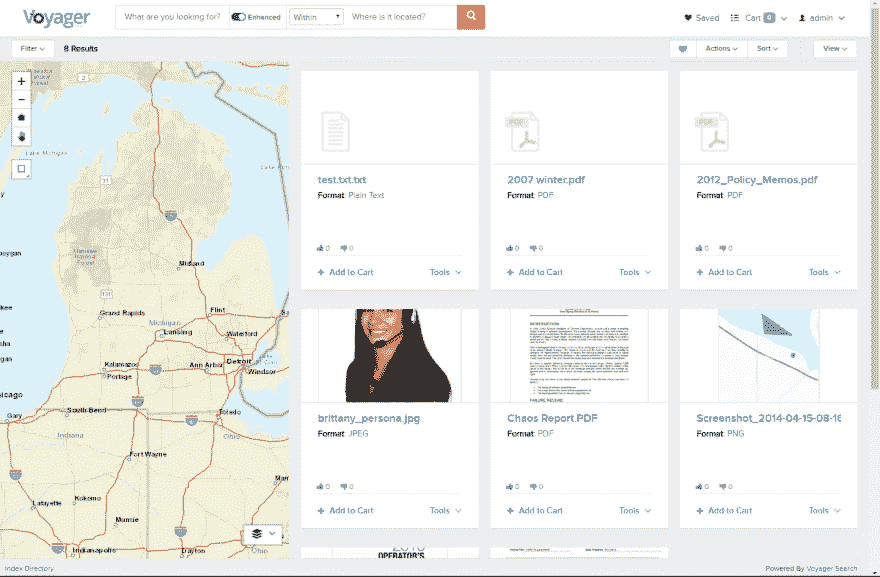T2】](https://res.cloudinary.com/practicaldev/image/fetch/s--T9P8Vh_2--/c_limit%2Cf_auto%2Cfl_progressive%2Cq_auto%2Cw_880/https://thepracticaldev.s3.amazonaws.com/i/an41b1ryl797yk39yx27.png)

我们已经成功地添加了一个新功能，而没有触及软件源代码！无服务器功能是一个游戏改变者，它允许我们用一个全新的架构来构建软件，或者，正如我们在这里看到的，一个混合的方法来给使用传统方法构建的软件添加新的特性。如果你不能放弃软件中所有的艰苦工作并重新开始(大多数人不能)，这是开始向微服务架构迁移的一个很好的选择。