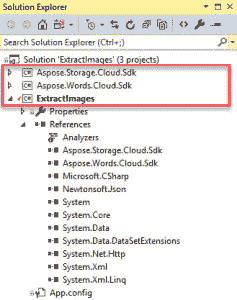

# 使用 Aspose 从文档中提取图像。词云 API (C# /。网)

> 原文：<https://dev.to/asposewords/extracting-images-from-a-document-using-asposewords-cloud-api-c--net-12jm>

下面的示例代码讨论了一些使用 [Aspose 从 DOCX 或其他文档文件中提取现有图像的方法。词云 API](https://products.aspose.cloud/words) 。

您可以直接连接并使用 [Aspose。Words REST API](https://apireference.aspose.cloud/words/) 但是为了使代码更简单，我们看一下 [Aspose。词云 SDK 为。网](https://github.com/aspose-words-cloud/aspose-words-cloud-dotnet)。还有其他语言的 SDK。

在我们使用云 API 从文档文件中提取图像数据之前，该文件需要在云存储中可用。下面的示例代码假设文档已经上传。参见[上传文档到云存储(C# /。NET)](https://dev.to/asposewords/uploading-a-document-to-asposewords-cloud-storage-c--net-3e3f) 。

示例代码依赖于通过 C#项目下载(作为代码或 dll)和引用的存储和单词 SDK。

我在 Visual Studio 中的解决方案如下所示:

[T2】](https://res.cloudinary.com/practicaldev/image/fetch/s--I6szGnSE--/c_limit%2Cf_auto%2Cfl_progressive%2Cq_auto%2Cw_880/https://thepracticaldev.s3.amazonaws.com/i/c1u7vug1ph44wikucvyp.jpg)

下面的代码显示了一个示例 ExtractImages 方法。

1)通过传入从 [Cloud Dashboard](https://dashboard.aspose.cloud/#/) 获得的 AppSid 和 AppKey，建立到 WordsApi 的连接。

2)在下一步中，我创建了一个 GetDocumentRequest，并调用 GetDocument 方法来验证文件是否存在于存储中，并且可以由 API 打开。

控制台。下面的 WriteLine 调用只显示了如何访问 document … SourceFormat 的属性。

下面这个简单的例子只有一个 for / next 循环，根据一个索引获取每张图片。如果需要检索与图像相关的其他信息，更好的方法可能是调用 GetDocumentDrawingObjects 方法来检索文档中的绘图对象列表。

3)创建一个 GetDocumentDrawingObjectImageDataRequest 对象，其中包含我们需要的图像的详细信息(基于索引),然后

4)我们调用 GetDocumentDrawingObjectImageData 来打开对象的流

5)将流保存到文件中(根据索引使用唯一的名称)。

然后循环回到 3)以抓取下一幅图像。

该代码将图像数据保存为 PNG 文件。

在我使用的示例 DOCX 文件中，有一个 SmartArt 对象，GetDocumentDrawingObjectImageData 调用可以看到它，但它不是一个图像…因此会生成一个错误，并被此示例代码跳过。

作为上述调用的替代方法，您可以使用 GetDocumentDrawingObjectByIndex 来指定返回图像的格式。