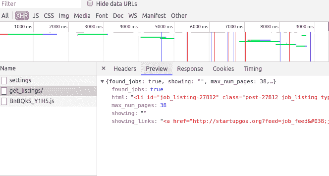

# 展示印度果阿最新 IT 工作的脸书信使机器人

> 原文：<https://dev.to/ns23/facebook-messenger-bot-that-displays-latest-it-jobs-in-goa-india-68g>

## TL；速度三角形定位法(dead reckoning)

[在 github 上查看源代码](https://github.com/ns23/goa-startup-jobs-bot)

这个周末，作为一个业余项目，我创建了一个简单的脸书聊天机器人，它可以通知在 starupgoa.org 发布的最新职位

果阿是一片海洋、沙滩和创业之地，而 starupgoa.org 是大多数 IT 职位发布的地方。

[starupgoa.org](http://startupgoa.org/jobs/#.W4w1d3UzbMV)上的工作显示如下。

[T2】](https://res.cloudinary.com/practicaldev/image/fetch/s--AYZp0fd1--/c_limit%2Cf_auto%2Cfl_progressive%2Cq_auto%2Cw_880/https://thepracticaldev.s3.amazonaws.com/i/vsu68lojda7stfkyw6ro.png)

在 chrome 的 network 选项卡中查看后，我发现了获取作业的 Ajax 调用。

[T2】](https://res.cloudinary.com/practicaldev/image/fetch/s--CGg-MNYU--/c_limit%2Cf_auto%2Cfl_progressive%2Cq_auto%2Cw_880/https://thepracticaldev.s3.amazonaws.com/i/65vw5qkmwtlinrsrmybw.png)

为了体验 javascript、es6 和 MongoDB，我选择用 Javascript 构建这个 bot。

我在 [Hackernoon](https://hackernoon.com/) 的
[上发现了这篇很棒的文章，如何使用 Node.js](https://hackernoon.com/how-to-build-a-facebook-bot-app-using-node-js-74629d4243ec) 构建一个脸书机器人应用程序

> 如果我开始解释代码行，帖子会很大。所以我会很快告诉你这个机器人是如何工作的。

## bot 一般如何工作

1.  最初，我已经从网站上获取了最新的 100 份工作，并将其存储在数据库中[使用 mlab 作为数据库]。
2.  当一个脸书用户点击 Get Started 按钮时，Bot 会捕获该用户的 id 并将其存储在数据库中。它用于发送推送通知。
3.  当用户在聊天中键入`latest jobs`时，bot 从数据库中获取最新的五个作业并显示给用户。
4.  我使用[节点调度](https://www.npmjs.com/package/node-schedule)编写了一个 cron 作业，它每天凌晨 1 点运行，从网站获取最新的作业并存储在数据库中。
5.  如果在 cron 作业期间获取了新的作业，那么 bot 会向有新作业的用户发送推送通知。

## 技术堆栈

*   **后端**:节点 JS
*   **数据库** : MongoDB [mlab](https://mlab.com/)
*   **服务器** : [英雄](https://www.heroku.com/)

## 使用的主要节点包。

*   用于构建 Facebook Messenger 聊天机器人的 JavaScript 框架。
*   cheerio - Html 解析器
*   温斯顿 -记录者
*   [节点-调度](https://www.npmjs.com/package/node-schedule) -运行 cron 作业
*   [请求](https://www.npmjs.com/package/request) -进行 API 调用

## 演示

[https://www.youtube.com/embed/G9y7hLZsh_E](https://www.youtube.com/embed/G9y7hLZsh_E)

> 目前该机器人处于开发模式，并不是每个人都可以使用。

## 欢迎建议

如果你有改进机器人的建议，请发表评论。

## 需要帮助

我想为这个机器人编写单元测试，但是我不知道如何开始编写单元测试。如果有人能帮我，我会非常感激。

## 结论

这是一个简单的机器人，希望对果阿的 It 求职者有所帮助。