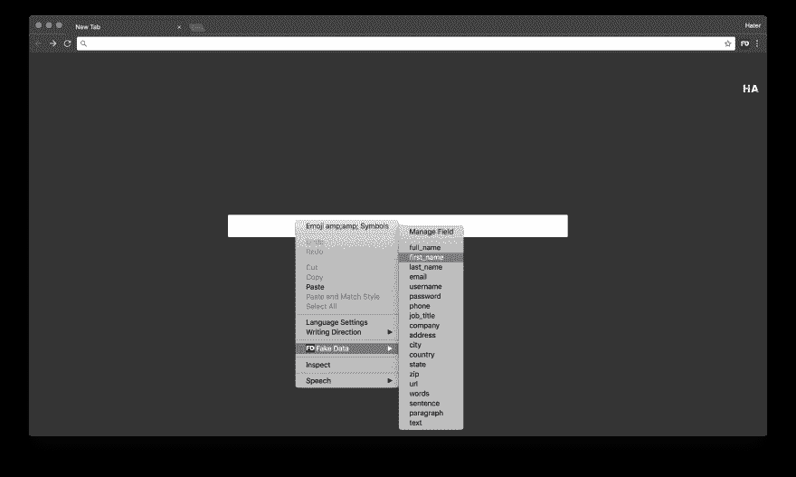
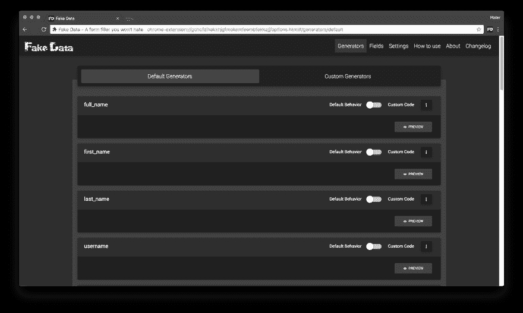
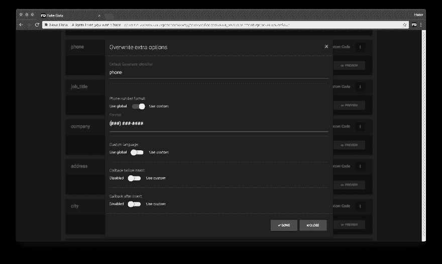
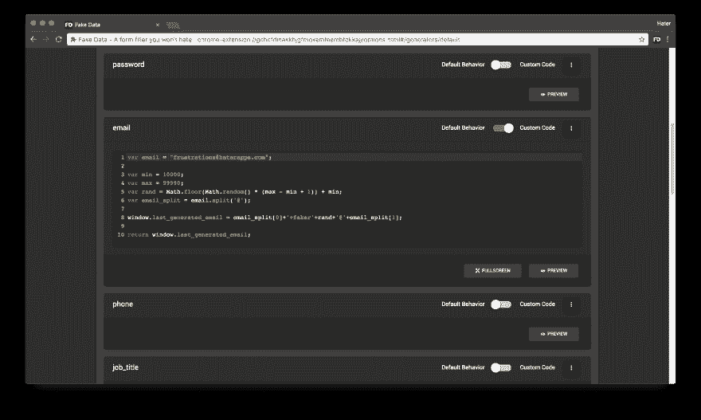

# 虚假数据——不是一般的填表人

> 原文：<https://dev.to/h8r/fake-data---not-your-average-form-filler-22dg>

TL；DR:每个开发者和用户都会喜欢的表单填充工具！字面意思！

chrome:[https://chrome . Google . com/web store/detail/fake-data-a-form-filler-y/gchcfdihakkhjgfmokemfeembfokkaj](https://chrome.google.com/webstore/detail/fake-data-a-form-filler-y/gchcfdihakkhjgfmokemfeembfokkajj)

火狐:[https://addons . Mozilla . org/en-US/Firefox/addon/fake-data-hater apps/](https://addons.mozilla.org/en-US/firefox/addon/fake-data-haterapps/)

非常欢迎批评！

* * *

我想给你看一个我在过去两年中一直在做的项目:一个随机和虚假数据的表格填充器，因此有了一个没有创意的名字**虚假数据**。

我知道你现在在想什么:“*两年？我本来可以在两天内完成的！*或者*哦不！又一个填表人！*”，但这不是一般的填表人，我会告诉你为什么。

当您不得不一遍又一遍地测试相同的表单时，日复一日，您开始考虑是否可以将您的手工劳动外包给自动化工具。毕竟，现在什么都有一个应用程序，找到一个简单的能够填充表单字段的应用程序有多难，对吗？**错了！**

因此，您打开浏览器扩展页面，开始尝试为表单填充查询显示的第一个扩展。

第一个看起来很有希望，所以你下载了它，进入你的表单并尝试使用它，但是没有任何反应。深入研究设置，您会发现您必须首先手动配置它，而且不是通过一个漂亮的用户界面，而是通过大量的 JSON 字符串和正则表达式匹配。所以你说“去他妈的！我没时间做那个！”，卸载它，然后转到下一个。

下一个似乎从一开始就能工作，它能够开箱即用地填写您的表单，但您会立即注意到有一些字段没有正确填写。它们要么被一个长句子代替了城市名，要么根本没有任何价值。没有快速修复的方法，所以你深入设置，你会发现与前一个匹配的正则表达式相同。你决定试一试，并开始设置它。它问你字段名或者模式，你不知道但是你想找到它。你回到表单，右击输入，检查 HTML 元素，复制它的名字，回到表单填充器，粘贴它，保存它，就完成了。现在你的领域工作正常。您进入表单的下一步，在更复杂的输入字段中，您注意到其中一半无法工作，需要手动配置。所以你说“去他妈的！我没时间做那个！”，卸载它，然后转到下一个。

最终你会找到一个合适的职位来填补你的空缺。但是现在你被指派去测试另一个网站，这个网站是用像<insert js="" buzzword="" here="" like="" angular="" react="" vue="" etc="">这样的最新技术构建的，在这个网站上，你甚至不需要给输入字段指定名称，因为它们会被其中的某种黑魔法机制“观察到”。现在你完蛋了！没有办法用这些字段来配置您的表单填充器，否则会非常困难。所以你说“去他妈的！我没时间做那个！”，卸载它，然后转到下一个。</insert>

好的，我想你已经明白了，我甚至没有进入某些字段需要特定格式的值的部分，比如日期字段、电话号码、数字字段，其中你的值必须在特定的范围内，或者有最小或最大长度要求的文本字段，或者必须总是选中的复选框，或者你希望总是有相同值的下拉框，或者有许多约束的密码字段。哦！一个表单中有如此多的内容，可以放下任何表单填充器。

* * *

下面是我向你展示**假数据**的部分——你会爱上的填表人。字面意思！

为什么？，我听到你问。

原因如下:

*   它开箱即用，无需初始设置。你只需使用键盘快捷键来填写表格。
*   它会尽可能多地尝试自动识别您的字段。当然，它不能变魔术，所以它有时可能会失败，但是不用担心！你不会花超过 10 秒钟来指导它。
*   如果一个字段没有被自动识别，你只需右击它，然后从上下文菜单中告诉假数据在该字段中插入什么值。它将花费你不到 10 秒钟。最棒的是你只需要做一次。假数据下次还记得。
*   它能够记住你的设置，即使是没有名字的字段，比如那些用<insert js="" buzzword="" here="" like="" angular="" react="" vue="" etc="">建立的网站。</insert>
*   您可以完全控制生成的数据。你甚至可以用纯 JavaScript 代码定制你的值。
*   你可以自定义日期格式，电话号码格式，字符串长度等等。而且不，你甚至不用为此写一行 JS！
*   一个非常好看的用户界面，有一大堆选项(如果功能有分量，假数据肯定有一大堆)。
*   每一个开发者都有更多的功能可以使用，而且还会有更多的功能出现。

就像一个用被咬过的水果作为标志的公司的家伙常说的那样:它就是管用！

如果你打算试一试，请随意批评！好的和不好的话都欢迎！

* * *

还有一些能凑成 1000 字的截图:

